import Guide from '@/components/Guide.astro';
import Knowledge from '@/components/Knowledge.astro';
import Example from '@/components/Example.astro';
import Analysis from '@/components/Analysis.astro';
import Solution from '@/components/Solution.astro';
import Variant from '@/components/Variant.astro';
import Note from '@/components/Note.astro';
import Block from '@/components/Block.astro';
import Method from '@/components/Method.astro';
import Exercise from '@/components/Exercise.astro';

## 10.2.1 基本磁现象

我国是世界上最早认识磁性和应用磁性的国家,早在战国时期就已发现磁石吸铁的现象.11世纪时,我国科学家沈括(北宋)创制了后来应用于航海的指南针,并发现了地磁偏角.地球的N极在地理南极附近,S极在地理北极附近.
天然磁铁和人造磁铁都称为永磁铁. 永磁铁不存在单一的磁极. 磁铁的两个磁极, 不可能分割成独立存在的 N 极和 S 极. 但我们知道, 有独立存在的正电荷或负电荷, 这是磁极和电荷的基本区别 ① .
  
磁单极子
在历史上很长一段时期内,人们对磁现象和电现象的研究是彼此独立进行的.1820年,丹麦物理学家奥斯特发现,放在通有电流的导线周围的磁针,会受到力的作用而发生偏转,如图 10.6 所示.其转动方向与导线中电流的方向有关.这就是历史上著名的奥斯特实验,它第一次指出了磁现象与电现象之间的联系.同年,法国科学家安培发现,放在磁铁附近的载流导线及载流线圈也会受到力的作用而发生运动,如图 10.7 所示.通过实验还发现,载流导线之间或载流线圈之间也有相互作用力.例如,把两个线圈面
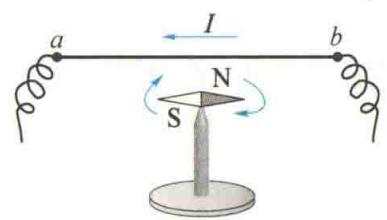  
图10.6 奥斯特实验
对面挂在一起，当两电流的流向相同时，两线圈相互吸引，如图10.8(a)所示；当两电流的流向相反时，两线圈相互排斥，如图10.8(b)所示.
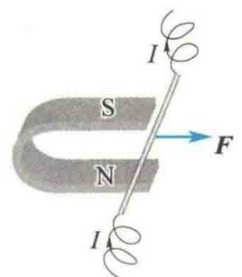  
(a) 磁铁对载流导线的作用
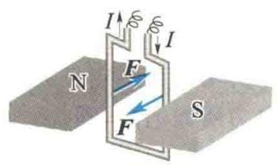  
(b) 载流线圈受到磁铁的作用而转动
图10.7 磁场对电流的作用  
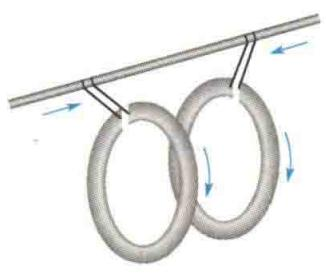  
(a) 两线圈相互吸引
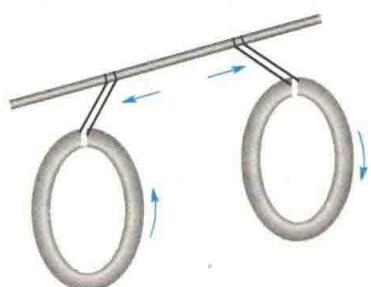  
(b) 两线圈相互排斥  
图10.8 载流线圈间的相互作用
电子射线束在磁场中路径发生偏转的实验进一步说明了通过磁场区域时,运动电荷要受到力的作用,如图 10.9 所示.
上述实验现象启发人们去探寻磁现象的本质.1822年,安培提出了关于物质磁性本质的假说,他认为一切磁现象的根源是电流.载流导线之间和载流线圈之间的相互作用可以很好地说明这一点,那么为什么磁铁与电流或磁铁与磁铁
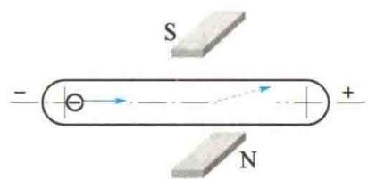  
图10.9 电子射线束在磁场中发生偏转
之间的相互作用也是电流之间的相互作用的表现呢？这是因为，任何物质都是由分子和原子组成的，而组成分子的电子和质子等带电粒子的运动会形成微小的环形电流，称为分子电流。分子电流相当于一个基元磁铁。当物体不显磁性时，各分子电流无规则地排列，它们对外界所产生的磁性相互抵消。在外磁场作用下，与分子电流相当的基元磁铁将趋向于沿外磁场方向取向，从而使得整个物体对外显示出磁性。一个磁铁与其他磁铁或电流之间的相互作用，实际上就是这些已经排列整齐的分子电流之间或它们与电流之间的相互作用. 根据安培的物质磁性假说, 能够很容易地说明两种磁极不能单独存在的原因: 基元磁铁的两个磁极对应于分子环形电流的正反两个面, 这两个面显然是无法单独存在的.
因为电流是由电荷的定向运动形成的,所以电流之间的相互作用可以说是运动电荷之间的相互作用.事实上,在所有情况下,磁现象的根源是运动电荷,磁力是运动电荷之间相互作用的表现.

## 10.2.2 磁感应强度

为了说明磁力的作用,类似于电场,可以引入场的概念.产生磁力的场称为磁场.运动电荷之间的磁力,电流与电流之间、电流与磁铁之间以及磁铁与磁铁之间的相互作用则是通过磁场这种特殊物质来传递的,这种关系可以简单表述为
$$
\text { 运动电荷(电流或磁铁)} \leftrightarrows \text { 磁场 } \leftrightarrows \text { 运动电荷(电流或磁铁) }
$$
磁场和电场一样,是客观存在的具有特殊形态的物质.磁场对外的重要表现如下.
(1) 磁场对进入场中的运动电荷或载流导体有磁力的作用.
(2) 载流导体在磁场中移动时, 磁场的作用力将对载流导体做功, 这表明磁场具有能量.
在静电场中,我们引入电场强度矢量 E 来描述电场的强弱和方向.类似地,这里引入磁感应强度矢量 B 来描述磁场的强弱和方向.
下面用磁场对运动电荷的作用来定量地描述磁场的性质.为了只研究磁场,一般选取载流导线而非运动电荷作为产生磁场的源.这是因为如果选取运动电荷来产生磁场,那么运动电荷周围空间除了磁场外,还有电荷所产生的电场,另一个运动电荷在它附近运动时,既会受到磁力的作用,又会受到电场力的作用.而载流导线则不同,因为导线内部既有带正电的金属正离子,又有带负电的自由电子,且正、负电荷密度相等,显电中性,对外所产生的电场相互抵消,合电场强度为零.所以,在载流导线的周围只有磁场存在,一个运动电荷所受到的作用力只是载流导线所产生的磁场对它的磁力.

作为描述磁场性质的磁感应强度, 可以通过在载流导线周围引入一个运动电荷, 并根据运动电荷所受磁力来定义. 如图 10.10(a) 所示, 假设一运动电荷 q 以速度 v 通过载流导线周围的某一考察点 P. 我们把这一运动电荷当作检验磁场的试验电荷. 实验表明, 当 q 沿不同的方向运动时, 它所受的磁力 F 的大小不同, 但若 q 沿某一特定方向 (或其反方向) 通过 P 点, 则它所受的磁力为零. 对不同的 P 点, 这种特定方向不同, 即磁场中各点都有各自的特定方向, 说明磁场具有方向性. 当 q 以不同方向通过 P 点时, 它所受的磁力方向总是与这一磁场方向和试验电荷本身的运动速度方向垂直. 这样可以进一步规定磁感应强度 B 的方向, 使得 $v \times B$ 和 F 同向.
极光为什么在两极出现而不在赤道出现？
当试验电荷 q 的速度方向与磁场垂直时, 它所受的磁力最大, 如图 10.10(b) 所示, 记作 $F_{max}$ . 实验表明, 试验电荷所受到的最大磁力的大小与试验电荷的电量 q 和速度大小 v 成正比, 即
$$
F _ {\max} \propto q v
$$
而且，比值 $\frac{F_{\mathrm{max}}}{qv}$ 为一恒量，仅与试验电荷的位置有关，即只与试验电荷所在处的磁场性质有关.显然，比值 $\frac{F_{\mathrm{max}}}{qv}$ 的大小反映了各点处磁场的强弱.规定，磁感应强度 $B$ 的大小为
$$
B = \frac {F _ {\mathrm{max}}}{q v}\tag{10.1}
$$
综上所述,磁场中磁感应强度的方向与该点运动电荷所受磁力为零时的速度方向相同,这个方向与将小磁针置于此处时小磁针的指向是一致的;磁感应强度的大小等于单位正电荷以单位速度运动时所受到的最大磁力.
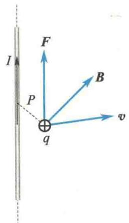  
(a) $\pmb{B}$ 的方向
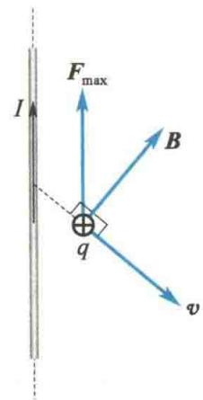  
(b) $\pmb{B}$ 的大小  
图10.10 磁感应强度 $B$ 的定义
在国际单位制(SI)中,磁感应强度B的单位名称为特斯拉,简称特,符号为T.工程上还常用高斯(Gs)作为磁感应强度的单位, $1\ T=10^{4}\ Gs$ .
地磁场的磁感应强度约为 0.5 Gs，一般永磁铁的磁场的磁感应强度约为 $10^{4}$ Gs，实验室里电磁铁产生的磁场的磁感应强度约为 $10^{5}$ Gs。

## 10.2.3 磁感应强度叠加原理

与电场类似,磁场也满足叠加原理.多个电流(或运动电荷)共同存在时所产生的磁场的磁感应强度等于各电流(或运动电荷)单独存在时所产生的磁场的磁感应强度的矢量和,这一结论称为磁感应强度叠加原理,其数学表达式为
$$
\pmb {B} = \sum_ {i} \pmb {B} _ {i}
$$
式中，B 为总磁感应强度， $B_{i}$ 为第 i 个电流（或运动电荷）单独存在时所产生的磁场的磁感应强度.

## 10.2.4 磁通量

### 1. 磁感线

类似于用电场线形象地描述静电场,也可以用磁感线来形象地描述磁场.在磁场中作一系列曲线,使曲线上每一点的切线方向都和该点的磁场方向一致.同时,为了用磁感线的疏密来表示空间各点磁场的强弱,还规定:通过磁场中某点处垂直于磁感应强度的单位面积的磁感线条数,等于该点磁感应强度的大小.这样,磁场较强的地方,磁感线较密集;反之,磁感线较稀疏.
几种不同形状的电流所产生的磁场的磁感线如图 10.11 所示. 根据磁感线的分布, 可以得出磁感线的特性如下.
(1) 磁场中每一条磁感线都是环绕电流的闭合曲线, 而且每条闭合磁感线都与
闭合电路互相套合,因此磁场是涡旋场.
(2) 任意两条磁感线在空间都不相交, 这是因为磁场中任意一点的磁场方向都是唯一确定的.
（3）磁感线的环绕方向与电流方向之间的关系可以用右手螺旋定则确定.若拇指指向电流方向，则四指方向即为磁感线方向，如图10.11(a)所示；若四指方向为电流方向，则拇指指向磁感线方向，如图10.11(b)和图10.11(c)所示.
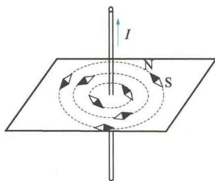  
(a) 直电流的磁感线
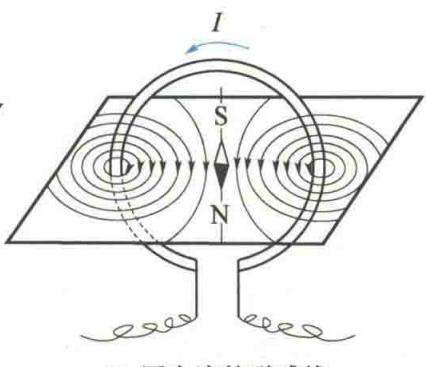  
(b) 圆电流的磁感线
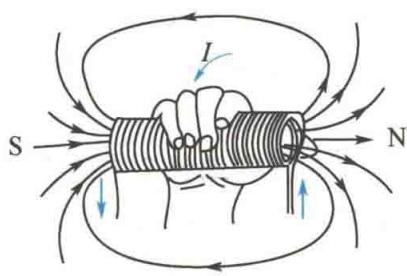  
(c) 螺线管电流的磁感线  
图 10.11 几种不同形状的电流所产生的磁场的磁感线

### 2. 磁通量

穿过磁场中某一曲面的磁感线总数,称为穿过该曲面的磁通量,用符号 $\Phi_{m}$ 表示.
在非均匀磁场中,需要通过积分计算穿过任意曲面 S 的磁通量,如图 10.12 所示. 在曲面 S 上取一面元 dS, dS 上的磁感应强度可视为均匀的, dS 可视为平面, 若其法线方向的单位矢量 $n_{0}$ 与该处的磁感应强度 B 成 $\theta$ 角, 则通过 dS 的磁通量为
$$
\mathrm{d} \Phi_ {\mathrm{m}} = B \cos \theta \mathrm{d} S = \boldsymbol {B} \cdot \mathrm{d} \boldsymbol {S}
$$
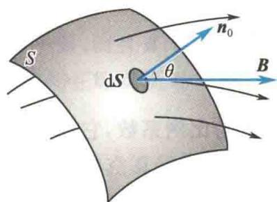  
图10.12 磁通量
而通过曲面 $S$ 的磁通量为
$$
\Phi_ {\mathrm{m}} = \int_ {S} \boldsymbol {B} \cdot \mathrm{d} \boldsymbol {S}\tag{10.2}
$$
在国际单位制(SI)中,磁通量的单位名称为韦伯,符号为Wb,1 Wb=1 T·m².

## 10.2.5 磁场中的高斯定理

对闭合曲面 S 来说,通常取向外的指向为该曲面上面元法线的正方向.因此,从闭合曲面穿出的磁通量为正,穿入闭合曲面的磁通量为负.因为磁感线是闭合曲线,所以穿过任意闭合曲面的总磁通量必为零,即
  
磁场中的高斯定理
$$
\oint_ {S} \boldsymbol {B} \cdot \mathrm{d} \boldsymbol {S} = 0\tag{10.3}
$$
式(10.3)称为磁场的高斯定理. 此式与静电场的高斯定理 $\oint_{S}D\cdot dS=\sum q_{i}$ 形式上相似, 但两者所反映的场在性质上却有本质的差别. 由于自然界有单独存在的自由正电荷或自由负电荷, 因此通过闭合曲面的电通量可以不等于零; 但在自然界中至今尚未发现有磁单极子存在, 因此通过任意闭合曲面的磁通量必为零.

## 10.2.6 毕奥-萨伐尔定律

科研成果介绍
在静电学中,任意形状的带电体所产生的电场强度 E, 可以看成是许多个电荷元 dq 所产生的电场强度 dE 的叠加. 现在, 我们研究任意形状的载流导线在给定点 P 处所产生的磁感应强度 B, 它也可以看作导线上各个电流元 $Idl$① 在该点处所产生的磁感应强度 dB 的叠加. 不过, 由于实际上不可能得到单独的电流元, 因此也无法直接从实验中找到单独的电流元与其所产生的磁感应强度之间的关系.
  
稳态强磁场
实验装置
19 世纪 20 年代, 受奥斯特的电流磁效应实验的启发, 法国科学家毕奥和萨伐尔通过长直和弯折载流导线对磁极作用力的实验, 得出了作用力与距离和弯折角的定量关系. 后在拉普拉斯等人的协助下, 得到了电流元产生磁场的普遍定量规律, 即毕奥-萨伐尔定律, 可表述如下:
任意电流元 $Idl$ 在给定点 $P$ 处产生的磁感应强度 $\mathrm{dB}$ 的大小与电流元的大小成正比，与电流元和由电流元到 $P$ 点的矢径 $r$ 间的夹角的正弦成正比，而与电流元到 $P$ 点的距离 $r$ 的平方成反比。 $\mathrm{dB}$ 的方向垂直于 $\mathrm{dl}$ 和 $r$ 所确定的平面，指向由 $Idl$ 经小于 $180^{\circ}$ 的角转向 $r$ 时右手螺旋前进的方向，如图10.13所示。其数学表达式为
$$
\mathrm{dB} = k \frac {I \mathrm{d} l \sin (I \mathrm{d} \hat {l} , r)}{r ^ {2}}
$$
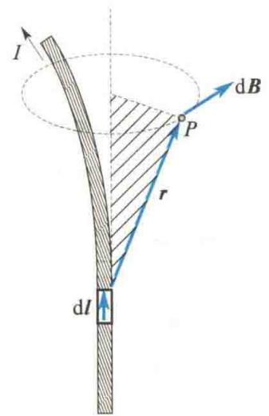
矢量式为
$$
\mathrm{d} \pmb {B} = k \frac {I \mathrm{d} \pmb {l} \times \pmb {r}}{r ^ {3}}\tag{10.4}
$$
图 10.13 毕奥-萨伐尔定律示意图
式中，k 为比例系数，它与磁场中的磁介质和单位制的选取有关。对于真空中的磁场，如式中各物理量用国际单位制（SI），则比例系数 $k = \frac{\mu_{0}}{4\pi}$ ， $\mu_{0}$ 称为真空磁导率。
$$
\mu_ {0} = 4 \pi \times 1 0 ^ {- 7} \mathrm{T} \cdot \mathrm{m/A(或H/m)}
$$
因此，在国际单位制（SI）中，真空中的毕奥-萨伐尔定律可表示为
$$
\mathrm{d} B = \frac {\mu_ {0} I \mathrm{d} l \sin (I \mathrm{d} \hat {l} , r)}{4 \pi r ^ {2}}\tag{10.5a}
$$
或
$$
\mathrm{d} \pmb {B} = \frac {\mu_ {0}}{4 \pi} \frac {I \mathrm{d} l \times r}{r ^ {3}}\tag{10.5b}
$$
由叠加原理可知,任意形状的载流导线在给定点P处产生的磁场的磁感应强度,等于各段电流元在该点产生的磁场的磁感应强度的矢量和,即
$$
\pmb {B} = \int_ {L} \mathrm{d} \pmb {B} = \frac {\mu_ {0}}{4 \pi} \int_ {L} \frac {I \mathrm{d} l \times r}{r ^ {3}}\tag{10.5c}
$$
式中，积分号下的 L 表示对整个载流导线 L 进行积分.
虽然毕奥-萨伐尔定律不可能直接由实验验证,但是由该定律计算出的载流导线在场点产生的磁场的磁感应强度和实验测量的结果符合得很好,从而间接地证实了毕奥-萨伐尔定律的正确性.
按照经典电子理论,导体中的电流是大量带电粒子的定向运动形成的.由此可知,电流产生的磁场实际上就是运动电荷产生的磁场的宏观表现.
研究运动电荷的磁场,在理论上就是研究毕奥-萨伐尔定律的微观意义.那么,一个带电量为 q、速度为 v 的带电粒子在其周围空间产生的磁场分布是怎样的呢?我们可以通过毕奥-萨伐尔定律导出.
设在导体的单位体积内有 n 个带电粒子, 每个粒子带有电量 q, 并以速度 v 沿电流元 Idl 的方向做匀速运动而形成导体中的电流, 如图 10.14 所示. 如果电流元的横截面积为 S, 那么单位时间内通过横截面的电量, 即电流 I 为
$$
I = q n v S
$$
将上式代入毕奥-萨伐尔定律的数学表达式[式(10.5a)],并注意到 $Idl$ 与 $\pmb{v}$ 的方向相同,则得
$$
\mathrm{dB} = \frac {\mu_ {0}}{4 \pi} \frac {(q n v S) \mathrm{d} l \sin (\widehat {\boldsymbol {v}}, \boldsymbol {r})}{r ^ {2}}
$$
在电流元 $Idl$ 内，有 $\mathrm{d}N = nS\mathrm{d}l$ 个带电粒子，因此从微观意义上说，电流元 $Idl$ 产生的磁感应强度 $\mathrm{dB}$ 就是 $\mathrm{d}N$ 个运动电荷所产生的。这样一来，我们就可以得到以速度 $\pmb{v}$ 运动的带电量为 $q$ 的粒子所产生的磁感应强度 $\pmb{B}$ 的大小为
$$
B = \frac {\mathrm{d} B}{\mathrm{d} N} = \frac {\mu_ {0}}{4 \pi} \frac {q v \sin (\widehat {\pmb {v} , r})}{r ^ {2}}
$$
B 的方向垂直于 v 和电荷 q 到场点的矢径 r 所确定的平面, 而且 B、v、r 三者的方向符合右手螺旋定则. 如果运动电荷带负电, 那么 B 的方向与正电荷运动时的方向相反, 如图 10.15 所示.
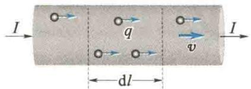  
图10.14 研究运动电荷的磁场
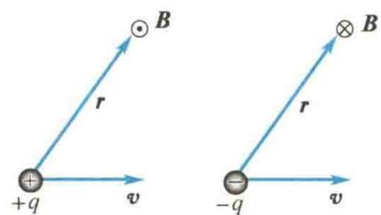  
图 10.15 正、负运动电荷产生的磁场方向
用矢量式表示,则运动电荷所产生的磁感应强度 B 为
$$
\pmb {B} = \frac {\mu_ {0}}{4 \pi} \frac {q \pmb {v} \times \pmb {r}}{r ^ {3}}\tag{10.6}
$$

## 10.2.7 毕奥-萨伐尔定律的应用

下面举几个应用毕奥-萨伐尔定律和磁场叠加原理计算几种常见的载流导线所产生磁场的磁感应强度的例子.

### 1. 载流直导线的磁场

如图 10.16 所示, 设在真空中有一长为 L 的载流直导线, 导线中的电流为 I, 现计算与导线的垂直距离为 a 的 P 点处的磁感应强度.
  
毕奥-萨伐尔定律的计算
在导线上任取一电流元 $Idl$ ，电流元到 $P$ 点的矢量为 $r$ ，电流元 $Idl$ 与 $r$ 的夹角为 $\alpha$ ，电流元在给定点 $P$ 处所产生的磁感应强度 $\mathrm{dB}$ 的大小为
$$
\mathrm{dB} = \frac {\mu_ {0}}{4 \pi} \frac {I \mathrm{d} l \sin \alpha}{r ^ {2}}
$$
dB 的方向垂直于电流元 Idl 与矢径 r 所确定的平面, 指向如图 10.16 所示, 即垂直于 xOy 平面. 由于导线上各电流元在 P 点所产生的磁感应强度的方向一致, 故载流直导线在 P 点所产生的总磁感应强度大小为
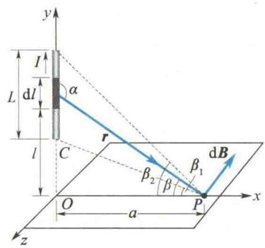  
图 10.16 载流直导线的磁场的计算
$$
B = \int_ {L} \mathrm{d} B = \int_ {L} \frac {\mu_ {0}}{4 \pi} \frac {I \mathrm{d} l \sin \alpha}{r ^ {2}}
$$
取 $\overline{OP}$ 与r的夹角 $\beta$ 为自变量,由图10.16可知
$$
\sin \alpha = \cos \beta , r = a \sec \beta , l = a \tan \beta
$$
在 $l = a\tan \beta$ 两边取微分，得
$$
\mathrm{d} l = a \sec^ {2} \beta \mathrm{d} \beta
$$
把以上各式代入积分式，并按图 10.16 所示取积分下限为 $\beta_{1}$ ，积分上限为 $\beta_{2}$ ，得
$$
B = \frac {\mu_ {0} I}{4 \pi a} \int_ {\beta_ {1}} ^ {\beta_ {2}} \cos \beta \mathrm{d} \beta = \frac {\mu_ {0} I}{4 \pi a} (\sin \beta_ {2} - \sin \beta_ {1})
$$
式中， $\beta_{1}, \beta_{2}$ 分别为载流直导线两端到 $P$ 点的连线与 $\overline{OP}$ 间的夹角。当角 $\beta$ 的旋转方向（以垂线 $\overline{OP}$ 为始线）与电流流向相同时， $\beta$ 取正值；当角 $\beta$ 的旋转方向与电流流向相反时， $\beta$ 取负值。显然，在图10.16中， $\beta_{1}, \beta_{2}$ 均取正值。
如果载流直导线为无限长，即导线的长度 $L$ 比垂距 $a$ 大得多 $(L \gg a)$ ，那么 $\beta_{1} \rightarrow -\frac{\pi}{2}, \beta_{2} \rightarrow +\frac{\pi}{2}$ ，得
$$
B = \frac {\mu_ {0} I}{2 \pi a}\tag{10.7}
$$

### 2. 圆电流轴线上的磁场

如图 10.17 所示, 真空中有一半径为 R 的圆形载流线圈, 通有电流 I, 现计算在线圈的轴线上任意一点 P 的磁感应强度.
在线圈顶部取电流元 Idl，电流元垂直于纸面向外，到 P 点的矢量为 r, r 在纸面内，选如图 10.17 所示的坐标系，电流元 Idl 在 P 点所产生的磁感应强度 dB 的大小为
$$
\mathrm{d} B = \frac {\mu_ {0}}{4 \pi} \frac {I \mathrm{d} l \sin (I \mathrm{d} \hat {l} , r)}{r ^ {2}} = \frac {\mu_ {0}}{4 \pi} \frac {I \mathrm{d} l}{r ^ {2}}
$$
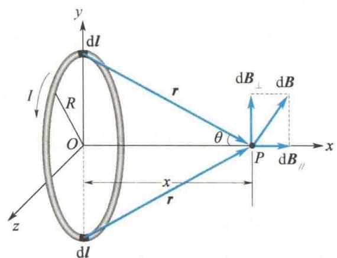  
图 10.17 圆电流轴线上磁感应强度的计算
$\mathrm{d}\pmb{B}$ 的方向如图10.17所示，垂直于 $Idl$ 和 $\pmb{r}$ 所确定的平面.显然，线圈上各电流元在 $P$ 点所产生的 $\mathrm{d}\pmb{B}$ 的方向各不相同.因此，把 $\mathrm{d}\pmb{B}$ 分解为与轴线平行的分量 $\mathrm{dB}_{//}$ 和与轴线垂直的分量 $\mathrm{dB}_{\perp}$ .由对称性可知， $B_{\perp} = \int \mathrm{dB}_{\perp} = 0$ ，因此
$$
\begin{array}{r l} B & = \int \mathrm{d} B _ {\parallel} = \int \mathrm{d} B \sin \theta \\ & = \int \frac {\mu_ {0}}{4 \pi} \frac {I \mathrm{d} l}{r ^ {2}} \frac {R}{r} = \frac {\mu_ {0}}{4 \pi} \frac {I R}{r ^ {3}} \int_ {0} ^ {2 \pi R} \mathrm{d} l \\ & = \frac {\mu_ {0}}{4 \pi} \frac {2 \pi R ^ {2} I}{r ^ {3}} = \frac {\mu_ {0}}{2} \frac {R ^ {2} I}{(R ^ {2} + x ^ {2}) ^ {3 / 2}} \end{array}\tag{10.8}
$$
B 的方向垂直于圆电流所在平面,与圆电流环绕方向的关系符合右手螺旋定则,沿 x 轴正方向.下面讨论两种特殊情况.
(1) 当 x = 0 时(即在圆心处), 磁感应强度大小为
$$
B = \frac {\mu_ {0} I}{2 R}\tag{10.9}
$$
(2) 当 $x \gg R$ 时, 有
$$
B \approx \frac {\mu_ {0} I R ^ {2}}{2 x ^ {3}} = \frac {\mu_ {0}}{2 \pi} \frac {I \pi R ^ {2}}{x ^ {3}}
$$
式中， $\pi R^{2}=S$ 为线圈的面积. 考虑到 B 的方向与 n 的方向一致，故上式写成矢量式为
$$
\pmb {B} = \frac {\mu_ {0} I S}{2 \pi x ^ {3}} \pmb {n}\tag{10.10}
$$
式(10.10)与电偶极子产生的电场的电场强度的表达式相似.

<Example title="例 10.1">
分别求如图 10.18(a) 和图 10.18(b) 所示的 P 点处的磁感应强度.
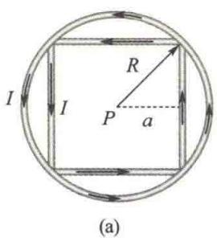
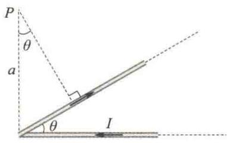  
(b)  
图10.18 例10.1图

<Solution title="解">
先求如图 10.18(a) 所示的 P 点处的磁感应强度. 依据长直导线所产生的磁场的结论, 可得正方形回路的每一条直导线在 P 点所产生的磁场的磁感应强度的大小为
的磁感应强度的大小为
$$
\begin{array}{r l} B _ {1} & = \frac {\mu_ {0} I}{4 \pi a} (\sin \beta_ {2} - \sin \beta_ {1}) \\ & = \frac {\mu_ {0} I}{4 \pi R \sin \frac {\pi}{4}} \left[ \sin \frac {\pi}{4} - \sin \left(- \frac {\pi}{4}\right) \right] \\ & = \frac {\mu_ {0} I}{2 \pi R} \end{array}
$$
$$
B _ {\mathrm{正}} = 4 \cdot \frac {\mu_ {0} I}{2 \pi R} = \frac {2 \mu_ {0} I}{\pi R}
$$
方向垂直于纸面向外.
依据圆电流在圆心处所产生的磁场的结论,可得P点处的磁感应强度大小为
$$
B _ {\mathrm{圆}} = \frac {\mu_ {0} I}{2 R}
$$
所以， $P$ 点处的总磁感应强度大小为
$$
B = B _ {\mathrm{正}} + B _ {\mathrm{圆}} = \frac {2 \mu_ {0} I}{\pi R} + \frac {\mu_ {0} I}{2 R}
$$
因此整个正方形回路中的电流在 $P$ 点处产生的磁场
方向垂直于纸面向外.
再求如图10.18(b)所示的 $P$ 点处的磁感应强度.依据长直导线所产生的磁场的结论，可得水平半无限长载流直导线和载流斜直导线在 $P$ 点所产生的磁场的磁感应强度分别如下.
$$
\begin{array}{r l} B _ {1} & = \frac {\mu_ {0} I}{4 \pi a} (\sin \beta_ {2} - \sin \beta_ {1}) \\ & = \frac {\mu_ {0} I}{4 \pi a} \left[ \sin 0 - \sin \left(- \frac {\pi}{2}\right) \right] \\ & = \frac {\mu_ {0} I}{4 \pi a} \end{array}
$$
方向垂直于纸面向里.
$$
\begin{array}{r l} B _ {2} & = \frac {\mu_ {0} I}{4 \pi a \cos \theta} (\sin \beta_ {2} - \sin \beta_ {1}) \\ & = \frac {\mu_ {0} I}{4 \pi a \cos \theta} \left[ \sin \frac {\pi}{2} - \sin (- \theta) \right] \\ & = \frac {\mu_ {0} I}{4 \pi a \cos \theta} (1 + \sin \theta) \end{array}
$$
方向垂直于纸面向外.
假设垂直于纸面向外为正方向,那么在图 10.18(b) 中 P 点处的总磁感应强度大小为
$$
\begin{array}{r l} B & = B _ {2} - B _ {1} \\ & = \frac {\mu_ {0} I}{4 \pi a \cos \theta} (1 + \sin \theta - \cos \theta) \end{array}
$$
</Solution>
</Example>

### 3. 载流直螺线管内部的磁场

均匀地绕在圆柱面上的螺旋线圈称为螺线管. 设螺线管的半径为 R, 总长度为 L, 单位长度内的匝数为 n. 若线圈用细导线绕得很密, 则每匝线圈可视为圆形线圈. 下面计算此螺线管轴线上任意一点 P[见图 10.19(a)] 的磁感应强度 B.
如图 10.19(b) 所示, 在距 P 点 l 处取一小段 dl, 则该小段上有 ndl 匝线圈, 对 P 点而言, 这一小段上的线圈等效于大小为 Indl 的一个圆电流. 根据式(10.8), 该圆电流在 P 点所产生的磁场的磁感应强度 dB 的大小为
$$
\mathrm{dB} = \frac {\mu_ {0}}{2} \frac {R ^ {2} I n \mathrm{d} l}{(R ^ {2} + l ^ {2}) ^ {3 / 2}}
$$
方向与圆电流环绕方向符合右手螺旋定则.由于螺线管上各小段的圆电流在 P 点所产生的磁场的磁感应强度方向都相同,因此整个载流直螺线管在 P 点所产生的磁场的磁感应强度 B 的大小为
$$
B = \int \mathrm{d} B = \int \frac {\mu_ {0}}{2} \frac {R ^ {2} I n \mathrm{d} l}{(R ^ {2} + l ^ {2}) ^ {3 / 2}}
$$
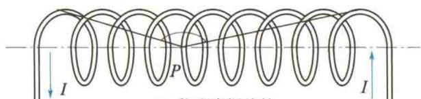  
(a) 载流直螺线管
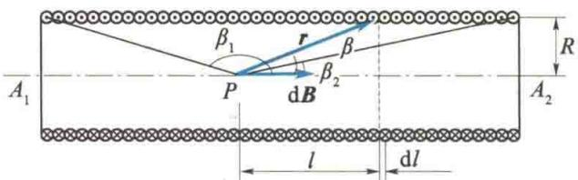  
(b) 载流直螺线管轴线上 P 点处的磁感应强度  
图 10.19 载流直螺线管及其轴线上 P 点处的磁感应强度
设螺线管轴线与从 P 点到 dl 处所引矢径 r 之间的夹角为 $\beta$ ，则由图 10.19(b) 可知
$$
l = R \cot \beta
$$
对上式求微分得
$$
\mathrm{d} l = - R \csc^ {2} \beta \mathrm{d} \beta
$$
又
$$
R ^ {2} + l ^ {2} = r ^ {2}, \quad \sin^ {2} \beta = \frac {R ^ {2}}{r ^ {2}}
$$
即
$$
R ^ {2} + l ^ {2} = \frac {R ^ {2}}{\sin^ {2} \beta} = R ^ {2} \csc^ {2} \beta
$$
因此
$$
\begin{array}{r l} B & = \int \frac {\mu_ {0}}{2} \frac {R ^ {2} I n \mathrm{d} l}{(R ^ {2} + l ^ {2}) ^ {\frac {3}{2}}} = \int_ {\beta_ {1}} ^ {\beta_ {2}} \left(- \frac {\mu_ {0}}{2} n I \sin \beta\right) \mathrm{d} \beta \\ & = \frac {\mu_ {0}}{2} n I (\cos \beta_ {2} - \cos \beta_ {1}) \end{array}
$$
式中， $\beta_{1}$ 和 $\beta_{2}$ 分别表示 P 点到螺线管两端的连线与轴线之间的夹角.
(1) 若 $R \ll L$ ，即对于无限长的螺线管， $\beta_{1} \rightarrow \pi, \beta_{2} \rightarrow 0$ ，则有
$$
B = \mu_ {0} n I\tag{10.11}
$$
即无限长载流直螺线管轴线上各点处的磁场是均匀磁场.
(2) 对长直螺线管的端点, 如图 10.19(b) 中的 $A_{1}$ 点, $\beta_{1} \rightarrow \frac{\pi}{2}$ , $\beta_{2} \rightarrow 0$ , 则 $A_{1}$ 点处磁感应强度 B 的大小为
$$
B = \frac {1}{2} \mu_ {0} n I\tag{10.12}
$$
式(10.12)表明,长直螺线管端点轴线上的磁感应强度恰是内部磁感应强度的一半.载流长直螺线管所产生的磁场的磁感应强度B的方向沿着螺线管轴线,指向可由右手螺旋定则确定.螺线管轴线上磁感应强度的大小变化情况大致如图10.20所示.
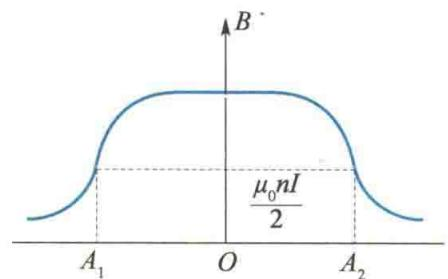  
图10.20 螺线管轴线上磁感应强度大小的变化情况

<Example title="例 10.2">
有一半径为 R 的薄圆盘均匀带电，总电量为 q。令此盘绕通过盘心，且垂直于盘面的轴线匀速转动，角速度为 $\omega$ 。求轴线上到盘心 O 距离为 x 的 P 点处的磁感应强度 B。

<Solution title="解">
均匀带电薄圆盘绕轴线转动产生的磁场可以看成由半径不同的一系列同心载流圆环产生的磁场. 如图10.21所示, 在圆盘上任取一半径为 $r$ 、宽度为 $\mathrm{d}r$ 的圆环, 此圆环所带的电量 $\mathrm{d}q = \sigma 2\pi r \mathrm{~d}r, \sigma = \frac{q}{\pi R^2}$ 为圆盘的面电荷密度. 当此圆环以角速度 $\omega$ 转动时, 相当于一个圆电流, 其电流大小为
$$
\mathrm{d} I = \frac {\omega}{2 \pi} \mathrm{d} q = \frac {\omega q}{\pi R ^ {2}} r \mathrm{d} r
$$
该圆电流 dI 在轴线上 P 点处产生的磁场的磁感应强度 dB 的大小为
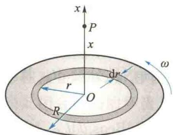  
图10.21 例10.2图
$$
\mathrm{dB} = \frac {\mu_ {0} r ^ {2} \mathrm{dI}}{2 (r ^ {2} + x ^ {2}) ^ {3 / 2}} = \frac {\mu_ {0} \omega q}{2 \pi R ^ {2}} \frac {r ^ {3} \mathrm{dr}}{(r ^ {2} + x ^ {2}) ^ {3 / 2}}
$$
dB 沿 x 轴正方向. 由于各同心圆环旋转时在 P 点处产生的 dB 方向均相同, 因此均匀带电圆盘转动时, 在 P 点处产生的总磁感应强度 B 的大小为
$$
\begin{array}{r l} B & = \int \mathrm{d} B = \frac {\mu_ {0} \omega q}{2 \pi R ^ {2}} \int_ {0} ^ {R} \frac {r ^ {3} \mathrm{d} r}{(r ^ {2} + x ^ {2}) ^ {3 / 2}} \\ & = \frac {\mu_ {0} \omega q}{2 \pi R ^ {2}} \left(\frac {R ^ {2} + 2 x ^ {2}}{\sqrt {R ^ {2} + x ^ {2}}} - 2 x\right) \end{array}
$$
$\pmb{B}$ 的方向沿 $x$ 轴正方向.
另外,实验室中常用亥姆霍兹线圈获得均匀磁场,其结构为两个半径均是R的同轴圆线圈,两圆中心相距a,且a=R.可以证明,轴上两线圈中点附近的磁场近似于均匀磁场.

</Solution>
</Example>
