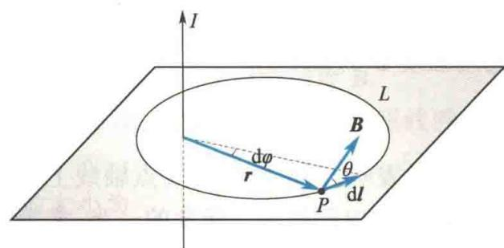
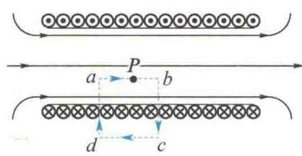
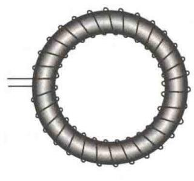
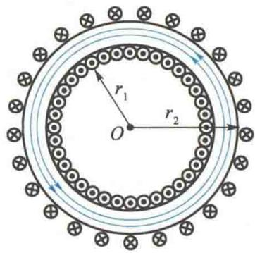
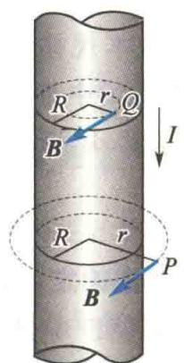
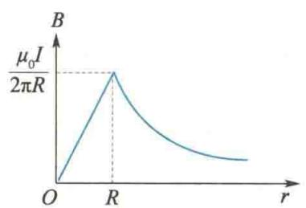
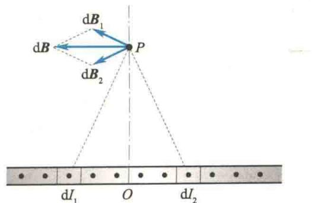
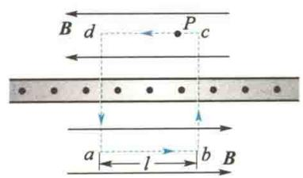

import Guide from '@/components/Guide.astro';
import Knowledge from '@/components/Knowledge.astro';
import Example from '@/components/Example.astro';
import Analysis from '@/components/Analysis.astro';
import Solution from '@/components/Solution.astro';
import Variant from '@/components/Variant.astro';
import Note from '@/components/Note.astro';
import Block from '@/components/Block.astro';
import Method from '@/components/Method.astro';
import Exercise from '@/components/Exercise.astro';

在静电场中,电场强度 E 的环流等于零,即 $\oint_{L} E \cdot dl = 0$ ,说明静电场是保守场.

现在研究稳恒电流的磁场,其磁感应强度 B 的环流 $\oint_{L} B \cdot dl$ 等于多少呢?

## 10.3.1 安培环路定理

  

磁场中的安培环路定理

如图 10.22 所示, 在无限长载流导线产生的磁场中, 取与电流垂直的平面上的任意包围导线的闭合曲线 L, 环路方向与电流方向的关系符合右手螺旋定则. 曲线上任意一点 P 处的磁感应强度 B 的大小为

$$

B = \frac {\mu_ {0} I}{2 \pi r}

$$

  

图 10.22 安培环路定理示意图

式中，I 为导线中的电流；r 为 P 点到导线的距离。B 的方向在平面上且与矢径 r 垂直。由图 10.22 可知

$$

\cos \theta \mathrm{d} l = r \mathrm{d} \varphi

$$

故磁感应强度 B 沿闭合曲线 L 的线积分为

$$

\oint_ {L} \pmb {B} \cdot \mathrm{d} \pmb {l} = \oint_ {L} B \cos \theta \mathrm{d} l = \oint B r \mathrm{d} \varphi = \frac {\mu_ {0} I}{2 \pi} \int_ {0} ^ {2 \pi} \mathrm{d} \varphi = \mu_ {0} I

$$

如果使积分方向(环路方向)反过来(或在图 10.22 中,积分方向不变,而电流方向反过来),则上述积分结果将变为负值,即

$$

\oint_ {L} \boldsymbol {B} \cdot \mathrm{d} \boldsymbol {l} = - \mu_ {0} I

$$

如果闭合回路不包围导线,上述积分结果将等于零,即

$$

\oint_ {L} \boldsymbol {B} \cdot \mathrm{d} \boldsymbol {l} = 0

$$

如果闭合曲线 $L$ 不在一个平面内，可以以通过 $L$ 上各点且垂直于导线的各个平面为参考平面，分别把每一段线元 $\mathrm{d}\pmb{l}$ 分解为在该平面内的分量 $\mathrm{d}\pmb{l}_{\parallel}$ 及垂直于该平面的分量 $\mathrm{d}\pmb{l}_{\perp}$ ，则

$$

\begin{array}{r l} \boldsymbol {B} \cdot \mathrm{d} \boldsymbol {l} & = \boldsymbol {B} \cdot (\mathrm{d} \boldsymbol {l} _ {\perp} + \mathrm{d} \boldsymbol {l} _ {\parallel}) = B \cos 9 0 ^ {\circ} \mathrm{d} l _ {\perp} + B \cos \theta \mathrm{d} l _ {\parallel} \\ & = 0 \pm \frac {\mu_ {0} I}{2 \pi r} r \mathrm{d} \varphi = \pm \frac {\mu_ {0} I}{2 \pi} \mathrm{d} \varphi \end{array}

$$

式中，“±”号取决于积分回路的绕行方向与电流方向的关系. 积分结果仍为

$$

\oint_ {L} \boldsymbol {B} \cdot \mathrm{d} \boldsymbol {l} = \mu_ {0} I

$$

虽然以上讨论是对无限长直载流导线而言的,但其结论具有普遍性.对于任意的稳恒电流所产生的磁场,闭合回路L也不一定是平面曲线,并且穿过闭合回路的电流还可以有许多个,都具有与上面的讨论同样的特性.这一普遍规律性的关系称为安培环路定理,可表述如下:

在真空中的稳恒电流磁场中,磁感应强度 B 沿任意闭合曲线 L 的线积分(也称 B 矢量的环流),等于穿过这个闭合曲线的所有电流(即穿过以闭合曲线为边界的任意曲面的电流)的代数和的 $\mu_{0}$ 倍.其数学表达式为

$$

\oint_ {L} \boldsymbol {B} \cdot \mathrm{d} \boldsymbol {l} = \mu_ {0} \sum I _ {i}\tag{10.13}

$$

式(10.13)中,对于L内的电流的正、负,作这样的规定:当穿过回路L的电流方向与回路L的绕行方向符合右手螺旋定则时,I为正;反之,I为负.如果I不穿过回路L,则I对式(10.13)右端无贡献,但是不能误认为沿回路L上各点的磁感应强度B仅由L内所包围的那部分电流所产生.如果 $\oint_{L}B\cdot dl=0$ ,它只说明回路L所包围的电流的代数和及磁感应强度沿回路L的环流为零,而不能说明回路L上各点的B一定为零.

安培环路定理反映了稳恒电流的磁场与静电场的一个截然不同的性质:静电场的环流 $\oint_{L}E\cdot dl=0$ ，因而可以引进电势这一物理量来描述电场。但对稳恒电流的磁场来说，一般情况下 $\oint_{L}B\cdot dl\neq0$ ，因此不存在标量势。环流不等于零的矢量场称为有旋场，故磁场是有旋场（或涡旋场），也是非保守场。

## 10.3.2 安培环路定理的应用

应用安培环路定理可较简便地计算某些具有特定对称性的载流导线的磁场分布,下面讨论几个简单的应用.

### 1. 长直载流螺线管内的磁场分布

设有一长直螺线管,单位长度上密绕 n 匝线圈,通过每匝线圈的电流为 I,求管内某点 P 处的磁感应强度.可以证明:由于螺线管相当长,故管内中央部分的磁场是均匀的,方向与螺线管轴线平行,管外侧的磁场与管内磁场相比很微弱,可忽略不计.

为了计算管内某点 P 处的磁感应强度, 过 P 点作一矩形回路 abcda, 如图 10.23 所示, 则磁感应强度沿此闭合回路的环流为

  

图10.23 长直载流螺线管内磁感应强度的计算

$$

\oint_ {L} \boldsymbol {B} \cdot \mathrm{d} \boldsymbol {l} = \int_ {a} ^ {b} \boldsymbol {B} \cdot \mathrm{d} \boldsymbol {l} + \int_ {b} ^ {c} \boldsymbol {B} \cdot \mathrm{d} \boldsymbol {l} + \int_ {c} ^ {d} \boldsymbol {B} \cdot \mathrm{d} \boldsymbol {l} + \int_ {d} ^ {a} \boldsymbol {B} \cdot \mathrm{d} \boldsymbol {l}

$$

因为管外侧的磁场可忽略不计,管内磁场沿着轴线方向,所以

$$

\oint_ {L} \boldsymbol {B} \cdot \mathrm{d} \boldsymbol {l} = \int_ {a b} \boldsymbol {B} \cdot \mathrm{d} \boldsymbol {l} = B \overline {{a b}}

$$

闭合回路 abcda 所包围的电流的代数和为 $\overline{abn}I$ ，根据安培环路定理得

$$

B \overline {{a b}} = \mu_ {0} \overline {{a b n I}}

$$

故

$$

B = \mu_ {0} n I\tag{10.14}

$$

可以看出,式(10.14)与式(10.11)的结果完全相同,但应用安培环路定理推导上式比较简便.

### 2. 环形载流螺线管内的磁场分布

在环形管上均匀密绕线圈，形成环形螺线管（又称螺绕环），如图10.24(a)所示。当线圈密绕时，可认为磁场几乎全部集中在管内，管内的磁感线都是同心圆，如图10.24(b)所示。在同一条磁感线上，B的大小相等，方向就是该圆形磁感线的切线方向。

  

(a)

  

(b)  

图 10.24 环形螺线管

现在计算环形螺线管内任意一点 $P$ 处的磁感应强度. 在环形载流螺线管内取过 $P$ 点的磁感线 $L$ 作为闭合回路, 则有

$$

\oint_ {L} \boldsymbol {B} \cdot \mathrm{d} \boldsymbol {l} = B \oint_ {L} \mathrm{d} l = B L

$$

式中， $L$ 是闭合回路的长度.

设环形螺线管共有 N 匝线圈, 每匝线圈的电流为 I, 则闭合回路 L 所包围的电流的代数和为 NI. 由安培环路定理得

$$

\oint_ {L} \pmb {B} \cdot \mathrm{d} \pmb {l} = B L = \mu_ {0} N I

$$

即

$$

B = \mu_ {0} \frac {N}{L} I\tag{10.15}

$$

当环形螺线管的横截面的直径比闭合回路 L 的长度小很多时, 管内的磁场可近似地认为是均匀的, L 可认为是环形螺线管的平均长度, $\frac{N}{L} = n$ 即为单位长度上的线圈匝数, 因此

$$

B = \mu_ {0} n I

$$

### 3. 无限长载流圆柱导体内外的磁场分布

设载流导体为一无限长圆柱导体，半径为 R，电流 I 均匀地分布在导体的横截面上，如图 10.25(a) 所示。显然，场源电流关于中心轴线对称分布，因此其产生的磁场对柱体中心轴线也有对称性，磁感线是一组分布在垂直于轴线的平面上并以轴线为中心的同心圆.与圆柱轴线等距离处的磁感应强度B的大小相等,其方向与电流方向的关系符合右手螺旋定则.

现在计算导体外任意一点 P 处的磁感应强度. 设 P 点与轴线的距离为 r, 过 P 点沿磁感线方向作圆形回路 L, 则 B 沿此回路的环流为

$$

\oint_ {L} \pmb {B} \cdot \mathrm{d} \pmb {l} = \oint_ {L} B \mathrm{d} l = B \oint_ {L} \mathrm{d} l = 2 \pi r B

$$

应用安培环路定理得

$$

\begin{array}{r l} 2 \pi r B & = \mu_ {0} I \\ B & = \frac {\mu_ {0} I}{2 \pi r} \quad (r > R) \end{array}\tag{10.16}

$$

式(10.16)说明,无限长载流圆柱导体外的磁场分布与无限长载流直导线产生的磁场分布相同.

下面计算导体内任意一点 $Q$ 处的磁场. 取过 $Q$ 点的磁感线为积分回路, 包围在这一回路之内的电流为 $\frac{I}{\pi R^2}\pi r^2$ , 因此

$$

\begin{array}{r l} \oint_ {L} \mathbf {B} \cdot \mathrm{d} \mathbf {l} & = 2 \pi r B = \mu_ {0} \frac {I}{\pi R ^ {2}} \pi r ^ {2} \\ B & = \frac {\mu_ {0} I r}{2 \pi R ^ {2}} \quad (r \leqslant R) \end{array}\tag{10.17}

$$

可见，在导体内，磁感应强度 B 的大小与到轴线的距离 r 成正比；在导体外，B 的大小与到轴线的距离 r 成反比。图 10.25(b) 所示为 B 与 r 的关系曲线。

  

(a) 无限长载流圆柱导体的磁感应强度

  

(b) 无限长载流圆柱导体的B与r的关系曲线  

图10.25 无限长载流圆柱导体内外磁场的分布

<Example title="例 10.3">
如图 10.26(a) 所示, 一无限大导体薄平板垂直于纸面放置, 其上有方向垂直于纸面向外的电流, 面电流密度 (通过与电流方向垂直的单位长度的电流) 处处相等, 大小为 i, 求其磁场分布.

  

(a) 无限长导体薄平板

  

(b) 过 $P$ 点的矩形回路  

图10.26 例10.3图

<Solution title="解">
无限大平面电流可看成由无限多根平行排列的长直电流 $\mathrm{d}I$ 组成. 先分析任意一点 $P$ 处磁场的方向, 如图10.26(a)所示, 在以 $OP$ 为对称轴的两侧分别取宽度相等的长直电流 $\mathrm{d}I_{1}$ 和 $\mathrm{d}I_{2}$ , 则 $\mathrm{d}I_{1} = \mathrm{d}I_{2}$ , 故它们在 $P$ 点产生的元磁感应强度 $\mathrm{d}\pmb{B}_{1}$ 和 $\mathrm{d}\pmb{B}_{2}$ 叠加后的合磁感应强度 $\mathrm{d}\pmb{B}$ 的方向一定平行于电流平面, 方向向左. 由此可知, 整个平面电流在 $P$ 点产生的合磁感应强度 $\pmb{B}$ 的方向必然平行于电流平面向左. 同理, 电流平面的下部空间 $\pmb{B}$ 的方向为平行于电流平面向右. 又由于电流平面无限大, 故与电流平面等距离的各点 $\pmb{B}$ 的大小相等.

根据上述磁场分布的特点, 过 P 点作矩形回路 abcda, ab = cd = l, 如图 10.26(b) 所示, 其中 ab 和 cd两边与电流平面平行，而bc和da两边与电流平面垂直且被电流平面等分.该回路所包围的电流为li，由安培环路定理得

$$

\begin{array}{r l} \oint_ {L} \boldsymbol {B} \cdot \mathrm{d} \boldsymbol {l} & = \int_ {a} ^ {b} \boldsymbol {B} \cdot \mathrm{d} \boldsymbol {l} + \int_ {b} ^ {c} \boldsymbol {B} \cdot \mathrm{d} \boldsymbol {l} + \int_ {c} ^ {d} \boldsymbol {B} \cdot \mathrm{d} \boldsymbol {l} + \int_ {d} ^ {a} \boldsymbol {B} \cdot \mathrm{d} \boldsymbol {l} \\ & = \mu_ {0} l i \end{array}

$$

于是

$$

2 B l = \mu_ {0} l i

$$

$$

B = \frac {1}{2} \mu_ {0} i\tag{10.18}

$$

式(10.18)说明,在无限大均匀平面电流两侧的磁场是均匀磁场,且大小相等、方向相反.其磁感线在无穷远处闭合,且方向与电流方向的关系亦符合右手螺旋定则.

</Solution>
</Example>
