import Guide from '@/components/Guide.astro';
import Knowledge from '@/components/Knowledge.astro';
import Example from '@/components/Example.astro';
import Analysis from '@/components/Analysis.astro';
import Solution from '@/components/Solution.astro';
import Variant from '@/components/Variant.astro';
import Note from '@/components/Note.astro';
import Block from '@/components/Block.astro';
import Method from '@/components/Method.astro';
import Exercise from '@/components/Exercise.astro';

## 10.4.1 安培定律

磁场对载流导线的作用力即磁力，通常称为安培力。其基本规律是安培通过大量实验结果总结出来的，故称为安培定律。其内容如下：位于磁场中某点处的电流元 $Idl$ 将受到磁场的作用力 $\mathrm{d}F$ 。 $\mathrm{d}F$ 的大小与电流 $I$ 、电流元的长度 $\mathrm{d}l$ 、磁感应强度 $B$ 的大小及 $Idl$ 与 $B$ 的夹角 $\theta$ 的正弦成正比。即
$$
\mathrm{d} F = k B I \mathrm{d} l \sin \theta
$$
dF 的方向垂直于 Idl 与 B 所确定的平面, 指向由右手螺旋定则确定, 如图 10.27 所示. 式中 k 为比例系数, 取决于各量所用的单位. 在国际单位制 (SI) 中, k = 1, 则上式写成
$$
\mathrm{d} F = B I \mathrm{d} l \sin \theta\tag{10.19}
$$
写成矢量式为
$$
\mathrm{d} \boldsymbol {F} = I \mathrm{d} \boldsymbol {l} \times \boldsymbol {B}\tag{10.20}
$$
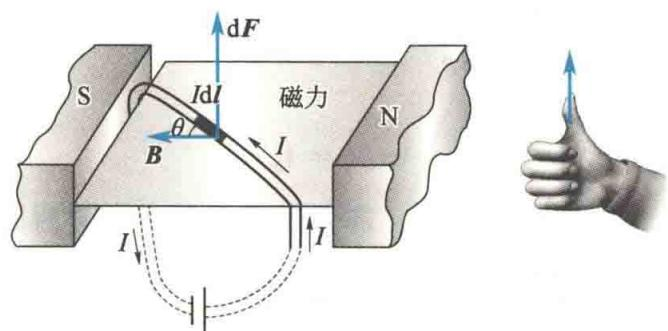  
图 10.27 电流元在磁场中所受的安培力
计算一给定载流导线在磁场中所受到的安培力时,必须对各个电流元所受的力dF求矢量和,即
$$
\pmb {F} = \int_ {L} \mathrm{d} \pmb {F} = \int_ {L} I \mathrm{d} \pmb {l} \times \pmb {B}\tag{10.21}
$$
由于单独的电流元不能获取,因此无法用实验直接证明安培定律.但是应用式(10.21),可以计算各种形状的载流导线在磁场中所受的安培力,计算结果都与实验相符合.例如,长为l的直导线中通有电流I,位于磁感应强度为B的均匀磁场中,当电流方向与B的夹角为 $\theta$ 时,如图10.28(a)所示,因为各电流元所受磁力的方向一致,可采用标量积分,所以这段载流直导线所受的安培力的大小为
$$
F = \int_ {0} ^ {l} I B \sin \theta \mathrm{d} l = I B l \sin \theta\tag{10.22}
$$
方向垂直于纸面向里. 当导线电流方向与磁场方向平行时, 导线所受安培力为零; 当导线电流方向与磁场方向垂直时, 如图 10.28(b) 所示, 导线所受的安培力最大, $F_{\max} = BIl$ . $F$ 的方向既与磁场垂直, 又与导线垂直.
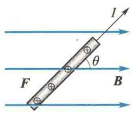  
(a)
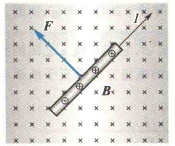  
(b)  
图 10.28 均匀磁场中一段载流直导线所受的安培力

## 10.4.2 两无限长平行载流直导线间的相互作用力

设有两根相距 a 的无限长平行直导线 1 和 2，分别通有同方向的电流 $I_{1}$ 和 $I_{2}$ ，如图 10.29 所示，现在计算两根导线单位长度所受的安培力。在导线 2 上取一电流元 $I_{2}dl_{2}$ ，由毕奥-萨伐尔定律可知，导线 1 在 $I_{2}dl_{2}$ 处产生的磁感应强度 $B_{1}$ 的大小为
$$
B _ {1} = \frac {\mu_ {0} I _ {1}}{2 \pi a}
$$
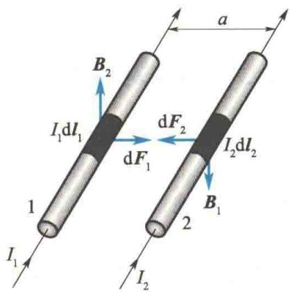
$B_{1}$ 的方向如图 10.29 所示, 垂直于两导线所在的平面. 由安培定律可得, 电流元 $I_{2}dl_{2}$ 所受安培力大小为
图10.29 两平行载流直导线间的相互作用
$$
\begin{array}{r l} \mathrm{d} F _ {2} & = B _ {1} I _ {2} \mathrm{d} l _ {2} \sin \theta \\ & = B _ {1} I _ {2} \mathrm{d} l _ {2} \\ & = \frac {\mu_ {0} I _ {1} I _ {2}}{2 \pi a} \mathrm{d} l _ {2} \end{array}
$$
$\theta$ 表示 $I_{2}dl_{2}$ 与 $B_{1}$ 的夹角， $dF_{2}$ 的方向在两平行导线所在的平面内，垂直于导线 2，并指向导线 1. 所以，导线 2 单位长度所受安培力大小为
$$
\frac {\mathrm{d} F _ {2}}{\mathrm{d} l _ {2}} = \frac {\mu_ {0} I _ {1} I _ {2}}{2 \pi a}\tag{10.23a}
$$
同理可得,导线1单位长度所受安培力的大小为
$$
\frac {\mathrm{d} F _ {1}}{\mathrm{d} l _ {1}} = \frac {\mu_ {0} I _ {1} I _ {2}}{2 \pi a}\tag{10.23b}
$$
方向指向导线 2. 由此可知, 当两平行导线中的电流流向相同时, 两导线通过磁场的作用而相互吸引; 当两平行导线中的电流流向相反时, 两导线通过磁场的作用而相互排斥, 斥力与引力大小相等.
在国际单位制(SI)中,电流的单位为安培,符号为A.由式(10.23a)、式(10.23b)可知,安培的定义为:放在真空中的两根无限长平行直导线,各通有相等的稳恒电流,当两导线相距1m,每一导线每米长度上受力为 $2\times10^{-7}$ N时,各导线中的电流为1A.

<Example title="例 10.4">
通有电流 $I_{1}$ 的长直导线a旁有一与长直导线垂直的共面导线b，导线b中通有电流 $I_{2}$ ，其长度为 $l$ ，近端与导线a的距离为 $d$ ，如图10.30所示。求电流 $I_{1}$ 作用在导线b上的力。

<Solution title="解">
在导线 b 上取线元 dl，它与导线 a 之间的距离为 r，电流 $I_{1}$ 在此处产生的磁场方向垂直于纸面向里，大小为
$$
B = \frac {\mu_ {0} I _ {1}}{2 \pi r}
$$
$$
F = \int_ {\mathrm{b}} \mathrm{d} F = \int_ {d} ^ {d + l} \frac {\mu_ {0} I _ {1} I _ {2} \mathrm{d} r}{2 \pi r} = \frac {\mu_ {0} I _ {1} I _ {2}}{2 \pi} \ln \frac {d + l}{d}
$$
线元 $\mathrm{d}\pmb{l}$ 受力为 $\mathrm{d}\pmb {F} = I_2\mathrm{d}\pmb {l}\times \pmb{B}$
方向垂直于导线 b 向上, 大小为
$$
\mathrm{d} F = \frac {\mu_ {0} I _ {1} I _ {2} \mathrm{d} l}{2 \pi r} = \frac {\mu_ {0} I _ {1} I _ {2} \mathrm{d} r}{2 \pi r}
$$
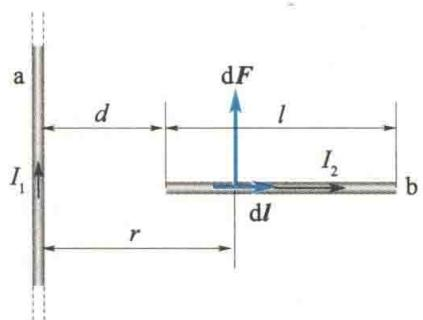
所以,电流 $I_{1}$ 作用在导线 b 上的力的方向垂直于导线 b 向上,大小为
图10.30 例10.4图
</Solution>
</Example>

## 10.4.3 磁场对载流线圈的作用

对于平面载流线圈,通常采用磁矩来表征载流线圈本身的性质.设载流线圈所围面积为 $\Delta S$ , 线圈中电流为 $I_{0}$ , 则该载流线圈的磁矩定义为
$$
\pmb {P} _ {\mathrm{m}} = I _ {0} \Delta S \pmb {n} _ {0}\tag{10.24}
$$
式中，磁矩 $P_{m}$ 是矢量，其方向与线圈的法线方向一致； $n_{0}$ 是沿法线方向的单位矢量。法线方向与电流方向的关系符合右手螺旋定则，如图 10.31 所示。显然，线圈的磁矩是表征线圈本身特性的物理量。
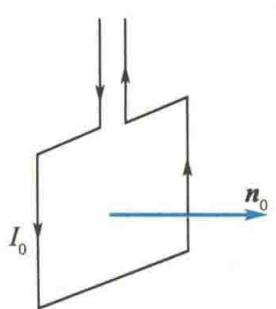  
图10.31 平面载流线圈法线方向的规定

### 1.均匀磁场对载流线圈的作用

设在磁感应强度为 B 的均匀磁场中有一刚性矩形线圈，线圈的边长分别为 $l_{1}$ 、 $l_{2}$ ，电流为 I，如图 10.32(a) 所示。当线圈磁矩的方向与磁场 B 的方向成 $\varphi$ 角（线圈平面与磁场的方向成 $\theta$ 角， $\varphi + \theta = \frac{\pi}{2}$ 时，由安培定律可知，导线 $da$ 和 $bc$ 所受的安培力大小分别为
$$
\begin{array}{r l} F _ {1} & = B I l _ {1} \sin (\pi - \theta) = B I l _ {1} \sin \theta \\ & F _ {1} ^ {\prime} = B I l _ {1} \sin \theta \end{array}
$$
这两个力在同一直线上，大小相等，方向相反，其合力为零。导线 $ab$ 和 $cd$ 都与磁场垂直，它们所受的安培力分别为 $\mathbf{F}_2$ 和 $\mathbf{F}_2'$ ，其大小为
$$
F _ {2} = F _ {2} ^ {\prime} = B I l _ {2}
$$
如图 10.32(b) 所示, $F_{2}$ 和 $F_{2}^{\prime}$ 大小相等, 方向相反, 但不在同一直线上, 形成力偶. 因此, 载流线圈所受的磁力矩为
$$
\begin{array}{r l} M & = F _ {2} \frac {l _ {1}}{2} \cos \theta + F _ {2} ^ {\prime} \frac {l _ {1}}{2} \cos \theta = B I l _ {1} l _ {2} \cos \theta \\ & = B I S \cos \theta = B I S \sin \varphi \end{array}
$$
式中， $S = l_{1}l_{2}$ ，表示线圈平面的面积。如果线圈有 N 匝，那么线圈所受磁力矩的大小为
$$
M = N B I S \sin \varphi = P _ {\mathrm{m}} B \sin \varphi\tag{10.25}
$$
式中， $P_{m}=NIS$ ，即线圈磁矩的大小。磁矩是矢量，式(10.25)写成矢量式为
$$
\boldsymbol {M} = \boldsymbol {P} _ {\mathrm{m}} \times \boldsymbol {B}\tag{10.26}
$$
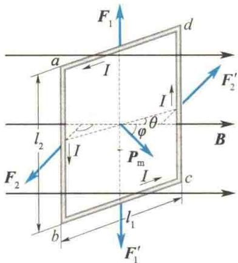  
(a) 侧视图
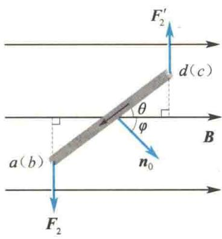  
(b) 俯视图  
图 10.32 平面载流线圈在均匀磁场中所受的力矩
式(10.25)和式(10.26)不仅对矩形线圈成立,对于处在均匀磁场中任意形状的载流平面线圈也同样成立.另外,带电粒子沿闭合回路的运动及带电粒子的自旋所具有的磁矩,使带电粒子在磁场中所受的磁力矩也可用式(10.26)来描述.
下面讨论几种特殊情况.
(1) 当 $\varphi = \frac{\pi}{2}$ 时, 线圈平面与 B 平行, $P_{m}$ 与 B 垂直, 线圈所受的磁力矩最大, 其值为 M = NBIS, 这时磁力矩有使 $\varphi$ 减少的趋势.
(2) 当 $\varphi = 0$ 时, 线圈平面与 B 垂直, $P_{m}$ 与 B 同方向, 线圈所受磁力矩为零, 此时线圈处于稳定平衡状态.
(3) 当 $\varphi = \pi$ 时, 线圈平面与 B 垂直, 但 $P_{m}$ 与 B 反向, 线圈所受磁力矩也为零, 这时线圈处于非稳定平衡位置. 所谓非稳定平衡位置, 是指一旦外界扰动使线圈稍稍偏离这一平衡位置, 磁场对线圈的磁力矩作用将使线圈继续偏离, 直到 $P_{m}$ 转向 B 的
方向(线圈达到稳定平衡状态)时为止.
从上面的讨论可知,平面载流刚性线圈在均匀磁场中由于只受磁力矩作用,因此只发生转动,而不会发生整个线圈的平动.
磁场对载流刚性线圈作用力矩的规律是制成各种电动机和电流计的基本原理.

### 2. 非均匀磁场对载流线圈的作用

如果平面载流线圈处在非均匀磁场中，由于线圈上各个电流元所在处的 B 在大小和方向上都不相同，各个电流元所受的安培力的大小和方向一般也都不相同，因此线圈所受的合力和合力矩一般也不会等于零，导致线圈除转动外还要平动。下面通过特例来说明这种情况。在如图 10.33 所示的辐射形磁场中，设线圈的磁矩 $P_{m}$ 与线圈中心所在处的 B 同方向。取线圈上任意电流元 Idl，把电流元所在处的 B 分解为两个分矢量：垂直于线圈平面的分矢量 $B_{\perp}$ 和平行于线圈平面的分矢量 $B_{\parallel}$ 。电流元 Idl 受到 $B_{\perp}$ 的作用力为 $dF_{2}$ （图 10.33 中未画出），方向沿线圈的半径向外。对整个线圈来说，作用在各个电流元上的这些力只能使线圈发生形变，不能使线圈发生平动或转动。但是电流元 Idl 还同
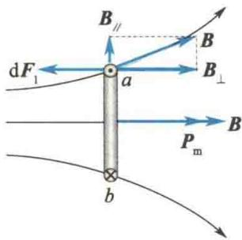  
图10.33 非均匀磁场中的载流线圈
时受到 $B_{\parallel}$ 分矢量作用的力 $\mathrm{d}F_{1}$ ，方向垂直于线圈平面，指向左方。对整个线圈来说，各个电流元所受的这些力的方向都相同，因此在合力的作用下，线圈将向磁场较强处平移。可以证明：合力的大小与线圈的磁矩和磁感应强度的梯度成正比。

<Example title="例 10.5">
一半径为 $R$ 的圆盘带正电，其面电荷密度 $\sigma = kr, k$ 是常数，圆盘放在一均匀磁场中，其法线方向与磁感应强度 $B$ 垂直，如图10.34所示。当圆盘以角速度 $\omega$ 绕过圆心 $O$ 点且垂直于圆盘平面的轴逆时针旋转时，求圆盘的磁矩和磁力矩的大小与方向。

<Solution title="解">
在圆盘上取内半径为 r、外半径为 $r + dr$ 的圆环，则圆环上的电量为
$$
\mathrm{dq} = \sigma 2 \pi r \mathrm{dr}
$$
根据电流的定义,圆环以角速度 $\omega$ 旋转的等效电流为
$$
\mathrm{d} I = \frac {\sigma 2 \pi r \mathrm{d} r}{T} = \frac {\sigma 2 \pi r \mathrm{d} r}{2 \pi / \omega} = \sigma r \omega \mathrm{d} r = k \omega r ^ {2} \mathrm{d} r
$$
圆环的磁矩大小为 $dP_{m} = \pi r^{2} dI = \pi k \omega r^{4} dr$ ，故圆盘的磁矩大小为
$$
P _ {\mathrm{m}} = \int_ {0} ^ {R} \pi k \omega r ^ {4} \mathrm{d} r = \frac {\pi k \omega R ^ {5}}{5}
$$
根据右手螺旋定则可知,磁矩的方向垂直于纸面向外.
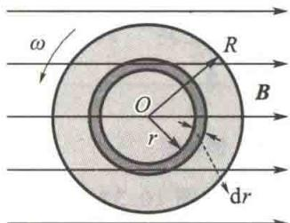  
图10.34 例10.5图
圆环上的磁力矩 $\mathrm{d}M = B\mathrm{d}P_{\mathrm{m}} = B\pi k\omega r^{4}\mathrm{d}r$ ，因此圆盘所受总磁力矩大小为
$$
M = \int \mathrm{d} M = \int_ {0} ^ {R} B \pi k \omega r ^ {4} \mathrm{d} r = \pi k \omega B R ^ {5} / 5
$$
方向由右手螺旋定则可确定为垂直于磁感应强度 B 且竖直向上.
</Solution>
</Example>

## 10.4.4 磁力的功

载流导线或载流线圈在磁场中运动时,其所受的磁力或磁力矩将对它们做功.

### 1. 载流导线在磁场中运动时磁力所做的功

设在磁感应强度为 B 的均匀磁场中有一载流闭合回路 abcda，电流 I 保持不变，电路中 ab 的长为 l，ab 可沿 da 和 cb 滑动，如图 10.35 所示。根据安培定律，ab 所受的磁力 F 的大小为
$$
F = B I l
$$
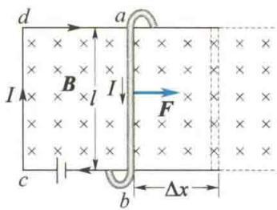
F 的方向如图 10.35 所示. 在 ab 从初始位置向右移动 $\Delta x$ 距离的过程中, 磁力 F 所做的功为
图10.35 磁力所做的功
$$
W = F \Delta x = B I l \Delta x = B I \Delta S = I \Delta \Phi_ {\mathrm{m}}\tag{10.27}
$$
式(10.27)说明,当载流导线在磁场中运动时,如果电流保持不变,则磁力所做的功等于电流乘以通过回路所环绕的面积的磁通量的增量.

### 2. 载流线圈在磁场中转动时磁力矩所做的功

设一面积为 S、通有电流 I 的线圈，处于磁感应强度为 B 的均匀磁场中。下面计算线圈转动时，磁力矩所做的功。
如图 10.36 所示, 设线圈转过极小的角度 dφ, 使 $n(P_{\mathrm{m}})$ 与 B 之间的夹角从 φ 增为 $\varphi + d\varphi$ , 在此转动过程中, 磁力矩做负功 (磁力矩总是试图使 $P_{m}$ 转向 B), 因此
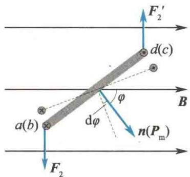
$$
\begin{array}{r l} \mathrm{d} W & = - M \mathrm{d} \varphi = - B I S \sin \varphi \mathrm{d} \varphi \\ & = B I S \mathrm{d} (\cos \varphi) \\ & = I \mathrm{d} (B S \cos \varphi) = I \mathrm{d} \Phi_ {\mathrm{m}} \end{array}
$$
图10.36 磁力矩所做的功
(10.28)
在上述线圈从角位置 $\varphi_{1}$ 转到 $\varphi_{2}$ 的过程中, 维持线圈内电流不变, 则磁力矩所做的总功为
$$
W = \int_ {\Phi_ {\mathrm{m1}}} ^ {\Phi_ {\mathrm{m2}}} I \mathrm{d} \Phi_ {\mathrm{m}} = I (\Phi_ {\mathrm{m2}} - \Phi_ {\mathrm{m1}}) = I \Delta \Phi_ {\mathrm{m}}\tag{10.29}
$$
式中， $\Phi_{m1}$ 和 $\Phi_{m2}$ 分别表示线圈在角位置 $\varphi_{1}$ 和 $\varphi_{2}$ 时通过线圈的磁通量.
可以证明,一个任意的闭合回路在磁场中改变位置或改变形状时,如果维持线圈上的电流不变,则磁力或磁力矩所做的功都可按 $W=I\Delta\Phi_{m}$ 计算,即磁力或磁力矩所做的功等于电流乘以通过载流线圈的磁通量的增量.
如果电流随时间改变,这时磁力所做的总功要用积分计算,即
$$
W = \int_ {\Phi_ {\mathrm{m1}}} ^ {\Phi_ {\mathrm{m2}}} I \mathrm{d} \Phi_ {\mathrm{m}}\tag{10.30}
$$
式 $(10.30)$ 是计算磁力做功的一般公式.

<Example title="例 10.6">
一通有电流 $I$ 的半圆形闭合线圈的半径为 $R$ ，放在均匀的外磁场中，磁感应强度 $\pmb{B}$ 的方向与线圈平面平行，如图10.37所示。（1）求此时线圈所受的磁力矩的大小和方向；（2）求在此磁力矩作用下，当线圈平面转到与磁感应强度 $\pmb{B}$ 垂直的位置时，磁力矩所做的功.

<Solution title="解">
（1）线圈的磁矩为
$$
\pmb {P} _ {\mathrm{m}} = I S \pmb {n} _ {0} = I \frac {\pi}{2} R ^ {2} \pmb {n} _ {0}
$$
在如图 10.37 所示的位置时, 线圈磁矩 $P_{m}$ 的方向与 B 垂直.

由于 $M = P_{m} \times B$ ，故如图 10.37 所示位置线圈所受磁力矩的大小为
$$
M = P _ {\mathrm{m}} B \sin \frac {\pi}{2} = \frac {1}{2} \pi I B R ^ {2}
$$
磁力矩 M 的方向由 $P_{m} \times B$ 确定，为垂直于 B 的方向且向上.
(2) 计算磁力矩做的功. 根据式(10.29), 得
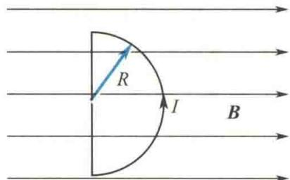  
图10.37 例10.6图
$$
\begin{array}{r l} W & = I \Delta \Phi_ {\mathrm{m}} = I (\Phi_ {\mathrm{m2}} - \Phi_ {\mathrm{m1}}) \\ & = I \left(B \frac {1}{2} \pi R ^ {2} - 0\right) = \frac {1}{2} \pi I B R ^ {2} \end{array}
$$
此问题也可以用积分计算,请读者自行完成.
</Solution>
</Example>
