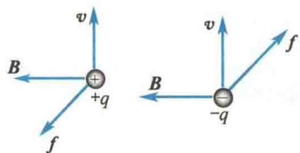
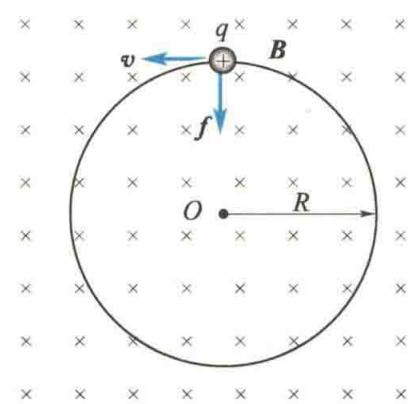
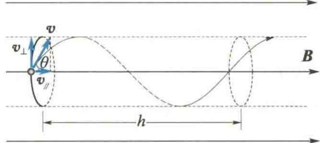
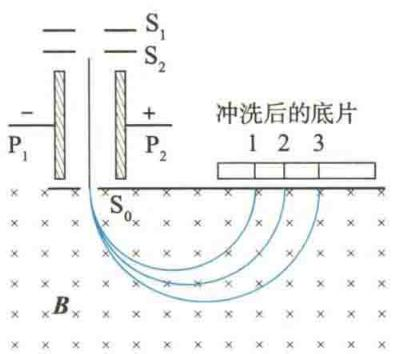
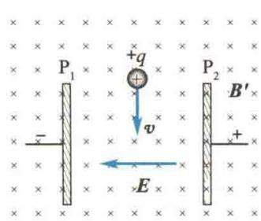
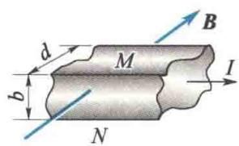
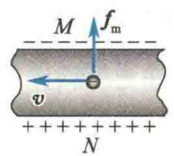
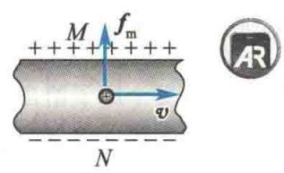
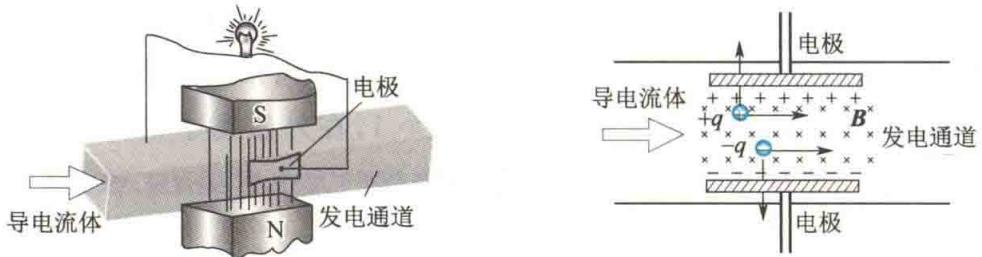

import Guide from '@/components/Guide.astro';
import Knowledge from '@/components/Knowledge.astro';
import Example from '@/components/Example.astro';
import Analysis from '@/components/Analysis.astro';
import Solution from '@/components/Solution.astro';
import Variant from '@/components/Variant.astro';
import Note from '@/components/Note.astro';
import Block from '@/components/Block.astro';
import Method from '@/components/Method.astro';
import Exercise from '@/components/Exercise.astro';

本节将研究磁场对运动电荷的磁力作用和带电粒子在磁场中的运动规律,以及霍尔效应等实际应用的例子.

## 10.5.1 洛伦兹力

  

洛伦兹

从安培定律可以推算出每一个运动着的带电粒子在磁场中所受的力. 由安培定律得, 任意电流元 $Idl$ 在磁感应强度为 $\pmb{B}$ 的磁场中所受的力 $\mathrm{dF}$ 的大小为

$$

\mathrm{d} F = B I \mathrm{d} l \sin \theta

$$

式中， $\theta$ 为 Idl 与 B 的夹角. 因为电流可写成

$$

I = q n v S

$$

式中，S 为电流元的横截面积，v 为带电粒子的定向运动速率，q 为带电粒子的电量，n 为导体内带电粒子数密度。所以有

$$

\mathrm{d} F = q n v S B \mathrm{d} l \sin \theta

$$

由于电流元 $Idl$ 的方向与带电粒子 $q$ 定向运动的方向一致，故上式中的 $\theta$ 亦为 $\pmb{v}$ 与 $\pmb{B}$ 的夹角. 而在线元 $\mathrm{d}l$ 这一段导体内定向运动的带电粒子数目 $\mathrm{d}N = nS\mathrm{d}l$ ，每一个带电粒子受到的磁场作用力，都使粒子与电流元导线发生碰撞，产生磁场对载流导线的作用力 $\mathrm{d}F$ ，因此每一个定向运动的带电粒子所受到的磁力 $f$ 的大小为

$$

f = \frac {\mathrm{d} F}{\mathrm{d} N} = q v B \sin \theta\tag{10.31}

$$

磁场对运动电荷作用的力 f 称为洛伦兹力. 如果带电粒子带正电荷, 则它所受的洛伦兹力 f 的方向与 $v \times B$ 的方向一致; 如果粒子带负电荷, 则洛伦兹力的方向与正电荷的情形相反, 如图 10.38 所示.

  

图10.38 洛伦兹力的方向

洛伦兹力的矢量表达式为

$$

f = q \pmb {v} \times \pmb {B}\tag{10.32}

$$

式中， $q$ 的正负取决于粒子所带电荷的正负.由式（10.32）可以看出，洛伦兹力 $\pmb{f}$ 总是与带电粒子运动速度 v 的方向垂直, 即有 $f \cdot v = 0$ , 因此洛伦兹力不能改变运动电荷速度的大小, 只能改变速度的方向, 使带电粒子的运动路径弯曲.

如果带电粒子在同时存在电场和磁场的空间中运动,则其所受合力为

$$

\boldsymbol {F} = q (\boldsymbol {E} + \boldsymbol {v} \times \boldsymbol {B})\tag{10.33}

$$

式(10.33)称为洛伦兹关系式,它包含电场力qE与磁力(洛伦兹力) $qv\times B$ 两部分.

## 10.5.2 带电粒子在均匀磁场中的运动

科研成果介绍

设有一均匀磁场,磁感应强度为 B,一电量为 q、质量为 m 的粒子以速度 v 进入磁场.在磁场中粒子受到洛伦兹力,则

  

北京正负电子

对撞机

$$

\boldsymbol {f} = q \boldsymbol {v} \times \boldsymbol {B} = m \frac {\mathrm{d} \boldsymbol {v}}{\mathrm{d} t}

$$

(10.34)

下面分三种情况进行讨论.

### 1) $\pmb{v}$ 与 $\pmb{B}$ 平行

当带电粒子的运动速度 v 与 B 同向或反向时,作用于带电粒子的洛伦兹力等于零.由式(10.34)可知,v 为恒矢量,故带电粒子仍做匀速直线运动,不受磁场的影响.

### 2) $\pmb{v}$ 与 $\pmb{B}$ 垂直

若带电粒子以速度 v 沿垂直于磁场的方向进入均匀磁场 B 中, 如图 10.39 所示, 则洛伦兹力 f 的方向始终与速度 v 垂直, 故带电粒子将在 f 与 v 所确定的平面内做匀速圆周运动. 洛伦兹力即为向心力, 其运动方程为

$$

\bar {q v B} = m \frac {v ^ {2}}{R}

$$

可求得轨道半径(又称回旋半径)

$$

R = \frac {m v}{q B}\tag{10.35}

$$

图10.39 $\pmb{v}$ 垂直于 $B$ 时的运动

由式(10.35)可知,对于一定的带电粒子 $\left(\frac{q}{m}\text{一定}\right)$ ,当它在均匀磁场中运动时,其轨道半径R与带电粒子的速度大小成正比.

由式 $(10.35)$ 还可求得粒子在圆周轨道上绕行一周所需的时间(周期)为

$$

T = \frac {2 \pi R}{v} = \frac {2 \pi m}{q B}\tag{10.36}

$$

T 的倒数即粒子在单位时间内绕圆周轨道转过的圈数, 称为带电粒子的回旋频率, 用 $\nu$ 表示为

科研成果介绍

$$

\nu = \frac {1}{T} = \frac {q B}{2 \pi m}\tag{10.37}

$$

式(10.36)和式(10.37)表明,带电粒子在垂直于磁场方向的平面内做圆周运动时,其周期T和回旋频率 $\nu$ 只与磁感应强度B及粒子本身的质量m和所带的电量q有关,而与粒子的速度及回旋半径无关.也就是说,同种粒子在同样的磁场中运动时,快速粒子在半径大的圆周上运动,慢速粒子在半径小的圆周上运动,但它们绕行一周所需的时间都相同.这是带电粒子在磁场中做圆周运动的一个显著特征.回旋加速器

兰州重离子研究装置

就是根据这一特征设计制造的.

### 3) $\pmb{v}$ 与 $\pmb{B}$ 斜交成 $\theta$ 角

当带电粒子的运动速度 $\pmb{v}$ 与磁场 $\pmb{B}$ 成 $\theta$ 角时，可将 $\pmb{v}$ 分解为与 $\pmb{B}$ 垂直的速度分量 $v_{\perp} = v\sin \theta$ 和与 $\pmb{B}$ 平行的速度分量 $v_{\parallel} = v\cos \theta.$ 根据上面的讨论可知，在垂直于 $\pmb{B}$ 的

方向上,由于具有分速度 $v_{\perp}$ ,磁力将使粒子在垂直于B的平面内做匀速圆周运动.在平行于B的方向上,磁场对粒子没有作用力,粒子以速度分量 $v_{\parallel}$ 做匀速直线运动.这两种运动合成的结果,使带电粒子在均匀磁场中做等螺距的螺旋运动,如图10.40所示.此时螺旋线的半径为

  

图10.40 $\pmb{v}$ 与 $B$ 斜交时的运动

$$

R = \frac {m v _ {\perp}}{q B} = \frac {m v \sin \theta}{q B}

$$

螺旋周期为

$$

T = \frac {2 \pi R}{v _ {\perp}} = \frac {2 \pi m}{q B}\tag{10.38}

$$

螺距为

$$

h = v _ {\parallel} T = v \cos \theta T = \frac {2 \pi m v \cos \theta}{q B}\tag{10.39}

$$

带电粒子在磁场中的螺旋线运动广泛地应用于“磁聚焦”技术.

测定离子荷质比的仪器称为质谱仪.倍恩勃立奇质谱仪的原理图如图10.41(a)所示.离子源所产生的带电量为q的离子,经狭缝 $S_{1}$ 和 $S_{2}$ 之间的加速电场加速,进入由 $P_{1}$ 、 $P_{2}$ 组成的速度选择器.在速度选择器中,电场强度为E,磁感应强度为 $B^{\prime}$ .E、 $B^{\prime}$ 方向如图10.41(b)所示.从 $S_{0}$ 射出的离子垂直射入一磁感应强度为B的均匀磁场中.离子进入这一磁场后,因受洛伦兹力而做匀速圆周运动.不同质量的离子打在底片的不同位置上,形成按离子质量排列的线系.若底片上有三条线系,则该元素有几种同位素?设 $d_{1}$ 、 $d_{2}$ 、 $d_{3}$ 是底片上1、2、3三个位置与速度选择器轴线间的距离,该元素的这几种同位素的质量分别为多少?

  

(a) 倍恩勃立奇质谱仪原理图

  

(b) 速度选择器  

图10.41 例10.7图

<Solution title="解">
如图 10.41(b) 所示, 在速度选择器中, 带电量为 q 的离子所受电场力大小 $f_{e} = qE$ , 同时所受磁力大小$f_{m}=qvB'$ ，两力方向相反。只有当离子的速度大小满足 $qE=qvB'$ ，即 $v=\frac{E}{B'}$ 时，离子才有可能穿过 $P_{1}$ 和

$P_{2}$ 两板间的狭缝，从 $S_{0}$ 射出.

$$

m = \frac {q B B ^ {\prime}}{E} R

$$

离子自 $S_{0}$ 进入均匀磁场 B 后, 做匀速圆周运动. 设其半径为 R, 则

将 $R = \frac{d_1}{2},\frac{d_2}{2},\frac{d_3}{2}$ 分别代入，得

$$

q v B = m \frac {v ^ {2}}{R}

$$

$$

m _ {1} = \frac {q B B ^ {\prime}}{2 E} d _ {1}

$$

式中 B、q、v 是一定的，则质量 m 不同的离子对应不同的圆周运动半径 R，故该元素有三种同位素.

$$

\left\{m _ {2} = \frac {q B B ^ {\prime}}{2 E} d _ {2} \right.

$$

又因为 $v = \frac{E}{B'}$ ，代入上式得

$$

m _ {3} = \frac {q B B ^ {\prime}}{2 E} d _ {3}

$$
</Solution>

## 10.5.3 霍尔效应

将一导体板放在垂直于板面的磁场中，如图10.42(a)所示。当有电流 $I$ 沿着垂直于磁感应强度 $\pmb{B}$ 的方向通过导体时，在金属板上、下两表面 $M, N$ 之间就会出现横向电势差 $U_{\mathrm{H}}$ 。这种现象是美国物理学家霍尔在1879年首先发现的，因此称为霍尔效应。电势差 $U_{\mathrm{H}}$ 称为霍尔电压（或霍尔电势差）。实验表明，霍尔电压 $U_{\mathrm{H}}$ 与电流 $I$ 及磁感应强度 $\pmb{B}$ 的大小成正比，与导体板的厚度 $d$ 成反比，即

$$

U _ {\mathrm{H}} = R _ {\mathrm{H}} \frac {I B}{d}\tag{10.40}

$$

式中， $R_{H}$ 是仅与导体材料有关的常数，称为霍尔系数.

霍尔电压的产生是运动电荷在磁场中受洛伦兹力作用的结果, 这是因为导体中的电流是带电粒子定向运动形成的. 如果做定向运动的带电粒子是负电荷, 则它所受的洛伦兹力 $f_{\mathrm{m}}$ 的方向如图 10.42(b) 所示, 结果使导体的上表面 $M$ 聚集负电荷, 下表面 $N$ 聚集正电荷, 在 $M, N$ 两表面间产生方向向上的电场; 如果做定向运动的带电粒子是正电荷, 则它所受的洛伦兹力 $f_{\mathrm{m}}$ 的方向如图 10.42(c) 所示, 在这个力的作用下, 导体的上表面 $M$ 聚集正电荷, 下表面 $N$ 聚集负电荷, 在 $M, N$ 两表面间产生方向向下的电场, 当这个电场对带电粒子的电场力 $f_{\mathrm{e}}$ 正好与磁场 $B$ 对带电粒子的洛伦兹力 $f_{\mathrm{m}}$ 互相平衡时, 达到稳定状态, 此时上、下两表面的电势差 $U_{M} - U_{N}$ 就是霍尔电压 $U_{\mathrm{H}}$ .

  

(a)

  

(b)

  

(c)

  

图10.42 霍尔效应

设导体内载流子的电量为 q，定向运动平均速度为 v，它在磁场中所受的洛伦兹力大小为

$$

f _ {\mathrm{m}} = q v B

$$

如果导体板的宽度为 b，当导体上、下两表面间的电势差为 $U_{M}-U_{N}$ 时，带电粒子所受的电场力大小为

$$

f _ {\mathrm{e}} = q E = q \frac {U _ {M} - U _ {N}}{b}

$$

由平衡条件有

$$

q v B = q \frac {U _ {M} - U _ {N}}{b}

$$

则导体上、下两表面间的电势差为

$$

U _ {\mathrm{H}} = U _ {M} - U _ {N} = b v B

$$

设导体内载流子浓度为 n，于是 I = nqvbd，以此代入上式可得

$$

U _ {\mathrm{H}} = \frac {1}{n q} \frac {I B}{d}\tag{10.41}

$$

将式(10.41)与式(10.40)比较,可得霍尔系数

$$

R _ {\mathrm{H}} = \frac {1}{n q}\tag{10.42}

$$

式(10.42)表明,霍尔系数的数值取决于每个载流子所带的电量q和载流子浓度n,其正负取决于载流子所带电荷的正负.若q为正,则 $R_{H}>0,U_{M}-U_{N}>0$ ;若q为负,则 $R_{H}<0,U_{M}-U_{N}<0$ .由实验测定霍尔电压或霍尔系数后,就可判定载流子带的是正电荷还是负电荷.也可用此方法来判定半导体是空穴型(P型)的还是电子型(N型)的.此外,根据霍尔系数的大小,还可测定载流子浓度.

一般金属导体中的载流子就是自由电子, 其浓度很大, 因此金属材料的霍尔系数很小, 相应的霍尔电压也很弱. 但在半导体材料中, 载流子浓度 n 很小, 因而半导体材料的霍尔系数与霍尔电压比金属的大得多, 故实际中大多采用半导体材料.

近年来，霍尔效应已在测量技术、电子技术、自动化技术、计算技术等多个领域中得到越来越普遍的应用。例如，我国已制造出多种半导体材料的霍尔元件，可以用来测量磁感应强度、电流、压力、转速等，还可以用于放大、振荡、调制、检波等方面，也可以用于制造电子计算机中的计算元件等。

<Example title="例 10.8">
有一宽为 $0.50 \, cm$ 、厚为 $0.10 \, mm$ 的薄片银导线，当薄片中通以 $2 \, A$ 电流，且有 $0.80 \, T$ 的磁场垂直于薄片时，产生的霍尔电压为多大（银的密度为 $10.5 \, g/cm^{3}$ ）？

<Solution title="解">
银原子是单价原子, 每个原子给出一个自由电子, 则单位体积中的自由电子数 n 将等于单位体积中的银原子数. 已知银的原子量为 108, 1 mol 银 (0.108 kg) 有 $N_{0} = 6.0 \times 10^{23}$ 个原子, 银的密度为 $10.5 \times 10^{3} \, kg/m^{3}$ , 则

$$

\begin{array}{r l} n & = N _ {0} \frac {\rho}{M _ {\mathrm{mol}}} = 6. 0 \times 1 0 ^ {2 3} \times \frac {1 0 . 5 \times 1 0 ^ {3}}{0 . 1 0 8} \mathrm{m} ^ {- 3} \\ & \approx 6 \times 1 0 ^ {2 8} \mathrm{m} ^ {- 3} \end{array}

$$

由式(10.41)可求出霍尔电压为

$$

\begin{array}{r l} U _ {\mathrm{H}} & = \frac {1}{n q} \frac {I B}{d} \\ & = \frac {2 \times 0 . 8 0}{6 \times 1 0 ^ {2 8} \times 1 . 6 \times 1 0 ^ {- 1 9} \times 0 . 1 0 \times 1 0 ^ {- 3}} \mathrm{V} \\ & \approx 1. 7 \times 1 0 ^ {- 6} \mathrm{V} \end{array}

$$

由此可知，对于良导体，霍尔电压是非常微小的。

</Solution>
</Example>

## \*10.5.4 磁流体发电

除固体外，在导电流体中同样会产生霍尔效应。图10.43是磁流体发电机原理示意图。在燃烧室中利用燃料（油、煤气或原子能反应堆）燃烧的热能加热气体，使之成为等离子体，其温度约为 $3000\mathrm{K}$ （为了加速等离子体的形成，往往在气体中加入少量钾或铯等容易电离的物质）。然后使这种高温等离子体（导电流体）以约 $1000\mathrm{m / s}$ 的高速进入发电通道，发电通道的上、下两面有磁极以产生磁场 $\pmb{B}$ ，其两侧安有电极，则在以高速 $\pmb{v}$ 流动着的导电流体中，正、负带电粒子的运动方向与磁场垂直。由于受洛伦兹力的作用，正、负带电粒子将分别向垂直于 $\pmb{v}$ 和 $\pmb{B}$ 的两个相反方向偏转，因此在发电通道两侧的电极上产生电势差。如果不断提供高温高速的等离子体，便能在电极上连续输出电能。

  

图 10.43 磁流体发电机原理示意图

  

等离子体及其磁约束

我们知道，在普通发电机中，电动势是由线圈在磁场中转动产生的。为此必须先把初级能源（化学燃料、核燃料）燃烧放出的热能经过锅炉、热机等变成机械能，然后再变成电能。而在磁流体发电机中，是利用热能加热等离子体，然后使等离子体通过磁场产生电动势，从而直接得到电能。这一过程不经过热能到机械能的转变，因而损耗少，热效率高（可达 $50\% \sim 60\%$ ，而火力发电的热效率通常只有 $30\% \sim 40\%$ ）。但磁流体发电目前还存在某些技术问题有待解决，如发电通道效率低，通道和电极的材料都要求耐高温、耐腐蚀、耐化学烧蚀等。目前所用材料的寿命都比较短，因而磁流体发电机不能长时间运行，磁流体发电还没有达到实用阶段。

  

磁流体发电机
