import Guide from '@/components/Guide.astro';
import Knowledge from '@/components/Knowledge.astro';
import Example from '@/components/Example.astro';
import Analysis from '@/components/Analysis.astro';
import Solution from '@/components/Solution.astro';
import Variant from '@/components/Variant.astro';
import Note from '@/components/Note.astro';
import Block from '@/components/Block.astro';
import Method from '@/components/Method.astro';
import Exercise from '@/components/Exercise.astro';

## 10.6.1 磁介质的分类

实际的磁场中大多存在着各种各样的物质,这些物质因受磁场的作用而处于一种特殊的状态,称为磁化状态.磁化后的物质反过来又对磁场产生影响,我们称能够影响磁场的物质为磁介质.

实验表明,不同的物质对磁场的影响差异很大.若均匀磁介质处于磁感应强度为 $B_{0}$ 的外磁场中,磁介质要被磁化,从而产生磁化电流.磁化电流也要激发磁感应强度为 $B'$ 的附加磁场,则磁介质中的总磁感应强度B是 $B_{0}$ 和 $B'$ 的叠加,即

$$

\boldsymbol {B} = \boldsymbol {B} _ {0} + \boldsymbol {B} ^ {\prime}\tag{10.43}

$$

对不同的磁介质, $B'$ 的大小和方向可能有很大的差别.为了便于讨论磁介质的分类,我们引入相对磁导率 $\mu_{r}$ .当均匀磁介质充满整个磁场时,磁介质的相对磁导率定义为

$$

\mu_ {\mathrm{r}} = \frac {B}{B _ {0}}

$$

(10.44)

磁介质车票

式中，B 为磁介质中的总磁场的磁感应强度的大小， $B_{0}$ 为真空中磁场（或者说外磁场）的磁感应强度的大小。 $\mu_{r}$ 可用来描述不同磁介质磁化后对原外磁场的影响。类似于介电常量 $\varepsilon$ 的定义，我们定义磁介质的磁导率为

$$

\mu = \mu_ {0} \mu_ {\mathrm{r}}\tag{10.45}

$$

实验指出,就磁性来说,物质可分为以下三类.

（1）抗磁质. 这类磁介质的相对磁导率 $\mu_{r} < 1$ ，在外磁场中，其附加磁感应强度 $B'$ 与 $B_{0}$ 方向相反，因而总磁感应强度的大小 $B < B_{0}$ . 汞、铜、铋、氢、锌、铅等都是抗磁质.

(2) 顺磁质. 这类磁介质的相对磁导率 $\mu_{\mathrm{r}} > 1$ , 在外磁场中, 其附加磁感应强度 $B'$ 与 $B_{0}$ 方向相同, 因而总磁感应强度的大小 $B > B_{0}$ . 锰、铬、铂、氧、铝等都是顺磁质.

科研成果介绍

  

磁悬浮列车

（3）铁磁质. 这类磁介质的相对磁导率 $\mu_{r} \gg 1$ ，在外磁场中，其附加磁感应强度 $B'$ 与 $B_{0}$ 方向相同，且 $B' \gg B_{0}$ ，因而总磁感应强度的大小 $B \gg B_{0}$ 。铁、镍、钴、钆等都是铁磁质.

抗磁质和顺磁质的磁性都很弱,统称为弱磁质.它们的 $\mu_{r}$ 尽管可能大于1或者小于1,但是都很接近1,而且 $\mu_{r}$ 都是与外磁场无关的常数.铁磁质的磁性都很强,而且还具有一些特殊的性质.

## \*10.6.2 抗磁质与顺磁质的磁化

下面根据物质的结构来说明物质的磁性. 在无外磁场作用时, 分子中任何一个电子都同时参与两种运动, 即环绕原子核的轨道运动和电子本身的自旋. 这两种运动都能产生磁效应. 把分子看成一个整体, 分子中各个电子对外界所产生的磁效应的总和可用一个等效的圆电流表示, 称为分子电流. 这种分子电流具有的磁矩称为分子固有磁矩或分子磁矩, 用 $P_{\mathrm{m}}$ 表示.

当没有外磁场作用时，抗磁质分子的固有磁矩 $P_{\mathrm{m}} = 0$ ，从而整块磁介质有 $\sum P_{\mathrm{mi}} = 0$ ，介质不显磁性；而顺磁质分子的固有磁矩 $P_{\mathrm{m}} \neq 0$ ，但由于排列杂乱无章，整块磁介质仍有 $\sum P_{\mathrm{mi}} = 0$ ，因此介质也不显磁性.

无外磁场时，抗磁质分子的固有磁矩 $P_{\mathrm{m}} = 0$ ，这是由于分子中各电子的轨道运动磁矩和自旋运动磁矩的矢量和为零.就每个电子而言，无论是轨道运动还是自旋运动都产生磁矩.当有外磁场作用时，将引起分子磁矩的变化，在分子上产生附加磁矩 $\Delta P_{\mathrm{m}}$ .下面来分析附加磁矩 $\Delta P_{\mathrm{m}}$ 及由此产生的附加磁场 $B^{\prime}$ 的方向.

附加磁矩 $\Delta P_{m}$ 是由电子的进动产生的, 具体分析如下.

（1）绕核轨道运动磁矩为 $P_{\mathrm{m,e}}$ 的电子的进动.设电子绕核轨道运动的磁矩为 $P_{\mathrm{m,e}}$ ，因为电子带负电，所以电子绕核轨道运动的角动量 $L_{\mathrm{e}}$ 与磁矩 $P_{\mathrm{m,e}}$ 方向相反（见图10.44).在外磁场作用下，电子所受的磁力矩为

$$

\boldsymbol {M} = \boldsymbol {P} _ {\mathrm{m,e}} \times \boldsymbol {B} _ {0}

$$

根据角动量定理 $M = \frac{\mathrm{d}L_{\mathrm{e}}}{\mathrm{d}t}$ ，电子轨道运动角动量 $L_{\mathrm{e}}$ 的改变量 $\mathrm{d}L_{\mathrm{e}}$ 与 $M$ 同方向，即顺着 $B_{0}$ 的方向看去，电子运动的轨道角动量 $L_{\mathrm{e}}$ 绕 $B_{0}$ 以顺时针方向转动。因此，电子在绕核轨道运动的同时还以外磁场 $B_{0}$ 的方向为轴线转动。电子的这种运动就叫作电子的进动，进动角速度为 $\Omega$ 而且，不论电子原来轨道运动角动量的方向如何，即不论电子磁矩 $P_{\mathrm{m,e}}$ 与 $B_0$ 的夹角大于或小于 $\frac{\pi}{2}$ ，由电子进动产生的附加磁矩 $\Delta P_{\mathrm{m,e}}$ 总是与外磁场 $B_0$ 的方向相反，如图10.44所示.

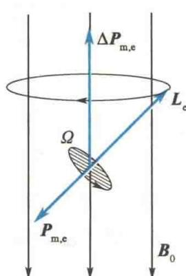  

图10.44 电子的进动

（2）分子的附加磁矩 $\Delta P_{m}$ . 因为电子的附加磁矩 $\Delta P_{m,e}$ 总是与 $B_{0}$ 的方向相反，所以电子附加磁矩 $\Delta P_{m,e}$ 的总和即分子的附加磁矩 $\Delta P_{m}$ 总是与 $B_{0}$ 的方向相反. 它将产生一个与 $B_{0}$ 反方向的 $B'$ ，这就是抗磁效应.

在顺磁质分子中，即使在没有外磁场时，各个电子的磁效应也不相互抵消，故顺磁质分子的固有磁矩 $P_{\mathrm{m}}$ 不等于零。当存在外磁场时，外磁场在电子上也引起附加磁矩。但分子磁矩 $P_{\mathrm{m}}$ 比分子中电子附加磁矩的总和大得多，以致 $\Delta P_{\mathrm{m}}$ 可以忽略不计。这样，顺磁性物质中的分子电流由于外磁场的作用，它们的磁矩将转向外磁场方向，于是 $\sum P_{\mathrm{mi}} \neq 0$ ，产生与外磁场同方向的附加磁场 $B'$ ，故顺磁质内的磁感应强度的大小为 $B = B_0 + B'$ 。这就是顺磁性物质磁效应的成因。

## \*10.6.3 磁化强度

与电介质中引入极化强度 P 来描述电介质的极化程度类似, 在磁介质中可引入磁化强度 M 来描述磁介质的磁化程度.

对于顺磁质,我们将磁介质内某点处单位体积内分子磁矩的矢量和定义为该点的磁化强度,即

$$

M = \frac {\sum P _ {\mathrm{mi}}}{\Delta V}\tag{10.46a}

$$

顺磁质中 M 的方向与外磁场 $B_{0}$ 的方向相同.

对于抗磁质,磁化的主要原因是抗磁质分子在外磁场中产生附加磁矩 $\Delta P_{m}, \Delta P_{m}$ 与 $B_{0}$ 的方向相反,大小与 $B_{0}$ 成正比.抗磁质的磁化强度为

$$

\boldsymbol {M} = \frac {\sum \Delta \boldsymbol {P} _ {\mathrm{mi}}}{\Delta V}\tag{10.46b}

$$

抗磁质中 M 的方向与外磁场 $B_{0}$ 的方向相反.

在国际单位制(SI)中,磁化强度的单位名称是安培每米,符号为 A/m.

## 10.6.4 磁介质中的安培环路定理

### \*1. 磁化强度与磁化电流的关系

当电介质极化时,极化强度与极化电荷有着密切的关系.与此类似,当磁介质被磁化时,磁化强度与磁化电流也有着密切的关系.下面通过一个简单的例子来进行讨论.

设有一无限长载流直螺线管，管内充满均匀的顺磁质，螺线管的电流为 $I$ 。在此电流磁场 $\pmb{B}_0$ 的作用下，磁介质中分子电流平面将趋向与磁感应强度 $\pmb{B}_0$ 方向垂直，如图10.45(a)所示。在均匀磁介质内部任意位置处通过的分子电流是成对的，而且方向相反，结果互相抵消，如图10.45(b)所示。只有在横截面边缘处，分子电流未被抵消，形成与横截面边缘重合的圆电流 $I_{\mathrm{s}}$ 。对磁介质整体来说，分子电流沿着圆柱面以垂直于其母线的方向流动，称为磁化面电流。因为是顺磁质，所以磁化面电流与螺线管上导线中的电流 $I$ 方向相同，如图10.45(c)所示。如果是抗磁质，则两者方向相反。

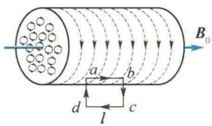  

(a)

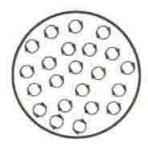  

(b)

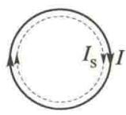  

(c)  

图 10.45 充满顺磁质的长直螺线管

设 $j_{s}$ 为圆柱形磁介质表面上“单位长度的分子面电流”（磁化面电流密度），S 为磁介质的横截面积，l 为所选取的一段磁介质的长度。在 l 长度上，磁化电流 $I_{s} = l j_{s}$ ，因此在这段总体积为 Sl 的磁介质中的总磁矩为

$$

\sum P _ {\mathrm{mi}} = I _ {\mathrm{s}} S = j _ {\mathrm{s}} l S

$$

按定义,磁介质的磁化强度大小为

$$

M = \frac {\sum P _ {m i}}{\Delta V} = \frac {j _ {s} S l}{S l} = j _ {s}\tag{10.47}

$$

式(10.47)表明,磁化强度M在量值上等于磁化面电流密度.M是矢量, $j_{s}$ 也是矢量,它们之间的关系写成矢量式为

$$

j _ {\mathrm{s}} = M \times n _ {0}\tag{10.48}

$$

式中， $n_{0}$ 是磁介质表面外法线方向上的单位矢量。不难看出，这一关系与电介质中极化面电荷密度和极化强度 P 的关系 $\sigma' = P \cdot n = P_{n}$ 相对应。

下面进一步讨论磁化强度与磁化电流之间的关系. 如图 10.45(a) 所示, 在圆柱体磁介质的边界附近, 取一长方形的闭合回路 abcda, ab 在磁介质内部, 它平行于圆柱体轴线, 长度为 l, 而 bc、ad 两边则垂直于圆柱面. 现在, 在磁介质内部各点处 M 都沿 ab 方向, 大小相等, 在圆柱外各点处 M = 0. 因此, 磁化强度 M 对图 10.45(a) 中的闭合回路的线积分为

$$

\oint_ {L} \boldsymbol {M} \cdot \mathrm{d} \boldsymbol {l} = \int_ {a b} \boldsymbol {M} \cdot \mathrm{d} \boldsymbol {l} = M \overline {{a b}} = M l

$$

将 $M = j_{\mathrm{s}}$ 代入上式得

$$

\oint_ {L} \boldsymbol {M} \cdot \mathrm{d} \boldsymbol {l} = j _ {\mathrm{s}} l = I _ {\mathrm{s}}\tag{10.49}

$$

这里， $j_{s}l = I_{s}$ 就是通过闭合回路 abcda 的总磁化电流。式(10.49)虽然是从均匀磁介质及长方形闭合回路的简单特例导出的，但它是在任何情况下都普遍适用的关系式。

### 2. 磁介质中的安培环路定理

下面把真空中磁场的安培环路定理推广到有磁介质存在的稳恒磁场中. 当电流的磁场中有磁介质时, 由于介质的磁化, 要产生磁化电流. 如果考虑到磁化电流对磁场的贡献, 则安培环路定理应写成

$$

\oint_ {L} \boldsymbol {B} \cdot \mathrm{d} \boldsymbol {l} = \mu_ {0} \left(\sum I _ {i} + I _ {\mathrm{s}}\right)\tag{10.50}

$$

式中，B 为磁介质中的总磁感应强度；等式右边括号内的两项电流之和是穿过回路所围面积的总电流，即传导电流 $\sum I_{i}$ 和磁化电流 $I_{s}$ 的代数和。

  

磁介质中的安培环路定理

将式 $(10.49)$ 代入式 $(10.50)$ ，则有

或

$$

\begin{array}{r l} & {\oint_ {L} \pmb {B} \cdot \mathrm{d} \pmb {l} = \mu_ {0} \left(\sum I _ {i} + \oint_ {L} \pmb {M} \cdot \mathrm{d} \pmb {l}\right)} \\ & {\qquad \oint_ {L} \left(\frac {\pmb {B}}{\mu_ {0}} - \pmb {M}\right) \cdot \mathrm{d} \pmb {l} = \sum I _ {i}} \end{array}

$$

和电介质中引进电位移 D 相似，以 $\left(\frac{B}{\mu_{0}} - M\right)$ 定义一个新的物理量 H，称为磁场强度。即

$$

\pmb {H} = \frac {\pmb {B}}{\mu_ {0}} - \pmb {M}\tag{10.51}

$$

这样,有磁介质时的安培环路定理便有下列简单的形式

$$

\oint_ {L} \boldsymbol {H} \cdot \mathrm{d} \boldsymbol {l} = \sum I _ {i}\tag{10.52}

$$

从式(10.52)可知,在稳恒磁场中,磁场强度 H 沿任意一闭合路径的线积分(H 的环流)等于包围在环路内各传导电流的代数和,而与磁化电流无关.

## 10.6.5 磁感应强度 B 与磁场强度 H 的关系

式(10.51)是磁场强度H的定义式,它表示了磁场中任意一点处H、B、M三个物理量之间的关系.而且不论磁介质是否均匀,甚至是铁磁质,用此式定义的磁场强度H都是正确的.

实验表明,对于各向同性的均匀磁介质,介质内任意一点的磁化强度 M 与该点的磁场强度 H 成正比.比例系数 $\chi_{m}$ 是恒量,称为磁介质的磁化率,即

$$

\pmb {M} = \chi_ {\mathrm{m}} \pmb {H}\tag{10.53}

$$

把式 $(10.53)$ 代入式 $(10.51)$ ，则得

$$

\boldsymbol {B} = \mu_ {0} \boldsymbol {H} + \mu_ {0} \boldsymbol {M} = \mu_ {0} (1 + \chi_ {\mathrm{m}}) \boldsymbol {H}\tag{10.54}

$$

如果引入一个物理量 $\mu_{\mathrm{r}}$ ，令

$$

\mu_ {\mathrm{r}} = 1 + \chi_ {\mathrm{m}}\tag{10.55}

$$

$\mu_{r}$ 就是磁介质的相对磁导率, 这和用式(10.44)所定义的 $\mu_{r}$ 是同一个量, 于是式(10.54)可写成

$$

\boldsymbol {B} = \mu_ {0} \mu_ {\mathrm{r}} \boldsymbol {H} = \mu \boldsymbol {H}\tag{10.56}

$$

对于真空， $M=0,\chi_{m}=0,\mu_{r}=1,\mu=\mu_{0}$ ，因此， $B=\mu_{0}H$ .

对于各向同性的均匀磁介质， $\chi_{\mathrm{m}}$ 是恒量， $\mu_{\mathrm{r}}$ 也是恒量，且都是纯数， $\mu_{\mathrm{r}} = 1 + \chi_{\mathrm{m}}$ 。磁介质的磁化率 $\chi_{\mathrm{m}}$ 、相对磁导率 $\mu_{\mathrm{r}}$ 、磁导率 $\mu$ 都是描述磁介质磁化特性的物理量，只要知道三个量中的任意一个量，该磁介质的磁性就完全清楚了。对于顺磁质， $\chi_{\mathrm{m}} > 0$ ，故 $\mu_{\mathrm{r}} > 1$ ；对于抗磁质， $\chi_{\mathrm{m}} < 0$ ，故 $\mu_{\mathrm{r}} < 1$ 。表10.1列出了几种常见磁介质的磁化率。

表 10.1 几种常见磁介质的磁化率

<table><tr><td colspan="2">材料</td><td> $\chi_{m} = \mu_{r} - 1$ </td><td colspan="2">材料</td><td> $\chi_{m} = \mu_{r} - 1$ </td></tr><tr><td rowspan="4">顺磁质</td><td>锰(18°C)</td><td> $12.4 \times 10^{-5}$ </td><td rowspan="4">抗磁质</td><td>铋(18°C)</td><td> $-1.70 \times 10^{-5}$ </td></tr><tr><td>铬(18°C)</td><td> $4.5 \times 10^{-5}$ </td><td>铜(18°C)</td><td> $-1.08 \times 10^{-6}$ </td></tr><tr><td>铝(18°C)</td><td> $8.2 \times 10^{-6}$ </td><td>银(18°C)</td><td> $-2.5 \times 10^{-6}$ </td></tr><tr><td>空气(101 kPa,20°C)</td><td> $3.036 \times 10^{-4}$ </td><td>氢(20°C)</td><td> $-2.47 \times 10^{-5}$ </td></tr></table>

可见，在常温下，磁化率的值都很小，相对磁导率 $\mu_{r}$ 都接近于 1.

通过以上的讨论可知,引入磁场强度 H 这个物理量以后,能够比较方便地处理有磁介质的磁场问题,就像引入电位移 D 后,能够比较方便地处理有电介质的静电场问题一样.特别是均匀磁介质充满整个磁场,且磁场分布又具有某些对称性的情况,可用有磁介质的安培环路定理先求出磁场强度 H 的分布,再根据 $B = \mu H$ 得出介质中磁场的磁感应强度的分布,在整个过程中可不考虑磁化电流.下面举例说明.

(b)

<Example title="例 10.9">
一根无限长的直圆柱形铜导线, 外包一层相对磁导率为 $\mu_{r}$ 的圆筒形磁介质, 导线半径为 $R_{1}$ , 磁介质的外半径为 $R_{2}$ , 导线内有电流 I 通过, 电流均匀分布在横截面上, 如图 10.46 所示, 求:

(1) 介质内外的磁场强度分布, 并画出 H-r 曲线 (r 是磁场中某点到圆柱轴线的距离);

(2) 介质内外的磁感应强度分布, 并画出 B-r 曲线.

<Solution title="解">
（1）由于电流分布具有轴对称性，因此磁场分布也具有轴对称性，可用安培环路定理求解。在垂直于轴线的平面上，选择积分回路 L 为以圆柱轴线与平面的交点为圆心、r 为半径的圆周，由式（10.52）可得

$$

\oint_ {L} \boldsymbol {H} \cdot \mathrm{d} \boldsymbol {l} = 2 \pi r H = \sum I _ {i}

$$

$$

H = \frac {1}{2 \pi r} \sum I _ {i}

$$

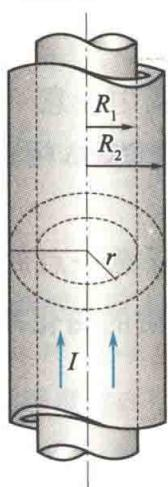  

图10.46 例10.9图

当 $r < R_{1}$ 时

$$

H _ {1} = \frac {1}{2 \pi r} \frac {I}{\pi R _ {1} ^ {2}} \pi r ^ {2} = \frac {I}{2 \pi R _ {1} ^ {2}} r

$$

当 $R_{1} \leqslant r \leqslant R_{2}$ 时

$$

H _ {2} = \frac {I}{2 \pi r}

$$

当 $r > R_{2}$ 时

$$

H _ {3} = \frac {I}{2 \pi r}

$$

画出 H-r 曲线, 如图 10.47(a) 所示.

(2) 由已求出的介质内外的磁场强度分布, 再根据 $B = \mu H = \mu_{0} \mu_{r} H$ 确定介质内外的磁感应强度分布.

当 $r < R_{1}$ 时，该区域在导线内，可作为真空处理， $\mu_{\mathrm{r}} = 1$ ，故 $B_{1} = \mu_{0}H_{1} = \frac{\mu_{0}I}{2\pi R_{1}^{2}} r;$

当 $R_{1} \leqslant r \leqslant R_{2}$ 时，该区域是相对磁导率为 $\mu_{\mathrm{r}}$ 的磁介质，故 $B_{2} = \mu H_{2} = \mu_{0}\mu_{\mathrm{r}}\frac{I}{2\pi r};$

当 $r > R_{2}$ 时，该区域为真空，故 $B_{3} = \mu_{0}H_{3} = \frac{\mu_{0}I}{2\pi r}$ 画出 $B - r$ 曲线，如图10.47(b)所示.可见，在边界 $r = R_{1}$ 和 $r = R_{2}$ 处，磁感应强度不连续.

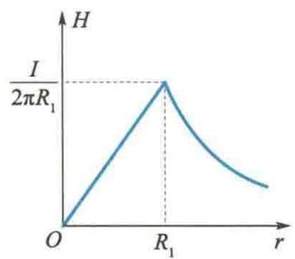  

(a)

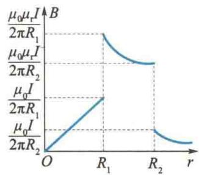  

图10.47 $H - r$ 和 $B - r$ 曲线
</Solution>
</Example>

## 10.6.6 铁磁质

铁磁质是一类特殊的磁介质,也是最有用的磁介质.铁、镍、钴和它们的一些合金均属于铁磁质.

### 1. 磁化曲线

在实验室中, 常用图 10.48 所示的电路来研究铁磁质的磁化特性. 以铁磁质作为芯的环形螺线管和电源及可变电阻串联成一电路, 设螺线管单位长度的匝数为 n, 当线圈中通有电流 I 时, 螺线管内的磁场强度大小为

$$

H = n I

$$

与 $H$ 相应的磁感应强度大小 $B$ 可通过图中的磁通计①来测量.

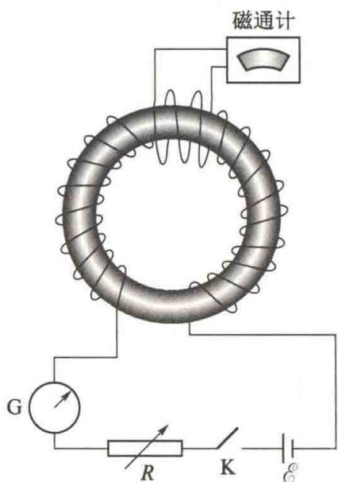  

图10.48 测定铁磁质磁化特性的实验装置

实验结果:测得铁磁质内的磁感应强度大小 B 和磁场强度大小 H 之间的关系,不再是顺磁质和抗磁质内那种简单的线性关系,而是较复杂的函数关系,如图 10.49 所示.开始时 H=0,B=0,磁介质处于未磁化状态.当逐渐增大线圈中的电流时,H 逐渐增大,B 也逐渐增大,相当于曲线的 O\~1 段;当 H 继续增大时,B 急剧增大,相当于曲线的 1\~2 段;H 再继续增大,B 开始缓慢增大,相当于曲线的 2\~a 段;到达 a 点后,磁场强度 H 再增大时,铁磁质内的磁感应强度 B 不再增大了,达到磁化饱和状态.这时的磁感应强度 $B_{s}$ 叫作饱和磁感应强度.这条曲线叫作起始磁化曲线,简称磁化曲线.

由图 10.49 可以看出, 对于铁磁质, B 和 H 之间不是线性关系, 故曲线上各点的斜率(即磁导率 $\mu$ ) 是不同的. 也就是说, 铁磁质的 $\mu$ 不再是常数, 而是磁场强度 H 的函数, 这个函数关系可用图 10.50 所示的曲线表示. 由于铁磁质具有很大的磁导率, 即 $\mu_{r} \gg 1$ , 故在外磁场的作用下, 铁磁质中将产生与外磁场同方向、量值很大的磁感应强度. 并且在撤去外磁场后, 介质的磁化状态并不能恢复到原来的起点, 而是保留部分磁性.

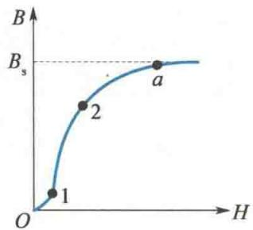  

图10.49 铁磁质的起始磁化曲线

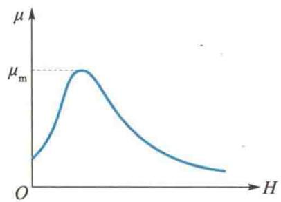  

图10.50 铁磁质的 $\mu - H$ 曲线

### 2. 磁滞回线

铁磁质的磁化达到饱和状态以后,如果使H减小,实验发现,此时B也减小,但B

并不沿原来的起始磁化曲线(Oa 曲线)下降,而是沿着另一曲线 ab 下降,如图 10.51 所示.当 H=0 时,B 没有回到零,磁介质中还保留一定的磁感应强度 $B_{r}$ , $B_{r}$ 称为剩余磁感应强度,简称剩磁.到达 b 点以后,按 $0\rightarrow-H_{c},-H_{c}\rightarrow-H_{s},-H_{s}\rightarrow0,0\rightarrow H_{c},H_{c}\rightarrow H_{s}$ 的顺序继续改变磁场强度 H;相应的磁感应强度 B 将分别沿着曲线 $b\rightarrow c,c\rightarrow a',a'\rightarrow b',b'\rightarrow c',c'\rightarrow a$ 变化.从上述变化过程可以看出,磁感应强度 B 的变化总是落后于磁场强度 H 的变化,这种现象称为磁滞现

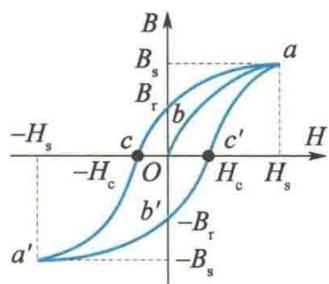  

图10.51 磁滞回线

象, 是铁磁质的重要特性之一. 图 10.51 中的闭合曲线 $abca'b'c'a$ 称为磁滞回线. 如果在达到饱和状态以前就把 $H$ 减小, $B$ 将沿另一较小的磁滞回线变化.

从上述的实验结果可知,对铁磁质而言,B不是H的单值函数.对同一磁场强度(如H=0),磁感应强度可能有不同的量值 $(B=Ob,Ob',\cdots,0)$ ,这取决于铁磁质的磁化历史.

磁滞回线

若要完全消除铁磁质内的剩磁(称为完全退磁),需要加上反向磁场.使铁磁质完全退磁所需的反向磁场强度 $H_{c}$ 称为矫顽力.实际中通常不采用加恒定的反向电流消除剩磁的方法,而是施加一个由强变弱的交变磁场,使铁磁质的剩磁逐渐减弱到零.例如,录音机和录像机的磁头、磁带等的退磁都采用这一方法.

实验指出,铁磁质反复磁化时会发热,这种耗散为热量的能量损失,称为磁滞损耗.热量的产生是因为铁磁质在反复磁化时,分子的振动加剧,使分子振动加剧的能量是由产生磁化场的电流所供给的.可以证明,磁化一次的磁滞损耗与B-H磁滞回线所包围的面积成正比,而磁滞损耗的功率与反复磁化的频率成正比.因此,对一具有铁芯的线圈来说,线圈中所通的交流电流频率愈高,以及磁滞回线面积愈大,磁滞损耗的功率也愈大.

### 3. 磁畴

铁磁性不能用一般顺磁质的磁化理论来解释. 因为铁磁质的单个原子或分子并不具有任何特殊的磁性. 如铁原子和铬原子的结构大致相同, 原子的磁矩也相同, 但铁是典型的铁磁质, 而铬是普通的顺磁质. 可见, 铁磁性并不是与原子或分子有关的性质, 而是和物质的固体结构有关的性质.

现代理论和实验都证明，在铁磁质内存在着许多小区域，其体积约为 $10^{-12} \, m^{3}$

其中含有 $10^{12} \sim 10^{15}$ 个原子. 在这些小区域内的原子间存在着非常强的电子“交换耦合作用”，使相邻原子的磁矩排列整齐，也就是说，这些小区域已自发磁化到饱和状态了. 这种小区域称为磁畴. 每个磁畴相当于一个小的磁性极强的永久磁铁. 无外磁场作用时，同一磁畴内的分子磁矩方向一致，各个磁畴的磁矩方向杂乱无章，磁介质的总磁矩为零，宏观上对外不显磁性. 多晶铁磁质的磁畴示意图如图10.52所示.

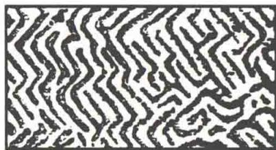  

图10.52 多晶铁磁质的磁畴示意图

图 10.53 为用磁畴的观点说明铁磁质的磁化过程示意图。有四个体积相同的磁畴，它们的取向不同，磁矩恰好抵消，对外不显磁性，如图 10.53(a) 所示。当加有外磁场时，铁磁质内自发磁化方向和外磁场相近的磁畴体积将因外磁场的作用而扩大，自发磁化方向与外磁场有较大偏离的磁畴体积将缩小。如果外磁场较弱，则磁畴的这种扩大、缩小过程较缓慢，如图 10.53(b) 所示，这相当于图 10.49 中磁化曲线的 O～1 段。如果外磁场增强，并达到一定值，磁畴界壁就以相当快的速度跳跃地移动，直到自发磁化方向与外磁场偏离较大的那些磁畴全部消失，如图 10.53(c) 所示，此过程与图 10.49 中 1～2 段相对应，是一不可逆过程（即外磁场减弱后，磁畴不能完全恢复原状）。如外磁场继续增加，则留存的磁畴逐渐转向外磁场方向，如图 10.53(d) 所示。当所有磁畴的自发磁化方向都和外磁场方向相同时，磁化达到饱和，这相当于图 10.49 中的 2～a 段。

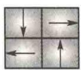  

(a)

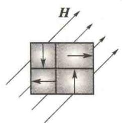  

(b)

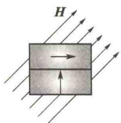  

(c)

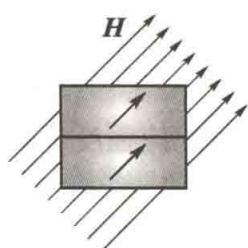  

(d)  

图 10.53 用磁畴的观点说明铁磁质的磁化过程示意图

由于铁磁质内存在杂质和内应力,因此磁畴在磁化和退磁过程中做不连续的体积变化和转向时,磁畴不能按原来的变化规律逆着退回原状,因而出现磁滞现象和剩磁.

铁磁性和磁畴结构的存在是分不开的, 当铁磁质受到强烈震动, 或在高温下剧烈的热运动使磁畴瓦解时, 铁磁质的铁磁性也就消失了. 皮埃尔·居里曾发现: 对任何铁磁质来说, 各有一特定的温度, 当铁磁质的温度高于这一温度时, 磁畴全部瓦解, 铁磁性完全消失而成为普通的顺磁质. 这个温度叫作居里点. 铁、镍、钴的居里点分别为 $770^{\circ} \mathrm{C}, 358^{\circ} \mathrm{C}, 1115^{\circ} \mathrm{C}$ .

### 4. 铁磁质的分类及其应用

从铁磁质的性质和应用方面来看,按矫顽力的大小,可将铁磁质分为软磁材料、硬磁材料和矩磁材料.

软磁材料的矫顽力小 $(H_{c}<100\ A/m)$ ，磁滞回线狭长，如图10.54(a)所示。这种材料容易磁化，也容易退磁，适合在交变电磁场中工作，常用来制造各种电感元件、变压器、镇流器、继电器等。一旦切断电流，剩磁很小。常用的金属软磁材料有工程纯铁、硅钢、坡莫合金等。常用的非金属软磁铁氧体有锰锌铁氧体、镍锌铁氧体等。

硬磁材料的矫顽力较大 $(H_{c}>100\ A/m)$ ，磁滞回线宽大，如图10.54(b)所示。这种材料的磁滞特性显著，磁化后，会保留较大的剩磁，且不易退磁，故适合作为永磁体，常用于制造磁电式电表、永磁扬声器、拾音器、电话、录音机、耳机等电器设备。常见的金属硬磁材料有碳钢、钨钢、铝钢等。

矩磁材料的特点是剩磁 $B_{r}$ 很大，接近于饱和磁感应强度 $B_{s}$ ，而矫顽力小，其磁滞回线接近于矩形，如图10.54(c)所示。当它被外磁场磁化时，总是处在 $B_{r}$ 或 $-B_{r}$ 两种不同的剩磁状态，因此适合用来制造计算机中的储存记忆元件。通常计算机中采用二进制，只有“1”和“0”两个数码，因此可用矩磁材料的两种剩磁状态分别代表这两个数码，从而起到“记忆”的作用。目前常用的矩磁材料有锰-镁铁氧体和锂-锰铁氧体等，广泛用于制造天线、电感磁芯和记忆元件。

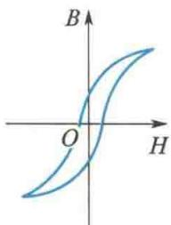  

(a) 软磁材料

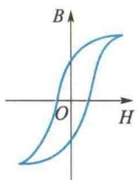  

(b) 硬磁材料  

图 10.54 几种铁磁质的磁滞回线

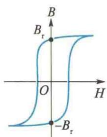  

(c) 矩磁材料

<Example title="例 10.10">
在图 10.48 所示的测定铁磁质磁化特性的实验装置中, 设所用的环形螺线管共有 1 000 匝, 平均半径为 15.0 cm, 当通有 2.00 A 电流时, 测得环内磁感应强度 B 为 1.00 T. 求:

(1) 螺线管铁芯内的磁场强度大小 H 和磁化强度大小 M;

(2) 该铁磁质的磁导率 $\mu$ 和相对磁导率 $\mu_{r}$ ;

(3) 已磁化的环形铁芯的“分子表面电流密度”.

解（1）磁场强度大小为

$$

\begin{array}{r l} H = n I & = \frac {1 0 0 0}{2 \pi \times 1 5 . 0 \times 1 0 ^ {- 2}} \times 2. 0 0 \mathrm{A/m} \\ & = 2. 1 2 \times 1 0 ^ {3} \mathrm{A/m} \end{array}

$$

磁化强度大小为

$$

M = \frac {B}{\mu_ {0}} - H = \left(\frac {1 . 0 0}{4 \pi \times 1 0 ^ {- 7}} - 2. 1 2 \times 1 0 ^ {3}\right) \mathrm{A/m}

$$

$$

= 7. 9 4 \times 1 0 ^ {5} \mathrm{A/m}

$$

(2) 铁磁质中磁场在上述 H 值时的磁导率为

$$

\begin{array}{r l} \mu & = \frac {B}{H} = \frac {1 . 0 0}{2 . 1 2 \times 1 0 ^ {3}} \mathrm{H/m} \\ & = 4. 7 1 \times 1 0 ^ {- 4} \mathrm{H/m} \end{array}

$$

相对磁导率为

$$

\mu_ {\mathrm{r}} = \frac {\mu}{\mu_ {0}} = \frac {4 . 7 1 \times 1 0 ^ {- 4}}{4 \pi \times 1 0 ^ {- 7}} = 3 7 5

$$

(3) 环形铁芯的“分子表面电流密度”为

$$

j _ {\mathrm{s}} = M = 7. 9 4 \times 1 0 ^ {5} \mathrm{A/m}

$$

其绕行方向与螺线管中电流方向相同.
</Example>
