import Guide from '@/components/Guide.astro';
import Knowledge from '@/components/Knowledge.astro';
import Example from '@/components/Example.astro';
import Analysis from '@/components/Analysis.astro';
import Solution from '@/components/Solution.astro';
import Variant from '@/components/Variant.astro';
import Note from '@/components/Note.astro';
import Block from '@/components/Block.astro';
import Method from '@/components/Method.astro';
import Exercise from '@/components/Exercise.astro';

## 解答题

<Exercise title="习题 10.3.1">
在同一磁感线上,各点磁感应强度 B 的大小是否都相等?为何不把作用于运动电荷的磁力方向定义为磁感应强度 B 的方向?
</Exercise>

<Exercise title="习题 10.3.2">
(1) 在没有电流的空间区域里, 如果磁感线是平行直线, 磁感应强度 B 的大小在沿磁感线和垂直于它的方向上是否可能变化(磁场是否一定是均匀的)? (2) 若存在电流, 上述结论是否还对?
</Exercise>

<Exercise title="习题 10.3.3">
在长直载流螺线管的情况下,前面曾推导出其内部磁感应强度 $B = \mu_{0} nI$ , 外部磁感应强度 B = 0, 因此在载流螺线管外部环绕一周(见题 10.3.3 图) 的环路积分为

$$

\oint_ {L} \pmb {B} _ {\mathrm{外}} \cdot \mathrm{d} \pmb {l} = 0

$$

但从安培环路定理来看,环路 L 中有电流 I 穿过,环路积分应为

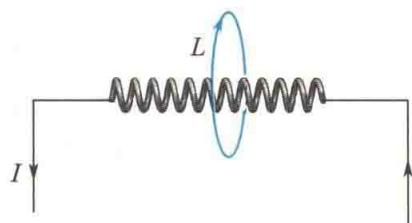  

题10.3.3图

$$

\oint_ {L} \pmb {B} _ {\mathrm{外}} \cdot \mathrm{d} \pmb {l} = \mu_ {0} I

$$
</Exercise>

<Exercise title="习题 10.3.4">
如果一个电子在通过空间某一区域时不偏转,能否肯定这个区域中没有磁场?如果它发生偏转,能否肯定这个区域中存在着磁场?
</Exercise>

<Exercise title="习题 10.3.5">
已知磁感应强度大小 $B = 2.0\mathrm{T}$ 的均匀磁场，方向沿 $x$ 轴正方向，如题10.3.5图所示.试求：(1)通过图中abcd面的磁通量；(2)通过图中befc面的磁通量；(3)通过图中aefd面的磁通量.如题10.3.6图所示，AB、CD为长直导线，BC为圆心在O点的一段圆弧形导线，其半径为R.若通以电流I，求O点的磁感应强度.

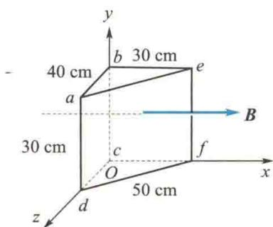  

题10.3.5图

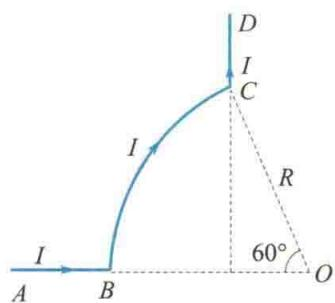  

题10.3.6图
</Exercise>

<Exercise title="习题 10.3.7">
在真空中，有两根互相平行的无限长直导线 $\mathrm{L}_1$ 和 $\mathrm{L}_2$ ，它们相距 $0.10\mathrm{m}$ ，通有方向相反的电流， $I_{1} = 20\mathrm{A}, I_{2} = 10\mathrm{A}$ ，如题10.3.7图所示。A、B两点与导线在同一平面内。这两点与导线 $\mathrm{L}_2$ 的距离均为 $5.0\mathrm{cm}$ 。试求A、B两点处的磁感应强度，以及磁感应强度为零的点的位置。
</Exercise>

<Exercise title="习题 10.3.8">
如题10.3.8图所示，两根导线沿半径方向引向铁环上的 $A, B$ 两点，并在很远处与电源相连。已知圆环的粗细均匀，求环中心 $O$ 的磁感应强度。

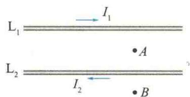  

题10.3.7图

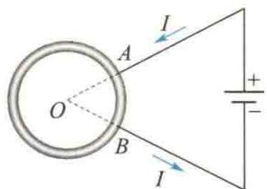  

题10.3.8图
</Exercise>

<Exercise title="习题 10.3.9">
在一半径 $R = 1.0\mathrm{cm}$ 的无限长半圆柱形金属薄片中，有电流 $I = 5.0\mathrm{A}$ 自上而下通过，电流分布均匀，如题10.3.9图所示.试求圆柱轴线任意一点 $P$ 处的磁感应强度.
</Exercise>

<Exercise title="习题 10.3.10">
氢原子处在基态时，它的电子可看作在半径 $a = 0.52 \times 10^{-8} \, cm$ 的轨道上做匀速圆周运动，速率 $v = 2.2 \times 10^{8} \, cm/s$ 。试求电子在轨道中心所产生的磁感应强度和电子磁矩的大小。
</Exercise>

<Exercise title="习题 10.3.11">
两平行长直导线相距 $d = 40\mathrm{cm}$ ，每根导线载有电流 $I_{1} = I_{2} = 20\mathrm{A}$ ，如题10.3.11图所示.求：(1）两导线所在平面内与该两导线等距的一点 $A$ 处的磁感应强度；

(2) 通过题 10.3.11 图中斜线所示面积的磁通量 $(r_{1}=r_{3}=10\ \text{cm}, l=25\ \text{cm})$ .

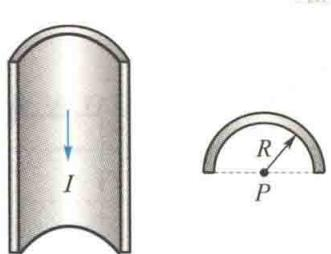  

题10.3.9图

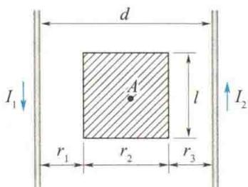  

题10.3.11图
</Exercise>

<Exercise title="习题 10.3.12">
一根很长的铜导线载有电流10 A，设电流均匀分布。在导线内部作一平面S，如题10.3.12图所示。试计算通过平面S的磁通量（沿导线长度方向取长为1 m的一段计算）。铜的磁导率 $\mu\approx\mu_{0}$ 。设题10.3.13图中两导线中的电流均为8 A，对图示的三条闭合曲线a、b、c，分别写出安培环路定理等式右边电流的代数和，并讨论：

(1) 在各条闭合曲线上, 各点的磁感应强度 B 的大小是否相等?

(2) 在闭合曲线 c 上各点的磁感应强度 B 是否为零？为什么？

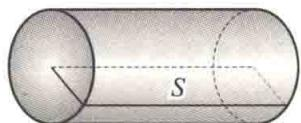  

题10.3.12图

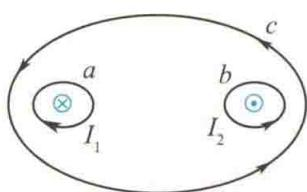  

题10.3.13图
</Exercise>

<Exercise title="习题 10.3.14">
题10.3.14图所示是一根长直圆管形导体的横截面，内、外半径分别为 $a, b$ ，导体内载有沿轴线方向的电流 $I$ ，且 $I$ 均匀地分布在管的横截面上。设导体的磁导率 $\mu \approx \mu_0$ ，试证明导体内部各点 $(a < r < b)$ 的磁感应强度的大小由下式给出：

$$

B = \frac {\mu_ {0} I}{2 \pi (b ^ {2} - a ^ {2})} \frac {r ^ {2} - a ^ {2}}{r}

$$
</Exercise>

<Exercise title="习题 10.3.15">
一根很长的同轴电缆,由一导体圆柱(半径为 a) 和一同轴的导体圆筒(内、外半径分别为 b、c) 构成,如题 10.3.15 图所示.使用时,电流 I 从一导体流出,从另一导体流回.设电流都是均匀地分布在导体的横截面上,求:(1) 导体圆柱内 (r &lt; a) 各点的磁感应强度的大小;(2) 两导体之间 (a &lt; r &lt; b) 各点的磁感应强度的大小;(3) 导体圆筒内 (b &lt; r &lt; c) 各点的磁感应强度的大小;(4) 电缆外 (r > c) 各点的磁感应强度的大小.

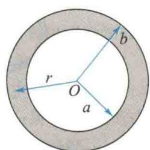  

题10.3.14图

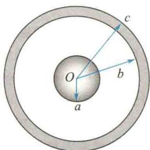  

题10.3.15图
</Exercise>

<Exercise title="习题 10.3.16">
在半径为 R 的长直圆柱形导体内部，与轴线平行地挖成一半径为 r 的长直圆柱形空腔，两轴间距离为 a，且 a > r，横截面如题 10.3.16 图所示。现在电流 I 沿导体管流动，电流均匀分布在管的横截面上，而电流方向与管的轴线平行。求：

(1) 圆柱轴线上的磁感应强度的大小；

(2) 空心部分轴线上的磁感应强度的大小.
</Exercise>

<Exercise title="习题 10.3.17">
如题 10.3.17 图所示, 长直电流 $I_{1}$ 附近有一等腰直角三角形线框, 通以电流 $I_{2}$ , 二者共面. 求 $\triangle ABC$ 的各边所受的磁力.

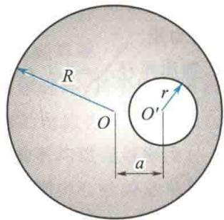  

题10.3.16图

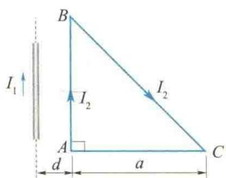  

题10.3.17图
</Exercise>

<Exercise title="习题 10.3.18">
在磁感应强度为 B 的均匀磁场中, 垂直于磁场方向的平面内有一段载流弯曲导线, 电流为 I, 如题 10.3.18 图所示. 求其所受的安培力.
</Exercise>

<Exercise title="习题 10.3.19">
如题10.3.19图所示，在长直导线 $AB$ 内通有电流 $I_{1} = 20\mathrm{A}$ ，在矩形线圈CDEF中通有电流 $I_{2} = 10\mathrm{A}, AB$ 与线圈共面，且 $CD, EF$ 都与 $AB$ 平行.已知 $a = 9.0~\mathrm{cm}, b = 20.0~\mathrm{cm}, d = 1.0~\mathrm{cm}$ ，求：

(1) 导线 AB 的磁场对矩形线圈每边所作用的力；

(2) 矩形线圈所受合力和绕通过其相对两边中点的竖直轴的合力矩.

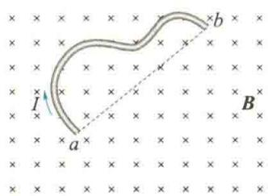  

题10.3.18图

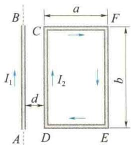  

题10.3.19图
</Exercise>

<Exercise title="习题 10.3.20">
边长为 $l = 0.1 \, m$ 的正三角形线圈放在磁感应强度 B = 1 T 的均匀磁场中，线圈平面与磁场方向平行，如题 10.3.20 图所示。在线圈中通以电流 I = 10 A，求：

(1) 线圈每边所受的安培力；

(2) 对 $OO'$ 轴的磁力矩大小；

(3) 从所在位置转到线圈平面与磁场垂直时磁力所做的功.
</Exercise>

<Exercise title="习题 10.3.21">
如题10.3.21图所示，一正方形线圈，由细导线做成，边长为 $a$ ，共有 $N$ 匝，可以绕通过其相对两边中点的一个竖直轴自由转动.现在线圈中通有电流 $I$ ，并把线圈放在均匀的水平外磁场 $\pmb{B}$ 中，求线圈磁矩与磁场 $\pmb{B}$ 的夹角为 $\theta$ 时，线圈所受的转动力矩.

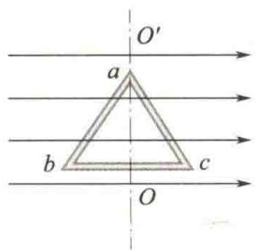  

题10.3.20图

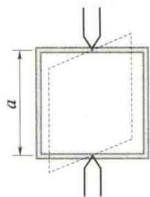  

题10.3.21图
</Exercise>

<Exercise title="习题 10.3.22">
一长直导线通有电流 $I_{1}=20\ A$ ，旁边放一导线 ab，其中通有电流 $I_{2}=10\ A$ ，且两者共面，如题 10.3.22 图所示。求导线 ab 所受作用力对 O 点的力矩。
</Exercise>

<Exercise title="习题 10.3.23">
电子在 $B = 70 \times 10^{-4}$ T 的均匀磁场中做圆周运动，圆周半径 r = 3.0 cm. 已知 B 垂直于纸面向外，某时刻电子在 A 点，其速度 v 向上，如题 10.3.23 图所示.

(1) 试画出该电子运动的轨道；

(2) 求该电子速度 v 的大小；

(3) 求该电子的动能 $E_{k}$ .

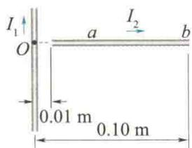  

题10.3.22图

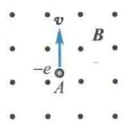  

题10.3.23图
</Exercise>

<Exercise title="习题 10.3.24">
一电子在磁感应强度大小为 $B=20\times10^{-4}$ T的磁场中沿半径为R=2.0cm的螺旋线运动，螺距h=5.0cm，如题10.3.24图所示.

(1) 求该电子的速度；

(2) 磁感应强度 B 的方向如何?
</Exercise>

<Exercise title="习题 10.3.25">
在霍尔效应实验中，一宽 $1.0\mathrm{cm}$ 、长 $4.0\mathrm{cm}$ 、厚 $1.0\times 10^{-3}\mathrm{cm}$ 的导体，沿长度方向载有 $3.0\mathrm{A}$ 的电流，当磁感应强度大小为 $B = 1.5\mathrm{T}$ 的磁场垂直地通过该导体时，产生 $1.0\times 10^{-5}\mathrm{V}$ 的横向电压.试求：

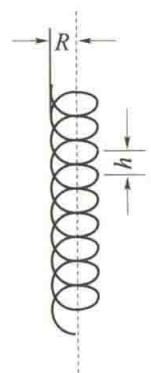

(1) 载流子的漂移速度；

(2) 每立方米的载流子数目.
</Exercise>

<Exercise title="习题 10.3.26">
两种不同磁性材料做成的小棒,放在磁铁的两个磁极之间,小棒被磁化后在磁极间处于不同的方位,如题10.3.26图所示.试指出哪一个是由顺磁质材料做成的,哪一个是由抗磁质材料做成的.

题10.3.24图
</Exercise>

<Exercise title="习题 10.3.27">
题 10.3.27 图中的三条线表示三种不同磁介质的 B-H 关系曲线，虚线是 $B = \mu_{0} H$ 的曲线，试指出哪一条表示顺磁质，哪一条表示抗磁质，哪一条表示铁磁质.

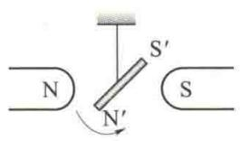  

(a)

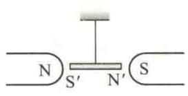  

(b)  

题10.3.26图

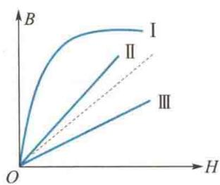  

题10.3.27图
</Exercise>

<Exercise title="习题 10.3.28">
螺绕环中心周长 L = 10 cm，环上线圈匝数 N = 200 匝，线圈中通有电流 I = 100 mA.

(1) 当管内是真空时, 求管中心的磁场强度 H 和磁感应强度 $B_{0}$ ;

(2) 若环内充满相对磁导率 $\mu_{r}=4\ 200$ 的磁性物质，则管内的 B 和 H 分别是多少？
</Exercise>

<Exercise title="习题 10.3.29">
\* (3) 磁性物质中心处由导线中传导电流产生的 $B_{0}$ 和由磁化电流产生的 $B'$ 分别是多少? 螺绕环的导线内通有电流 20 A, 利用冲击电流计测得环内磁感应强度的大小是 1.0 Wb/m². 已知环的平均周长是 40 cm, 绕有导线 400 匝. 试计算:

(1) 磁场强度；

(2) 磁化强度；

$^{*}$ (3) 磁化率；

$^{*}$ (4) 相对磁导率.
</Exercise>

<Exercise title="习题 10.3.30">
一铁制的螺绕环, 其平均圆周长 $L = 30 \mathrm{~cm}$ , 横截面积为 $1.0 \mathrm{~cm}^{2}$ , 在环上均匀绕以 300 匝导线, 当绕组内的电流为 $0.032 \mathrm{~A}$ 时, 环内的磁通量为 $2.0 \times 10^{-6} \mathrm{~Wb}$ . 试计算:

(1) 环内的平均磁通量密度；

(2) 环横截面中心处的磁场强度.

  
</Exercise>
