import Guide from '@/components/Guide.astro';
import Knowledge from '@/components/Knowledge.astro';
import Example from '@/components/Example.astro';
import Analysis from '@/components/Analysis.astro';
import Solution from '@/components/Solution.astro';
import Variant from '@/components/Variant.astro';
import Note from '@/components/Note.astro';
import Block from '@/components/Block.astro';
import Method from '@/components/Method.astro';
import Exercise from '@/components/Exercise.astro';

## 第11章 变化的电磁场

本章提要
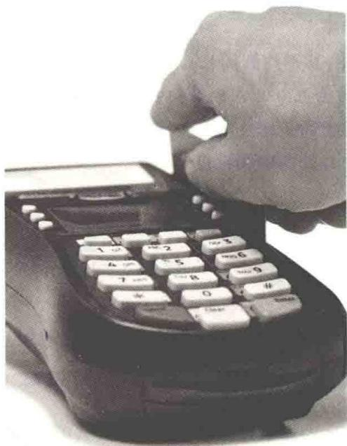

电和磁既有区别,又有联系.上一章已经介绍电流能激发磁场,那么能否利用磁场来产生电流呢?自1820年丹麦物理学家奥斯特发现了电流的磁效应之后,许多人致力于探索利用磁场产生电流的问题.经过10余年的努力,英国物理学家法拉第(Faraday)终于在1831年发现了电磁感应现象及其基本规律.电磁感应现象的发现,深刻地揭示了电和磁之间的内在联系,推动了电磁学理论的发展.1861—1864年,麦克斯韦在总结前人成果的基础上,极富创建性地提出了感应电场和位移电流的概念,用优美的数学形式建立了完整的电磁场方程组,即麦克斯韦方程组,概括了所有宏观电磁现象的规律,同时预言了电磁波的存在,并揭示了光的电磁本质.
本章首先介绍电磁感应现象的基本规律——电磁感应定律，讨论感应电动势的两种情况——动生电动势和感生电动势；其次介绍工程技术中常见的自感现象与互感现象及其规律，讲解磁场的能量；最后介绍位移电流的概念和麦克斯韦方程组。

电磁感应定律的发现,是电磁学领域的重大成就.在理论上,它揭示了电与磁相互联系和转化的重要一面,推动了电磁场理论的建立;在实践上,它为电工学和电子技术奠定了基础.
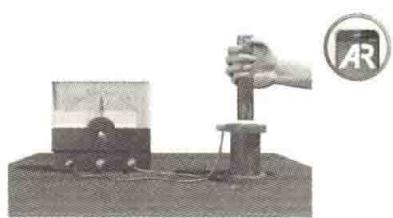

## 11.1.1 法拉第电磁感应定律

  
电磁感应
法拉第研究电磁感应的实验大体上可归结为两类:一类实验是磁铁与闭合线圈有相对运动时,线圈中产生了电流,如图11.1所示;另一类实验是用一个通电线圈来取代磁铁,当通电线圈中的电流发生变化时,其附近的闭合线圈中产生了电流,如图11.2所示.通过与静电感应类比,法拉第将这些现象称为电磁感应现象.
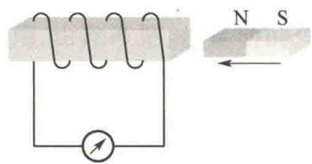  
图11.1 磁铁相对于线圈  
运动产生电流
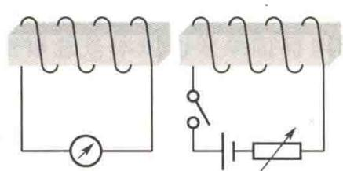  
图11.2 通电线圈中的电流变化，  
其附近的闭合线圈中产生电流
从大量的电磁感应实验中,法拉第总结出:当穿过闭合导体回路所围面积的磁通量发生变化时,无论是何种原因引起的,都会在回路中产生电流,这种电流称为感应电流.感应电流的出现说明回路中有电动势存在,这种电动势称为感应电动势.
1845年，德国物理学家诺伊曼(Neumann)对法拉第的工作从理论上作出了定量表述：当穿过闭合导体回路的磁通量发生变化时，回路中产生感应电流，而感应电动势与穿过回路的磁通量对时间的变化率的负值成正比.在国际单位制(SI)中，其数学表达式为
$$
\mathcal {E} = - \frac {\mathrm{d} \Phi_ {\mathrm{m}}}{\mathrm{d} t}\tag{11.1}
$$
式中的负号反映感应电动势的方向与磁通量变化的关系.
在判断感应电动势的方向时，应先规定回路的绕行正方向。如果回路中磁感线的方向与所规定的绕行正方向满足右手螺旋定则，那么穿过回路所围面积的磁通量为正值，反之则为负值。图11.3给出了可能出现的4种情况下感应电动势方向的判定。对于图11.3(a)和图11.3(b)所示的情况，磁感线的方向与所规定的回路绕行正方向满足右手螺旋定则，所以磁通量为正。此时，如果磁通量增大，即 $\mathrm{d}\Phi_{\mathrm{m}} / \mathrm{dt} > 0$ ，则 $\mathcal{E} < 0$ ，这表明感应电动势的方向与所规定的回路 $L$ 的绕行正方向相反[见图11.3(a)]；如果磁通量减小，即 $\mathrm{d}\Phi_{\mathrm{m}} / \mathrm{dt} < 0$ ，则 $\mathcal{E} > 0$ ，这表明感应电动势的方向与所规定的回路 $L$ 的绕行正方向相同[见图11.3(b)]。对于图11.3(c)和图11.3(d)所示的情况，磁感线的方向与所规定的回路绕行正方向的反方向满足右手螺旋定则，所以磁通量为负.此时，如果磁通量增大，即 $\mathrm{d}\Phi_{\mathrm{m}} / \mathrm{dt} < 0$ ，则 $\mathcal{E} > 0$ ，这表明感应电动势的方向与所规定的回路 $L$ 的绕行正方向相同[见图11.3(c)]；如果磁通量减小，即 $\mathrm{d}\Phi_{\mathrm{m}} / \mathrm{dt} > 0$ ，则 $\mathcal{E}< 0$ ，这表明感应电动势的方向与所规定的回路 $L$ 的绕行正方向相反[见图11.3(d)].
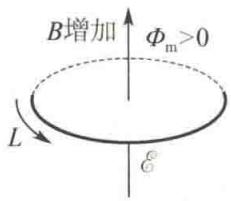  
(a)
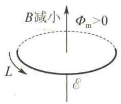  
(b)
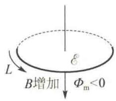  
(c)
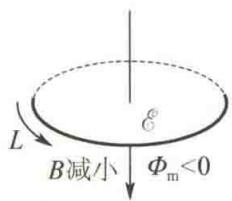  
(d)  
图 11.3 感应电动势的方向与磁通量变化的关系
思考: 对一个闭合回路, 绕行正方向可以任选, 但一般而言, 回路的绕行正方向总是使得对所取的回路的磁通量 $\Phi_{m} > 0$ . 例如, 对于图 11.3(c) 和图 11.3(d) 所示的两种情况, 绕行正方向可以取图中所示 L 的反方向, 此时感应电动势的方向又如何判断呢?
如果闭合回路的总电阻为 R，则回路中的感应电流为
$$
i = \frac {\mathcal {E}}{R} = - \frac {1}{R} \frac {\mathrm{d} \Phi_ {\mathrm{m}}}{\mathrm{d} t}\tag{11.2}
$$
由式(11.2)可确定感应电流的大小.
在 $t_{1}$ 到 $t_{2}$ 的时间内通过回路导线中任意横截面的感应电量为
$$
q = \int_ {t _ {1}} ^ {t _ {2}} i \mathrm{d} t = - \frac {1}{R} \int_ {\Phi_ {\mathrm{m} 1}} ^ {\Phi_ {\mathrm{m} 2}} \mathrm{d} \Phi_ {\mathrm{m}} = \frac {1}{R} (\Phi_ {\mathrm{m} 1} - \Phi_ {\mathrm{m} 2})
$$
式中， $\Phi_{\mathrm{m1}}$ 和 $\Phi_{\mathrm{m2}}$ 分别是 $t_1$ 和 $t_2$ 时刻通过回路的磁通量。上式表明，在一段时间内通过导线任意横截面的电量与这段时间内穿过导线所包围的区域的磁通量的变化量成正比，而与磁通量变化的快慢无关。常用的测量磁感应强度的磁通计（又称高斯计）就是根据这个原理制成的。
实际中用到的线圈通常是由多匝线圈串联而成的,如果穿过每匝线圈的磁通量均相等且方向相同,那么在磁通量变化时,每匝线圈中的感应电动势的大小相等,方向相同.因此,N 匝线圈中总的感应电动势为
$$
\mathcal {E} = - N \frac {\mathrm{d} \Phi_ {\mathrm{m}}}{\mathrm{d} t} = - \frac {\mathrm{d} \Psi_ {\mathrm{m}}}{\mathrm{d} t}\tag{11.3}
$$
式中， $\Psi_{m}=N\Phi_{m}$ ，称为线圈的磁通匝链数，简称磁链。在国际单位制（SI）中，磁链的单位与磁通量的单位相同，均为Wb（韦伯）。

## 11.1.2 楞次定律

1833 年, 楞次从实验中总结出判断感应电流方向的方法: 闭合回路中感应电流的方向, 总是使得它所激发的磁场去反抗引起感应电流的磁通量的变化. 这一结论叫作楞次定律.
如图 11.4(a) 所示, 当磁铁向着导体回路移动时, 穿过导体回路的磁通量 $\Phi_{m}$ 增加, 这时导体回路中将产生感应电流 I. 根据楞次定律, 感应电流 I 激发的磁场应与磁铁产生的磁场方向相反, 以反抗原磁通量 $\Phi_{m}$ 的增加, 所以感应电流的方向应如图 11.4(a) 所示. 当磁铁远离导体回路时, 穿过导体回路的磁通量 $\Phi_{m}$ 减少, 这时感应电流 I 所激发的磁场应与磁铁产生的磁场方向相同, 以补偿原磁通量 $\Phi_{m}$ 的减少, 如图 11.4(b) 所示.
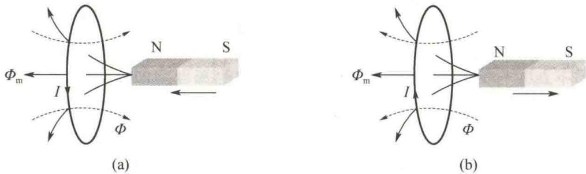  
图 11.4 感应电流激发的磁场总是反抗引起感应电流的磁通量的变化
另外，当磁铁的N极靠近导体回路时，导体回路中出现如图11.4(a)所示方向的感应电流I.如果把导体回路等效为一块薄磁片，那么面对磁铁的那一面相当于磁片的N极，它与磁铁的N极相斥，起到阻碍磁铁靠近导体回路的作用.当磁铁的N极远离导体回路时，导体回路中则出现如图11.4(b)所示方向的感应电流I.导体回路面对磁铁的那一面相当于磁片的S极，它与磁铁的N极相吸，起到阻碍磁铁远离导体回路的作用.由此可见，从运动的角度来看，楞次定律总是体现为效果阻碍原因.如果把磁通量的变化看作原因，把感应电流激发的磁场看作效果，那么楞次定律又可表述为感应电流的效果总是反抗引起感应电流的原因.
  
楞次定律
楞次定律是能量守恒定律在电磁感应现象中的具体体现. 当把磁铁的 N 极插入线圈时, 线圈中有感应电流流过, 因此线圈相当于磁铁. 由楞次定律知, 线圈的 N 极应与磁铁的 N 极相对. 这样, 插入磁铁时外力必须克服两个 N 极之间的斥力做机械功. 正是此机械功转化为感应电流的焦耳热.

<Example title="例 11.1">
如图 11.5 所示, 空间分布着均匀磁场. 磁感应强度大小 $B = B_{0} \sin \omega t$ . 一旋转半径为 r、长为 l 的矩形导体线圈以匀角速度 $\omega$ 绕与磁场垂直的轴 $OO'$ 旋转, t = 0 时, 线圈的法向量 n 与 B 之间的夹角 $\varphi_{0} = 0$ . 求线圈中的感应电动势.

<Solution title="解">
设 $\varphi$ 为 $t$ 时刻 $\pmb{n}$ 与 $\pmb{B}$ 之间的夹角，则
$$
\varphi = \omega t + \varphi_ {0} = \omega t
$$
$t$ 时刻通过矩形导体线圈的磁通量为
$$
\begin{array}{r l} \Phi_ {\mathrm{m}} & = \boldsymbol {B} \cdot \boldsymbol {S} = B S \cos \omega t = B _ {0} 2 r l \sin \omega t \cos \omega t \\ & = B _ {0} r l \sin 2 \omega t \end{array}
$$
线圈中的感应电动势为
$$
\mathcal {E} = - \frac {\mathrm{d} \Phi_ {\mathrm{m}}}{\mathrm{d} t} = - 2 \omega B _ {0} r l \cos 2 \omega t
$$
可见， $\mathcal{E}$ 是随时间作周期性变化的。当 $\mathcal{E} > 0$ 时，感应电动势的方向与 $n$ 的方向的关系遵循右手螺旋定则；当 $\mathcal{E} < 0$ 时， $\mathcal{E}$ 的方向与 $n$ 的反方向的关系遵循右手螺旋定则. 另外, 当该均匀磁场是不随时间变化的稳恒磁场时, 本例就是交流发电机的基本原理.
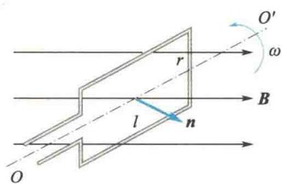  
图11.5 例11.1图
</Solution>
</Example>

<Example title="例 11.2">
一根无限长的直导线载有交流电流 $i = I_0 \sin \omega t$ ，旁边有一共面矩形线圈 $abcd$ ，如图11.6所示。 $ab = l_1, bc = l_2, ab$ 与直导线平行且相距 $d$ 。求线圈中的感应电动势。

<Solution title="解">
取矩形线圈沿顺时针 abcda 方向为回路正绕向, 则
$$
\begin{array}{r l} \Phi_ {\mathrm{m}} & = \int_ {S} \boldsymbol {B} \cdot \mathrm{d} \boldsymbol {S} = \int_ {d} ^ {d + l _ {2}} \frac {\mu_ {0} i}{2 \pi x} l _ {1} \mathrm{d} x \\ & = \frac {\mu_ {0} i l _ {1}}{2 \pi} \ln \frac {d + l _ {2}}{d} \\ & = \frac {\mu_ {0} l _ {1}}{2 \pi} I _ {0} \left(\ln \frac {d + l _ {2}}{d}\right) \sin \omega t \end{array}
$$
线圈中感应电动势的方向沿顺时针方向, $\varepsilon<0$ 表示它的方向沿逆时针方向.
所以，矩形线圈中的感应电动势为
$$
\mathcal {E} = - \frac {\mathrm{d} \Phi_ {\mathrm{m}}}{\mathrm{d} t} = - \frac {\mu_ {0} l _ {1} \omega}{2 \pi} I _ {0} \left(\ln \frac {d + l _ {2}}{d}\right) \cos \omega t
$$
可见， $\mathcal{E}$ 也是随时间作周期性变化的， $\mathcal{E} > 0$ 表示矩形
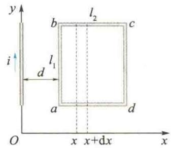  
图11.6 例11.2图

</Solution>
</Example>
