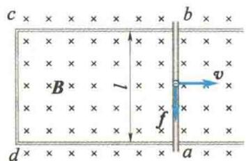
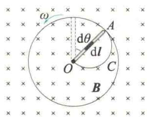
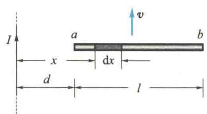
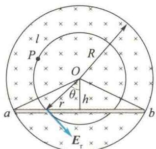
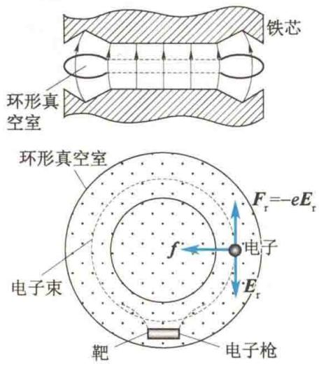
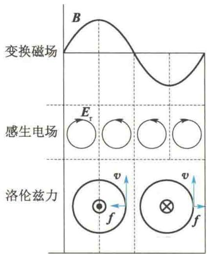
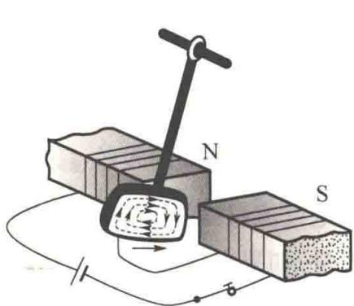
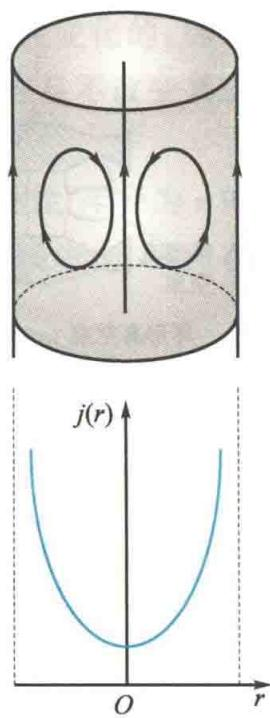

import QRCodeVideo from '@/components/QRCodeVideo.astro';

import Guide from '@/components/Guide.astro';
import Knowledge from '@/components/Knowledge.astro';
import Example from '@/components/Example.astro';
import Analysis from '@/components/Analysis.astro';
import Solution from '@/components/Solution.astro';
import Variant from '@/components/Variant.astro';
import Note from '@/components/Note.astro';
import Block from '@/components/Block.astro';
import Method from '@/components/Method.astro';
import Exercise from '@/components/Exercise.astro';

法拉第电磁感应定律说明,无论什么原因,只要穿过回路的磁通量发生了变化,回路中就有感应电动势产生.事实上,磁通量发生变化的原因不外乎两种:一种是磁场不变,回路或其一部分在磁场中有相对磁场的运动,这样产生的感应电动势称为动生电动势;另一种是回路不动,磁场随时间发生变化,这样产生的感应电动势称为感生电动势.

## 11.2.1 动生电动势

动生电动势的产生可以用洛伦兹力来解释. 如图 11.7 所示, 长为 l 的导体棒与导轨所构成的矩形回路 abcd 平放在纸面上, 均匀磁场的磁感应强度 B 垂直于纸面向里. 当导体棒 ab 以速度 v 沿导轨向右滑动时, 导体棒内的自由电子也以速度 v 随之向右运动. 电子受到的洛伦兹力为
<figure class="vp-figure">
  
  <figcaption>图11.7 产生动生电动势的原因</figcaption>
</figure>
$$
f = (- e) \boldsymbol {v} \times \boldsymbol {B}
$$
$f$ 的方向由 $b$ 端指向 $a$ 端. 在洛伦兹力的作用下, 自由电子做向下的定向漂移运动. 如果导轨是导体, 在回路中将产生沿 $abcda$ 方向的电流; 如果导轨是绝缘体, 则洛伦兹力将使自由电子在 $a$ 端积累, 使 $a$ 端带负电而 $b$ 端带正电. 在导体棒 $ab$ 上产生自上而下的静电场. 静电场对电子的作用力的方向由 $a$ 端指向 $b$ 端, 与电子所受洛伦兹力的方向相反. 当静电力与洛伦兹力达到平衡时, $a, b$ 两端的电势差达到稳定值, $b$ 端电势比 $a$ 端电势高. 由此可见, 这段运动导体棒相当于一个电源, 它的非静电力就是洛伦兹力.
我们已经知道,电动势定义为把单位正电荷从负极通过电源内部移到正极的过程中,非静电力做的功.在产生动生电动势的情形中,作用在单位正电荷上的非静电力是洛伦
兹力,其对应的非静电场的场强 $E_{k}$ 为
$$
\pmb {E} _ {\mathrm{k}} = \frac {f}{- e} = \pmb {v} \times \pmb {B}
$$
所以，动生电动势为
$$
\mathcal {E} _ {a b} = \int_ {-} ^ {+} \boldsymbol {E} _ {\mathrm{k}} \cdot \mathrm{d} \boldsymbol {l} = \int_ {a} ^ {b} (\boldsymbol {v} \times \boldsymbol {B}) \cdot \mathrm{d} \boldsymbol {l}\tag{11.4}
$$
一般而言,在任意的稳恒磁场中,一个任意形状的导线 L(闭合的或不闭合的)在运动或发生形变时,各个线元 dl 的速度 v 的大小和方向都可能不同.这时,在整个线圈 L 中所产生的动生电动势为
$$
\mathcal {E} = \int_ {L} (\pmb {v} \times \pmb {B}) \cdot \mathrm{d} l\tag{11.5}
$$
式(11.5)提供了计算动生电动势的方法.

<Example title="例 11.3">
如图11.8所示，长度为 $L$ 的铜棒 $OA$ 在磁感应强度为 $\pmb{B}$ 的均匀磁场中以角速度 $\omega$ 绕通过 $O$ 点的轴沿逆时针方向转动.求：（1）棒中感应电动势的大小和方向；（2）直径为 $OA$ 的半圆弧导体 $\widehat{OCA}$ 以同样的角速度 $\omega$ 绕 $O$ 轴转动时，导体 $\widehat{OCA}$ 上的感应电动势.

<Solution title="解">
（1）方法一：用 $\mathcal{E} = \int_{O}^{A}(\pmb {v}\times \pmb {B})\cdot \mathrm{d}\pmb{l}$ 求解.
在铜棒 OA 上距轴 l 处取 dl，其速度 v 与 B 垂直且 $v \times B$ 与 dl 方向相反，故
$^{8}$ 的方向仍可根据洛伦兹力判断,所得结果与方法一相同.
$$
(\pmb {v} \times \pmb {B}) \cdot \mathrm{d} l = v B \mathrm{d} l \cos \pi = - \omega B l \mathrm{d} l
$$
$$
\begin{array}{r l} \mathcal {E} _ {O A} & = \int_ {0} ^ {A} (\pmb {\nu} \times \pmb {B}) \cdot \mathrm{d} \pmb {l} = \int_ {0} ^ {L} - \omega B l \mathrm{d} l \\ & = - \frac {1}{2} \bar {\omega} B L ^ {2} \end{array}
$$
(2) 因为由铜棒 OA 和半圆弧导体 $\widehat{ACO}$ 组成的闭合导体回路在磁场中以角速度 $\omega$ 旋转时穿过回路的磁通量不变, 所以整个闭合导体回路的感应电动势 $\mathcal{E}=0$ . 又因为
$$
\mathcal {E} = \mathcal {E} _ {O A} + \mathcal {E} _ {\widehat {A C O}}
$$
感应电动势 $\varepsilon$ 的实际方向由 A 点指向 O 点.
所以
方法二:用法拉第电磁感应定律求解.
$$
\mathcal {E} _ {\widehat {O C A}} = \mathcal {E} _ {O A} = - \frac {1}{2} \omega B L ^ {2}
$$
$\widehat{E_{OCA}}$ 的实际方向由 A 点沿半圆弧指向 O 点.
设铜棒 OA 在 dt 时间内转了 $d\theta$ 角，则铜棒 OA 扫过的面积 $dS = \frac{1}{2}L^{2}d\theta$ ，穿过 dS 的磁通量为
$$
\mathrm{d} \Phi_ {\mathrm{m}} = B \mathrm{d} S = \frac {1}{2} B L ^ {2} \mathrm{d} \theta
$$
由法拉第电磁感应定律可知,面积为 dS 的回路中,只有铜棒 OA 在切割磁感线,所以铜棒 OA 上的感应电动势大小为
<figure class="vp-figure">
  
  <figcaption>图11.8 例11.3图</figcaption>
</figure>
$$
\mid \mathcal {E} _ {O A} \mid = \left| \frac {\mathrm{d} \Phi_ {\mathrm{m}}}{\mathrm{d} t} \right| = \frac {1}{2} B L ^ {2} \frac {\mathrm{d} \theta}{\mathrm{d} t} = \frac {1}{2} B \omega L ^ {2}
$$
</Solution>
</Example>

<Example title="例 11.4">
无限长直导线中通有电流 $I = 10\mathrm{A}$ ，另一长 $l = 0.20\mathrm{m}$ 的导体棒ab以速率 $v = 2.0\mathrm{m / s}$ 平行于长直导线做匀速运动.导体棒与长直导线共面且正交，如图11.9所示.导体棒的a端到长直导线的距离 $d = 0.1\mathrm{m}$ ，求导体棒中的动生电动势.

<Solution title="解">
导体棒 ab 在电流 I 产生的非均匀磁场中做切割磁感线运动, 产生动生电动势. 在导体棒 ab 上取线元 dx，在 dx 范围内磁场可视为均匀磁场，且磁感应强度大小 $B = \frac{\mu_{0} I}{2\pi x}$ ，则导体棒 ab 中的动生电动势为
$$
\begin{array}{r l} \mathcal {E} _ {a b} & = \int_ {a} ^ {b} (\pmb {v} \times \pmb {B}) \cdot \mathrm{d} \pmb {x} = - \int_ {a} ^ {b} v B \mathrm{d} x \\ & = - \int_ {d} ^ {d + l} v \frac {\mu_ {0} I}{2 \pi x} \mathrm{d} x = - \frac {\mu_ {0} I}{2 \pi} v \ln \frac {d + l}{d} \\ & = - 4. 4 \times 1 0 ^ {- 6} \mathrm{V} \end{array}
$$
即导体棒 ab 中的动生电动势大小为 $4.4 \times 10^{-6}$ V，负号表示动生电动势的方向是由 b 端指向 a 端，a 端电势高，b 端电势低，两端电势差为 $U_{ab} = 4.4 \times 10^{-6}$ V.
<figure class="vp-figure">
  
  <figcaption>图11.9 例11.4图</figcaption>
</figure>
</Solution>
</Example>

## 11.2.2 感生电动势

<QRCodeVideo title="感生电场与静电场的区别" url="https://api.guangyiedu.com/v3/resource/resource/r/NewQrCode-qDzRsLDSl8kXAk98griH" />  
如上所述,导体在磁场中切割磁感线产生动生电动势,其非静电力是洛伦兹力.在因磁场变化而产生感生电动势的情况下,导体回路不动,其非静电力不可能是洛伦兹力.然而,人们发现,不论导体回路的形状及导体的性质和温度如何,只要磁场变化导致穿过导体回路的磁通量发生了变化,就会有数值等于 $\frac{d\Phi_{m}}{dt}$ 的感生电动势在导体回路上产生.这说明感生电动势的产生只是变化的磁场本身引起的.在分析电磁感应现象的基础上,麦克斯韦提出:变化的磁场在其周围空间激发一种新的电场,这种电场称为感生电场或涡旋电场,其电场强度用 $E_{r}$ 表示.在回路中产生感生电动势的非静电力正是这一感生电场力,即
$$
\mathcal {E} = \oint_ {L} \boldsymbol {E} _ {\mathrm{r}} \cdot \mathrm{d} \boldsymbol {l} = - \frac {\mathrm{d} \Phi_ {\mathrm{m}}}{\mathrm{d} t}
$$
设回路 L 所围区域的面积为 S，则磁通量为
$$
\Phi_ {\mathrm{m}} = \int_ {S} \boldsymbol {B} \cdot \mathrm{d} \boldsymbol {S}
$$
所以感生电动势可表示为
<QRCodeVideo title="麦克斯韦" url="https://api.guangyiedu.com/v3/resource/resource/r/NewQrCode-qheWOy2WHkkJw2lnaXiF" />  
$$
\mathcal {E} = \oint_ {L} \boldsymbol {E} _ {\mathrm{r}} \cdot \mathrm{d} \boldsymbol {l} = - \frac {\mathrm{d}}{\mathrm{d} t} \int_ {S} \boldsymbol {B} \cdot \mathrm{d} \boldsymbol {S}
$$
当闭合回路 L 不动时, 可以把对时间的导数和对曲面 S 的积分两个运算的顺序交换, 得
$$
\oint_ {L} \boldsymbol {E} _ {\mathrm{r}} \cdot \mathrm{d} \boldsymbol {l} = - \int_ {s} \frac {\partial \boldsymbol {B}}{\partial t} \cdot \mathrm{d} \boldsymbol {S}\tag{11.6}
$$
这就是法拉第电磁感应定律的积分形式. 式(11.6)中的负号表示 $E_{r}$ 的方向与 $\frac{\partial B}{\partial t}$ 的反方向的关系遵循右手螺旋定则, 是楞次定律的数学表示方法.
如果同时存在静电场 $E_{\mathrm{e}}$ ，则总电场 $\pmb{E}$ 等于感生电场 $E_{\mathrm{r}}$ 与静电场 $E_{\mathrm{e}}$ 的矢量和，并且有静电场环路定理 $\oint_{L}E_{\mathrm{e}}\cdot \mathrm{d}\boldsymbol {l} = 0$ ，所以不难得到，对总电场 $E = E_{\mathrm{r}} + E_{\mathrm{e}}$ 而言，有
$$
\oint_ {L} \boldsymbol {E} \cdot \mathrm{d} \boldsymbol {l} = - \int_ {S} \frac {\partial \boldsymbol {B}}{\partial t} \cdot \mathrm{d} \boldsymbol {S}\tag{11.7}
$$
讨论: 感生电场和静电场都对电荷有电场力的作用, 但仍存在以下不同之处.
(1) 静电场由静止电荷激发,而感生电场由变化的磁场激发.
(2) 静电场是保守场, $\oint_{L} E_{e} \cdot dl = 0$ , 即环流等于零; 而感生电场不是保守场, $\oint_{L} E_{r} \cdot dl = -\int_{S} \frac{\partial B}{\partial t} \cdot dS$ , 即环流不等于零.
（3）静电场的电场线起于正电荷，止于负电荷，是有源场；感生电场的电场线是闭合的，无头无尾，因此称为涡旋电场。同时，感生电场对任意闭合曲面的电通量必然为零，因此是无源场。

<Example title="例 11.5">
如图 11.10 所示, 半径为 R 的圆柱形空间内分布着沿圆柱轴线方向的均匀磁场, 磁场方向垂直于纸面向里, 其变化率为 $\frac{dB}{dt}$ .
(1) 求圆柱形空间内、外感生电场 $E_{r}$ 的分布；
(2) 若 $\frac{dB}{dt} > 0$ ，把长为 L 的导体 ab 放在圆柱横截面上，则 $E_{ab}$ 等于多少？
<figure class="vp-figure">
  
  <figcaption>图11.10 例11.5图</figcaption>
</figure>

<Solution title="解">
（1）根据磁场分布的轴对称性可知，空间的感生电场的电场线应是围绕圆柱轴线且在圆柱横截面上的一系列同心圆.过圆柱形空间内任意一点 $P$ 在横截面上作半径为 $r$ 的圆形回路 $l$ ，并设 $l$ 的回转方向与 $\pmb{B}$ 的方向的关系遵循右手螺旋定则，即设图中沿 $l$ 的顺时针切线方向为 $E_{\mathrm{r}}$ 的正方向.由式(11.6)
$$
\oint_ {l} \boldsymbol {E} _ {\mathrm{r}} \cdot \mathrm{d} \boldsymbol {l} = - \int_ {S} \frac {\partial \boldsymbol {B}}{\partial t} \cdot \mathrm{d} \boldsymbol {S}
$$
并考虑 l 上各点 $E_{r}$ 沿 l 的切线方向且大小相等, 可得
$$
E _ {\mathrm{r}} 2 \pi r = - \frac {\mathrm{d} B}{\mathrm{d} t} \pi r ^ {2}
$$
$$
E _ {r} = - \frac {r}{2} \frac {\mathrm{d} B}{\mathrm{d} t} \qquad (r \leqslant R)
$$
(2) 方法一: 用电动势定义求解.
由(1)的结论知，在 $r\leqslant R$ 区域 $E_{\tau}=-\frac{r}{2}\frac{dB}{dt}$ .当 $\frac{dB}{dt}>0$ 时， $E_{\tau}$ 沿逆时针方向（见图11.10）.因此有
$$
\begin{array}{r l} \mathcal {E} _ {a b} & = \int_ {a} ^ {b} \boldsymbol {E} _ {\mathrm{r}} \cdot \mathrm{d} \boldsymbol {l} = \int_ {a} ^ {b} \frac {r}{2} \frac {\mathrm{d} B}{\mathrm{d} t} \mathrm{d} l \cos \theta \\ & = \int_ {0} ^ {L} \frac {h}{2} \frac {\mathrm{d} B}{\mathrm{d} t} \mathrm{d} l = \frac {L h}{2} \frac {\mathrm{d} B}{\mathrm{d} t} \end{array}
$$
$$
E _ {\mathrm{r}} = - \frac {R ^ {2}}{2 r} \frac {\mathrm{d} B}{\mathrm{d} t} \qquad (r > R)
$$
同理，在圆柱形空间外一点 $(r > R)$ ，感生电场为
当 $\frac{dB}{dt}>0$ 时, $E_{r}<0$ ,即沿逆时针方向;反之, $E_{r}>0$ ,即沿顺时针方向.
因为 $\frac{dB}{dt}>0$ ，所以 $E_{ab}>0$ ，即 $E_{ab}$ 的方向由a端指向b端.
方法二:用法拉第电磁感应定律求解.
作闭合回路 OabO，回路内感应电动势为
$$
\mathcal {E} = - \frac {\mathrm{d} \Phi_ {\mathrm{m}}}{\mathrm{d} t} = - \int_ {s} \frac {\mathrm{d} B}{\mathrm{d} t} \mathrm{d} S \cos \pi = \frac {\mathrm{d} B}{\mathrm{d} t} \frac {h L}{2}
$$
因为
$$
\mathcal {E} _ {O a} = \mathcal {E} _ {b O} = 0
$$
所以
$$
\mathcal {E} _ {a b} = \mathcal {E} - \mathcal {E} _ {O a} - \mathcal {E} _ {b O} = \frac {h L}{2} \frac {\mathrm{d} B}{\mathrm{d} t}
$$
其方向由 a 端指向 b 端, 结果与方法一相同.
</Solution>
</Example>

## 11.2.3 电子感应加速器

下面讨论感生电场的一个重要应用——电子感应加速器. 电子感应加速器是利用感生电场加速电子的高能电子加速器, 它的结构如图 11.11(a) 所示, 在圆柱形电磁铁的两磁极之间放置一个环形真空室, 当电磁铁线圈中通以交变电流时, 在两磁极间产生一圆形区域的交变磁场. 交变磁场又在真空室内激发涡旋状的感生电场. 电子由电子枪射入环形真空室后, 在磁场施加的洛伦兹力和感生电场施加的电场力的共同作用下做加速圆周运动. 由于磁场和感生电场都是周期性变化的, 因此只有当圆形区域上的磁场分布满足一定的条件时, 电子才能得到加速且不改变其圆形轨道的半径.
由磁场分布的轴对称性可知,感生电场的分布也具有轴对称性.半径为 r 的圆形轨道上各点的感生电场大小应相等,而方向都沿圆形轨道的切线方向.因而在半径为 r 的圆形轨道上感生电场的环路积分为
$$
\oint_ {L} \boldsymbol {E} _ {\mathrm{r}} \cdot \mathrm{d} \boldsymbol {r} = E _ {\mathrm{r}} \cdot 2 \pi r
$$
以 $\overline{B}$ 表示半径为r的圆形轨道所围区域的平均磁感应强度,则通过此区域的磁通量为
$$
\Phi_ {\mathrm{m}} = \overline {{{B}}} S = \overline {{{B}}} \cdot \pi r ^ {2}
$$
由式(11.6)可得,距轴线 r 处的感生电场的电场强度大小为
$$
E _ {\mathrm{r}} = \frac {r}{2} \frac {\mathrm{d} \overline {{B}}}{\mathrm{d} t}
$$
电子的运动方程为
$$
\frac {\mathrm{d} (m v)}{\mathrm{d} t} = e E _ {\mathrm{r}} = \frac {e r}{2} \frac {\mathrm{d} \overline {{B}}}{\mathrm{d} t}\tag{\textcircled{1}}
$$
而电子在半径为 r 的圆形轨道上运动时又受到洛伦兹力的作用, 洛伦兹力提供向心力, 应满足 $mv^{2}/r = evB$ , 即
$$
m v = e r B
$$
将此式对时间求导可得
$$
\frac {\mathrm{d} (m v)}{\mathrm{d} t} = e r \frac {\mathrm{d} B}{\mathrm{d} t}\tag{\textcircled{2}}
$$
比较式 ① 和式 ②, 可得
$$
B = \frac {1}{2} \overline {{{B}}}\tag{11.8}
$$
也就是说，磁场分布必须满足半径为 $r$ 的圆形轨道上的磁感应强度等于其所围区域的平均磁感应强度的一半，才能保证电子在真空室的圆形轨道上被加速而又不改变其圆形轨道半径.
还应该注意,如果磁场是交变的,感生电场当然也是交变的.因此,在一个周期内电子并不按一种回旋方向加速,而且电子所受的洛伦兹力也并不总是指向圆心.电子感应加速器的结构如图11.11(a)所示,图11.11(b)表示在一个周期中电子受到的感生电场力和洛伦兹力的方向,说明只在第一个1/4周期内,电子才处于正常加速阶段.这个时间虽然短,但由于电子束在注入真空室时已有较大的初速度,在1/4周期内也已在真空室内环行了几十万甚至几百万圈,即使是小型电子感应加速器,也可以把电子加速到动能为0.1\~1 MeV(1 MeV = 1.6 × 10 $^{-13}$ J),大型电子感应加速器可使电子获得数百兆电子伏的动能,产生的高能电子束可用于科学研究、医疗和工业生产.
  
(a) 结构
  
(b) 电子在一个周期中的受力情况  
图 11.11 电子感应加速器

## 11.2.4 涡电流．趋肤效应

当把大块金属导体放在交变磁场中时,金属中的自由电子会受到变化磁场产生的感生电动势的作用,从而在金属中形成涡旋状的感生电流,称为涡电流(简称涡流).因为金属块的电阻很小,所以一般涡电流很大,结果会产生大量的焦耳热,这就是感应加热的原理.感应加热广泛用于有色金属和特种合金的冶炼、焊接及真空技术方面.然而,在很多情况下,涡电流发热是有害的.例如,变压器和电机的铁芯,由于处在交变磁场中;铁芯会因涡电流而发热,这不但损失了能量,而且发热会使铁芯温度升高,引起导线绝缘性能下降,甚至造成事故.为此,常用增大铁芯的电阻的方法来减小涡电流,如把铁芯做成层状,用薄层状的绝缘材料(如绝缘漆)把各层铁芯隔开.更有效的方法是用粉末状的铁芯,各粉末间相互绝缘.在高频变压器中,常采用这种粉末状铁芯.
<QRCodeVideo title="安检门的原理是什么？" url="https://api.guangyiedu.com/v3/resource/resource/r/NewQrCode-fIO59z6bP5h5hLeDAOBu" />  
在另一些场合,可利用涡电流产生的阻尼作用.如图11.12所示,用金属片做成的摆悬挂于电磁铁的两极之间.在电磁铁未通电时,金属片可以自由摆动,要经过较长时间才会停下来.电磁铁通电后,两极间便有强大的磁场,当金属摆进入磁场时,会产生涡电流.根据楞次定律,这个感生电流要阻碍摆和磁场的相对运动,因此金属摆受到一个阻尼力的作用,就像在某种黏性介质中摆动一样,会很快停止摆动.这种阻尼起源于电磁感应,称为电磁阻尼.
<figure class="vp-figure">
  
  <figcaption>图11.12 阻尼摆</figcaption>
</figure>
在各式仪表中电磁阻尼已被广泛应用. 电力机车和电车中所用的电磁制动器, 也是根据电磁阻尼的原理制成的.
一段柱状的均匀导体通以直流电流时,电流在导体的横截面上的分布基本上是均匀的.但在交变电流尤其是高频电流的情况下,变化的电流在导线内部产生围绕着电流的变化磁场,变化的磁场又在导体内产生涡电流,在导线中心轴附近的涡电流的方向与原先的电流的方向几乎总是相反,而在导线表面处两者的方向又几乎总是相同.即涡电流使得交变电流在导体的横截面上不再均匀分布,而是越靠近导体表面处电流密度越大,电流密度呈如图11.13所示的分布,这种交变电流集中于导体表面的效应叫作趋肤效应.由于趋肤效应的存在,在高频电路中可以用空心导线代替实心导线.

趋肤效应使载流导线的有效截面减小了,导线电阻随频率的增大而显著增大.为了改善这种情况,常在导线表面镀银以减小电阻,或用彼此绝缘的许多细导线集束来代替单一粗导线,因为这样可以增加导线的表面积,增大导线载流的有效截面.在工业应用方面,利用趋肤效应可以对金属进行表面淬火.
图11.13 趋肤效应
最后应当指出,把感应电动势分成动生和感生两种,
这在一定程度上只有相对的意义,因为在确定是导体还是磁场源运动时,显然与所选参考系有关.例如图11.1所示的情形,如果在线圈为静止的参考系中观察,磁铁的运动引起空间磁场的变化,线圈中的电动势是感生电动势.但是如果在随磁铁一起运动的参考系中观察,则磁铁是静止的,空间磁场也未发生变化,而线圈在运动,因而线圈内的电动势是动生电动势.这是运动的相对性导致的必然结果.然而,我们也必须看到,坐标变换只能在一定程度上消除动生电动势和感生电动势的界限.对如图11.2所示的情形,则不可能通过坐标变换把感生电动势归结为动生电动势.

