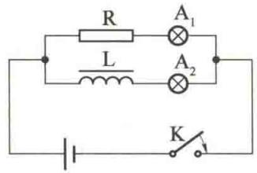
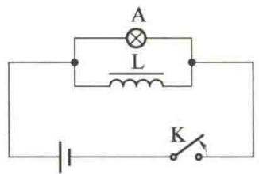
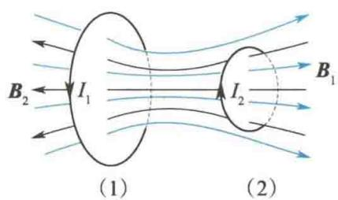
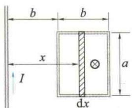
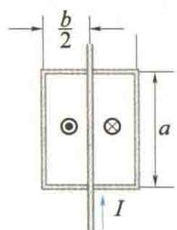
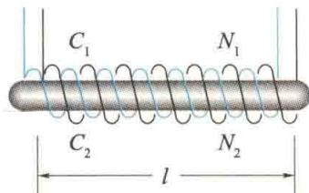

import QRCodeVideo from '@/components/QRCodeVideo.astro';

import Guide from '@/components/Guide.astro';
import Knowledge from '@/components/Knowledge.astro';
import Example from '@/components/Example.astro';
import Analysis from '@/components/Analysis.astro';
import Solution from '@/components/Solution.astro';
import Variant from '@/components/Variant.astro';
import Note from '@/components/Note.astro';
import Block from '@/components/Block.astro';
import Method from '@/components/Method.astro';
import Exercise from '@/components/Exercise.astro';

## 11.3.1 自感

电流流过线圈时,其产生的磁场的磁感线将穿过线圈本身,因而给线圈提供了磁通量.如果电流随时间变化,线圈中就会因磁通量变化而产生感生电动势,这种现象叫作自感现象.
自感现象可用图11.14所示的实验来演示. 图11.14(a)中 $\mathrm{A}_{1}, \mathrm{~A}_{2}$ 是两个相同的小灯泡，L是带铁芯的多匝线圈，R是电阻，其阻值与L的阻值相等. 接通开关K，灯泡 $\mathrm{A}_{1}$ 立即变亮，而灯泡 $\mathrm{A}_{2}$ 逐渐变亮，最后与 $\mathrm{A}_{1}$ 亮度相同. 这说明，由于L中存在自感电动势，电流的增大是比较迟缓的. 自感的这种作用称为电磁惯性.
在图 11.14(b) 中, 开关 K 断开时, 我们看到灯泡 A 不会立即熄灭, 而是猛然一亮, 然后逐渐熄灭. 这是因为开关 K 断开时, 线圈 L 与电源脱离, 线圈 L 上的电流从有变无, 是一个减小的过程. 线圈 L 上的自感电动势将阻碍电流的减小, 所以线圈上的电流不会立即减为零. 但此时开关 K 已切断, 线圈 L 上的电流只能通过灯泡 A, 因此灯泡 A 不会立即熄灭. 实验中线圈 L 的电阻远小于灯泡 A 的电阻. 在开关 K 连通, 电路处于稳定状态时, 流过线圈的电流远大于流过灯泡的电流. 在切断开关 K 的瞬间, 流过线圈的电流就流过灯泡, 使灯泡猛然一亮.
  
(a) 电流增大时的自感现象
  
(b) 电流减小时的自感现象  
图11.14 自感现象
不同线圈产生自感现象的能力不同. 一个密绕的 N 匝线圈, 每一匝线圈可近似看成一条闭合曲线. 线圈中的电流激发的穿过每匝线圈的磁通量近似相等, 该磁通量叫作自感磁通, 记作 $\Phi_{m自}$ . 因为整个线圈由 N 匝相同的线圈串联而成, 所以整个线圈的自感电动势为
<QRCodeVideo title="自感" url="https://api.guangyiedu.com/v3/resource/resource/r/NewQrCode-0VQS9sav5py5BjDpeVn5" />  
$$
\mathcal {E} _ {\mathrm{自}} = - N \frac {\mathrm{d} \Phi_ {\mathrm{m自}}}{\mathrm{d} t} = - \frac {\mathrm{d} (N \Phi_ {\mathrm{m自}})}{\mathrm{d} t}
$$
令 $\Psi_{m自} = N\Phi_{m自}$ ，称为线圈的自感磁链，则
$$
\mathcal {E} _ {\mathrm{自}} = - \frac {\mathrm{d} \Psi_ {\mathrm{m自}}}{\mathrm{d} t}
$$
根据毕奥-萨伐尔定律,电流在空间各点激发的磁感应强度 B 都与电流 I 成正比(有铁芯的线圈除外),而对同一个线圈, $\Phi_{m自}$ 又与 B 成正比,故 $\Psi_{m自}$ 与 I 成正比,即
$$
\Psi_ {\mathrm{m自}} \propto I
$$
写成等式为
$$
\Psi_ {\mathrm{m自}} = L I
$$
式中,比例系数 L 叫作线圈的自感系数,简称自感.它只与线圈本身的形状、大小及介质的磁导率有关,而与电流无关(有铁芯的线圈除外).引入自感系数后,自感电动势为
$$
\mathcal {E} _ {\mathrm{自}} = - L \frac {\mathrm{d} I}{\mathrm{d} t}\tag{11.9}
$$
式中，规定 $\varepsilon_{自}$ 的正方向与 I 的方向相同， $\varepsilon_{自}$ 的方向与 $\Phi_{m自}$ 的方向的关系遵循右手螺旋定则。在国际单位制（SI）中，L 的单位是 H（亨利），1 H = 1 Wb/A。实际中常用 mH（毫亨）和 $\mu H$ （微亨）等单位， $1 H = 10^{3} mH = 10^{6} \mu H$ 。
思考:对于真空中的长直密绕螺线管,试证明其自感函数 $L = \mu_{0} n^{2} V$ . 式中,n 为单位长度的匝数,V 为螺线管内部空间的体积.(请读者自行完成)
自感现象在电工、电子技术中有广泛的应用。日光灯的镇流器是自感现象用在电工技术中最简单的例子。在电子电路中也广泛应用自感现象，如自感元件与电容器组成的谐振电路和滤波器等。在供电系统中切断载有较大电流的电路时，由于电路中自感元件的作用，开关触头处会出现强烈的电弧，容易危及设备与人身安全。为避免事故，必须使用带有灭弧结构的特殊开关，如油开关等。

## 11.3.2 互感

<QRCodeVideo title="互感" url="https://api.guangyiedu.com/v3/resource/resource/r/NewQrCode-lW9xyXw6NxCQHwGiTUXr" />  
如图 11.15 所示, 两个邻近的线圈(1) 和线圈(2) 分别通有电流 $I_{1}$ 和 $I_{2}$ . 当其中一个线圈的电流发生变化时, 在另一个线圈中会产生感生电动势. 这种因两个载流线圈中的电流变化而相互在对方线圈中激起感应电动势的现象叫作互感现象.
  
图11.15 互感现象
在两线圈的形状、相互位置保持不变时，根据毕奥-萨伐尔定律，由电流 $I_{1}$ 产生的空间各
点的磁感应强度 $B_{1}$ 均与 $I_{1}$ 成正比. 因而 $B_{1}$ 穿过线圈(2) 的磁链 $\Psi_{m21}$ 也与电流 $I_{1}$ 成正比, 即
$$
\Psi_ {\mathrm{m21}} = M _ {2 1} I _ {1}
$$
同理
$$
\Psi_ {\mathrm{m12}} = M _ {1 2} I _ {2}
$$
式中， $M_{21}$ 和 $M_{12}$ 是两个比例系数。实验与理论均证明 $M_{21} = M_{12}$ ，故用 M 表示，称为两线圈的互感系数，简称互感。根据法拉第电磁感应定律，电流 $I_{1}$ 的变化在线圈（2）中产生的互感电动势
<QRCodeVideo title="互感系数的计算" url="https://api.guangyiedu.com/v3/resource/resource/r/NewQrCode-pfTmVyhwaY0zesOzC8iJ" />  
$$
\mathcal {E} _ {2 1} = - M \frac {\mathrm{d} I _ {1}}{\mathrm{d} t}
$$
(11.10)
同理,电流 $I_{2}$ 的变化在线圈(1)中产生的互感电动势
$$
\mathcal {E} _ {1 2} = - M \frac {\mathrm{d} I _ {2}}{\mathrm{d} t}\tag{11.11}
$$
互感系数的单位与自感系数的单位相同. 互感系数也不易计算, 一般通过实验测定.

<Example title="例 11.6">
一矩形线圈长为 $a$ ，宽为 $b$ ，由100匝表面绝缘的导线组成，放在一根很长的直导线旁边并与之共面.求图11.16中(a)、(b）两种情况下线圈与长直导线之间的互感系数.
  
(a)
  
(b)  
图11.16 例11.6图

<Solution title="解">
如图 11.16(a) 所示, 已知载流长直导线在距其 x 处产生的磁感应强度大小为
$$
B = \frac {\mu_ {0} I}{2 \pi x}
$$
通过线圈的磁链为
$$
\Psi_ {\mathrm{m}} = \int_ {b} ^ {2 b} \frac {N \mu_ {0} I}{2 \pi x} a \mathrm{d} x = \frac {N \mu_ {0} I a}{2 \pi} \ln 2
$$
可得线圈与长直导线的互感系数为
$$
M = \frac {\Psi_ {\mathrm{m}}}{I} = \frac {N \mu_ {0} a}{2 \pi} \ln 2
$$
图 11.16(b) 中, 长直导线两边的磁感应强度方向相反且以导线为轴对称分布,通过矩形线圈的磁链为零,因此 M = 0. 这是消除互感现象的方法之一.
互感现象被广泛应用于无线电技术和电磁测量中. 通过互感线圈, 能够使能量或信号由一个线圈传递到另一个线圈. 各种电源变压器、中频变压器、输入输出变压器、电压互感器、电流互感器等都是利用互感现象制成的. 但是, 电路之间的互感现象也会引起相互干扰, 必须采用磁屏蔽的方法来减小这种干扰.
</Solution>
</Example>

<Example title="例 11.7">
如图 11.17 所示， $C_{1}$ 表示一个螺线管（称为原线圈），长为 l，横截面积为 S，共有 $N_{1}$ 匝， $C_{2}$ 表示另一个螺线管（称为副线圈），其长度和横截面积分别与 $C_{1}$ 的长度和横截面积相同，并与 $C_{1}$ 共轴，共有 $N_{2}$ 匝，螺线管内磁介质的磁导率为 $\mu$ 。求：（1）这两个共轴螺线管的互感系数；（2）两个螺线管的自感系数与互感系数的关系。
  
图11.17 例11.7图

<Solution title="解">
（1）设原线圈中通有电流 $I_{1}$ ，可知管内的磁场的磁感应强度大小为
$$
B = \mu \frac {N _ {1} I _ {1}}{l}
$$
通过副线圈的磁链为
$$
\Psi_ {2 1} = N _ {2} \Phi_ {2 1} = \mu \frac {N _ {1} N _ {2} I _ {1}}{l} S
$$
由互感系数的定义得两线圈的互感系数为
$$
M = \frac {\Psi_ {2 1}}{I _ {1}} = \mu \frac {N _ {1} N _ {2} S}{l}
$$
(2) 原线圈通有电流 $I_{1}$ 时, 原线圈的磁链为
$$
\Psi_ {1 1} = N _ {1} \Phi_ {1 1} = \mu \frac {N _ {1} ^ {2} I _ {1}}{l} S
$$
由自感系数的定义得原线圈的自感系数为
$$
L _ {1} = \frac {\Psi_ {1 1}}{I _ {1}} = \mu \frac {N _ {1} ^ {2} S}{l}
$$
同理，副线圈的自感系数为
$$
L _ {2} = \mu \frac {N _ {2} ^ {2} S}{l}
$$
</Solution>
</Example>

由此可见， $M^{2}=L_{1}L_{2}$ ，故 $M=\sqrt{L_{1}L_{2}}$ ，这是在无磁漏的情况下的结果。在考虑磁漏的情况下， $M=K\sqrt{L_{1}L_{2}}(K\leqslant1)$ ，K 称为耦合系数。
思考: 将一个自感线圈截成相等的两段, 每一段的自感系数不是原线圈自感系数的 1/2, 而是原线圈自感系数的 1/4, 为什么?
