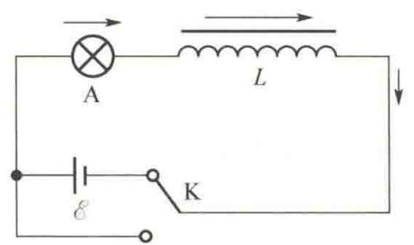
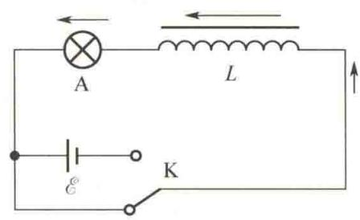
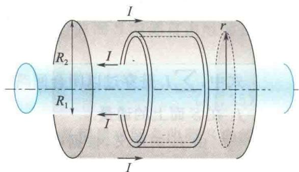

import Guide from '@/components/Guide.astro';
import Knowledge from '@/components/Knowledge.astro';
import Example from '@/components/Example.astro';
import Analysis from '@/components/Analysis.astro';
import Solution from '@/components/Solution.astro';
import Variant from '@/components/Variant.astro';
import Note from '@/components/Note.astro';
import Block from '@/components/Block.astro';
import Method from '@/components/Method.astro';
import Exercise from '@/components/Exercise.astro';

## 11.4.1 自感磁能

如图 11.18(a) 所示, 自感系数为 L 的线圈与电源接通, 线圈中的电流 i 将由零增大至恒定值 I. 这一电流变化在线圈中所产生的自感电动势的方向与电流的方向相反, 起着阻碍电流增大的作用. 因此自感电动势 $\varepsilon = -L \frac{di}{dt}$ 做负功. 在建立电流 I 的整个过程中, 外电源不仅要供给电路中产生焦耳热的能量, 而且要反抗自感电动势做功 W, 即

$$

W = \int \mathrm{d} W = \int_ {0} ^ {\infty} (- \mathcal {C}) i \mathrm{d} t = \int_ {0} ^ {\infty} L \frac {\mathrm{d} i}{\mathrm{d} t} i \mathrm{d} t = \int_ {0} ^ {I} L i \mathrm{d} i = \frac {1}{2} L I ^ {2}

$$

电源反抗自感电动势所做的功 W 转化为储存在线圈中的能量, 称为自感磁能, 即

$$

W _ {\mathrm{m}} = \frac {1}{2} L I ^ {2}\tag{11.12}

$$

在图 11.18(b) 中, 切断开关后, 灯泡 A 不立即熄灭而是猛然一亮, 然后逐渐熄灭, 就是由于线圈中所储存的磁能通过自感电动势做功全部释放出来, 变成灯泡 A 在很短时间内所发出的光能与热能.

  

(a) 电流增大时, 自感电动势阻碍电流增大

  

(b) 电流减小时, 自感电动势补偿电流  

图11.18 线圈中储存的能量

## 11.4.2 磁场能量

  

磁场能量

与电场一样,磁能是定域在整个磁场空间的.我们可以从通电自感线圈储存自感磁能的公式导出磁场能量及其能量密度公式.长直密绕螺线管的自感系数 $L=\mu_{0}n^{2}V$ ,如果管内充满均匀磁介质(非铁磁质),则 $L=\mu n^{2}V,\mu$ 为磁介质的磁导率.当长直密绕螺线管中通有电流I时,它所储存的磁能为

$$

W _ {\mathrm{m}} = \frac {1}{2} L I ^ {2} = \frac {1}{2} \mu n ^ {2} V I ^ {2}

$$

因为长直密绕螺线管内 $H = nI, B = \mu nI$ ，所以

$$

W _ {\mathrm{m}} = \frac {1}{2} \mu n I n I V = \frac {1}{2} B H V

$$

V 是长直密绕螺线管内部空间的体积,也就是磁场存在的空间的体积,并且长直密绕螺线管内部的磁场是均匀磁场,因此

$$

w _ {\mathrm{m}} = \frac {W _ {\mathrm{m}}}{V} = \frac {1}{2} B H\tag{11.13}

$$

$w_{m}$ 表示磁场中单位体积的能量, 叫作磁能密度. 尽管式(11.13)是根据长直密绕螺线管内部的磁场得到的, 但可以证明它对任何磁场都适用. 在普遍情况下, 如果 B 与 H 的方向不同, 则

$$

w _ {\mathrm{m}} = \frac {1}{2} \boldsymbol {B} \cdot \boldsymbol {H}

$$

而总磁场能量等于磁能密度对磁场所占有的全部空间的积分,即

$$

W _ {\mathrm{m}} = \int_ {V} \frac {1}{2} \pmb {B} \cdot \pmb {H} \mathrm{d} V\tag{11.14}

$$

  

遥感技术

对于一个载流线圈，有

$$

\frac {1}{2} L I ^ {2} = \int_ {V} \frac {1}{2} \pmb {B} \cdot \pmb {H} \mathrm{d} V = W _ {\mathrm{m}}

$$

上式不仅为自感系数 L 提供了另一种计算方法, 而且对于横截面积有限的导体来说 (导线的横截面积不能忽略时), 它还为自感系数提供了基本的定义, 即用磁能法定义自感系数 $L = \frac{2W_{m}}{I^{2}}$ .

<Example title="例 11.8">
求无限长圆柱形同轴电缆上长为 l 的一段中磁场的能量及自感系数. 设内、外导体的横截面半径分别为 $R_{1}$ 、 $R_{2}$ ( $R_{2} > R_{1}$ )，电缆中通有电流 I，两导体之间磁介质的磁导率为 $\mu_{0}$ .

<Solution title="解">
作为传输超高频信号(如微波)的同轴电缆如图11.19所示,由于趋肤效应,磁场只存在于两导体之间,即 $R_{1}<r<R_{2}$ 的空间内.利用安培环路定理不难求得磁场分布为

$$

H = \frac {I}{2 \pi r}, \quad B = \mu_ {0} H = \frac {\mu_ {0} I}{2 \pi r}

$$

所以磁能密度为

$$

w _ {\mathrm{m}} = \frac {1}{2} B H = \frac {\mu_ {0} I ^ {2}}{8 \pi^ {2} r ^ {2}}

$$

在长为 $l$ 的一段同轴电缆内，总磁场能量为

$$

\begin{array}{r l} W _ {\mathrm{m}} & = \int_ {V} w _ {\mathrm{m}} \mathrm{d} V = \int_ {R _ {1}} ^ {R _ {2}} \frac {\mu_ {0} I ^ {2}}{8 \pi^ {2} r ^ {2}} l 2 \pi r \mathrm{d} r \\ & = \frac {\mu_ {0} I ^ {2} l}{4 \pi} \ln \frac {R _ {2}}{R _ {1}} \end{array}

$$

$$

L = \frac {2 W _ {\mathrm{m}}}{I ^ {2}} = \frac {\mu_ {0} l}{2 \pi} \ln \frac {R _ {2}}{R _ {1}}

$$

因此

而单位长度的圆柱形同轴电缆的自感系数为

$$

L _ {0} = \frac {\mu_ {0}}{2 \pi} \ln \frac {R _ {2}}{R _ {1}}

$$

它只与电缆的结构及介质情况有关.

  

图11.19 同轴电缆

</Solution>
</Example>
