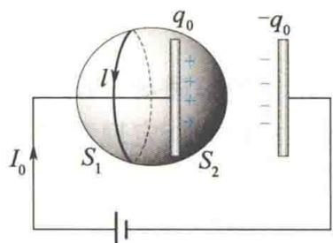
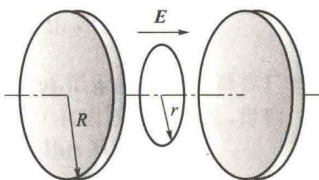

import Guide from '@/components/Guide.astro';
import Knowledge from '@/components/Knowledge.astro';
import Example from '@/components/Example.astro';
import Analysis from '@/components/Analysis.astro';
import Solution from '@/components/Solution.astro';
import Variant from '@/components/Variant.astro';
import Note from '@/components/Note.astro';
import Block from '@/components/Block.astro';
import Method from '@/components/Method.astro';
import Exercise from '@/components/Exercise.astro';

## 11.5.1 位移电流

### 1. 电磁场的基本规律

对于静电场,由库仑定律和电场强度叠加原理,可以导出描述电场性质的高斯定理和静电场环路定理:
$$
\oint_ {S} \boldsymbol {D} \cdot \mathrm{d} \boldsymbol {S} = \sum q _ {i}
$$

(11.15)
位移电流
$$
\oint_ {l} \boldsymbol {E} \cdot \mathrm{d} \boldsymbol {l} = 0\tag{11.16}
$$
对于稳恒磁场,由毕奥-萨伐尔定律和磁感应强度叠加原理,可以导出描述稳恒磁场性质的高斯定理和安培环路定理:
$$
\oint_ {S} \boldsymbol {B} \cdot \mathrm{d} \boldsymbol {S} = 0\tag{11.17}
$$
$$
\oint_ {l} \boldsymbol {H} \cdot \mathrm{d} \boldsymbol {l} = \sum I _ {i}\tag{11.18}
$$
对于变化的磁场,麦克斯韦提出,感生电动势现象预示着变化的磁场周围产生了感生电场.于是,法拉第电磁感应定律就表明了在普遍(非稳恒)情况下电场的环路定理为
$$
\oint_ {l} \boldsymbol {E} \cdot \mathrm{d} \boldsymbol {l} = - \int_ {s} \frac {\partial \boldsymbol {B}}{\partial t} \cdot \mathrm{d} \boldsymbol {S}\tag{11.19}
$$

<Note>
式(11.19)中的电场强度 E 为静电场的电场强度和非稳恒电场的电场强度的和,而静电场的环路定理[式(11.16)]只是它的一个特例.
当时的实验资料和理论分析,都没有指出电场的高斯定理和磁场的高斯定理在非稳恒条件下有什么不合理的地方.麦克斯韦假定它们在普遍情况(包括非稳恒条件)下都成立.然而,麦克斯韦在分析安培环路定理时发现,将它应用到非稳恒磁场时遇到了困难.
</Note>

### 2. 传导电流和位移电流

在稳恒条件下,无论载流回路周围是真空还是磁介质,安培环路定理都可以写成
$$
\oint_ {l} \boldsymbol {H} \cdot \mathrm{d} \boldsymbol {l} = \sum I _ {i} = \int_ {S} \boldsymbol {j} _ {0} \cdot \mathrm{d} S\tag{11.20}
$$
式中， $\sum I_{i}$ 是穿过以闭合回路 $l$ 为边界的任意曲面 $S$ 的传导电流，等于传导电流密度 $j_{0}$ 在 $S$ 面上的通量.
由 $j_{0}$ 的定义，根据电荷守恒定律，由闭合曲面流出的电荷应等于闭合曲面内电荷 $q$ 的减少量，因此有
$$
\oint_ {S} \boldsymbol {j} _ {0} \cdot \mathrm{d} \boldsymbol {S} = - \frac {\mathrm{d} q}{\mathrm{d} t}\tag{11.21}
$$
这一关系式叫作电流的连续性方程.
导体内各处的电流密度都不随时间变化的电流叫作稳恒电流. 稳恒电流的一个重要性质就是通过任意一个闭合曲面的稳恒电流等于零, 即
$$
\oint_ {S} \boldsymbol {j} _ {0} \cdot \mathrm{d} \boldsymbol {S} = 0\tag{11.22}
$$
通过任意一个闭合曲面的电流等于零,即任意一段时间内流出和流入该闭合曲面的电量相等,而这一闭合曲面内的总电量应不随时间改变.在导体内各处都可作一个任意形状和大小的闭合曲面,由此可以得出结论:在稳恒电流情况下,导体内电荷的分布不随时间改变.不随时间改变的电荷分布产生不随时间改变的电场,这种电场称为稳恒电场.导体内恒定的不随时间改变的电荷分布就像固定的静止电荷分布一样,因此稳恒电场与静电场有许多相似之处,
例如,它们都服从高斯定理和电场强度的环路积分为零的环路定理.若以 E 表示稳恒电场的电场强度,则也应有
$$
\oint_ {l} \boldsymbol {E} \cdot \mathrm{d} \boldsymbol {l} = 0\tag{11.23}
$$
为了考察在非稳恒条件下安培环路定理[式(11.20)]是否仍然成立,我们分析图11.20所示的电容器充、放电电路.电容器的充、放电过程显然是非稳恒过程,导线中的电流是随时间变化的,并且在两极板之间的绝缘介质中没有传导电流.如果围绕导线取一闭合回路 l,并以 l 为边界作两个曲面 $S_{1}$ 和 $S_{2}$ ,其中曲面 $S_{1}$ 与导线相交,而曲面 $S_{2}$ 穿过两极板之间的绝缘介质.这里设曲面 $S_{1}$ 上的各处法线方向指向闭合曲面内,以便与回路 l 的绕向匹配,则
  
图 11.20 电容器充、放电电路
$$
\int_ {S _ {1}} \boldsymbol {j} _ {0} \cdot \mathrm{d} \boldsymbol {S} = I _ {0}\tag{11.24a}
$$
$$
\int_ {S _ {2}} \boldsymbol {j} _ {0} \cdot \mathrm{d} \boldsymbol {S} = 0\tag{11.24b}
$$
也就是说，电容器的存在破坏了电路中传导电流的连续性，导致以同一闭合回路 $l$ 所作的不同曲面 $S_{1}$ 和 $S_{2}$ 上穿过的电流不同，从而使式(11.20)失去了意义。因此，在非稳恒磁场的情况下，安培环路定理[式(11.20)]不再适用，必须以新的规律来代替它。
在图 11.20 所示的电容器充电过程中,传导电流在电容器极板上终止的同时,将在极板表面引起自由电荷的积累,即正极板上的 $+q_{0}$ 增加、负极板上的 $-q_{0}$ 增加,从而引起两极板之间的电场随之变化.因为穿过闭合曲面 S 的传导电流密度的通量 $\oint_{S} j_{0} \cdot dS$ 就是流出闭合曲面 S 的电流,所以它应当等于闭合曲面 S 内部自由电荷在单位时间内的减少率,即
$$
\oint_ {S} \boldsymbol {j} _ {0} \cdot \mathrm{d} \boldsymbol {S} = - \frac {\mathrm{d} q _ {0}}{\mathrm{d} t}\tag{11.25}
$$
式中，S 是由曲面 $S_{1}$ 和 $S_{2}$ 构成的闭合曲面的面积矢量； $q_{0}$ 是积累在闭合曲面 S 内的极板上的自由电荷，即图 11.20 所示的正极板表面的自由电荷。
根据麦克斯韦的假设,对此非稳恒电场,高斯定理仍然成立,则有
$$
\oint_ {S} \boldsymbol {D} \cdot \mathrm{d} \boldsymbol {S} = q _ {0}
$$
对此式两边求导数,得
$$
\frac {\mathrm{d}}{\mathrm{d} t} \oint_ {S} \boldsymbol {D} \cdot \mathrm{d} \boldsymbol {S} = \oint_ {S} \frac {\partial \boldsymbol {D}}{\partial t} \cdot \mathrm{d} \boldsymbol {S} = \frac {\mathrm{d} q _ {0}}{\mathrm{d} t}
$$
把此式代入式(11.25)，得
$$
\oint_ {S} \boldsymbol {j} _ {0} \cdot \mathrm{d} \boldsymbol {S} = - \oint_ {S} \frac {\partial \boldsymbol {D}}{\partial t} \cdot \mathrm{d} \boldsymbol {S}
$$
可将此式改写为
$$
\oint_ {S} \left(\boldsymbol {j} _ {0} + \frac {\partial \boldsymbol {D}}{\partial t}\right) \cdot \mathrm{d} \boldsymbol {S} = 0
$$
或
$$
\int_ {S _ {1}} \left(\boldsymbol {j} _ {0} + \frac {\partial \boldsymbol {D}}{\partial t}\right) \cdot \mathrm{d} \boldsymbol {S} = \int_ {S _ {2}} \left(\boldsymbol {j} _ {0} + \frac {\partial \boldsymbol {D}}{\partial t}\right) \cdot \mathrm{d} \boldsymbol {S}
$$
由此可见，在非稳恒条件下，尽管传导电流密度 $j_0$ 不一定连续，但 $j_0 + \frac{\partial D}{\partial t}$ 这个量永远是连续的，并且 $\frac{\partial D}{\partial t}$ 具有电流密度的性质，麦克斯韦把它称为位移电流密度 $j_{\mathrm{D}}$ ，即
$$
j _ {\mathrm{D}} = \frac {\partial D}{\partial t}\tag{11.26}
$$
把 $\frac{d\Phi_{D}}{dt}$ 称为位移电流,用 $I_{D}$ 表示,即
$$
I _ {\mathrm{D}} = \frac {\mathrm{d} \Phi_ {\mathrm{D}}}{\mathrm{d} t} = \frac {\mathrm{d}}{\mathrm{d} t} \int_ {S} \boldsymbol {D} \cdot \mathrm{d} \boldsymbol {S} = \int_ {S} \frac {\partial \boldsymbol {D}}{\partial t} \cdot \mathrm{d} \boldsymbol {S} = \int_ {S} \boldsymbol {j} _ {\mathrm{D}} \cdot \mathrm{d} \boldsymbol {S}\tag{11.27}
$$
把传导电流 $I_{0}$ 与位移电流 $I_{D}$ 合在一起称为全电流，用 I 表示。全电流 I 为
$$
I = I _ {0} + I _ {\mathrm{D}} = \int_ {S} \boldsymbol {j} _ {0} \cdot \mathrm{d} \boldsymbol {S} + \int_ {S} \boldsymbol {j} _ {\mathrm{D}} \cdot \mathrm{d} \boldsymbol {S} = \int_ {S} \left(\boldsymbol {j} _ {0} + \frac {\partial \boldsymbol {D}}{\partial t}\right) \cdot \mathrm{d} \boldsymbol {S}\tag{11.28}
$$
在图11.20所示的电路中，电容器极板表面中断了的传导电流 $I_{0}$ 被绝缘介质中的位移电流 $I_{\mathrm{D}} = \frac{\mathrm{d}\Phi_{\mathrm{D}}}{\mathrm{d}t}$ 接续，二者合在一起，保持全电流的连续性。在一般情况下，电介质中的电流主要是位移电流，传导电流可忽略不计；而在导体中主要是传导电流，位移电流可忽略不计。但在超高频电流情况下，导体内的传导电流和位移电流均起作用，不可忽略。
因为在电介质中 $D = \varepsilon_{0} E + P$ ，所以位移电流密度 $j_{D}$ 为
$$
\boldsymbol {j} _ {\mathrm{D}} = \frac {\partial \boldsymbol {D}}{\partial t} = \varepsilon_ {0} \frac {\partial \boldsymbol {E}}{\partial t} + \frac {\partial \boldsymbol {P}}{\partial t}
$$
式中，右边第二项来自交变电路中电介质的反复极化，若在真空中，这一项等于零。因此，真空中位移电流密度为
$$
j _ {\mathrm{D}} = \varepsilon_ {0} \frac {\partial E}{\partial t}
$$
它是位移电流的基本组成部分,说明真空中的位移电流(或者说“纯粹”的位移电流)本质上是变化着的电场,而与电荷的定向运动无关.

## 11.5.2 全电流定律

在引进了位移电流的概念之后,麦克斯韦为了把安培环路定理推广到非稳恒情况下也适用的普遍形式,用全电流代替式(11.20)右边的传导电流,得到
$$
\oint_ {l} \boldsymbol {H} \cdot \mathrm{d} \boldsymbol {l} = \sum I _ {i} + \int_ {s} \frac {\partial \boldsymbol {D}}{\partial t} \cdot \mathrm{d} \boldsymbol {S}\tag{11.29}
$$
即在普遍情况下,磁场强度 H 沿任意闭合回路 l 的积分等于穿过以该回路为边界的任意曲面的全电流.这就是麦克斯韦的全电流定律.
麦克斯韦的位移电流假设的实质在于,它说明了位移电流与传导电流一样都是激发磁场的源,其核心是变化的电场可以激发磁场.但是,位移电流与传导电流仅仅在激发磁场这一点上是相同的.在本质上,位移电流是变化着的电场,而传导电流则是自由电荷的定向运动.此外,传导电流在通过导体时会产生焦耳热,而导体中的位移电流则不会产生焦耳热.高频情况下电介质的反复极化会放出大量热,这是位移电流热效应的原因,但这与传导电流通过导体时放出的焦耳热不同,二者遵循完全不同的规律.
科研成果介绍

## 11.5.3 麦克斯韦方程组

  
奇迹工程
——“中国天眼”
麦克斯韦把电磁现象的普遍规律概括为四个方程式,通常称为麦克斯韦方程组.
（1）通过任意闭合曲面的电位移通量等于该曲面所包围的自由电荷的代数和.即
$$
\oint_ {S} \boldsymbol {D} \cdot \mathrm{d} \boldsymbol {S} = \sum q _ {i}
$$

<Note>
上式在电荷和电场都随时间变化时仍然成立.这意味着尽管这时电场与电荷之间的关系不像静电场那样由库仑定律决定,但任意一个闭合曲面的 D 通量与闭合曲面内自由电荷的电量之间的关系仍遵循高斯定理.
（2）电场强度沿任意一条闭合曲线的线积分等于以该曲线为边界的任意一个曲面的磁通量对时间变化率的负值.即
$$
\oint_ {l} \boldsymbol {E} \cdot \mathrm{d} \boldsymbol {l} = - \int_ {s} \frac {\partial \boldsymbol {B}}{\partial t} \cdot \mathrm{d} \boldsymbol {S}
$$
这里的电场强度 E 包括自由电荷产生的静电场的电场强度和变化的磁场产生的感生电场的电场强度.
（3）通过任意一个闭合曲面的磁通量恒等于零.即
$$
\oint_ {S} \boldsymbol {B} \cdot \mathrm{d} \boldsymbol {S} = 0
$$
这也是从稳恒磁场的情况到对随时间变化的非稳恒磁场的情况的假设性推广.
（4）磁场强度沿任意一条闭合曲线的线积分等于穿过以该曲线为边界的曲面的全电流.即
$$
\oint_ {l} \boldsymbol {H} \cdot \mathrm{d} \boldsymbol {l} = \sum I _ {i} + \int_ {s} \frac {\partial \boldsymbol {D}}{\partial t} \cdot \mathrm{d} \boldsymbol {S}
$$
前面已对此作了详细论述.
归纳起来,麦克斯韦方程组的积分形式为
$$
\left\{ \begin{array}{l} \oint_ {S} \boldsymbol {D} \cdot \mathrm{d} \boldsymbol {S} = \sum q _ {i} \\ \oint_ {l} \boldsymbol {E} \cdot \mathrm{d} l = - \int_ {S} \frac {\partial \boldsymbol {B}}{\partial t} \cdot \mathrm{d} \boldsymbol {S} \\ \oint_ {S} \boldsymbol {B} \cdot \mathrm{d} \boldsymbol {S} = 0 \\ \oint_ {l} \boldsymbol {H} \cdot \mathrm{d} l = \sum I _ {i} + \int_ {S} \frac {\partial \boldsymbol {D}}{\partial t} \cdot \mathrm{d} \boldsymbol {S} \end{array} \right.
$$
  
麦克斯韦方程组
(11.30)
从上面的论述中可以看到,麦克斯韦方程组不但提出了感生电场、位移电流这样的概念,还包括从特殊情况(静电场和稳恒磁场)向一般非稳恒情况的假设性推广,如稳恒场中的高斯定理在非稳恒场中仍成立的假设.它的正确性由一系列理论与实验符合得很好的事实证实.
在有介质存在时，E 和 B 都与介质的特性有关，因此上述麦克斯韦方程组是不完备的，还需要再补充描述介质性质的下述方程：
$$
\left\{ \begin{array}{l} D = \varepsilon_ {0} \varepsilon_ {\mathrm{r}} E = \varepsilon E \\ B = \mu_ {0} \mu_ {\mathrm{r}} H = \mu H \\ j _ {0} = \sigma E \end{array} \right.\tag{11.31}
$$
式中， $\varepsilon,\mu,\sigma$ 分别是介质的介电常量、磁导率和电导率.
通过数学变换,可得麦克斯韦方程组(11.30)的微分形式如下:
$$
\left\{ \begin{array}{l} \boldsymbol {\nabla} \cdot \boldsymbol {D} = \rho_ {0} \\ \boldsymbol {\nabla} \times \boldsymbol {E} = - \frac {\partial \boldsymbol {B}}{\partial t} \\ \boldsymbol {\nabla} \cdot \boldsymbol {B} = 0 \\ \boldsymbol {\nabla} \times \boldsymbol {H} = j _ {0} + \frac {\partial \boldsymbol {D}}{\partial t} \end{array} \right.\tag{11.32}
$$
  
探雷器是如何工作的？
式中， $\nabla\cdot D$ 和 $\nabla\cdot B$ 分别为电位移和磁感应强度的散度， $\nabla\times E$ 和 $\nabla\times H$ 分别为电场强度的旋度和磁场强度的旋度.
麦克斯韦方程组(11.30)加上介质方程(11.31)构成决定电磁场变化的一组完备的方程式.这就是说,当电荷、电流分布给定时,根据麦克斯韦方程组[一般采用微分形式(11.32)],由初始条件及边界条件就可以确定电磁场的分布和变化.
</Note>

<Example title="例 11.9">
如图11.21所示，半径 $R = 0.1\mathrm{m}$ 的两块圆板构成平行板电容器，通过匀速充电，使电容器两极板间电场强度的变化率为 $\frac{\mathrm{d}E}{\mathrm{d}t} = 1\times 10^{13}\mathrm{V / (m\cdot s)}$ ，求电容器两极板间的位移电流，并计算电容器内离两极板中心连线 $r(r < R)$ 处的磁感应强度大小 $B_{r}$ 和 $r = R$ 处的磁感应强度大小 $B_{R}$

<Solution title="解">
由位移电流的定义知
$$
H _ {r} = \frac {\varepsilon_ {0}}{2} r \frac {\mathrm{d} E}{\mathrm{d} t}
$$
$$
I _ {\mathrm{D}} = \frac {\mathrm{d} \Phi_ {\mathrm{D}}}{\mathrm{d} t} = S \frac {\mathrm{d} D}{\mathrm{d} t} = \pi R ^ {2} \varepsilon_ {0} \frac {\mathrm{d} E}{\mathrm{d} t} = 2. 8 \mathrm{A}
$$
这个正在充电的电容器的两极板之外有传导电流，两极板之间有位移电流，所产生的磁场对于两极板中心连线具有对称性，即在离两极板中心连线 r 处的圆周上各点的磁感应强度的大小相等，方向沿圆周切向，其与电流流向的关系遵循右手螺旋定则。以两极板中心连线为轴，在平行于极板的平面内作半径为 r 的圆形回路，应用麦克斯韦方程组（11.30）的第 4 个公式有
$$
\oint_ {L} \boldsymbol {H} \cdot \mathrm{d} \boldsymbol {l} = \int_ {S} \frac {\partial \boldsymbol {D}}{\partial t} \cdot \mathrm{d} \boldsymbol {S}
$$
$$
H \cdot 2 \pi r = \varepsilon_ {0} \frac {\mathrm{d} E}{\mathrm{d} t} \cdot \pi r ^ {2}
$$
$$
B _ {r} = \frac {\mu_ {0} \varepsilon_ {0}}{2} r \frac {\mathrm{d} E}{\mathrm{d} t}
$$
即
当 $r = R$ 时
$$
B _ {R} = \frac {\mu_ {0} \varepsilon_ {0}}{2} R \frac {\mathrm{d} E}{\mathrm{d} t} = 5. 6 \times 1 0 ^ {- 6} \mathrm{T}
$$
计算结果表明,虽然位移电流相当大,但它产生的磁场却很弱.只有在超高频情况下,才会获得较强的磁场.
  
图11.21 例11.9图
因此
</Solution>
</Example>
