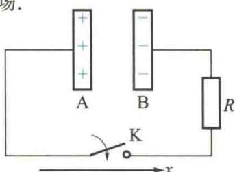

import Guide from '@/components/Guide.astro';
import Knowledge from '@/components/Knowledge.astro';
import Example from '@/components/Example.astro';
import Analysis from '@/components/Analysis.astro';
import Solution from '@/components/Solution.astro';
import Variant from '@/components/Variant.astro';
import Note from '@/components/Note.astro';
import Block from '@/components/Block.astro';
import Method from '@/components/Method.astro';
import Exercise from '@/components/Exercise.astro';

## 选择题

<Exercise title="习题 11.1.1">
一圆形线圈在均匀磁场中做下列运动时,会产生感应电流的是
A. 沿垂直于磁场的方向平移.
B. 以直径为轴转动, 轴与磁场垂直.
C. 沿平行于磁场的方向平移.
D. 以直径为轴转动, 轴与磁场平行.
</Exercise>

<Exercise title="习题 11.1.2">
下列矢量场中属于保守力场的是
A. 静电场.
B. 稳恒磁场.
C. 感生电场.
D. 变化的磁场.
</Exercise>

<Exercise title="习题 11.1.3">
用线圈的自感系数 L 表示的载流线圈磁场能量的公式 $W_{m} = \frac{1}{2} LI^{2}$ A. 只适用于无限长密绕螺线管.
B. 只适用于一个匝数很多且密绕的螺线环.
C. 只适用于单匝圆线圈.
D. 适用于自感系数 L 一定的任意线圈.
</Exercise>

<Exercise title="习题 11.1.4">
对于感生电场,下列说法中不正确的是
A. 感生电场对电荷有作用力.
B. 感生电场由变化的磁场产生.
C. 感生电场由电荷激发.
D. 感生电场的电场线是闭合的.
</Exercise>

<Exercise title="习题 11.1.5">
对于位移电流,下列说法中正确的是
A.与电荷的定向运动有关.
B.其实质为变化的电场.
C.产生焦耳热.
D.与传导电流一样.
</Exercise>

<Exercise title="习题 11.1.6">
题 11.1.6 图所示为一充电后的平行板电容器, A 板带正电, B 板带负电, 开关 K 合上时, A、B 间位移电流的方向为 (按图上所标 x 轴正方向回答) ( )
A. x 轴正方向.    B. x 轴负方向.
C. x 轴正方向或负方向.    D. 不确定.
  
题11.1.6图

</Exercise>
