import Guide from '@/components/Guide.astro';
import Knowledge from '@/components/Knowledge.astro';
import Example from '@/components/Example.astro';
import Analysis from '@/components/Analysis.astro';
import Solution from '@/components/Solution.astro';
import Variant from '@/components/Variant.astro';
import Note from '@/components/Note.astro';
import Block from '@/components/Block.astro';
import Method from '@/components/Method.astro';
import Exercise from '@/components/Exercise.astro';

## 解答题

<Exercise title="习题 11.3.1">
一半径 $r = 10 \mathrm{~cm}$ 的圆形回路放在 $B = 0.8 \mathrm{~T}$ 的均匀磁场中. 回路平面与 $\pmb{B}$ 垂直. 当回路半径以恒定变化率 $\frac{\mathrm{d} r}{\mathrm{d} t} = 80 \mathrm{~cm/s}$ 收缩时, 求回路中感应电动势的大小.
</Exercise>

<Exercise title="习题 11.3.2">
一对互相垂直的相同的半圆形导线构成回路, 半径 $R = 5 \mathrm{~cm}$ , 如题11.3.2图所示. 均匀磁场的磁感应强度大小 $B = 80 \times 10^{-3} \mathrm{T}, B$ 的方向与两个半圆的公共直径 (在 $z$ 轴上) 垂直, 且与两个半圆构成相等的夹角 $\alpha$ . 当磁感应强度在 $5 \mathrm{~ms}$ 内均匀降为零时, 求回路中的感应电动势的大小及方向.
</Exercise>

<Exercise title="习题 11.3.3">
如题 11.3.3 图所示, 在载有电流 I 的长直导线附近放一半圆环导体 MeN, 使其与长直导线共面, 且两端点 M、N 的连线与长直导线垂直. 半圆环导体的半径为 b, 环心 O 与导线相距 a. 设半圆环导体以速度 v 平行于导线平移. 求半圆环导体内感应电动势的大小和方向及 M、N 两端的电势差 $U_{M} - U_{N}$ .

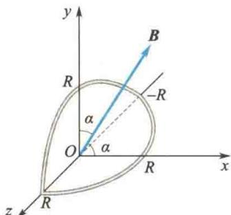  

题11.3.2图

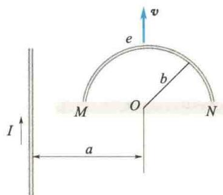  

题11.3.3图
</Exercise>

<Exercise title="习题 11.3.4">
如题 11.3.4 图所示, 在两平行的无限长直载流导线的平面内有一矩形线圈, 两导线中的电流的方向相反、大小相等, 且电流以 $\frac{dI}{dt}$ 的变化率增大, 求:

(1) 任意时刻线圈内所通过的磁通量；

(2) 线圈中的感应电动势.
</Exercise>

<Exercise title="习题 11.3.5">
如题 11.3.5 图所示, 将一根硬导线弯成一个半径为 r 的半圆. 令此半圆形导线在磁场中以频率 f 绕此半圆的直径旋转. 整个电路的电阻为 R. 求感应电流的最大值.

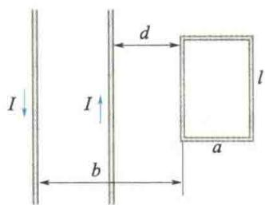  

题11.3.4图

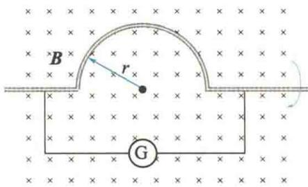  

题11.3.5图
</Exercise>

<Exercise title="习题 11.3.6">
如题 11.3.6 图所示, 长直导线中通有电流 I = 5 A, 在其右方放一矩形线圈, 两者共面. 线圈长 b = 0.06 m, 宽 a = 0.04 m, 线圈以速率 v = 0.03 m/s 垂直于导线平移远离. 求 d = 0.05 m 时线圈中感应电动势的大小和方向.
</Exercise>

<Exercise title="习题 11.3.7">
长度为 $l$ 的金属杆 $ab$ 以速率 $v$ 在导电轨道 $ad, cb$ 上平行移动。已知导轨处于均匀磁场 $\pmb{B}$ 中， $\pmb{B}$ 的方向与回路的法线成 $60^{\circ}$ 角（见题11.3.7图）， $\pmb{B}$ 的大小为 $B = kt$ （ $k$ 为正常数）。设 $t = 0$ 时杆位于 $cd$ 处，求任意时刻 $t$ 回路中感应电动势的大小和方向。

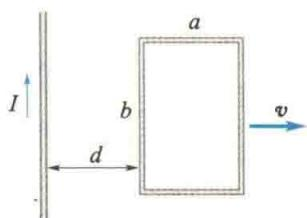  

题11.3.6图

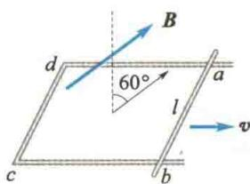  

题11.3.7图
</Exercise>

<Exercise title="习题 11.3.8">
一矩形导线框以恒定的速度v向右穿过一均匀磁场区，B的方向如题11.3.8图所示.取逆时针方向为电流正方向，画出线框中电流与时间的关系（设导线框刚进入磁场区时t=0）.
</Exercise>

<Exercise title="习题 11.3.9">
导线 ab 的长为 l，绕通过 O 点的垂直轴以角速度 $\omega$ 转动. $aO = \frac{l}{3}$ ，磁感应强度 B 平行于转轴，如题 11.3.9 图所示.

(1) 求 a、b 两端的电势差；

(2) a、b 两端哪一点的电势高？

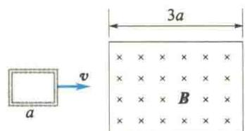  

题11.3.8图

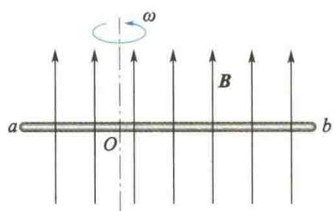  

题11.3.9图
</Exercise>

<Exercise title="习题 11.3.10">
如题 11.3.10 图所示, 长度为 $2b$ 的金属杆位于两无限长直导线所在平面的正中间, 并以速度 $\pmb{v}$ 平行于两直导线运动. 两直导线中分别通有大小相等、方向相反的电流 $I$ , 两直导线相距 $2a$ . 试求

金属杆两端的电势差及其方向.
</Exercise>

<Exercise title="习题 11.3.11">
磁感应强度为 B 的均匀磁场充满一半径为 R 的圆柱形空间，一金属杆放在题 11.3.11 图中位置，杆长为 2R，其中一半位于磁场内，另一半在磁场外。当 $\frac{dB}{dt} > 0$ 时，求杆两端的感应电动势的大小和方向。

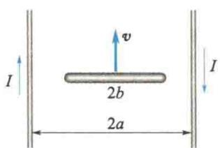  

题11.3.10图

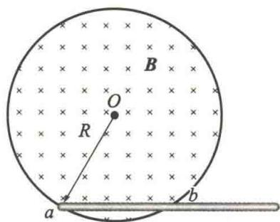  

题11.3.11图
</Exercise>

<Exercise title="习题 11.3.12">
半径为 $R$ 的直螺线管中有 $\frac{\mathrm{d}B}{\mathrm{d}t} > 0$ 的磁场，一任意闭合导线 $abca$ 的一部分在螺线管内绷直成 $ab$ 弦， $a, b$ 两点与螺线管绝缘，如题11.3.12图所示。设 $ab = R$ ，试求闭合导线中的感应电动势。
</Exercise>

<Exercise title="习题 11.3.13">
如题11.3.13图所示，在垂直于直螺线管轴线的平面上放置导体 $ab$ 于直径位置，另一导体 $cd$ 在一弦上，导体均与螺线管绝缘。当螺线管接通电源的一瞬间，管内磁场的方向如题11.3.13图所示。试求：

(1) a、b 两端的电势差；

(2) c、d 两点电势高低的情况.

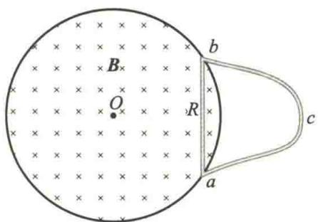  

题11.3.12图

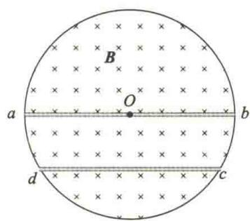  

题11.3.13图
</Exercise>

<Exercise title="习题 11.3.14">
一无限长的直导线和一正方形的线圈按题11.3.14图所示放置(导线与线圈接触处绝缘).求线圈与导线间的互感系数.
</Exercise>

<Exercise title="习题 11.3.15">
一横截面为矩形的螺绕环如题11.3.15图所示，共有 $N$ 匝.

(1) 求此螺绕环的自感系数；

(2) 若导线内通有电流 I, 环内磁能为多少?

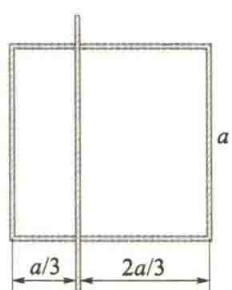  

题11.3.14图

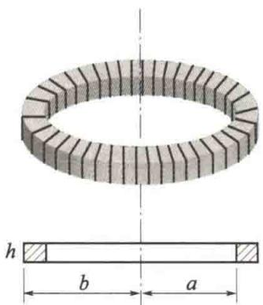  

题11.3.15图
</Exercise>

<Exercise title="习题 11.3.16">
一无限长圆柱形直导线,其横截面各处的电流密度相等,总电流为 I. 求导线内部单位长度上所储存的磁能.
</Exercise>

<Exercise title="习题 11.3.17">
圆柱形电容器内、外导体横截面的半径分别为 $R_{1}$ 和 $R_{2}(R_{1} < R_{2})$ ，中间充满介电常量为 $\varepsilon$ 的电介质.当两极板间的电压随时间的变化率为 $\frac{\mathrm{d}U}{\mathrm{d}t} = k(k$ 为常数）时，求介质内距圆柱轴线 $r$ 处的位移电流密度.
</Exercise>

<Exercise title="习题 11.3.18">
试证: 平行板电容器的位移电流可写成 $I_{D} = C \frac{dU}{dt}$ . 式中, C 为电容器的电容, U 是电容器两极板的电势差. 如果不是平行板电容器, 以上关系还适用吗?
</Exercise>

<Exercise title="习题 11.3.19">
如题 11.3.19 图所示, 电荷 +q 以速度 v 向 O 点运动, +q 到 O 点的距离为 x, 在 O 点处作半径为 a 的圆平面, 圆平面与 v 垂直. 求通过此圆平面的位移电流.
</Exercise>

<Exercise title="习题 11.3.20">
如题 11.3.20 图所示, 设平行板电容器内各点的交变电场强度大小 $E = 720 \sin 10^{5} \pi t \, V/m$ , 规定向右为正方向. 试求:

(2) 电容器内距中心连线 $r = 10^{-2} \, m$ 的一点 P 处，当 $t = 0 \, s$ 和 $t = \frac{1}{2} \times 10^{-5} \, s$ 时磁场强度的大小及方向（不考虑传导电流产生的磁场）.

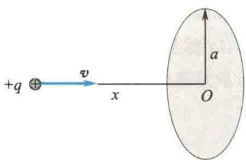  

题11.3.19图

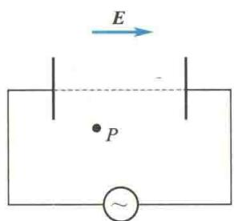  

题11.3.20图
</Exercise>
