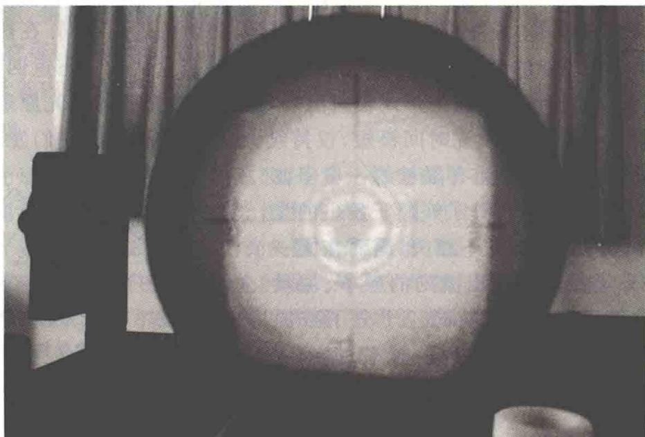
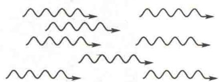
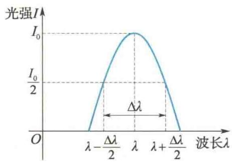
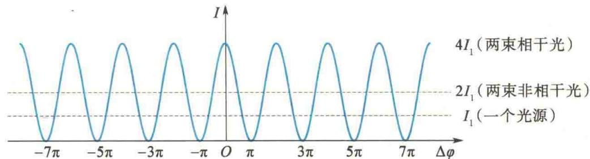

import QRCodeVideo from '@/components/QRCodeVideo.astro';

import Guide from '@/components/Guide.astro';
import Knowledge from '@/components/Knowledge.astro';
import Example from '@/components/Example.astro';
import Analysis from '@/components/Analysis.astro';
import Solution from '@/components/Solution.astro';
import Variant from '@/components/Variant.astro';
import Note from '@/components/Note.astro';
import Block from '@/components/Block.astro';
import Method from '@/components/Method.astro';
import Exercise from '@/components/Exercise.astro';

## 第12章 光的干涉

光学是研究光的本性、光的传播和光与物质相互作用等规律的学科。其内容通常分为几何光学、波动光学和量子光学三部分。以光的直线传播为基础，研究光在透明介质中传播规律的光学称为几何光学；以光的波动性为基础，研究光的传播及规律的光学称为波动光学；以光的粒子性为基础，研究光与物质相互作用规律的光学称为量子光学。
光学是人类历史上发展较早的学科,公元前400多年,我国的《墨经》中就记载了光影关系、小孔成像、反射成像等光的直线传播现象,对光的几何性质已有了较为完整的描述.1590年,琼森(Jonsen)和李普塞(Lippershey)发明了望远镜.17世纪初,冯特纳(Fontana)发明了显微镜,斯涅耳(Snell)和笛卡儿(Descartes)将光的反射和折射现象的观察结果归纳为如今我们所用的反射定律和折射定律.17世纪后半叶,人们对于光的本性的认识有两派不同的学说:一派是牛顿所主张的微粒说(至18世纪末一直占主导地位),认为光是一股粒子流;另一派是惠更斯所倡导的波动说,认为光是机械振动在“以太”介质中的传播.由于当时科学水平的局限,人们或者把光看作由机械微粒所组成,或者把光看作一种机械波.这两种观点都没有正确地反映光的客观本质.
19世纪初,波动光学体系已初步形成,其中以英国的托马斯·杨(T. Young)和法国的菲涅耳(A. J. Fresnel)的著作为代表.托马斯·杨用双缝实验显示了光的干涉现象,测定了光的波长并圆满地解释了“薄膜的颜色”现象;菲涅耳认为光振动是一种连续介质的机械弹性振动,并于1835年以杨氏干涉原理为基础补充了惠更斯波动说,提出了惠更斯-菲涅耳原理,进一步解释了光的干涉和衍射现象.1808年,法国人马吕斯(E. L. Malus)发现了光的偏振现象,托马斯·杨根据这一发现提出光是一种横波.光的干涉、衍射和偏振现象表明光具有波动性,并且是横波.至此,光的波动说获得了普遍承认.1865年,麦克斯韦(C. Maxwell)的理论研究指出,电场和磁场的变化,不能局限在空间的某一部分,而是以一定的速度传播着,且其在真空中的传播速度等于实验测定的光速 $-3 \times 10^{8}$ m/s，于是麦克斯韦预言：光是一种电磁波。这一结论在 1887 年被赫兹（Hertz）的实验所证实，人们这才认识到光不是机械波，而是电磁波，波动光学的理论得以完善。
19世纪末至20世纪初,人们又发现一系列新现象,如热辐射、光电效应、康普顿效应等,不能用光的波动理论来解释.1900年,普朗克提出了能量子假说,成功地解释了黑体辐射的实验规律,开创了量子光学的新纪元.1905年,爱因斯坦提出光量子假说,认为光是由大量以光速运动的粒子流——光子组成的,圆满地解释了光电效应;之后,康普顿又假定光子不仅具有能量,而且具有动量,成功地解释了康普顿效应.
光究竟是“微粒”还是“波”？近代科学实践证明，光是一种十分复杂的客体，关于光的本性问题，只能用它所表现的性质和规律来回答：光在某些方面的行为像“波”，在另一些方面的行为却像“粒子”，即它具有波动和粒子的两重性质，这就是所谓光的波粒二象性。光的这种二象性，已被证实也是一切微观粒子所具有的基本属性。
光的干涉、衍射和偏振现象在现代科学技术中的应用已十分广泛,如长度的精密测量、光谱学的测量与分析、光测弹性研究、晶体结构分析等.20世纪60年代以来,激光的问世和激光技术的迅速发展开拓了光学研究和应用的新领域,如全息技术、信息光学、集成光学、光纤通信及强激光下的非线性光学效应研究等,推动了现代科技的新发展.
本篇只是从波动的角度来研究光的性质,分别介绍光的干涉、衍射和偏振,光的量子性将在“量子论”篇介绍.

<QRCodeVideo title="本章提要" url="https://api.guangyiedu.com/v3/resource/resource/r/NewQrCode-hqMHljWDAwK8ML2eeB8y" />  
通过对第6章机械波的学习,我们知道,干涉现象是波的一种叠加效应.当频率相同、振动方向相同、相位差恒定的两列波在空间传播时,在重叠区域会形成稳定的、强弱分布不变的波形.在对光的研究中,人们发现,满足一定条件的两列光相遇时,在它们的重叠区域也会出现稳定的明暗条纹分布,这就是光的干涉现象.能产生干涉现象的光称为相干光.
本章介绍光的干涉现象和规律,主要讨论光的相干条件、明暗条纹分布的规律及典型的光干涉实验等.

## 12.1.1 光源

### 1. 光源的发光机理

能发射光的物体称为光源. 常用的光源有两类: 普通光源和激光光源. 普通光源有热光源(由热能激发, 如白炽灯、太阳)、冷光源(由化学能、电能或光能激发, 如日光灯、气体放电管)等. 各种光源的激发方式不同, 辐射机理也不同. 在热光源中, 大量分子和原子在热能的激发下处于高能量的激发态, 当它从激发态返回较低能量状态时, 就把多余的能量以光波的形式辐射出来, 这便是热光源的发光原理. 这些分子或原子间歇地向外发光, 发光时间极短, 仅持续大约 $10^{-8} \mathrm{~s}$ , 因而它们发出的光波是
在时间上很短、在空间中为有限长的一串串波列(见图12.1).由于各个分子或原子发出的光波参差不齐,彼此独立,互不相关,因而在同一时刻,各个分子或原子发出波列的频率、振动方向和相位都不相同.即使同一个分子或原子,在不同时刻所发出的波列的频率、振动方向和相位也不尽相同.
  
图 12.1 热光源的各原子或分子所发出的光波是持续时间约为 $10^{-8}$ s 的波列

### 2. 光的颜色和光谱

光源发出的可见光是频率在 $3.9 \times 10^{14} \sim 7.7 \times 10^{14} \mathrm{~Hz}$ 之间的、可以引起视觉效应的电磁波，它在真空中对应的波长范围是 $390 \sim 760 \mathrm{~nm}$ 。在可见光范围内，不同频率的光在视觉上对应不同的颜色，各种颜色的可见光的波长和频率范围如表12.1所示。由此可见，波长从小到大呈现出从紫到红等颜色。
表 12.1 各种颜色的可见光的波长和频率范围
<table><tr><td>光色</td><td>波长范围 /nm</td><td>频率范围 /Hz</td></tr><tr><td>红</td><td>622 ～ 760</td><td> $3.9 \times 10^{14} \sim 4.7 \times 10^{14}$ </td></tr><tr><td>橙</td><td>597 ～ 622</td><td> $4.7 \times 10^{14} \sim 5.0 \times 10^{14}$ </td></tr><tr><td>黄</td><td>577 ～ 597</td><td> $5.0 \times 10^{14} \sim 5.5 \times 10^{14}$ </td></tr><tr><td>绿</td><td>492 ～ 577</td><td> $5.5 \times 10^{14} \sim 6.3 \times 10^{14}$ </td></tr><tr><td>青</td><td>450 ～ 492</td><td> $6.3 \times 10^{14} \sim 6.7 \times 10^{14}$ </td></tr><tr><td>蓝</td><td>435 ～ 450</td><td> $6.7 \times 10^{14} \sim 6.9 \times 10^{14}$ </td></tr><tr><td>紫</td><td>390 ～ 435</td><td> $6.9 \times 10^{14} \sim 7.7 \times 10^{14}$ </td></tr></table>
单一波长的光称为单色光. 然而, 严格的单色光实际是不存在的, 一般光源发出的光是由大量分子或原子在同一时刻发出的, 包含各种不同的波长成分, 称为复色光. 如果光波中包含波长范围很小的成分, 则这种光称为准单色光, 也就是通常所说的单色光. 波长范围 $\Delta \lambda$ 越小, 其单色性越好. 例如, 用滤光片从白光中得到的色光, 其
波长范围相当大, $\Delta\lambda\approx10\ nm$ ; 在气体原子发出的光中, 每一种成分的光的波长范围 $\Delta\lambda$ 为 $10^{-4}\sim10^{-2}\ nm$ ; 即使是单色性很好的激光,也有一定的波长范围, $\Delta\lambda\approx10^{-9}\ nm$ . 利用光谱仪可以把光源发出的光按波长不同的成分彼此分开, 所有的波长成分组成了光谱. 光谱中每一种波长成分所对应的亮线或暗线称为光谱线, 它们都有一定的宽度, 如图 12.2 所示. 每种光源都有自己特定的光谱结构, 利用它可以对化学元素进行分析, 或对原子和分子的内部结构进行研究.
  
图12.2 光谱线及其宽度

### 3. 光强

可见光是能激起人视觉的电磁波, 是变化的电磁场在空间的传播. 实验表明, 能引起眼睛视觉效应和照相底片感光作用的是光波中的电场, 所以光学中常用电场强度 E 代表光振动, 并把 E 矢量称为光矢量. 光振动指的是光矢量随时间周期性地变化.
人眼或感光仪器所检测到的光的强弱是由平均能流密度决定的,平均能流密度与光矢量振幅 $E_{0}$ 的平方成正比,所以光强(平均能流密度)为
$$
I \propto E _ {0} ^ {2}
$$
人们通常关心的是光强的相对分布,可设比例系数为1,故在传播光的空间内任意一点的光强可用该点光矢量振幅的平方表示,即
$$
I = E _ {0} ^ {2}\tag{12.1}
$$

## 12.1.2 光的相干性

我们已经知道,波动具有叠加性,两个相干波源发出的两列相干波,在相遇的区域将产生干涉现象,如机械波、无线电波的干涉现象.那么,对于两列光波,在它们的相遇区域满足什么条件才能观察到干涉现象呢?
设两个频率相同、光矢量 E 的方向相同的光源所发出的光振幅和光强分别为 $E_{10}$ 、 $E_{20}$ 和 $I_{1}$ 、 $I_{2}$ ，它们在空间某处 P 点相遇，根据式(5.29)和式(12.1)，在 P 点合成的光矢量的振幅 E、光强 I 可分别表示为
$$
E ^ {2} = E _ {1 0} ^ {2} + E _ {2 0} ^ {2} + 2 E _ {1 0} E _ {2 0} \cos \Delta \varphi\tag{12.2}
$$
$$
I = I _ {1} + I _ {2} + 2 \sqrt {I _ {1} I _ {2}} \cos \Delta \varphi\tag{12.3}
$$
式中， $\Delta\varphi$ 为两光的振动在 P 点的相位差。由于分子或原子每次发光持续的时间极短（约为 $10^{-8}$ s），人眼和感光仪器不可能在这极短的时间内对两波列之间的干涉作出反应。我们所观察到的光强是在较长时间 $\tau$ 内的平均值，即
$$
\begin{array}{r l} I & = \frac {1}{\tau} \int_ {0} ^ {\tau} (I _ {1} + I _ {2} + 2 \sqrt {I _ {1} I _ {2}} \cos \Delta \varphi) \mathrm{d} t \\ & = I _ {1} + I _ {2} + 2 \sqrt {I _ {1} I _ {2}} \frac {1}{\tau} \int_ {0} ^ {\tau} \cos \Delta \varphi \mathrm{d} t \end{array}\tag{12.4}
$$
下面对式(12.4)分两种情况进行讨论.

### 1. 非相干叠加

由于分子或原子发光的间歇性和随机性，在 $\tau$ 时间内，在叠加处随着光波列的大量更替，来自两个独立光源的两束光（或同一光源的不同部位所发出的光）的相位差 $\Delta \varphi$ “瞬息万变”，它可以取 $0\sim 2\pi$ 之间的一切数值，且机会均等，因而cos $\Delta \varphi$ 对时间的平均值为零，故
$$
I = I _ {1} + I _ {2}\tag{12.5}
$$
式(12.5)表明,来自两个独立光源的两束光(或同一光源不同部位所发出的光)叠加后的光强等于两束光单独照射时的光强 $I_{1}$ 和 $I_{2}$ 之和,故观察不到干涉现象.

### 2. 相干叠加

如果利用某些方法使得两束相干光在光场中各指定点的相位差 $\Delta \varphi (\Delta \varphi = \varphi_2 - \varphi_1)$ 各有恒定值，则在相遇空间的 $P$ 点处合成后的光强为
$$
I = I _ {1} + I _ {2} + 2 \sqrt {I _ {1} I _ {2}} \cos \Delta \varphi
$$
因为相位差 $\Delta \varphi$ 恒定，所以 $P$ 点的光强始终不变.对于两波相遇区域的不同位置，其光强的大小将由这些位置的相位差决定，即空间各处光强分布将由干涉项 $2\sqrt{I_1I_2}\cos \Delta \varphi$ 决定，有些地方始终加强 $(I > I_{1} + I_{2})$ ，有些地方始终减弱 $(I < I_{1} + I_{2})$ .若 $I_{1} = I_{2}$ ，则合成后的光强为
$$
I = 2 I _ {1} (1 + \cos \Delta \varphi) = 4 I _ {1} \cos^ {2} \frac {\Delta \varphi}{2}\tag{12.6}
$$
当 $\Delta\varphi=\pm2k\pi(k=0,1,2,\cdots)$ 时，这些位置的光强最大 $(I=4I_{1})$ ，这称为相长干涉，这些位置为亮纹中心；当 $\Delta\varphi=\pm(2k+1)\pi(k=0,1,2,\cdots)$ 时，这些位置的光强最小 $(I=0)$ ，这称为相消干涉。光强 I 随相位差 $\Delta\varphi$ 变化的情况如图 12.3 所示。
  
图12.3 光强 $I$ 随相位差 $\Delta \varphi$ 变化的情况
综上所述, 只有在两束相干光叠加时才能观察到光的干涉现象. 怎样才能获得两束相干光呢? 原则上可以将光源上同一发光点发出的光波分成两束, 使之经历不同的路径后再会合叠加. 因为这两束光是出自同一发光原子或分子的同一次发光, 所以它们的频率和初相位必然完全相同, 在相遇点, 这两束光的相位差是恒定的, 而振动方向一般总有相互平行的振动分量, 从而满足相干条件, 可以产生干涉现象. 获得相干光的具体方法有两种: 分波阵面法和分振幅法. 分波阵面法是从同一波阵面上的不同部分产生的次级波相干, 如下节将要讨论的杨氏双缝干涉; 分振幅法是利用光在透明介质薄膜表面的反射和折射将同一束光分割成振幅较小的两束相干光, 如后面要介绍的薄膜干涉、牛顿环等.

