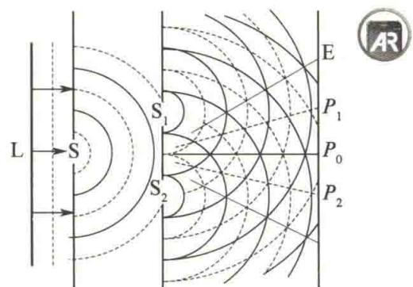
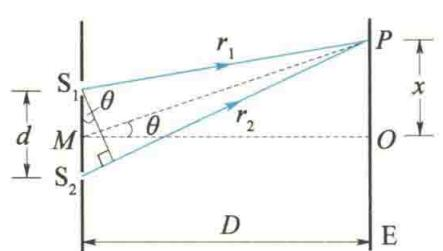
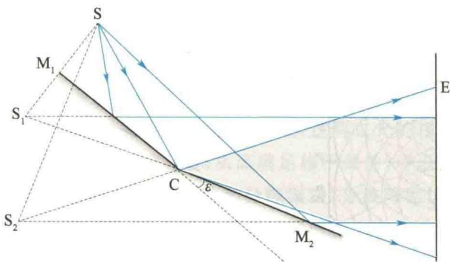
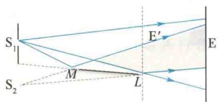

import QRCodeVideo from '@/components/QRCodeVideo.astro';

import Guide from '@/components/Guide.astro';
import Knowledge from '@/components/Knowledge.astro';
import Example from '@/components/Example.astro';
import Analysis from '@/components/Analysis.astro';
import Solution from '@/components/Solution.astro';
import Variant from '@/components/Variant.astro';
import Note from '@/components/Note.astro';
import Block from '@/components/Block.astro';
import Method from '@/components/Method.astro';
import Exercise from '@/components/Exercise.astro';

## 12.2.1 杨氏双缝干涉

1801年，托马斯·杨首先通过实验获得了两列相干的光波，观察到了光的干涉现象。如图12.4所示，在普通单色光源（如钠光灯）L前面先放置一个开有小孔S的屏，再放置一个开有两个相距很近的小孔 $S_{1}$ 和 $S_{2}$ 的屏，这样就可以在较远的屏幕E上观测到干涉图样。根据惠更斯原理，小孔S可看作发射球面波的点光源。如果 $S_{1}$ 、 $S_{2}$ 处于该球面波的同一波阵面上，则它们的相位永远相同。显然， $S_{1}$ 、 $S_{2}$ 是满足相干条件的两个相干点光源，由它们发出的子波将在相遇区域发生干涉。为了提高干涉条纹的亮度，后来，人们改用狭缝代替小孔 $S_{1}$ 、 $S_{2}$ ，即用柱面波代替球面波，这种实验就叫作双缝干涉实验。当激光问世以后，利用它的相干性好和亮度高的特性，直接用激光束照射双孔，便可在屏幕上获得清晰、明亮的干涉条纹。
下面对双缝干涉条纹的位置进行定量分析. 如图 12.5 所示, $S_{1}$ 与 $S_{2}$ 之间的距离为 $d$ , $S_{1}$ 、 $S_{2}$ 所在平面到屏幕 E 的距离为 $D$ , $MO$ 是 $S_{1}$ 、 $S_{2}$ 连线的中垂线. 在屏幕 E 上任取一点 $P$ , 设 $P$ 点到 $O$ 点的距离为 $x$ , $P$ 点到 $S_{1}$ 、 $S_{2}$ 的距离分别为 $r_{1}$ 、 $r_{2}$ , $\angle PMO = \theta$ . 在实验中, 一般 $D \gg d$ , $\theta$ 很小, 因此从 $S_{1}$ 与 $S_{2}$ 发出的光到达 $P$ 点的波程差为
$$
\delta = r _ {2} - r _ {1} \approx d \sin \theta \approx d \tan \theta = d \frac {x}{D}\tag{12.7}
$$
由干涉加强或干涉减弱的条件[式(6.52)和式(6.53)],有
$$
\delta = r _ {2} - r _ {1} = \left\{ \begin{array}{l l} \pm k \lambda & (k = 0, 1, 2, \dots) (\text {干涉加强}) \\ \pm (2 k - 1) \frac {\lambda}{2} & (k = 1, 2, 3, \dots) (\text {干涉减弱}) \end{array} \right.\tag{12.8}
$$
即 P 点到双缝的波程差为波长的整数倍时，P 点处将出现明条纹。其中 k 称为干涉级，k = 0 对应的明条纹称为零级明纹或中央明纹， $k = 1, 2, \cdots$ 对应的明条纹分别称为第 1 级明纹、第 2 级明纹……当 P 点到双缝的波程差为半波长的奇数倍时，P 点处出现暗条纹， $k = 1, 2, \cdots$ 对应的暗条纹分别称为第 1 级暗纹、第 2 级暗纹……波程差为其他值的各点，其光强介于明纹光强与暗纹光强之间。因此，可以在屏幕 E 上看到
<figure class="vp-figure">
  
  <figcaption>图 12.4 杨氏双缝干涉实验</figcaption>
</figure>
<figure class="vp-figure">
  
  <figcaption>图 12.5 干涉条纹计算用图</figcaption>
</figure>
明暗相间的稳定的干涉条纹.
将式 $(12.8)$ 代入式 $(12.7)$ ，可得明纹中心在屏幕上的位置为
$$
x = \pm k \frac {D}{d} \lambda (k = 0, 1, 2, \dots)\tag{12.9}
$$
暗纹中心的位置为
$$
x = \pm (2 k - 1) \frac {D}{d} \frac {\lambda}{2} \quad (k = 1, 2, 3, \dots)\tag{12.10}
$$
两相邻明纹或暗纹间的距离(条纹间距)均为
$$
\Delta x = x _ {k + 1} - x _ {k} = \frac {D}{d} \lambda\tag{12.11}
$$
由式(12.9)～式(12.11)可知，双缝干涉条纹有如下特点.
（1）屏幕上明暗条纹的位置，是对称分布于屏幕中心 O 点两侧且平行于狭缝的直条纹，明暗条纹交替排列.
(2) 相邻明纹和相邻暗纹的间距相等,与干涉级 k 无关. 条纹间距 $\Delta x$ 的大小与入射光的波长 $\lambda$ 及缝屏间距 D 成正比,与两缝间距 d 成反比.
因此，当 $D, d$ 一定时，用不同的单色光做实验，入射光的波长愈小，条纹愈密；波长愈大，条纹愈稀。如果用白光照射，则屏幕上除中央明纹因各单色光重合而显示白色外，其他各级由于各单色光出现明纹的位置不同，因此形成彩色条纹。此外，还可通过精确测量 $\Delta x$ 推算出单色光的波长 $\lambda$ 。
<QRCodeVideo title="菲涅耳" url="https://api.guangyiedu.com/v3/resource/resource/r/NewQrCode-FyfiS7wwtMfLqkpHRdFS" />  

## 12.2.2 其他分波阵面干涉装置

### 1. 菲涅耳双面镜

杨氏双缝干涉实验装置中的小孔或狭缝都很小，它们的边缘效应往往会对实验产生影响，使问题复杂化。后来，菲涅耳提出一种可使问题简化的获得相干光束的方法。如图12.6所示，一对紧靠在一起的夹角 $\varepsilon$ 很小的平面镜 $\mathrm{M}_1$ 和 $\mathrm{M}_2$ 构成菲涅耳双面镜，狭缝光源S与两镜面的交棱C平行，于是从光源S发出的光经 $\mathrm{M}_1$ 和 $\mathrm{M}_2$ 反射后成为两束相干光，在它们的重叠区域内的屏幕上就会出现等间距的平行干涉条纹。设 $\mathrm{S}_1$ 和 $\mathrm{S}_2$ 为S通过 $\mathrm{M}_1$ 和 $\mathrm{M}_2$ 所成的两个虚像，则屏幕上的干涉条纹就如同是由相干的虚光源 $\mathrm{S}_1$ 和 $\mathrm{S}_2$ 发出的光波所产生的，因此可利用杨氏双缝干涉实验的结果计算这里的明暗纹位置及条纹间距。
<figure class="vp-figure">
  
  <figcaption>图 12.6 菲涅耳双面镜实验原理</figcaption>
</figure>

### 2. 劳埃德镜

劳埃德（H. Lloyd）镜干涉实验原理如图 12.7 所示。从狭缝 $S_{1}$ 发出的光，一部分直接射向屏幕 E，另一部分以近 $90^{\circ}$ 的入射角掠射到镜面 ML 上，然后反射到屏幕 E 上。 $S_{2}$ 是 $S_{1}$ 在镜中的虚像，反射光可看成是虚光源 $S_{2}$ 发出的，它和 $S_{1}$ 构成一对相干光源，于是在屏上的叠加区域内出现明暗相间的等间距的干涉条纹。
<figure class="vp-figure">
  
  <figcaption>图 12.7 劳埃德镜干涉实验原理</figcaption>
</figure>
若将屏幕 E 放到镜端 L 处且与镜接触, 则在接触处屏幕 $E'$ 上出现的是暗纹. 这表明, 在该处由 $S_{1}$ 直接射到屏幕上的光和经镜面反射后的光相遇, 虽然两光的波程相同, 但相位相反. 这只能认为光从空气掠射 ( $i \approx 90^{\circ}$ ) 到镜面发生反射时, 反射光有相位 $\pi$ 的突变. 也就是说, 光从光疏介质 (折射率较小的介质) 掠射向光密介质 (折射率较大的介质) 界面而反射时, 会发生半波损失.
从劳埃德镜干涉实验和前面波动的叙述中,我们知道,入射光由光疏介质射向光密介质界面时,在掠射或正射 $(i\approx0)$ 两种情况下,都将在反射过程中产生半波损失.但光从光密介质射向光疏介质界面时,在反射过程中不产生半波损失,而且在任何情况下,透射光均没有半波损失.在一般情况下,光线倾斜地入射到两介质的界面时,反射光的相位变化是复杂的,它与界面两边介质的折射率及入射角有关,很难笼统地说是否有半波损失.

<Example title="例 12.1">
用单色光照射相距 0.4 mm 的双缝，缝、屏间距为 1 m。（1）从第 1 级明纹到同侧第 5 级明纹的距离为 6 mm，求此单色光的波长；（2）若入射的单色光是波长为 400 nm 的紫光，求相邻两明纹间的距离；（3）上述两种波长的光同时照射时，求两种波长的明纹第 1 次重合在屏幕上的位置，以及这两种波长的光从双缝到该位置的波程差。

<Solution title="解">
（1）由双缝干涉明纹条件 $x = \pm k\frac{D}{d}\lambda$ ，可得
$$
x = k _ {1} \frac {D}{d} \lambda_ {1} = k _ {2} \frac {D}{d} \lambda_ {2}
$$
$$
\Delta x _ {1 - 5} = x _ {5} - x _ {1} = \frac {D}{d} (k _ {5} - k _ {1}) \lambda
$$
即
$$
\frac {k _ {1}}{k _ {2}} = \frac {\lambda_ {2}}{\lambda_ {1}} = \frac {4 0 0}{6 0 0} = \frac {2}{3}
$$
得
$$
\begin{array}{r l} \lambda & = \frac {d}{D} \frac {\Delta x _ {1 - 5}}{(k _ {5} - k _ {1})} = \frac {4 \times 1 0 ^ {- 4} \times 6 \times 1 0 ^ {- 3}}{1 \times (5 - 1)} \mathrm{m} \\ & = 6. 0 \times 1 0 ^ {- 7} \mathrm{m(橙光)} \end{array}
$$
</Solution>
</Example>

由此可见，波长为 $400 \, nm$ 的紫光的第 3 级明纹与波长为 $600 \, nm$ 的橙光的第 2 级明纹第 1 次重合。重合的位置为
(2) 当 $\lambda = 400 \, nm$ 时, 相邻两明纹的间距为
$$
\begin{array}{r l} \Delta x & = \frac {D}{d} \lambda = \frac {1 \times 4 \times 1 0 ^ {- 7}}{4 \times 1 0 ^ {- 4}} \mathrm{m} = 1. 0 \times 1 0 ^ {- 3} \mathrm{m} \\ & = 1. 0 \mathrm{mm} \end{array}
$$
（3）设两种波长的光的明纹重合处到中央明纹的距离为 x，则有
$$
\begin{array}{r l} x & = k _ {1} \frac {D}{d} \lambda_ {1} = \frac {2 \times 1 \times 6 \times 1 0 ^ {- 7}}{4 \times 1 0 ^ {- 4}} \mathrm{m} \\ & = 3 \times 1 0 ^ {- 3} \mathrm{m} = 3 \mathrm{mm} \end{array}
$$
双缝到重合处的波程差为
$$
\delta = k _ {1} \lambda_ {1} = k _ {2} \lambda_ {2} = 1. 2 \times 1 0 ^ {- 6} \mathrm{m}
$$

