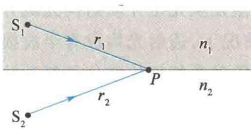
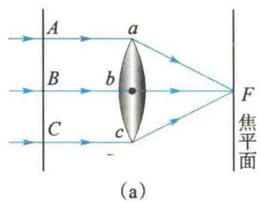
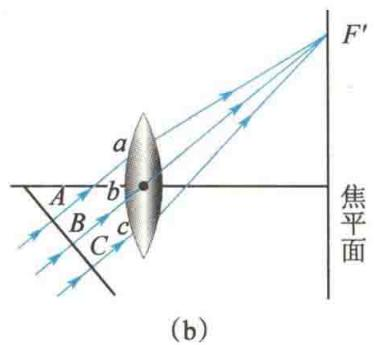
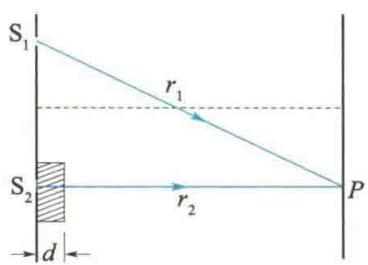

import Guide from '@/components/Guide.astro';
import Knowledge from '@/components/Knowledge.astro';
import Example from '@/components/Example.astro';
import Analysis from '@/components/Analysis.astro';
import Solution from '@/components/Solution.astro';
import Variant from '@/components/Variant.astro';
import Note from '@/components/Note.astro';
import Block from '@/components/Block.astro';
import Method from '@/components/Method.astro';
import Exercise from '@/components/Exercise.astro';

我们知道,干涉现象是否产生,取决于两束相干光的相位差.当两束相干光都在同一均匀介质中传播时,它们在相遇处叠加时的相位差仅取决于两束相干光间的几何路程之差.但是,当两束相干光通过不同的介质时,如光从空气透入薄膜,这时两束相干光间的相位差就不能单纯由它们的几何路程之差来确定.为此,引入光程与光程差的概念.

前面已经说过,不论单色光在何种介质中传播,其频率恒定不变,始终等于光源的频率 $\nu$ . 由波速、波长与频率的关系可知,若光在真空中的传播速度为 c, 则真空中的波长为 $\lambda = \frac{c}{\nu}$ . 而光在介质中的传播速度 $u = \frac{c}{n}$ , 所以它在介质中的波长为 $\lambda_{n} = \frac{u}{\nu} = \frac{c}{n\nu} = \frac{\lambda}{n}$ . 这表明, 光在折射率为 n 的介质中传播时, 其波长为真空中波长的 $\frac{1}{n}$ . 由于光每传播一个波长的距离, 相位变化为 $2\pi$ , 若光在介质中传播的几何路程为 r,

那么相应的相位变化为 $2\pi \frac{r}{\lambda_{n}} = \frac{2\pi}{\lambda} nr$ . 由此可见, 当光在不同的介质中传播时, 即使传播的几何路程相同, 相位的变化也是不同的.

  

光程和光程差

设从同相位的相干光源 $S_{1}$ 和 $S_{2}$ 发出的两相干光，分别在折射率为 $n_{1}$ 和 $n_{2}$ 的介质中传播，相遇点 P 与光源 $S_{1}$ 和 $S_{2}$ 的距离分别为 $r_{1}$ 和 $r_{2}$ ，如图 12.8 所示，则两光束到达 P 点时的相位变化之差为

图12.8 两相干光在不同介质中传播

$$

\Delta \varphi = \frac {2 \pi r _ {1}}{\lambda_ {n _ {1}}} - \frac {2 \pi r _ {2}}{\lambda_ {n _ {2}}} = \frac {2 \pi}{\lambda} (n _ {1} r _ {1} - n _ {2} r _ {2})\tag{12.12}

$$

式(12.12)表明,两相干光通过不同的介质时,决定其相位变化之差的因素有两个:一是两相干光经历的几何路程 $r_{1}$ 和 $r_{2}$ ;二是两相干光所经介质的性质,即折射率 $n_{1}$ 和 $n_{2}$ .我们把光在某一介质中所经过的几何路程r和该介质的折射率n的乘积nr叫作光程.当光经历几种不同的介质时,

$$

\mathrm{光程} = \sum n _ {i} r _ {i}\tag{12.13}

$$

在均匀介质中， $nr = \frac{c}{u} r = ct$ ，因此光程可认为是在相同的时间内，光在真空中通过的路程.引进光程的概念后，就可将光在介质中经过的路程折算为光在真空中的路程，这样便统一用真空中的波长 $\lambda$ 来比较两束光经历不同介质时所引起的相位改变.若用 $\Delta = (n_1r_1 - n_2r_2)$ 表示两束光到达 $P$ 点的光程差，则两束光在 $P$ 点的相位差为

$$

\Delta \varphi = \frac {2 \pi}{\lambda} \Delta\tag{12.14}

$$

这是考虑光的干涉问题时常用的一个基本关系式. 应该注意, 引进光程后, 不论光在什么介质中传播,式(12.14)中的 $\lambda$ 均是光在真空中的波长.此外,式(12.14)仅考虑了两束光经历不同介质、不同路程引起的相位差,如果两相干光源不是同相位的,则加上两相干光源的初相位差才是两束光在 P 点的相位差.

这样,对于两同相的相干光源发出的两相干光,其干涉条纹的明暗条件便可由两相干光的光程差 $\Delta$ 决定,即

$$

\Delta = \left\{ \begin{array}{l l} \pm k \lambda & (k = 0, 1, 2, \dots) (\text {干涉加强，明纹}) \\ \pm (2 k + 1) \frac {\lambda}{2} & (k = 0, 1, 2, \dots) (\text {干涉减弱，暗纹}) \end{array} \right.\tag{12.15}

$$

在观察干涉、衍射现象时,经常要用到透镜.不同光线通过透镜可改变传播方向,那么会不会引起附加光程差呢?

我们知道,平行光通过薄透镜后,将会聚在透镜的焦平面的焦点F上,形成一个亮点.这一事实说明,平行光波面上各点(见图12.9中A、B、C各点)的相位相同,它们到达焦平面上的会聚点 $F(\text{或} F')$ 后,相位仍然相同,因而相互加强形成亮点.这就是说,从A、B、C各点到 $F(\text{或} F')$ 点的光程都是相等的,即平行光束通过透镜后不会引起附加光程差.这一等光程性可作如下解释:虽然光线AaF比光线BbF经过的几何路程长,但BbF在透镜中经过的路程比AaF的长,由于透镜的折射率大于空气的折射率,所以折算成光程后,AaF的光程与BbF的光程相等.

  

图 12.9 平行光通过透镜后各光线的光程相等

<Example title="例 12.2">
在杨氏双缝干涉实验中，入射光的波长为 $\lambda$ ，若在 $S_{2}$ 缝处放置一片厚度为 d、折射率为 n 的透明介质，则原来的零级明纹将如何移动？如果观测到零级明纹移到了原来的第 k 级明纹处，求该透明介质的厚度 d.

<Solution title="解">
如图 12.10 所示, 有透明介质时, 从 $S_{1}$ 和 $S_{2}$ 射出的光到达观测点 P 的光程差为

  

图12.10 例12.2图

$$

\Delta = (r _ {2} - d + n d) - r _ {1}

$$

零级明纹处 $\Delta = 0$ ，故该位置应满足

$$

r _ {2} - r _ {1} = - (n - 1) d <   0\tag{①}

$$

与原来零级明纹位置所满足的 $r_2 - r_1 = 0$ 相比可知，在 $\mathrm{S}_2$ 前有介质时，零级明纹应该下移.

$S_{2}$ 处没有介质时第 k 级明纹的位置满足

$$

r _ {2} - r _ {1} = k \lambda (k = 0, \pm 1, \pm 2, \dots)\tag{②}

$$

按题意,观测到零级明纹移到了原来的第 k 级明纹处,于是式①和式②必须同时得到满足,由此可解得

$$

d = \frac {- k \lambda}{n - 1}

$$

其中 $k$ 为负整数. 上式也可理解为: 插入透明介质使屏幕上的干涉条纹移动了 $|k| = (n - 1)d / \lambda$ 条. 这也提供了一种测量透明介质折射率的方法.

</Solution>
</Example>
