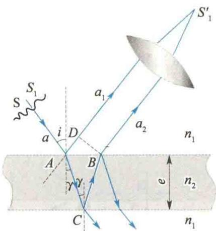
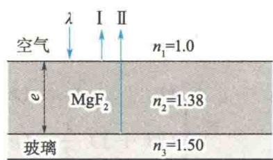

import QRCodeVideo from '@/components/QRCodeVideo.astro';

import Guide from '@/components/Guide.astro';
import Knowledge from '@/components/Knowledge.astro';
import Example from '@/components/Example.astro';
import Analysis from '@/components/Analysis.astro';
import Solution from '@/components/Solution.astro';
import Variant from '@/components/Variant.astro';
import Note from '@/components/Note.astro';
import Block from '@/components/Block.astro';
import Method from '@/components/Method.astro';
import Exercise from '@/components/Exercise.astro';

薄膜干涉现象在日常生活和生产技术中都经常见到,如马路上的油膜在雨后日光的照射下呈现的彩色条纹,高级照相机镜面上呈现的彩色花纹等都是日光的薄膜干涉图样.

## 12.4.1 薄膜干涉

下面讨论光线入射在厚度均匀的薄膜上产生的干涉现象. 如图 12.11 所示, 在折射率为 $n_1$ 的均匀介质中, 有一折射率为 $n_2$ 的平行平面透明介质薄膜 (厚度为 $e$ ). 设 $n_2 > n_1$ , 从单色扩展光源 (或面光源) S 上的 $S_1$ 发光点发出一条光线 $a$ , 以入射角 $i$ 投射到薄膜上的 $A$ 点, 这时, 光线 $a$ 将分成两部分, 一部分在 $A$ 点反射, 成为反射光线 $a_1$ , 另一部分则以折射角 $\gamma$ 射入薄膜内, 经下表面 $C$ 点反射后到达 $B$ 点, 再经过上表面透射回原介质成为光线 $a_2$ . 这两条光线因出自光源中的同一点 $S_1$ , 所以它们是相干光. 它们的能量也是从同一条入射光线 $a$ 发出来的. 由于波的能量与振幅有关, 这种产生相
  
图 12.11 薄膜的干涉
<QRCodeVideo title="等厚干涉的光程差及应用" url="https://api.guangyiedu.com/v3/resource/resource/r/NewQrCode-hAY9HCD5mtkbv5DDnDuH" />  
干光的方法又叫作分振幅法. 下面用光程差来分析薄膜干涉的加强和减弱条件.
光线 a 从 A 点开始分成两条光线 $a_{1}$ 和 $a_{2}$ ，且光线 $a_{1}$ 从 D 点以后和光线 $a_{2}$ 从 B 点以后是等光程的，因此两条光线的光程差为
$$
\Delta = n _ {2} (A C + C B) - n _ {1} A D + \frac {\lambda}{2}\tag{12.16}
$$
式中， $\frac{\lambda}{2}$ 是两条光线在上表面反射时因半波损失而产生的附加光程差.
由图12.11可见
$$
\begin{array}{r l} & A C = C B = \frac {e}{\cos \gamma} \\ & A D = A B \sin i = 2 e \tan \gamma \sin i \end{array}
$$
结合折射定律
$$
n _ {1} \sin i = n _ {2} \sin \gamma
$$
得
$$
\begin{array}{r l} \Delta & = 2 n _ {2} \frac {e}{\cos \gamma} - 2 n _ {1} e \tan \gamma \sin i + \frac {\lambda}{2} = \frac {2 n _ {2} e}{\cos \gamma} (1 - \sin^ {2} \gamma) + \frac {\lambda}{2} \\ & = 2 n _ {2} e \cos \gamma + \frac {\lambda}{2} = 2 e \sqrt {n _ {2} ^ {2} - n _ {1} ^ {2} \sin^ {2} i} + \frac {\lambda}{2} \end{array}
$$
于是，决定 $a_1$ 和 $a_2$ 两条光线的会聚点 $S_1'$ 是明还是暗的干涉条件为
$$
\begin{array}{r l} \Delta & = 2 e \sqrt {n _ {2} ^ {2} - n _ {1} ^ {2} \sin^ {2} i} + \frac {\lambda}{2} \\ & = \left\{ \begin{array}{l l} k \lambda & (k = 1, 2, 3, \dots) (\text {干涉加强，明纹}) \\ (2 k + 1) \frac {\lambda}{2} & (k = 0, 1, 2, \dots) (\text {干涉减弱，暗纹}) \end{array} \right. \end{array}\tag{12.17}
$$
同理，在透射光中也有干涉现象，式(12.17)对透射光仍然适用。但应注意：透射光之间的附加光程差与反射光之间的附加光程差产生的条件恰好相反，当反射光之间有 $\frac{\lambda}{2}$ 的附加光程差时，透射光之间没有附加光程差；反之，当反射光之间没有附加光程差时，透射光之间却有 $\frac{\lambda}{2}$ 的附加光程差。因此对同样的入射光来说，当反射方向干涉加强时，透射方向干涉减弱，反之亦然。
从光程差 $\Delta = 2e\sqrt{n_2^2 - n_1^2\sin^2i} + \frac{\lambda}{2}$ 可见，对于厚度均匀的薄膜（ $e$ 处处相等），光程差随入射光线的倾角 $i$ 变化。因此，不同的干涉明纹和暗纹相应地具有不同的倾角，而同一干涉条纹上的各点都具有相同的倾角。在厚度均匀的薄膜上产生的这种干涉条纹叫作等倾干涉条纹。

## 12.4.2 增透膜与增反膜

利用薄膜干涉可以测定薄膜的厚度或波长, 除此之外, 还可用以提高光学仪器的透射率或反射本领. 一般说来, 光射到光学元件表面时, 其能量要分成反射与透射两部分, 因此透射过来的光能(光强)或反射出的光能都比原光能少. 例如, 一个由6个透镜组成的高级照相机, 因光的反射而损失的能量占一半左右. 在现代光学仪器中, 为了减少光能在光学元件的玻璃表面上的反射损失, 常在玻璃表面上镀一层均匀的氟化镁( $\mathrm{MgF_{2}}$ )等材料的透明薄膜, 以增强其透射率. 这种能使透射增强的薄膜叫作增透膜.
但是，在有些光学系统中，却要求某些光学元件具有较高的反射本领。例如，激光器中的反射镜要求对某种频率的单色光的反射率在 $99\%$ 以上，为了增强反射能量，常在玻璃表面镀一层高反射率的透明薄膜，使薄膜上、下表面反射光的光程差满足干涉加强的条件，从而使反射光增强。这种薄膜叫作增反膜。由于反射光能量约占入射光能量的 $5\%$ ，为了达到提高反射率的目的，常在玻璃表面交替镀上折射率高低不同的多层介质膜，一般镀13层，有的高达15层、17层，宇航员佩戴的头盔和面甲上都镀有对红外线具有高反射率的多层膜，以屏蔽宇宙空间中极强的红外线照射。

<Example title="例 12.3">
在一光学元件的玻璃(折射率 $n_{3}=1.50$ ) 表面镀一层厚度为 e、折射率为 $n_{2}=1.38$ 的 $MgF_{2}$ 薄膜, 为了使入射白光中对人眼最敏感的黄绿光 ( $\lambda=550\ nm$ ) 的反射率最小, 试求 $MgF_{2}$ 薄膜的最小厚度.

<Solution title="解">
如图 12.12 所示, 由于 $n_{1} < n_{2} < n_{3}$ , $MgF_{2}$ 薄膜的上、下表面反射的 I、II 两光均有半波损失. 设光线垂直入射 (i = 0), 则 I、II 两光的光程差为
$$
\Delta = \left(2 n _ {2} e + \frac {\lambda}{2}\right) - \frac {\lambda}{2} = 2 n _ {2} e
$$
要使黄绿光的反射率最小, 即 I、II 两光发生干涉加强, 于是
$$
\Delta = 2 n _ {2} e = (2 k + 1) \frac {\lambda}{2} \quad (k = 0, 1, 2, \dots)
$$
应控制 $\mathrm{MgF_2}$ 薄膜的厚度为
$$
e = \frac {(2 k + 1) \lambda}{4 n _ {2}} (k = 0, 1, 2, \dots)
$$
其中， $\mathrm{MgF_2}$ 薄膜的最小厚度 $(k = 0)$ 为
$$
e _ {\mathrm{min}} = \frac {\lambda}{4 n _ {2}} = \frac {5 5 0 \mathrm{nm}}{4 \times 1 . 3 8} \approx 1 0 0 \mathrm{nm} = 0. 1 \mu \mathrm{m}
$$
  
图12.12 增透膜

</Solution>
</Example>
