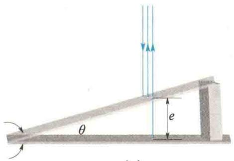
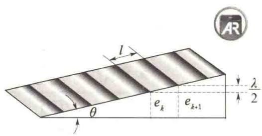
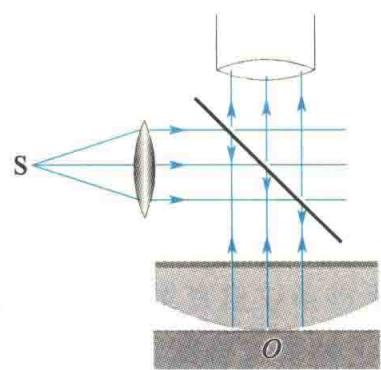
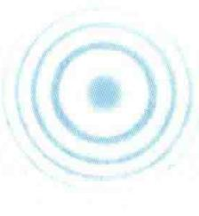
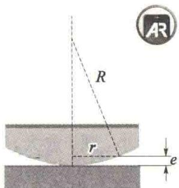
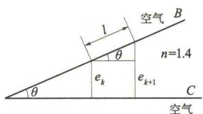
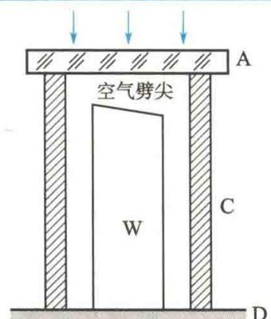
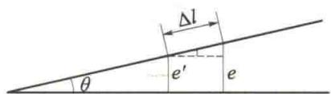

import Guide from '@/components/Guide.astro';
import Knowledge from '@/components/Knowledge.astro';
import Example from '@/components/Example.astro';
import Analysis from '@/components/Analysis.astro';
import Solution from '@/components/Solution.astro';
import Variant from '@/components/Variant.astro';
import Note from '@/components/Note.astro';
import Block from '@/components/Block.astro';
import Method from '@/components/Method.astro';
import Exercise from '@/components/Exercise.astro';

本节讨论光线入射在厚度不均匀的薄膜上所产生的干涉现象,其干涉条纹称为等厚干涉条纹.

## 12.5.1 劈尖干涉

将两块平板玻璃的一端叠合，在另一端垫入一薄纸片或一细丝，如图12.13(a)所示，则在两块平板玻璃间形成一端薄、一端厚的空气膜，这是一个劈尖形的空气膜，叫作空气劈尖。空气膜的两个表面为两块平板玻璃的内表面。两块平板玻璃叠合端的交线称为棱边，其夹角 $\theta$ 称为劈尖楔角。在平行于棱边的直线上的各点，空气膜的厚度 $e$ 是相等的。

中国物理学家

当平行单色光垂直照射底面的平板玻璃时,就可在空气劈尖表面观察到明暗相间的干涉条纹.这是由空气膜的上、下表面反射出来的两列光波干涉形成的.

考虑空气膜的厚度为 e 处，由上、下表面反射的两相干光的光程差为

$$

\Delta = 2 e + \frac {\lambda}{2}\tag{12.18}

$$

严济慈

式中， $\frac{\lambda}{2}$ 为光在空气膜的下表面反射时的半波损失。于是两表面反射光的干涉条件为

$$

\Delta = \left\{ \begin{array}{l l} 2 e + \frac {\lambda}{2} = k \lambda & (k = 1, 2, 3, \dots) (\text {明纹}) \\ 2 e + \frac {\lambda}{2} = (2 k + 1) \frac {\lambda}{2} & (k = 0, 1, 2, \dots) (\text {暗纹}) \end{array} \right.\tag{12.19}

$$

由此可见，凡是空气劈尖上厚度相同的地方，两反射光的光程差都相等，都与一定的明纹或暗纹的 $k$ 值相对应。因此这些条纹叫作等厚干涉条纹。这样的干涉称为等厚干涉。

如果平板玻璃的表面是严格的几何平面,即劈尖的表面是严格的平面,则平行于棱边的直线上的各点,其空气膜的厚度都相同,由式(12.18)可知,两相干光的光程差也一样,所以从式(12.19)可知,干涉条纹是平行于棱边的一系列明暗相间的直条纹,如图12.13(b)所示.如果平板玻璃的表面不平整,则干涉条纹将在凹凸不平处发生弯曲,由此可以检验平板玻璃是否平整.此外,在两块平板玻璃的接触处,e=0,两反射光的光程差为 $\frac{\lambda}{2}$ ,所以棱边处应为暗纹,事实正是如此.

  

(a)

  

(b)

  

图12.13 劈尖干涉

在劈尖干涉的直条纹中,任何两条相邻明纹或暗纹之间的距离 l 都是相同的,即条纹间距相等,这是因为

$$

l \sin \theta = e _ {k + 1} - e _ {k} = \frac {1}{2} (k + 1) \lambda - \frac {1}{2} k \lambda = \frac {\lambda}{2}\tag{12.20}

$$

式(12.20)说明,当一定波长的单色光入射时,劈尖的干涉条纹间距l仅与楔角θ有关.θ愈小,则l愈大,干涉条纹愈稀疏;θ愈大,则l愈小,干涉条纹愈密集.因此,应使θ较小,这时可在劈尖上方观察到清晰的干涉条纹;否则,干涉条纹将密得无法分辨.式(12.20)还说明,任何两相邻明纹或暗纹之间的空气膜的厚度差为 $\frac{\lambda}{2}$ .所以,在某处的空气膜厚度改变 $\frac{\lambda}{2}$ 的过程中,将观察到该处干涉条纹由亮逐渐变暗后又逐渐变亮(或由暗逐渐变亮后又逐渐变暗),好像干涉条纹移动了一条.若观察到干涉条纹移动了N条,则该处空气膜的厚度将改变 $N\frac{\lambda}{2}$ .干涉膨胀仪可测量样品微小长度的变化就是根据的这一原理.

如果构成劈尖的介质膜不是空气,而是其他透明物质(如液体、二氧化硅晶体等),其上、下表面两反射光的光程差的计算方法与上述方法类同,但附加光程差的计算方法应具体问题具体分析.

## 12.5.2 牛顿环

将一曲率半径相当大的平凸透镜叠放在一平板玻璃上,如图12.14(a)或(c)所示,则在透镜与平板玻璃之间形成一个上表面为球面、下表面为平面的空气膜.当平行单色光垂直照射时,由于空气膜上、下表面的两反射光发生干涉,在空气膜的上表面可以观察到以接触点O为中心的明暗相间的环形干涉条纹,如图12.14(b)所示.若用白光照射,则条纹呈彩色.这些环形干涉条纹叫作牛顿环,它是等厚条纹的一个特例.

根据前面的分析方法,可求出各环形明、暗纹的半径 r、波长 $\lambda$ 及透镜的曲率半径 R 三者之间的关系.在空气膜的任意厚度 e 处,上、下表面的反射光的相干条件为

$$

2 e + \frac {\lambda}{2} = \left\{ \begin{array}{l l} k \lambda & (k = 1, 2, 3, \dots) (\text {明纹}) \\ (2 k + 1) \frac {\lambda}{2} & (k = 0, 1, 2, \dots) (\text {暗纹}) \end{array} \right.\tag{12.21}

$$

由图12.14(c)可得

$$

r ^ {2} = R ^ {2} - (R - e) ^ {2} = 2 e R - e ^ {2}

$$

因 $R \gg e$ ，可略去 $e^2$ 项，于是

$$

e = \frac {r ^ {2}}{2 R}

$$

代入式(12.21)，可得干涉明、暗纹的半径分别为

  

牛顿环的条纹公式

$$

r _ {\text { 明 }} = \sqrt {\frac {(2 k - 1) R \lambda}{2}} \quad (k = 1, 2, 3, \dots)\tag{12.22}

$$

$$

r _ {\mathrm{暗}} = \sqrt {k R \lambda} \quad (k = 0, 1, 2, \dots)\tag{12.23}

$$

式(12.22)和式(12.23)表明，k值越大，环形条纹的半径越大，但相邻环形明纹（或暗纹）的半径之差越小，即随着牛顿环半径的增大，环形条纹变得愈来愈密.

  

全息照相

  

(a)

  

(b)

  

(c)  

图12.14 牛顿环

在透镜与平板玻璃的接触点 $O$ 处，因为 $e = 0$ ，两反射光的光程差为 $\frac{\lambda}{2}$ 所以牛顿环的中心是一个暗斑（因实际接触处不可能是点而是圆面）。实际测量平凸透镜的曲率半径 $R$ 的方法是分别测出两个环形暗纹的半径 $r_k$ 和 $r_{k + m}$ ，代入式(12.23)后，即可联立解出

$$

R = \frac {r _ {k + m} ^ {2} - r _ {k} ^ {2}}{m \lambda}\tag{12.24}

$$

本节介绍的两种干涉现象,在透射光中也可以观察到.但透射光干涉的明、暗纹条件恰好与反射光相反.所以,在牛顿环中用透射光观察时,中心处为一亮斑.

<Example title="例 12.4">
利用劈尖干涉可以测量微小角度. 如图 12.15 所示, 用某单色光垂直照射折射率 $n = 1.4$ 的劈尖, 测得两相邻明纹之间的距离是 $l = 0.25 \mathrm{~cm}$ . 已知单色光在空气中的波长 $\lambda = 700 \mathrm{~nm}$ , 求劈尖的顶角 $\theta$ .

<Solution title="解">
在劈尖的表面上(见图 12.15) 取第 k 级和第 $k+1$ 级两条明纹, 用 $e_{k}$ 和 $e_{k+1}$ 分别表示这两条明纹所在处空气膜的厚度. 按明纹出现的条件, $e_{k}$ 和 $e_{k+1}$ 应满足下列两式:

$$

2 n e _ {k} + \frac {\lambda}{2} = k \lambda

$$

$$

2 n e _ {k + 1} + \frac {\lambda}{2} = (k + 1) \lambda

$$

  

图12.15 劈尖

两式相减，得

$$

n (e _ {k + 1} - e _ {k}) = \frac {\lambda}{2}

$$

$$

e _ {k + 1} - e _ {k} = \frac {\lambda}{2 n}\tag{①}

$$

②

由图12.15可见， $(e_{k + 1} - e_k)$ 与两相邻明纹的间隔 $l$ 之间的关系为

$$

\sin \theta = \frac {\lambda}{2 n l}

$$

$$

l \sin \theta = e _ {k + 1} - e _ {k}

$$

将 $n = 1.4, l = 0.25 \mathrm{~cm}, \lambda = 7 \times 10^{-5} \mathrm{~cm}$ 代入式②，得

$$

\sin \theta = \frac {\lambda}{2 n l} = \frac {7 \times 1 0 ^ {- 5} \mathrm{cm}}{2 \times 1 . 4 \times 0 . 2 5 \mathrm{cm}} = 1 0 ^ {- 4}

$$

代入式 ①, 得

因为 $\sin \theta$ 很小，所以 $\theta \approx \sin \theta = 10^{-4}$ rad.
</Solution>
</Example>

<Example title="例 12.5">
用干涉膨胀仪可测定固体的热膨胀系数，干涉膨胀仪的结构如图12.16所示。在平台D上放置一上表面稍微倾斜的待测样品W，在W外套一个热膨胀系数很小的用石英制成的圆环C，环顶上放一平板玻璃A，它与样品的上表面构成一空气劈尖。以波长为 $\lambda$ 的单色光自A板垂直入射在该空气劈尖上，产生等厚干涉条纹。当样品受热膨胀时（不计圆环C的膨胀），劈尖的下表面位置上升，使干涉条纹移动。设温度为 $t_0$ 时，样品的高度为 $L_{0}$ ，温度升高到 $t$ 时，样品的高度增为 $L$ 。在此过程中，相对视场中某一刻线移动的条纹数目为 $N$ 。求样品的热膨胀系数 $\beta$ 。

  

图12.16 干涉膨胀仪的结构

<Solution title="解">
在劈尖干涉的等厚干涉条纹中, 设温度为 $t_{0}$ 时, 第 k 级暗纹所在处的空气膜的厚度为

在劈尖干涉的等厚干涉条纹中, 设温度为 $t_{0}$ 两温度下该处空气膜的厚度差为

$$

e _ {k} = k \frac {\lambda}{2}

$$

$$

L - L _ {0} = e _ {k} - e _ {k - N} = N \frac {\lambda}{2}

$$

由题意，得

温度升高到 t 时, 同一处的空气膜的厚度变为

$$

\beta = \frac {L - L _ {0}}{L _ {0}} \cdot \frac {1}{t - t _ {0}} = \frac {N \lambda}{2 L _ {0} (t - t _ {0})}

$$

$$

e _ {k - N} = (k - N) \frac {\lambda}{2}

$$
</Solution>
</Example>

<Example title="例 12.6">
如图 12.17 所示, 由两块平板玻璃构成一空气劈尖, 劈尖楔角为 $\theta = 5.0 \times 10^{-5}$ rad, 用波长 $\lambda = 0.5 \mu m$ 的平行单色光垂直照射该空气劈尖, 在空气劈尖的上方观察空气劈尖表面上的等厚干涉条纹.

(1) 若将下面的平板玻璃向下平移, 看到有 15 条条纹移过, 求平板玻璃下移的距离;

(2) 若向空气劈尖中注入某种液体, 看到第 5 级明纹在空气劈尖上移动了 0.5 cm, 求液体的折射率.

  

图 12.17 空气劈尖

<Solution title="解">
（1）空气劈尖下面的平板玻璃向下平移，但劈尖楔角保持不变，使空气劈尖表面上的等厚干涉条纹（平行于空气劈尖棱边的一些等间距的直线段）整个向棱边方向移动（条纹间距不变）.

设原来第 k 级明纹处空气劈尖的厚度为 $e_{1}$ ，光垂直入射时，劈尖干涉的明纹条件（有半波损失）为

$$

2 e _ {1} + \frac {\lambda}{2} = k \lambda

$$

将下面的平板玻璃向下平移后,原来的第 k 级明纹处变成第 $k + 15$ 级明纹处,该处的厚度由 $e_{1}$ 变成 $e_{2}$ ,由干涉条件,有

$$

2 e _ {2} + \frac {\lambda}{2} = (k + 1 5) \lambda

$$

两式相减，得

$$

e _ {2} - e _ {1} = \frac {1 5 \lambda}{2} = \frac {1 5 \times 0 . 5}{2} \mu \mathrm{m} = 3. 7 5 \mu \mathrm{m}

$$

即为平板玻璃向下平移的距离.

(2) 平板玻璃不动, 在空气劈尖中注入某种液体时, 空气劈尖上的条纹也发生移动 (也向棱边方向移动, 条纹间距也发生变化). 未加液体时, 第 5 级明纹在厚度 e 处, 满足

$$

2 e + \frac {\lambda}{2} = 5 \lambda

$$
</Solution>
</Example>

<Note>
入液体(设折射率为 n) 后, 第 5 级明纹移至厚度为 $e'$ 处, 满足

$$

2 n e ^ {\prime} + \frac {\lambda}{2} = 5 \lambda

$$

两式相减，得

$$

e ^ {\prime} = \frac {e}{n}

$$

由几何关系可知,条纹在空气劈尖上移动的距离为

$$

\Delta l = \frac {e - e ^ {\prime}}{\theta} = \frac {e - \frac {e}{n}}{\theta} = \frac {n - 1}{n \theta} e

$$

由 $2e + \frac{\lambda}{2} = 5\lambda$ ，得

$$

\begin{array}{r l} e & = \frac {1}{2} \times \left(5 - \frac {1}{2}\right) \lambda = \frac {1}{2} \times \frac {9}{2} \times 0. 5 \mu \mathrm{m} \\ & = 1. 1 2 5 \mu \mathrm{m} \end{array}

$$

则液体的折射率为

$$

\begin{array}{r l} n & = \frac {e}{e - \theta \Delta l} \\ & = \frac {1 . 1 2 5 \times 1 0 ^ {- 6}}{1 . 1 2 5 \times 1 0 ^ {- 6} - 5 . 0 \times 1 0 ^ {- 5} \times 0 . 5 \times 1 0 ^ {- 2}} \\ & = 1. 2 9 \end{array}

$$
</Note>

<Example title="例 12.7">
在牛顿环实验中,透镜的曲率半径为 $5.0 \, m$ , 圆平面的直径为 $2.0 \, cm$ .

(1) 用波长 $\lambda = 589.3 \, nm$ 的单色光垂直照射时, 可看到多少条干涉条纹?

(2) 若在空气膜中注入折射率为 n 的液体, 可看到 46 条明纹, 求液体的折射率.

解（1）由牛顿环的明纹半径公式

$$

r = \sqrt {\frac {(2 k - 1)}{2} R \lambda}

$$

$$

r = \sqrt {\frac {(2 k - 1) R \lambda}{2 n}}

$$

可见条纹级次越高，条纹半径越大，由上式得

$$

\begin{array}{r l} k & = \frac {r ^ {2}}{R \lambda} + \frac {1}{2} = \frac {(1 . 0 \times 1 0 ^ {- 2}) ^ {2}}{5 \times 5 . 8 9 3 \times 1 0 ^ {- 7}} + \frac {1}{2} \\ & = 3 4. 4 \end{array}

$$

故

可看到 34 条干涉条纹.

(2) 若在空气膜中注入液体, 则明纹的半径为

$$

\begin{array}{r l} n & = \frac {(2 k - 1) R \lambda}{2 r ^ {2}} \\ & = \frac {(2 \times 4 6 - 1) \times 5 \times 5 . 8 9 3 \times 1 0 ^ {- 7}}{2 \times (1 . 0 \times 1 0 ^ {- 2}) ^ {2}} \\ & = 1. 3 4 \end{array}

$$

可见在空气膜中注入液体后，干涉条纹将变密.
</Example>
