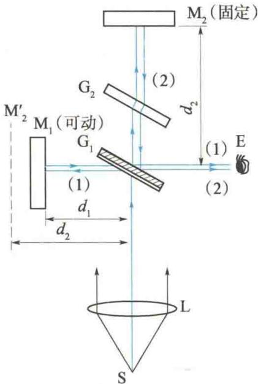
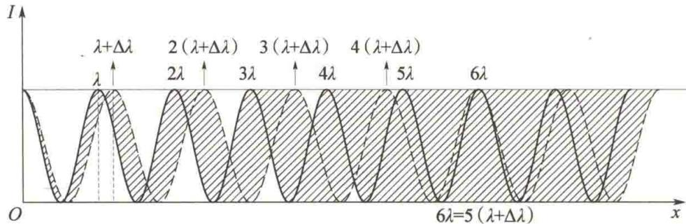
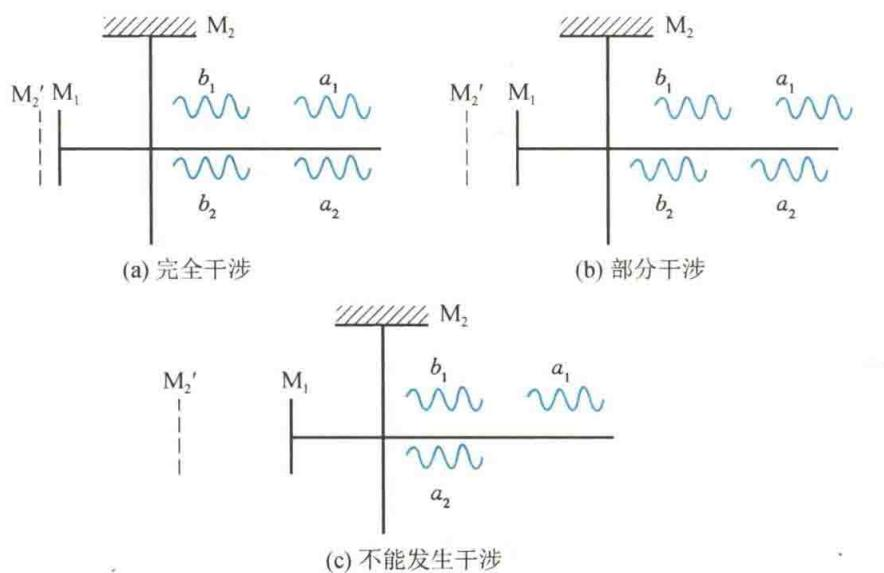

import Guide from '@/components/Guide.astro';
import Knowledge from '@/components/Knowledge.astro';
import Example from '@/components/Example.astro';
import Analysis from '@/components/Analysis.astro';
import Solution from '@/components/Solution.astro';
import Variant from '@/components/Variant.astro';
import Note from '@/components/Note.astro';
import Block from '@/components/Block.astro';
import Method from '@/components/Method.astro';
import Exercise from '@/components/Exercise.astro';

## 12.6.1 迈克耳孙干涉仪

  

迈克耳孙

在现代科学技术中,广泛应用干涉原理来测量微小长度、角度等,迈克耳孙干涉仪就是一种典型的精密测量仪器.它的构造和原理如图12.18所示.

$M_{1}$ 和 $M_{2}$ 是两块精细磨光的平面镜，分别装置在相互垂直的两臂上，其中 $M_{2}$ 是固定的， $M_{1}$ 由一螺钉控制，可在导轨上做微小移动。 $G_{1}$ 和 $G_{2}$ 是两块材料相同、厚度一样的玻璃片，均与两臂倾斜成 $45^{\circ}$ 角，其中 $G_{1}$ 的一个面上镀有半透明的薄银层，其作用是使入射到 $G_{1}$ 的光束一半反射，一半透过，因此 $G_{1}$ 称为分光板。

来自光源 S 的光束穿过透镜 L 后, 变成平行光射向 $G_{1}$ , 进入 $G_{1}$ 的光线在薄银层上分成两束, 一束在薄银层上反射后向 $M_{1}$ 传播, 用 (1) 表示, 经 $M_{1}$ 反射后, 再穿过 $G_{1}$ 进入观测者的眼睛 E. 另一束则透过薄银层及 $G_{2}$ 向 $M_{2}$ 传播, 用 (2) 表示, 经 $M_{2}$ 反射后再次穿过 $G_{2}$ 后由 $G_{1}$ 的薄银层反射也进入观测者的眼睛. 显然, 进入观测者的眼睛的光束 (1) 和 (2) 是

  

图12.18 迈克耳孙干涉仪的构造和原理

两相干光束,于是观测者可观察到干涉条纹. $G_{2}$ 的作用是使光束(2)与光束(1)一样,穿过玻璃片三次,这样可以避免两光束因在玻璃片中经过的路程不等而引起较大的光程差.因此, $G_{2}$ 又称为光程补偿片.

设想薄银层所形成的 $M_{2}$ 的虚像是 $M_{2}^{\prime}$ ，此时从 $M_{2}$ 处反射的光束可以看成是从虚像 $M_{2}^{\prime}$ 发出来的，于是在 $M_{2}^{\prime}$ 和 $M_{1}$ 之间就形成一个空气膜，从空气膜的两个表面 $M_{1}$ 和 $M_{2}^{\prime}$ 反射的光束（1）和（2）的干涉，就可当作薄膜干涉来处理。如果 $M_{1}$ 和 $M_{2}$ 不是严格相互垂直的，则 $M_{2}^{\prime}$ 与 $M_{1}$ 之间的空气膜就是劈尖状，形成的干涉条纹近似为平行的等厚条纹；若 $M_{1}$ 与 $M_{2}$ 严格相互垂直，则干涉条纹为一系列同心圆环状的等倾条纹。

根据劈尖干涉的理论, 当调节 $M_{1}$ 向前或向后平移 $\frac{\lambda}{2}$ 距离时 (空气膜的厚度变化 $\frac{\lambda}{2}$ ), 可观察到干涉条纹平移了一条. 因此, 数一数在视场中移动的条纹的数目 $\Delta N$ , 便可知 $M_{1}$ 移动的距离为

$$

\Delta d = \Delta N \frac {\lambda}{2}\tag{12.25}

$$

这表明,根据条纹的移动数 $\Delta N$ 和单色光的波长 $\lambda$ ,便可算出 $M_{1}$ 移动的距离.利用此原理可测量微小长度的变化,其精确度可达 $\frac{\lambda}{2} \sim \frac{\lambda}{200}$ ,比一般方法的精确度高得多.此外,也可根据 $M_{1}$ 移动的距离测定光波的波长.

<Example title="例 12.8">
在迈克耳孙干涉仪的两臂中分别放入长 10 cm 的玻璃管, 将一个抽成真空, 将另一个充以一个标准大气压的空气. 设所用光波的波长为 546 nm, 在向真空玻璃管中逐渐充入一个标准大气压空气的过程中, 观察到有 107.2 条条纹移动. 试求空气的折射率 n.

<Solution title="解">
设玻璃管分别为 A 和 B, 其长度均为 l, 当玻璃管 A 内为真空, 玻璃管 B 内充有空气时, 两臂之间的光程差为 $\Delta_{1}$ ; 在玻璃管 A 内充入空气后, 两臂之间的光程差为 $\Delta_{2}$ , 其变化量为

$$

\Delta_ {2} - \Delta_ {1} = 2 n l - 2 l = 2 (n - 1) l

$$

一个波长,故移动 107.2 条条纹时,对应的光程差的变化量为

由于条纹每移动一条时所对应的光程差的变化量为

$$

2 (n - 1) l = 1 0 7. 2 \lambda

$$

因此，空气的折射率为

$$

n = 1 + \frac {1 0 7 . 2 \lambda}{2 l} = 1. 0 0 0 2 9 2 7

$$
</Solution>
</Example>

## \*12.6.2 光源的非单色性对干涉条纹的影响(光场的时间相干性)

严格的单色光是具有确定的频率和波长的简谐波. 然而, 任何实际光源都不是理想的单色光源, 它们所发出的光总是处在一定的波长范围 $\Delta \lambda$ 内. 由于 $\Delta \lambda$ 范围内的每一个波长的光均形成各自的一套干涉条纹, 且除零级以外各套条纹间都有一定的位移, 因此它们非相干叠加的结果会使总的干涉条纹的清晰度下降. 如图 12.19 所示, 随着 $x$ 的增大, 干涉条纹的明暗对比减小, 当 $x$ 增大到某一值后, 干涉条纹就消失了. 对于谱线宽度为 $\Delta \lambda$ 的单色光, 干涉条纹消失的位置应当是, 波长为 $(\lambda + \Delta \lambda)$ 的第 $k_{\mathrm{c}}$ 级明纹中心与波长为 $\lambda$ 的第 $(k_{\mathrm{c}} + 1)$ 级明纹中心重合的位置, 即

由此式得

$$

\begin{array}{r l} k _ {\mathrm{c}} (\lambda + \Delta \lambda) & = (k _ {\mathrm{c}} + 1) \lambda \\ k _ {\mathrm{c}} & = \frac {\lambda}{\Delta \lambda} \end{array}\tag{12.26}

$$

与该干涉级 $k_{\mathrm{c}}$ 对应的光程差 $\Delta_{\mathrm{c}}$ ，就是实现相干的最大光程差，即

$$

\Delta_ {c} = k _ {c} (\lambda + \Delta \lambda) = \frac {\lambda^ {2}}{\Delta \lambda} + \lambda \approx \frac {\lambda^ {2}}{\Delta \lambda}\tag{12.27}

$$

式(12.27)中考虑到了 $\lambda\gg\Delta\lambda$ .由此可见,光源的单色性( $\Delta\lambda$ 的宽度)决定了能产生清晰干涉条纹的最大光程差 $\Delta_{c}$ .

  

图 12.19 光源的非单色性对光强分布的影响

光源的单色性对干涉条纹的影响也常用相干长度或相干时间来衡量. 我们知道, 普通光源中原子发出的光是持续时间约在 $10^{-8} \mathrm{~s}$ 以内的有限长波列, 而且只有同一原子在同一时刻发出的波列分成的两子波列, 经不同的光程后再相遇时, 才能发生干涉. 在迈克耳孙干涉仪的光路中, 设光源先后发出任意两个波列 $a$ 和 $b$ , 每个波列都被分光板分解成两个子波列, 对应用 $a_1, a_2$ 和 $b_1, b_2$ 表示. 它们被 $\mathrm{M}_1, \mathrm{M}_2$ 两平面镜反射后, 在观察点相遇, 如果两光路的光程相等, 则相遇时重叠的是 $a_1$ 和 $a_2, b_1$ 和 $b_2$ 波列, 它们将发生完全干涉, 可观察到清晰的干涉条纹, 如图12.20(a)所示; 若两光路的光程不相等, 但光程差不太大, 则 $a_1$ 和 $a_2, b_1$ 和 $b_2$ 波列还可能部分重叠, 此时仍可发生部分干涉, 但条纹的清晰度降低, 如图12.20(b)所示; 当两路光的光程差太大时, 由同一波列分解出来的两子波列将不再重叠, 此时与 $a_2$ 重叠的可能是 $b_1$ , 与 $b_2$ 重叠的可能是 $c_1$ 等 ( $c_1$ 为其他波列), 因光源发出的任意两波列间的相位差是随机变化的, 所以不同波列分解出的子波列的重叠均不满足相位差恒定的条件, 故不能发生干涉, 也就观察不到干涉条纹, 如图12.20(c)所示. 因此, 在迈克耳孙干涉仪实验中要想观察到干涉条纹，就必须对光程差的大小有一定限制。显然，能产生干涉的必要条件是，由同一波列分解出来的两个子波列到达相遇点的光程差 $\Delta$ 应小于原子发光的波列长度 $L$ 。波列的长度越大，两子波列在相遇点相互叠加的时间就越长，干涉条纹的清晰度就越高，也就是光场的时间相干性越好。通常称波列的长度 $L$ 为相干长度。设原子发光的持续时间为 $\tau$ ，则 $L = c\tau$ 。 $\tau$ 又称为相干时间。

  

图 12.20 相干长度对干涉的影响

实际上，光的单色性与波列的长度之间有着密切的关系。对于有一定波长范围 $\Delta \lambda$ 的非单色光源，利用傅里叶积分可证明其频率宽度 $\Delta \nu$ 与波列持续时间 $\tau$ 的关系为 $\Delta \nu = \frac{1}{\tau}$ 。因为 $\nu = \frac{c}{\lambda}, \Delta \nu = \frac{c}{\lambda^2} \Delta \lambda$ ，所以相干长度为

$$

L = c \tau = \frac {c}{\Delta \nu} = \frac {\lambda^ {2}}{\Delta \lambda}\tag{12.28}

$$

式(12.28)表明,波列的长度L与光源的谱线宽度 $\Delta\lambda$ 成反比.光源的单色性越好,其谱线宽度 $\Delta\lambda$ 就越小,波列的长度就越长.把式(12.28)与式(12.27)进行比较可以知道,波列的长度L至少应等于最大光程差 $\Delta_{c}$ ,才有可能观察到 $k_{c}=\frac{\lambda}{\Delta\lambda}$ 级以下的干涉条纹.如用白光进行实验,此时观察干涉条纹,其谱线宽度 $\Delta\lambda$ 约为150 nm,它的波列长度约与波长 $\lambda\approx10^{-7}$ m为同一数量级;钠光灯发射的光波的波列长度约为 $5.8\times10^{-4}$ m;低压镉灯发射的光波的波列长度约为 $3.2\times10^{-1}$ m.激光的单色性和时间相干性比普通光源要好得多,因此在干涉实验中采用激光可观测到干涉级较高、明亮清晰的干涉条纹 $^{①}$ .
