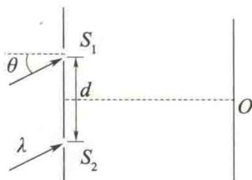

import Guide from '@/components/Guide.astro';
import Knowledge from '@/components/Knowledge.astro';
import Example from '@/components/Example.astro';
import Analysis from '@/components/Analysis.astro';
import Solution from '@/components/Solution.astro';
import Variant from '@/components/Variant.astro';
import Note from '@/components/Note.astro';
import Block from '@/components/Block.astro';
import Method from '@/components/Method.astro';
import Exercise from '@/components/Exercise.astro';

## 填空题

<Exercise title="习题 12.2.1">
如题 12.2.1 图所示, 波长为 $\lambda$ 的平行单色光斜入射到两条缝的间距为 d 的双缝上, 入射角为 $\theta$ . 在屏幕中央 O 处 $(\overline{S_{1}O} = \overline{S_{2}O})$ , 两束相干光的相位差为 \_\_\_\_.
</Exercise>

<Exercise title="习题 12.2.2">
在杨氏双缝干涉实验中,所用单色光的波长为 $\lambda=562.5\ nm$ ,双缝与屏幕的距离D=1.2m,若测得屏幕上相邻明纹的间距为 $\Delta x=1.5\ mm$ ,则两条缝的间距d=\_\_\_\_.

  

题12.2.1图
</Exercise>

<Exercise title="习题 12.2.3">
波长 $\lambda = 600 \, nm$ 的单色光垂直照射到牛顿环装置上，第2级明纹与第5级明纹所对应的空气膜厚度之差为 \_\_\_\_ nm.
</Exercise>

<Exercise title="习题 12.2.4">
在杨氏双缝干涉实验中,整个装置的结构不变,将其全部由空气中浸入水中,则干涉条纹的间距将变\_\_\_\_(填“疏”或“密”).
</Exercise>

<Exercise title="习题 12.2.5">
在杨氏双缝干涉实验中,光源沿平行于缝 $S_{1}$ 、 $S_{2}$ 连线方向向下做微小移动,则屏幕上的干涉条纹将向 \_\_\_\_ 方移动.
</Exercise>

<Exercise title="习题 12.2.6">
在杨氏双缝干涉实验中,用一块透明的薄云母片盖住下面的一条缝,则屏幕上的干涉条纹将向\_\_\_\_方移动.
</Exercise>

<Exercise title="习题 12.2.7">
由两块平板玻璃构成空气劈尖,左边为棱边,用平行单色光垂直入射.若上面的平板玻璃以垂直于下面的平板玻璃的方向向上平移,则干涉条纹将向\_\_\_\_平移,并且条纹的间距将\_\_\_\_.
</Exercise>
