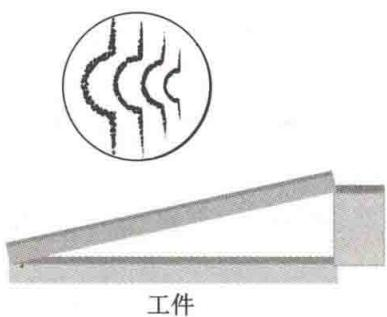
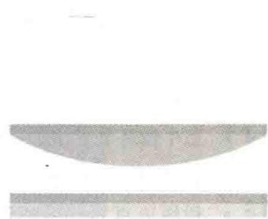
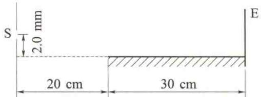
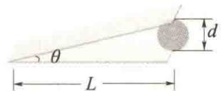

import Guide from '@/components/Guide.astro';
import Knowledge from '@/components/Knowledge.astro';
import Example from '@/components/Example.astro';
import Analysis from '@/components/Analysis.astro';
import Solution from '@/components/Solution.astro';
import Variant from '@/components/Variant.astro';
import Note from '@/components/Note.astro';
import Block from '@/components/Block.astro';
import Method from '@/components/Method.astro';
import Exercise from '@/components/Exercise.astro';

## 解答题

<Exercise title="习题 12.3.1">
某单色光从空气射入水中,其频率、波速、波长是否变化?怎样变化?
</Exercise>

<Exercise title="习题 12.3.2">
什么是光程？在不同的均匀介质中，若单色光通过的光程相等，其几何路程是否相同？其所需时间是否相同？在光程差与相位差的关系式 $\Delta \varphi = \frac{2\pi}{\lambda}\Delta$ 中，光波的波长要用真空中的波长，为什么？
</Exercise>

<Exercise title="习题 12.3.3">
用劈尖干涉来检测工件表面的平整度, 当波长为 $\lambda$ 的单色光垂直入射时, 观察到的干涉条纹如题 12.3.3 图所示, 每一条纹的弯曲部分的顶点恰与左邻的直线部分的连线相切. 试说明工件缺陷是凸还是凹, 并估算该缺陷的程度.
</Exercise>

<Exercise title="习题 12.3.4">
如题12.3.4图所示,牛顿环的平凸透镜可以上下移动,若以单色光垂直照射,看见条纹向中心收缩,问透镜是向上移动还是向下移动?
  
题12.3.3图
  
题12.3.4图
</Exercise>

<Exercise title="习题 12.3.5">
在杨氏双缝干涉实验中，两条缝的间距 $d = 0.20\mathrm{mm}$ ，缝、屏间距 $D = 1.0\mathrm{m}$ （1）若第2级明纹到屏幕中心的距离为 $6.0\mathrm{mm}$ ，计算此单色光的波长；（2）求相邻两明纹间的距离.
</Exercise>

<Exercise title="习题 12.3.6">
在双缝装置中，用一很薄的云母片 $(n=1.58)$ 覆盖其中的一条缝，结果使屏幕上的第7级明纹恰好移到屏幕中央原零级明纹的位置。若入射光的波长为550nm，求此云母片的厚度。
</Exercise>

<Exercise title="习题 12.3.7">
劳埃德镜干涉装置如题12.3.7图所示，镜长为 $30~\mathrm{cm}$ ，狭缝光源S在镜的左边、到镜的距离为 $20~\mathrm{cm}$ 的平面内，与镜面的垂直距离为 $2.0\mathrm{mm}$ ，光源的波长 $\lambda = 7.2\times 10^{-7}\mathrm{m}$ ，试求位于镜的右边缘的屏幕E上的第1条明纹到镜的右边缘的距离.
  
题12.3.7图
</Exercise>

<Exercise title="习题 12.3.8">
一平行单色光垂直照射在厚度均匀的薄油膜上, 油膜覆盖在平板玻璃上. 油的折射率为 1.30, 玻璃的折射率为 1.50, 若单色光的波长连续可调, 可观察到 $500 \mathrm{~nm}$ 与 $700 \mathrm{~nm}$ 这两个波长的单色光在反射中消失. 试求油膜层的厚度.
</Exercise>

<Exercise title="习题 12.3.9">
白光垂直照射到空气中一厚度为 $380 \mathrm{~nm}$ 的肥皂膜上, 设肥皂膜的折射率为 1.33, 则该肥皂膜的正面呈现什么颜色? 背面呈现什么颜色?
</Exercise>

<Exercise title="习题 12.3.10">
在折射率 $n_{1}=1.52$ 的镜头表面涂有一层折射率 $n_{2}=1.38$ 的 $MgF_{2}$ 增透膜，如果此膜适用于波长 $\lambda=550\ nm$ 的光，则膜的厚度应取何值？
</Exercise>

<Exercise title="习题 12.3.11">
如题 12.3.11 图所示, 波长为 680 nm 的平行光垂直照射到长 $L = 0.12 \, m$ 的两块平板玻璃上, 两块平板玻璃的一边相互接触, 另一边被直径 $d = 0.048 \, mm$ 的细钢丝隔开. 求:
  
题12.3.11图
(1) 两块平板玻璃的夹角 $\theta$ ;
(2) 相邻两明纹间空气膜的厚度差；
(3) 相邻两暗纹的间距；
(4) 在这 0.12 m 内呈现的明纹的数目.
用 $\lambda = 500 \, nm$ 的平行光垂直入射劈形薄膜的上表面，从反射光中观察，劈尖的棱边是暗纹。若劈尖上面的介质的折射率 $n_{1}$ 大于薄膜的折射率 $n(n = 1.50)$ 。
(1) 求劈尖下面的介质的折射率 $n_{2}$ 与 n 的大小关系；
(2) 求第 10 条暗纹处薄膜的厚度；
(3) 使膜的下表面向下平移一微小距离 $\Delta e$ ，干涉条纹有什么变化？若 $\Delta e = 2.0 \mu m$ ，则原来的第 10 条暗纹处将被哪级暗纹占据？
(1) 若用波长不同的光观察牛顿环, $\lambda_{1} = 600 \, nm$ , $\lambda_{2} = 450 \, nm$ , 观察到用波长为 $\lambda_{1}$ 的光时的第 k 级暗纹与用波长为 $\lambda_{2}$ 的光时的第 $k + 1$ 级暗纹重合, 已知透镜的曲率半径是 $190 \, cm$ . 求用波长为 $\lambda_{1}$ 的光时第 k 级暗纹的半径.
(2) 在牛顿环实验中, 波长为 500 nm 的光的第 5 级明纹与波长为 $\lambda_{2}$ 的光的第 6 级明纹重合, 求未知波长 $\lambda_{2}$ .
</Exercise>

<Exercise title="习题 12.3.14">
当牛顿环装置中的透镜与玻璃之间的空间充有液体时,第10级明纹的直径由 $d_{1}=1.40\times10^{-2}$ m 变为 $d_{2}=1.27\times10^{-2}$ m,求液体的折射率.
</Exercise>

<Exercise title="习题 12.3.15">
利用迈克耳孙干涉仪可测量单色光的波长. 当 $M_{1}$ 移动的距离为 0.322 mm 时, 观察到干涉条纹移动了 1024 条, 求所用单色光的波长.
</Exercise>

<Exercise title="习题 12.3.16">
把折射率为 n = 1.632 的玻璃片放入迈克耳孙干涉仪的一条光路中，观察到有 150 条干涉条纹向一方移过。若所用单色光的波长为 $\lambda = 500 \, nm$ ，求此玻璃片的厚度。

  
</Exercise>
