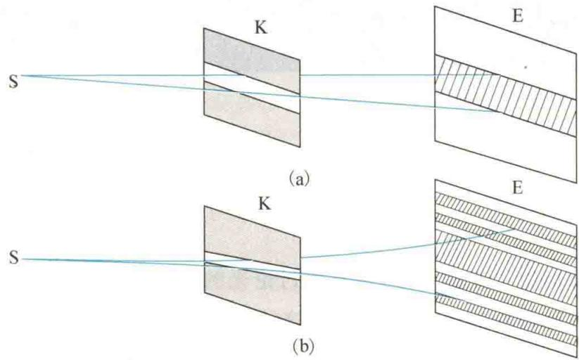
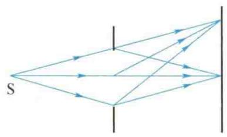
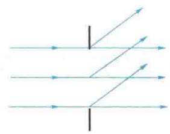
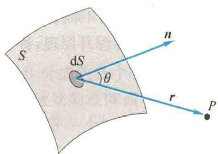

import QRCodeVideo from '@/components/QRCodeVideo.astro';

import Guide from '@/components/Guide.astro';
import Knowledge from '@/components/Knowledge.astro';
import Example from '@/components/Example.astro';
import Analysis from '@/components/Analysis.astro';
import Solution from '@/components/Solution.astro';
import Variant from '@/components/Variant.astro';
import Note from '@/components/Note.astro';
import Block from '@/components/Block.astro';
import Method from '@/components/Method.astro';
import Exercise from '@/components/Exercise.astro';

## 第13章 光的衍射

本章提要
上一章讨论了光的干涉,本章将讨论光的衍射.光在传播过程中遇到障碍物时,能绕过障碍物的边缘继续前进,这种偏离直线传播的现象称为光的衍射现象.和干涉一样,衍射也是波动的一个重要基本特征,它为光的波动说提供了有力的证据.在激光问世以后,人们利用其衍射现象开辟了许多新的研究领域.

## 13.1.1 光的衍射现象及分类

<QRCodeVideo title="单缝衍射的原理" url="https://api.guangyiedu.com/v3/resource/resource/r/NewQrCode-8zGeTyuaNYH3eHwL8x95" />  
单缝衍射原理
在讨论机械波时已经知道,衍射现象的显著程度取决于孔隙(或障碍物)的线度与波长的比值,当孔隙(或障碍物)的线度与波长的数量级差不多时,才能观察到明显的衍射现象.然而,对于光波,由于其波长远小于一般障碍物或孔隙的线度,因此光的衍射现象通常不易被观察到,而光的直线传播现象却给人们留下了深刻的印象.
在实验室中,采用高亮度的激光或普通的强点光源,并使屏幕的面积足够大,可以将光的衍射现象演示出来.图13.1(a)所示是一个光通过单缝的实验,S是一个单色点光源,K是一个可调节的狭缝,E为屏幕.实验发现,在S、K、E三者的位置固定的情况下,屏幕E上的光斑宽度取决于狭缝K的宽度.当狭缝K的宽度逐渐缩小时,屏幕E上的光斑也随之缩小,这体现了光的直线传播特征.但当狭缝K的宽度继续减小(小于 $10^{-4}$ m)时,屏幕E上的光斑不但不缩小,反而开始增大,这说明光波已“绕”到狭缝的几何阴影区,光斑的亮度也由原来的均匀分布变成一系列的明暗条纹(单色光源)或彩色条纹(白光光源),条纹的边缘也失去了明显的界限,变得模糊不清,如图13.1(b)所示.
  
图 13.1 光的衍射现象实验原理
衍射系统由光源、衍射屏和接收屏组成. 通常根据三者相对位置的大小, 把衍射现象分为两类: 一类是光源和接收屏 (或其中之一) 与衍射屏的距离为有限远的衍射, 称为菲涅耳衍射, 如图 13.2(a) 所示; 另一类是光源和接收屏与衍射屏的距离都是无限远的衍射, 即入射到衍射屏和离开衍射屏的光都是平行光的衍射, 称为夫琅禾费衍射, 如图 13.2(b) 所示. 本章着重讨论单缝和光栅的夫琅禾费衍射及其应用.
  
(a) 菲涅耳衍射
  
(b)夫琅禾费衍射  
图13.2 衍射分类

## 13.1.2 惠更斯-菲涅耳原理

惠更斯原理指出:波阵面上的每一点都可看成发射子波的新波源,任意时刻子波的包迹即为新的波阵面.惠更斯原理可以解释光通过衍射屏时为什么其传播方向会发生改变,但不能解释为什么会出现衍射条纹,更不能计算条纹的位置和光强的分布.在这方面,菲涅耳用子波相干叠加的设想发展了惠更斯原理.菲涅耳认为:从同一波阵面上各点发出的子波,在传播过程中相遇时,也能相互叠加而产生干涉现象,空间各点波的强度,由各子波在该点的相干叠加所确定.这个发展了的惠更斯原理称为惠更斯-菲涅耳原理.
<QRCodeVideo title="惠更斯" url="https://api.guangyiedu.com/v3/resource/resource/r/NewQrCode-DRTVVqCKWRIsDreGYHDf" />  
根据菲涅耳的子波相干叠加的设想,如果已知光波在某时刻的波阵面 S, 如图 13.3 所示,则空间任意一点 P 的光振动可由波阵面 S 上各面元 dS 发出的子波在该点叠加后的合振动来表示. 菲涅耳指出,每一面元 dS 发出的子波在 P 点引起的振动的振幅与 dS 成正比,与 P 点到 dS 的距离 r 成反比,还与 r 和 dS 的法线 n 之间的夹角 $\theta$ 有关. 若取 t = 0 时波阵面 S 上各点的初相位为零,则 dS 在 P 点引起的光振动可表示为
  
图 13.3 惠更斯-菲涅耳原理
$$
\mathrm{d} E = C \frac {K (\theta)}{r} \cos 2 \pi \left(\frac {t}{T} - \frac {r}{\lambda}\right) \mathrm{d} S\tag{13.1}
$$
式中， $C$ 为比例系数； $K(\theta)$ 为随 $\theta$ 角的增大而缓慢减小的函数，称为倾斜因子.当 $\theta = 0$ 时， $K(\theta)$ 取最大值；当 $\theta \geqslant \frac{\pi}{2}$ 时， $K(\theta) = 0$ ，因而子波叠加后的振幅为零.借此可以说明为什么子波不能向后传播.
波阵面上所有面元发出的子波在 P 点引起的合振动为
$$
E = \int \mathrm{d} E = \int C \frac {K (\theta)}{r} \cos 2 \pi \left(\frac {t}{T} - \frac {r}{\lambda}\right) \mathrm{d} S\tag{13.2}
$$
这便是惠更斯-菲涅耳原理的数学表达式. 它是研究衍射问题的理论基础, 可以解释并定量计算各种衍射场的分布, 但计算相当复杂. 下面采用菲涅耳提出的半波带法来讨论单缝夫琅禾费衍射现象, 以避免繁杂的计算.

