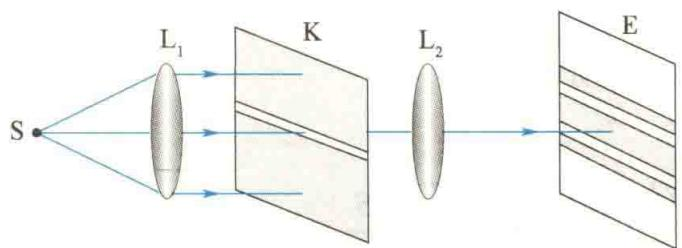
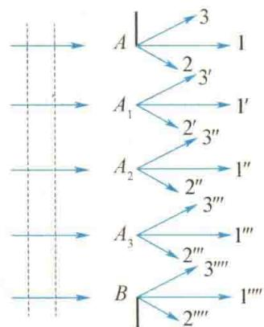
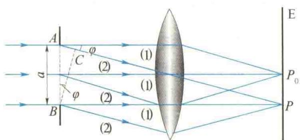
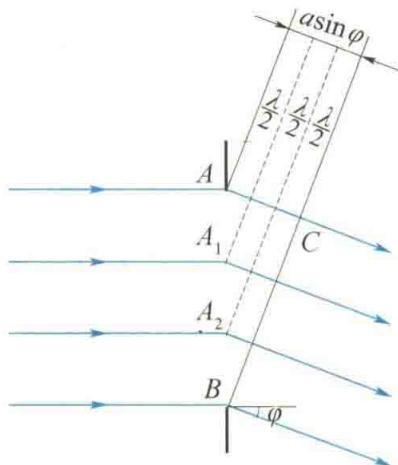
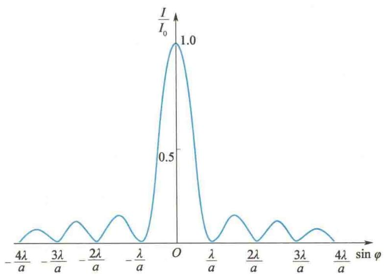
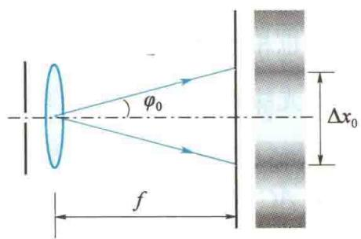

import Guide from '@/components/Guide.astro';
import Knowledge from '@/components/Knowledge.astro';
import Example from '@/components/Example.astro';
import Analysis from '@/components/Analysis.astro';
import Solution from '@/components/Solution.astro';
import Variant from '@/components/Variant.astro';
import Note from '@/components/Note.astro';
import Block from '@/components/Block.astro';
import Method from '@/components/Method.astro';
import Exercise from '@/components/Exercise.astro';

图 13.4 所示是单缝夫琅禾费衍射实验原理。在衍射屏 K 上开有一条细长狭缝，单色光源 S 发出的光经透镜 $L_{1}$ 后变为平行光束，射向单缝后产生衍射，再经透镜 $L_{2}$ 聚焦在焦平面处的屏幕 E 上，呈现出一系列平行于狭缝的衍射条纹。
  
夫琅禾费
现在用菲涅耳半波带法来分析产生明、暗纹的条件.
设衍射屏上的狭缝的宽度为 $a$ （如图13.5所示的 $AB$ ，为方便理解，特将狭缝放大），在平行单色光的垂直照射下，狭缝所在的平面就是入射光束的一个波阵面（等相位面）。按照惠更斯原理，波阵面上的每一点都可以发射子波，并以球面波的形式向各方向传播。显然，每一子波源发出的光线有无穷多条，每个可能的方向都有，这些光线都称为衍射光线。例如，图13.5中 $A$ 点处的1、2、3光线就代表该点发出的任意3个传播方向的光线，而波阵面上各点发出的各条衍射光则互相构成各方向的平行光束。如图13.5中，光线 $1, 1', 1'', 1''$ ……构成一个平行光束，光线 $2, 2', 2'', 2''$ ……构成另一个方向的平行光束，以此类推。每一个方向的平行光与原入射方向间的夹角用 $\varphi$ 表示， $\varphi$ 就称为衍射角。按几何光学原理，各平行光束经过透镜 $\mathrm{L}_2$ 后，会聚于焦平面（屏幕E）上的不同位置处。由于每一束平行光中所包含的光线均来自同一光源S，根据惠更斯-菲涅耳原理，各平行光线间有干涉作用，因而在屏幕上形成明暗相间的条纹。
  
图 13.4 单缝夫琅禾费衍射实验原理
  
图13.5 单缝衍射
首先,考虑沿入射光方向传播的衍射光(1),如图13.6所示,这些衍射光线从AB面发出时的相位是相同的,而经过透镜又不会引起附加光程差,它们经透镜会聚于焦点 $P_{0}$ 时,其相位仍然相同,因此它们在 $P_{0}$ 点处的光振动是相互加强的,于是在 $P_{0}$ 点处出现明纹,为中央明纹中心.
  
图13.6 单缝衍射条纹的位置
其次，考虑一束与原入射方向成 $\varphi$ 角的衍射光线(2)，它们经透镜后会聚于屏幕上的 P 点. 显然, 由 AB 面上各点发出的衍射光线到达 P 点的光程各不相同, 因而各子波在 P 点的相位也各不相同. 对其光程差可作这样的分析: 过 B 点作平面 BC 与衍射光线 (2) 垂直, 由凸透镜的等光程性可知, BC 面上各点发出的光线到达 P 点的光程都相等, 因此各衍射光线到达 P 点时的相位差就等于它们在 BC 面上的相位差, 它取决于各衍射光线从 AB 面上相应位置到 BC 面的光程差. 例如, 狭缝边缘 A、B 两点的衍射光线间的光程差为 $AC = a \sin \varphi$ , 显然, 这是沿 $\varphi$ 角方向各衍射光线之间的最大光程差, 其他各衍射光线间的光程差连续变化. 衍射角 $\varphi$ 不同, 最大光程差 AC 不同, P 点的位置也不同. 由菲涅耳半波带法分析可知, 屏幕上不同点的光强分布, 正是取决于此最大光程差.
菲涅耳将波阵面 AB 分割成许多面积相等的波带来研究. 其方法是: 将 AC 用一系列平行于 BC 的平面来划分, 这些平面中两相邻平面间的距离等于入射单色光的半波长, 即 $\frac{\lambda}{2}$ , 如图 13.7 所示. 这些平面同时也将狭缝处的波阵面 AB 分为 $AA_{1}, A_{1}A_{2}, A_{2}B$ 等整数个波带, 称为半波带. 由于这些波带的面积相等, 所以波带上子波源的数目也相等. 任何两个相邻的波带上对应点所发出的光线到达 BC 面的光程差均为 $\frac{\lambda}{2}$ , 即相位差为 $\pi$ , 经凸透镜会聚在 P 点时, 将一一相互抵消.
  
图 13.7 菲涅耳半波带法
  
半波带法
如果 AC 是半波长的偶数倍, 则可将狭缝处的波阵面 AB 分成偶数个半波带, 于是在 P 点将出现暗纹; 如果 AC 是半波长的奇数倍, 则可将狭缝处的波阵面 AB 分成奇数个半波带, 相邻半波带发出的衍射光将成对抵消, 最后剩下一个半波带的光线没有被抵消, 于是 P 点将出现明纹.
综上所述，当平行单色光垂直于狭缝入射时，单缝衍射明、暗纹的条件为
$$
a \sin \varphi = \left\{ \begin{array}{l l} 0 & \text { 中央明纹中心 } \\ \pm k \lambda & \text { 暗纹 } \\ \pm (2 k + 1) \frac {\lambda}{2} & \text { 明纹 } \end{array} \right. \quad (k = 1, 2, 3, \dots)\tag{13.3}
$$
式中，k 为级次，正、负号表示衍射条纹对称分布于中央明纹的两侧.
必须指出,对于任意衍射角 $\varphi$ 来说,AB 一般不能恰好分成整数个半波带,即 AC 不一定等于 $\frac{\lambda}{2}$ 的整数倍,对应于这些衍射角的衍射光束,经凸透镜会聚后,在屏幕上的光强介于最大光强与最小光强之间.因而在单缝衍射条纹中,光强的分布并不是均匀的.如图 13.8 所示,中央明纹最亮,条纹也最宽(约为其他明纹宽度的两倍),中央明纹的宽度指两个第 1 级暗纹中心的间距,因此满足 $a\sin\varphi_{0}=-\lambda$ 与 $a\sin\varphi_{0}=\lambda$ .当 $\varphi_{0}$ 很小时, $\varphi_{0}\approx\sin\varphi_{0}=\pm\frac{\lambda}{a}$ ,因此中央明纹的角宽度(两个第 1 级暗纹中心对凸透镜中心所张的角度)即为 $2\varphi_{0}\approx2\frac{\lambda}{a}$ .有时也用半角宽度描述,即
$$
\varphi_ {0} = \frac {\lambda}{a}\tag{13.4}
$$
这一关系称为衍射的反比律. 如图 13.9 所示, 以 f 表示凸透镜的焦距, 则在屏幕上观察到的中央明纹的线宽度为
$$
\Delta x _ {0} = 2 f \tan \varphi_ {0} = 2 \frac {\lambda}{a} f\tag{13.5}
$$
显然,其他明纹的角宽度近似为
$$
\Delta \varphi = (k + 1) \frac {\lambda}{a} - k \frac {\lambda}{a} = \frac {\lambda}{a}\tag{13.6}
$$
其线宽度为 $\Delta x = \frac{\lambda}{a} f$ . 而各级明纹的亮度随着级次的增大而迅速减小. 这是因为 $\varphi$ 角愈大, $AB$ 波阵面被分成的半波带数愈多, 每个半波带的面积愈小, 透过来的光通量亦愈小, 因而未被抵消的半波带上发出的光在屏幕上产生的明纹的亮度愈低.
  
图13.8 单缝衍射光强分布
  
图13.9 单缝衍射中央明纹的角宽度和线宽度
当缝宽 a 一定时, 对同一级衍射条纹, 波长 $\lambda$ 愈大, 衍射角 $\varphi$ 愈大, 因此若用白光入射, 除中央明纹的中部仍是白色外, 其两侧将出现一系列由紫到红的彩色条纹, 称为衍射光谱.
由式(13.3)和式(13.4)可知,对波长 $\lambda$ 一定的单色光来说,当a愈小时(a不能小于 $\lambda$ ),对应于各级条纹的 $\varphi$ 就愈大,即衍射愈明显;当a愈大时,各级条纹所对应的 $\varphi$ 将愈小,这些条纹都密布于中央明纹附近而逐渐分辨不清,也就是衍射愈不明显.如果 $a\gg\lambda$ ,各级衍射条纹将集中在 $P_{0}$ 点附近,形成单一的明纹,这就是凸透镜所成的狭缝的像.这个像相当于是由 $\varphi_{0}$ 趋于零时的平行光束形成的,也就是说,它是由入射到AB面的平行光束沿直线传播所引起的.由此可见,中央明纹的中心就是几何光学的像点.这样,在衍射实验的实际操作中,可借助几何光学的成像规律,迅速找到中央明纹的位置.一般只能看到光的直线传播现象,是因为光的波长极短,而障碍物上缝的宽度比波长大得多,因而衍射现象极不明显.只有当缝极窄,以至其缝宽可与波长相比拟时,衍射现象才较为显著.
由菲涅耳半波带法导出的式(13.3)只是近似准确.实际上除中央明纹中心外,其他明纹都要向中央移近少许.

<Example title="例 13.1">
用波长为 $\lambda$ 的单色光照射狭缝, 得到单缝夫琅禾费衍射图样, 第3级暗纹位于屏幕上的 P 点处. 问: (1) 若将狭缝宽度减小到原来的一半, 那么 P 点处是明纹还是暗纹?
(2) 若用波长为 $1.5\lambda$ 的单色光照射狭缝, P 点处是明纹还是暗纹?

<Solution title="解">
利用半波带法直接求解,与暗纹对应的半波带数为偶数 $2k(k=1,2,3,\cdots$ 为暗纹级次);与除中央明纹外的明纹对应的半波带数为奇数 $2k+1(k=1,2,3,\cdots$ 为明纹级次).
根据已知条件,在屏幕上的 P 点处出现第 3 级暗纹,所以对于 P 位置,狭缝处的波阵面可划分为 6 个半波带.
(1) 缝宽减小到原来的一半, 对于 P 点, 狭缝处的波阵面可分为 3 个半波带, 则在 P 点处出现第 1 级明纹.
(2) 改用波长为 $1.5\lambda$ 的单色光照射, 则狭缝处的波阵面可划分的半波带数变为原来的 $\frac{1}{1.5}$ , 对于 P 位置, 半波带数变为 4 个, 所以在 P 点处将出现第 2 级暗纹.
</Solution>
</Example>

<Example title="例 13.2">
波长 $\lambda = 600 \, nm$ 的单色光垂直入射到缝宽 $a = 0.2 \, mm$ 的狭缝上，缝后用焦距 $f = 50 \, cm$ 的凸透镜将衍射光会聚于屏幕上。求：(1) 中央明纹的角宽度、线宽度；(2) 第 1 级明纹的位置及狭缝处波阵面可分为几个半波带；(3) 第 1 级明纹的宽度。

<Solution title="解">
（1）第1级暗纹对应的衍射角 $\varphi_0$ 满足
$$
\sin \varphi_ {0} = \frac {\lambda}{a} = \frac {6 \times 1 0 ^ {- 7}}{2 \times 1 0 ^ {- 4}} = 3 \times 1 0 ^ {- 3}
$$
因 $\sin \varphi_0$ 很小，可知中央明纹的角宽度为
$$
2 \varphi_ {0} \approx 2 \sin \varphi_ {0} = 6 \times 1 0 ^ {- 3} \mathrm{rad}
$$
第1级暗纹到中央明纹中心 $O$ 的距离为
$$
\begin{array}{r l} x _ {1} & = f \tan \varphi_ {0} \approx f \varphi_ {0} = 0. 5 \times 3 \times 1 0 ^ {- 3} \mathrm{m} \\ & = 1. 5 \times 1 0 ^ {- 3} \mathrm{m} = 1. 5 \mathrm{mm} \end{array}
$$
因此中央明纹的线宽度为
$$
\Delta x _ {0} = 2 x _ {1} = 2 \times 1. 5 \mathrm{mm} = 3 \mathrm{mm}
$$
(2) 第 1 级明纹对应的衍射角 $\varphi$ 满足
$$
\begin{array}{r l} \sin \varphi & = (2 k + 1) \frac {\lambda}{2 a} = \frac {3 \times 6 \times 1 0 ^ {- 7}}{2 \times 2 \times 1 0 ^ {- 4}} \\ & = 4. 5 \times 1 0 ^ {- 3} \end{array}
$$
可知第1级明纹中心到中央明纹中心的距离为
$$
\begin{array}{r l} x & = f \tan \varphi \approx f \sin \varphi = 0. 5 \times 4. 5 \times 1 0 ^ {- 3} \mathrm{m} \\ & = 2. 2 5 \times 1 0 ^ {- 3} \mathrm{m} = 2. 2 5 \mathrm{mm} \end{array}
$$
对应于该 $\varphi$ 值，狭缝处波阵面可分的半波带数为
$$
2 k + 1 = 3
$$
(3) 设第 2 级暗纹到中央明纹中心 O 的距离为 $x_{2}$ ，对应的衍射角为 $\varphi_{2}$ ，故第 1 级明纹的线宽度为
$$
\begin{array}{r l} \Delta x & = x _ {2} - x _ {1} = f \tan \varphi_ {2} - f \tan \varphi_ {1} \\ & \approx f \left(\frac {2 \lambda}{a} - \frac {\lambda}{a}\right) = \frac {\lambda}{a} f = \frac {6 \times 1 0 ^ {- 7} \times 0 . 5}{2 \times 1 0 ^ {- 4}} \mathrm{m} \\ & = 1. 5 \times 1 0 ^ {- 3} \mathrm{m} = 1. 5 \mathrm{mm} \end{array}
$$
</Solution>
</Example>

由此可见,第1级明纹的宽度约为中央明纹宽度的一半.
