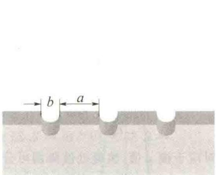
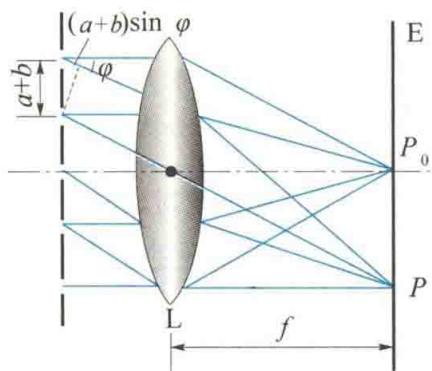
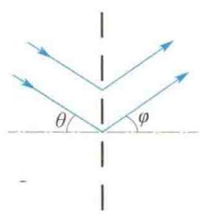
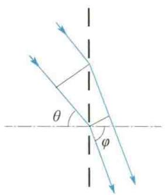
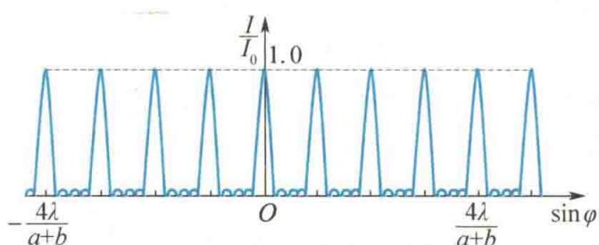
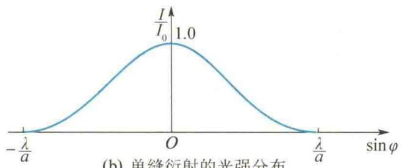
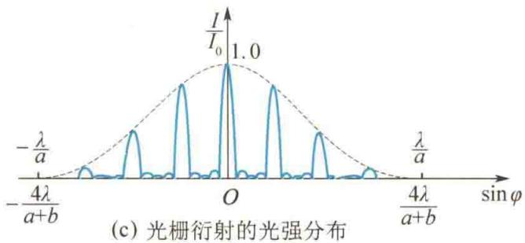
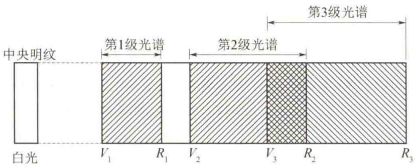
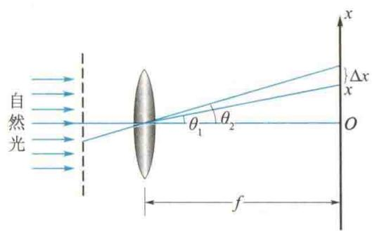

import Guide from '@/components/Guide.astro';
import Knowledge from '@/components/Knowledge.astro';
import Example from '@/components/Example.astro';
import Analysis from '@/components/Analysis.astro';
import Solution from '@/components/Solution.astro';
import Variant from '@/components/Variant.astro';
import Note from '@/components/Note.astro';
import Block from '@/components/Block.astro';
import Method from '@/components/Method.astro';
import Exercise from '@/components/Exercise.astro';

从上节的讨论可知,原则上可以利用单色光通过狭缝时所产生的衍射条纹来测定该单色光的波长.但为了保障测量的准确性,要求衍射条纹必须分得很开,条纹既细且明亮.然而,对单缝衍射来说,这两个要求难以同时达到.因为若要条纹分得开,狭缝的宽度a就要很小,这样通过狭缝的光能量就少,以致条纹不够明亮而难以看清楚;反之,若加大缝宽a,虽然观察到的条纹较明亮,但条纹间距变小,不容易分辨.所以实际上测定光波的波长时,往往不是使用单缝,而是采用能满足上述测量要求的衍射光栅.

## 13.3.1 光栅衍射现象

由大量等间距、等宽度的平行狭缝所组成的光学元件称为衍射光栅。用于透射光衍射的光栅叫作透射光栅，用于反射光衍射的光栅叫作反射光栅。常用的透射光栅是在一块玻璃片上刻画许多等间距、等宽度的平行刻痕，刻痕处相当于毛玻璃而不易透光，刻痕之间的光滑部分可以透光，相当于一个单缝，如图13.10所示。缝的宽度 $a$ 和刻痕的宽度 $b$ 之和，即 $a + b$ ，称为光栅常量。现代用的衍射光栅，在 $1\mathrm{cm}$ 内可刻上 $10^{3} \sim 10^{4}$ 条缝，所以一般的光栅常量为 $10^{-5} \sim 10^{-6}\mathrm{m}$ 的数量级。

如图 13.11 所示, 平行单色光垂直照射到光栅上, 由光栅射出的光线经凸透镜 L 后, 会聚于屏幕 E 上, 因而在屏幕上出现平行于狭缝的明暗相间的光栅衍射条纹. 这些条纹的特点是: 明纹很亮很窄, 相邻明纹间的暗区很宽, 衍射图样十分清晰.

  

图13.10 透射光栅

  

图13.11 光栅衍射

## 13.3.2 光栅衍射规律

光栅是由许多单缝组成的,每个缝都在屏幕上各自形成单缝衍射图样,由于各缝的宽度均为 $\dot{a}$ ,故它们形成的衍射图样都相同.如图13.11所示,各缝中 $\varphi$ 为零的衍射光(垂直于凸透镜入射的平行光)经凸透镜L后,都会聚在凸透镜主光轴的焦点上,即图13.11中的 $P_{0}$ 点,这就是各单缝衍射的中央明纹的中心位置.可见,由于凸透镜L的作用,各缝形成的衍射图样在屏幕E上是完全重合的.另外,各单缝的衍射光在屏幕上重叠时,因为它们都是相干光,所以缝与缝之间的衍射光将产生干涉,其干涉条纹的明暗分布取决于相邻两缝到会聚点的光程差.因此,分析屏幕上形成的光栅衍射条纹,既要考虑各缝的衍射,又要考虑各缝之间的干涉,即考虑单缝衍射与多缝干涉的总效果.

### 1. 光栅公式

  

光栅与相控阵雷达

下面讨论明纹的位置. 当平行单色光垂直照射光栅时, 每条缝均向各方向发出衍射光, 发自各缝具有相同衍射角 $\varphi$ 的一组平行光都会聚于屏幕上同一点, 如图 13.11 中的 $P$ 点, 这些光波叠加产生干涉, 这样的干涉称为多光束干涉. 从图 13.11 可以看出, 任意相邻两缝射出的衍射角为 $\varphi$ 的两束衍射光到达 $P$ 点处的光程差均为 $(a + b)\sin \varphi$ , 如果此值恰好是入射光波长 $\lambda$ 的整数倍, 则这两束衍射光在 $P$ 点满足干涉加强条件. 这时, 其他任意两缝沿该衍射角 $\varphi$ 方向射出的两束衍射光, 到达 $P$ 点处的光程差也一定是 $\lambda$ 的整数倍, 于是所有缝沿该衍射角 $\varphi$ 方向射出的衍射光在屏幕上会聚时, 均相互加强,形成明纹.这时在P点的衍射光的合振幅应是来自一条缝的衍射光的振幅的N倍(N表示光栅缝的总数),合光强则是来自一条缝的衍射光的光强的 $N^{2}$ 倍,因此光栅的多光束干涉形成的明纹的亮度要比一条缝发出的光的亮度大得多.光栅缝的数目愈多,明纹愈亮.由此可知,光栅衍射的明纹的位置应满足

$$

(a + b) \sin \varphi = k \lambda (k = 0, \pm 1, \pm 2, \dots)\tag{13.7}

$$

式(13.7)称为光栅公式.式中， $k$ 为明纹级次.这些明纹细窄而明亮，通常称为主极大. $k = 0$ ，对应零级主极大； $k = 1$ ，对应第1级主极大；其他情况以此类推.正、负号表示各级主极大在零级主极大两侧对称分布.从光栅公式可以看出，在波长一定的单色光的照射下，光栅常量 $(a + b)$ 愈小，各级明纹的 $\varphi$ 角愈大，因而相邻两条明纹分得愈开

以上讨论的是平行单色光垂直入射到光栅上的情况. 如果平行单色光倾斜地入射到光栅上, 入射方向与光栅平面法线之间的夹角为 $\theta$ , 那么相邻两缝的入射光在入射到光栅前已有光程差 $(a + b)\sin \theta$ , 所以光线倾斜入射时的光栅公式应为

$$

(a + b) (\sin \varphi \pm \sin \theta) = k \lambda (k = 0, \pm 1, \pm 2, \dots)\tag{13.8}

$$

式中， $\varphi$ 表示衍射方向与光栅平面的法线间的夹角， $\varphi$ 与 $\theta$ 均取正值。当 $\varphi$ 与 $\theta$ 在法线同侧时，如图13.12(a)所示，上式左边第二个括号中取加号，在异侧时取减号，如图13.12(b)所示。

  

(a)

  

(b)  

图 13.12 平行单色光的倾斜入射

### 2. 暗纹条件

在光栅衍射中,相邻两主极大之间还分布着一些暗纹.这些暗纹是由各缝射出的衍射光因干涉减弱而形成的.可以证明,若 $\varphi$ 满足条件

$$

(a + b) \sin \varphi = \left(k + \frac {n}{N}\right) \lambda \quad (k = 0, \pm 1, \pm 2, \dots)\tag{13.9}

$$

则出现暗纹.式中，k为主极大级次；N为光栅缝总数；n为正整数，取值为 $n=1,2,\cdots,(N-1)$ .由上式可知，在两个主极大之间，分布着 $(N-1)$ 条暗纹.显然，在这 $(N-1)$ 条暗纹之间的位置光强不为零，但其强度比各级主极大的光强小得多，这样的条纹称为次级明纹.在相邻两主极大之间分布有 $(N-1)$ 条暗纹和 $(N-2)$ 条光强极弱的次级明纹，这些次级明纹几乎是观察不到的，因此实际上在两个主极大之间是一片连续的暗区.从式(13.9)可知，缝数N愈多，暗纹也愈多，因而暗区愈宽，明纹愈细窄.

### 3. 单缝衍射对光强分布的影响

以上讨论多光束干涉时，并没有考虑各缝（单缝）衍射对屏幕上条纹强度分布的影响。实际上，由于单缝衍射在不同的 $\varphi$ 方向上，衍射光的光强是不同的，因此光栅衍射的不同位置的明纹，是来源于不同光强的衍射光的干涉加强。也就是说，多光束干涉的各明纹要受单缝衍射的调制. 单缝衍射光强大的方向明纹的光强也大, 单缝衍射光强小的方向明纹的光强也小. 图 13.13 所示是一个 $N = 5$ 的光栅衍射光强分布示意图, 图 13.13(a) 是只考虑多光束干涉的光强分布, 图 13.13(b) 是各单缝衍射的光强分布, 图 13.13(c) 是受单缝衍射调制的多光束干涉的光强分布, 即光栅衍射的光强分布. 光栅衍射的各级明纹的光强的包络线与单缝衍射的光强曲线类似.

  

(a) 多光束干涉的光强分布

  

光栅衍射原理及缺级现象

  

(b) 单缝衍射的光强分布

  

图 13.13 光栅衍射的光强分布示意图

### 4. 缺级现象

前面讨论光栅公式 $(a + b)\sin \varphi = k\lambda$ 时，只是从多光束干涉的角度说明了叠加光强最大而产生明纹的必要条件，但当这一 $\varphi$ 角位置同时也满足单缝衍射的暗纹条件 $a\sin \varphi = k'\lambda$ 时，可将这一位置看成光强为零的“干涉加强”。所以，从光栅公式看来应出现第 $k$ 级明纹的位置，实际上却是暗纹，即第 $k$ 级明纹不出现，这种现象称为光栅的缺级现象。将上述两式相比，可知缺级条件为

$$

k = k ^ {\prime} \frac {a + b}{a} (k ^ {\prime} = 1, 2, 3, \dots)\tag{13.10}

$$

一般只要 $\frac{a + b}{a}$ 为整数，则对应的第 $k$ 级明纹位置一定出现缺级现象.

## 13.3.3 光栅光谱

由光栅公式可知,在光栅常量一定的情况下,衍射角 $\varphi$ 的大小与入射光的波长有关.因此当白光通过光栅后,各种不同波长的光将产生各自分开的主极大.屏幕上除零级主极大由各种波长的光混合仍为白色外,其两侧将形成各级由紫到红对称排列的彩色光带,这些光带的整体称为光栅光谱,如图13.14所示.对于同一级的条纹,因为波长短的光衍射角小,波长长的光衍射角大,所以光谱中紫光(图中以V表示)靠近零级主极大,红光(图中以R表示)则远离零级主极大.在第2级和第3级光谱中发生了重叠,级次愈大,重叠情况愈复杂,实际上很难区分.

  

图13.14 光栅光谱

因为光栅可以把不同波长的光分隔开,且光栅衍射条纹的宽度窄,测量误差较小,所以常用它作为分光元件,其分光性能比棱镜优越得多.

<Example title="例 13.3">
用波长为 590 nm 的钠光垂直照射到每厘米刻有 5 000 条缝的光栅上，在光栅后放置一焦距为 20 cm 的凸透镜。（1）求第 1 级与第 3 级明纹的距离；（2）最多能看到第几级明纹？（3）当光线以入射角 $30^{\circ}$ 斜入射时，最多能看到第几级明纹？确定零级主极大中心的位置。

解（1）光栅常量为

$$

a + b = \frac {L}{N} = \frac {1 \times 1 0 ^ {- 2}}{5 0 0 0} \mathrm{m} = 2 \times 1 0 ^ {- 6} \mathrm{m}

$$

因为 $\varphi = 90^{\circ}$ 时实际看不到条纹，所以 k 应取小于该值的最大整数，故最多能看到第 3 级明纹.

由光栅公式 $(a + b)\sin \varphi = k\lambda$

得 $\sin \varphi_{1} = \frac{\lambda}{a + b},\quad \sin \varphi_{3} = \frac{3\lambda}{a + b}$

（3）光线以 $30^{\circ}$ 角斜入射时，由斜入射的光栅公式，得

因为 $\tan\varphi=\frac{x}{f}$ ，所以第1级与第3级明纹之间的距离为

$$

\begin{array}{r l} \Delta x & = x _ {3} - x _ {1} = f (\tan \varphi_ {3} - \tan \varphi_ {1}) \\ & = f \left(\frac {\sin \varphi_ {3}}{\sqrt {1 - \sin^ {2} \varphi_ {3}}} - \frac {\sin \varphi_ {1}}{\sqrt {1 - \sin^ {2} \varphi_ {1}}}\right) \end{array}

$$

将已知条件代入上式,可以算出

$$

\Delta x = 0. 3 2 \mathrm{m}

$$

$$

k = \frac {(a + b) (\sin \varphi + \sin \theta)}{\lambda}

$$

由题意得 $\theta = 30^{\circ},\varphi = 90^{\circ}$ ，代入上式得

$$

k = \frac {2 \times 1 0 ^ {- 6}}{5 . 9 \times 1 0 ^ {- 7}} \times (1 + \sin 3 0 ^ {\circ}) = 5. 1

$$

取 k = 5，即斜入射时，最多能看到第 5 级明纹。

(2) 由光栅公式 $(a+b)\sin\varphi=k\lambda$ ，得

此时零级主极大的位置可由 $k = 0$ 的光栅公式求得，即

$$

k = \frac {(a + b) \sin \varphi}{\lambda}

$$

$$

(a + b) (\sin \varphi - \sin \theta) = k \lambda = 0

$$

可得

$k$ 的最大值出现在 $\sin \varphi = 1$ 处，故

$$

k = \frac {2 \times 1 0 ^ {- 6}}{5 . 9 \times 1 0 ^ {- 7}} = 3. 4

$$

$$

\varphi = \theta = 3 0 ^ {\circ}

$$

即零级主极大中心在平行于入射光方向的副光轴与凸透镜焦平面的交点上,它到屏幕中心的距离为

$$

x = f \tan 3 0 ^ {\circ} = 0. 2 \times \frac {1}{\sqrt {3}} \mathrm{m} = 0. 1 1 5 \mathrm{m}

$$
</Example>

<Example title="例 13.4">
在垂直入射于光栅的平行光中，有 $\lambda_{1}$ 和 $\lambda_{2}$ 两种波长的光.已知波长为 $\lambda_{1}$ 的光的第3级光谱线（第3级明纹）与波长为 $\lambda_{2}$ 的光的第4级光谱线恰好重合在离中央明纹 $5\mathrm{mm}$ 处，而 $\lambda_{2} = 486.1\mathrm{nm}$ ，并发现波长为 $\lambda_{1}$ 的光的第5级光谱线缺级.凸透镜的焦距为 $0.5\mathrm{m}$ .试求：(1) $\lambda_{1}$ 及光栅常量 $(a + b)$ ; (2) 光栅的最小缝宽 $a_{\min}$ .

<Solution title="解">
利用光栅方程、缺级条件, 结合衍射光路直接求解.

(1) 由光栅方程

$$

(a + b) \sin \varphi = k \lambda

$$

并结合题意可知

$$

(a + b) \sin \varphi = k _ {1} \lambda_ {1} = k _ {2} \lambda_ {2}

$$

$$

\lambda_ {1} = \frac {k _ {2}}{k _ {1}} \lambda_ {2} = \frac {4}{3} \times 4 8 6. 1 \mathrm{nm} = 6 4 8. 1 \mathrm{nm}

$$

$$

\begin{array}{r l} & = \frac {0 . 5 \times 4 \times 4 8 6 . 1 \times 1 0 ^ {- 9}}{5 \times 1 0 ^ {- 3}} \mathrm{m} \\ & = 1. 9 4 \times 1 0 ^ {- 4} \mathrm{m} \end{array}

$$

所以

(2) 当第 k 级光谱线缺级时, 满足

$$

\frac {x}{f} = \tan \varphi \approx \sin \varphi

$$

$$

\begin{array}{c} (a + b) \sin \varphi = k \lambda \\ a \sin \varphi = k ^ {\prime} \lambda \end{array}

$$

又因为

两式相除得

$$

a = \frac {k ^ {\prime}}{k} (a + b)

$$

所以

$$

a + b = \frac {k _ {2} \lambda_ {2}}{\sin \varphi} = \frac {f}{x} k _ {2} \lambda_ {2}

$$

最小缝宽对应 $k^{\prime}=1$ ，即第k级因落在第1级单缝衍射暗纹上而缺级。所以，缝的最小宽度为

$$

\begin{array}{r l} a _ {\mathrm{min}} & = \frac {1 \times 1 . 9 4 \times 1 0 ^ {- 4}}{5} \mathrm{m} \\ & = 3. 8 8 \times 1 0 ^ {- 5} \mathrm{m} \end{array}

$$
</Solution>
</Example>

<Example title="例 13.5">
一个每厘米均匀刻有200条刻线的光栅，用白光照射，在光栅后放一焦距为 $f=500\ cm$ 的凸透镜，在凸透镜的焦平面处有一个屏幕，如果在屏幕上开一条宽为 $\Delta x=1\ mm$ 的细缝，细缝的内侧边缘离中央主极大中心5.0 cm，如图13.15所示。试求什么波长范围的可见光可通过细缝。

<Solution title="解">
利用光栅方程和衍射光路图求出在 $\Delta x$ 范围内的衍射光的波长范围. 此例给出了一种选择和获得准单色光的方法.

由题意,光栅常量为

$$

a + b = \frac {1 \times 1 0 ^ {- 2}}{2 0 0} \mathrm{m} = 5. 0 \times 1 0 ^ {- 5} \mathrm{m}

$$

$$

\begin{array}{r l} k _ {2} \lambda_ {2} & = \frac {x + \Delta x}{f} (a + b) \\ & = \frac {(5 . 0 + 0 . 1) \times 5 . 0 \times 1 0 ^ {- 5}}{5 0 0} \mathrm{m} \\ & = 0. 5 1 \times 1 0 ^ {- 6} \mathrm{m} = 5 1 0 \mathrm{nm} \end{array}

$$

由图可以看出 $\theta_{1}$ 和 $\theta_{2}$ 都很小，所以 $\sin \theta \approx \tan \theta$ ，根据光栅方程，有

$$

\sin \theta_ {1} = \frac {k _ {1} \lambda_ {1}}{a + b} \approx \frac {x}{f}

$$

$$

\sin \theta_ {2} = \frac {k _ {2} \lambda_ {2}}{a + b} \approx \frac {x + \Delta x}{f}

$$

因此

$$

\begin{array}{r l} k _ {1} \lambda_ {1} & = \frac {x}{f} (a + b) = \frac {5 . 0 \times 5 . 0 \times 1 0 ^ {- 5}}{5 0 0} \mathrm{m} \\ & = 0. 5 \times 1 0 ^ {- 6} \mathrm{m} = 5 0 0 \mathrm{nm} \end{array}

$$

显然，在可见光范围内， $k_{1}$ 和 $k_{2}$ 都只能取 1，所以可通过细缝的可见光的波长范围为

$$

5 0 0 \mathrm{nm} \leqslant \lambda \leqslant 5 1 0 \mathrm{nm}

$$

  

图13.15 例13.5图

</Solution>
</Example>
