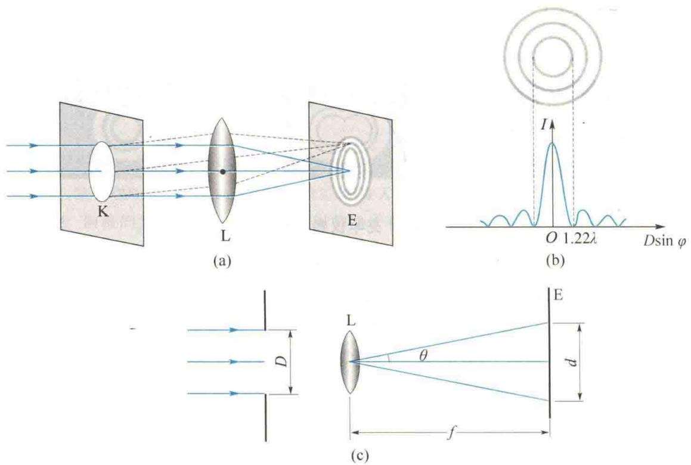
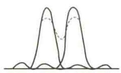
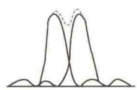
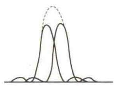
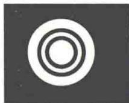

import QRCodeVideo from '@/components/QRCodeVideo.astro';

import Guide from '@/components/Guide.astro';
import Knowledge from '@/components/Knowledge.astro';
import Example from '@/components/Example.astro';
import Analysis from '@/components/Analysis.astro';
import Solution from '@/components/Solution.astro';
import Variant from '@/components/Variant.astro';
import Note from '@/components/Note.astro';
import Block from '@/components/Block.astro';
import Method from '@/components/Method.astro';
import Exercise from '@/components/Exercise.astro';

## 13.4.1 圆孔衍射

在单缝夫琅禾费衍射实验装置中,若用一小圆孔代替狭缝,也会产生衍射现象.
如图 13.16(a) 所示, 当单色平行光垂直照射小圆孔 K 时, 在凸透镜 L 的焦平面处的屏幕 E 上可以观察到圆孔夫琅禾费衍射图样, 其中央是一明亮圆斑, 周围为一组明暗相间的同心圆环, 由第 1 级暗环所围成的中央光斑称为艾里斑, 艾里斑的直径为 d, 其半径对凸透镜 L 光心的张角 $\theta$ 称为艾里斑的半角宽度. 圆孔夫琅禾费衍射图样的光强分布如图 13.16(b) 所示, 其中艾里斑的光强占整个入射光的光强的 80% 以上. 如图 13.16(c) 所示, 根据理论计算, 艾里斑的半角宽度 $\theta$ 与圆孔直径 D 及入射光的波长 $\lambda$ 的关系为
科研成果介绍
<QRCodeVideo title="郭守敬望远镜" url="https://api.guangyiedu.com/v3/resource/resource/r/NewQrCode-3LNCtQt4wrLQzpcE0unR" />  
$$
\theta \approx \sin \theta = 1. 2 2 \frac {\lambda}{D} = \frac {\frac {d}{2}}{f}\tag{13.11}
$$
式中， $f$ 为透镜焦距.由式(13.11)可知，圆孔直径 $D$ 愈小，或 $\lambda$ 愈大，则衍射现象愈明显
<figure class="vp-figure">
  
  <figcaption>图 13.16 圆孔夫琅禾费衍射</figcaption>
</figure>

## 13.4.2 光学仪器的分辨率

从几何光学来看,物体通过凸透镜成像时,每一个物点都有一个对应的像点.只要适当选择凸透镜的焦距,任何微小物体都可成清晰的图像.然而,从波动光学来看,组成各种光学仪器的凸透镜等部件,均相当于一个透光小孔,因此在屏幕上看到的像是圆孔的夫琅禾费衍射图样,粗略地说,看到的是一个具有一定大小的艾里斑.如果两个物点距离很近,其相对应的两个艾里斑很可能部分重叠而不易分辨,以致被看成一个像点.这就是说,光的衍射现象限制了光学仪器的分辨能力.
例如，用显微镜观察一个物体上的 $a, b$ 两点时，从 $a, b$ 发出的光，经显微镜的物镜成像时，将形成两个艾里斑，分别为 $a$ 和 $b$ 的像。如果这两个艾里斑分得较开，相互间没有重叠，或重叠较小时，就能够分辨出 $a, b$ 两点的像，从而可判断物点是两个点，如图13.17(a)所示。如果 $a, b$ 两点靠得很近，以致两个艾里斑的大部分重叠，这时将不能判断这是两个物点的像,即物点 a、b 不能被分辨,如图 13.17(c) 所示.那么可分辨和不可分辨的标准是什么呢?瑞利指出,对于任何一个光学仪器,如果一个物点的衍射图样的艾里斑中央最亮处恰好与另一个物点的衍射图样的第一个最暗处重合,则认为这两个物点恰好可以被光学仪器所分辨.以显微镜为例,如图 13.17(b) 所示,这里屏幕上的总光强分布可由两衍射图样的光强直接相加(因为两发光点是不相干的),其重叠部分中心的光强约为每个艾里斑的最大光强的 80%,一般人的眼睛刚好能分辨出这种光强差别,因而可判断出这是两个物点的像.这时的两物点对凸透镜光心的张角称为光学仪器的最小分辨角,用 $\theta_{0}$ 表示.它正好等于每个艾里斑的半角宽度,即
$$
\theta_ {0} = 1. 2 2 \frac {\lambda}{D}\tag{13.12}
$$

  
(a)
  
(b)
  
(c)  
图 13.17 光学仪器的分辨能力
最小分辨角的倒数 $1 / \theta_0$ ，称为光学仪器的分辨率.由式（13.12）可知，光学仪器的分辨率与仪器的孔径 $D$ 成正比，与光波的波长 $\lambda$ 成反比.所以，在天文观测中，为了分清远处靠得很近的几个星体，通常需要采用孔径很大的望远镜.而对于显微镜，为了提高分辨率，则尽量采用波长短的紫光.近代物理实验证实，电子也具有波动性，而且其波长可与固体中原子间距相比拟(0.1～0.01nm数量级)，因此电子显微镜的分辨率要比普通光学显微镜的分辨率高数千倍.

<Example title="例 13.6">
在通常的亮度下,人眼瞳孔的直径约为3 mm,在可见光中,人眼感受最灵敏的是波长为550 nm 的黄绿光.(1)人眼的最小分辨角是多大?(2)如果在黑板上画两条平行直线,相距2 mm,坐在距黑板多远处的学生恰能分辨这两条直线?

<Solution title="解">
（1）根据式(13.12)，可得人眼的最小分辨角为
间距为 $l$ ，两条平行直线对人眼的张角为
$$
\begin{array}{r l} \theta_ {0} & = 1. 2 2 \frac {\lambda}{D} = 1. 2 2 \times \frac {5 . 5 \times 1 0 ^ {- 7}}{3 \times 1 0 ^ {- 3}} \mathrm{rad} \\ & = 2. 2 \times 1 0 ^ {- 4} \mathrm{rad} \end{array}
$$
$$
\theta \approx \frac {l}{x}
$$
若恰能分辨，则应有 $\theta = \theta_0$ ，所以
(2) 设学生到黑板的距离为 x，两条平行直线的
$$
x = \frac {l}{\theta_ {0}} = \frac {2 \times 1 0 ^ {- 3}}{2 . 2 \times 1 0 ^ {- 4}} \mathrm{m} = 9. 1 \mathrm{m}
$$
</Solution>
</Example>

<Example title="例 13.7">
一直径为 2 mm 的氦氖激光束射向月球表面, 其波长为 632.8 nm, 已知月球和地面的距离为 $3.84 \times 10^{5}$ km. (1) 在月球上得到的光斑的直径为多大? (2) 如果此激光束经扩束器扩展成直径为 2 m, 则在月球表面上得到的光斑的直径为多大? 在激光测距仪中, 通常采用激光扩束器, 这是为什么?

<Solution title="解">
（1）设 $D_{1}$ 为光斑的直径， $L$ 为月球到地球的距离， $d_{1}$ 是激光束的直径， $\lambda$ 为波长，则由 $\theta_0 = 1.22\frac{\lambda}{d_1}$
$\theta_0 \approx \tan \theta_0 = \frac{\frac{D_1}{2}}{L}$ 得
$$
\frac {D _ {1}}{2} = 1. 2 2 \frac {\lambda}{d _ {1}} L
$$
(2) 由(1)中所述可知
$$
\begin{array}{r l} D _ {2} & = \frac {d _ {1}}{d _ {2}} D _ {1} = \frac {2 \times 1 0 ^ {- 3} \times 2 . 9 6 \times 1 0 ^ {5}}{2} \mathrm{m} \\ & = 2 9 6 \mathrm{m} \end{array}
$$
由此可知,激光通过扩束器后,其方向性大为改善,强度大大提高.
于是有
$$
\begin{array}{r l} D _ {1} & = \frac {2 \times 1 . 2 2 \lambda L}{d _ {1}} \\ & = \frac {2 \times 1 . 2 2 \times 6 3 2 . 8 \times 1 0 ^ {- 9} \times 3 . 8 4 \times 1 0 ^ {8}}{2 \times 1 0 ^ {- 3}} \mathrm{m} \\ & = 2. 9 6 \times 1 0 ^ {5} \mathrm{m} \end{array}
$$

</Solution>
</Example>
