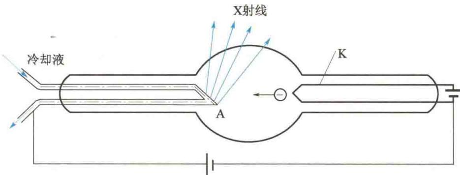
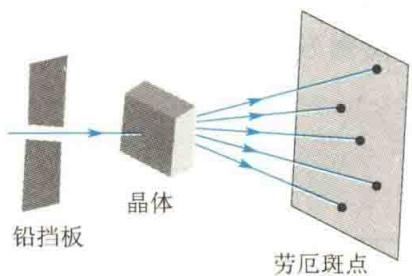
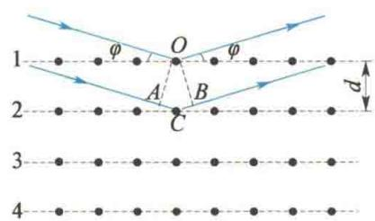

import QRCodeVideo from '@/components/QRCodeVideo.astro';

import Guide from '@/components/Guide.astro';
import Knowledge from '@/components/Knowledge.astro';
import Example from '@/components/Example.astro';
import Analysis from '@/components/Analysis.astro';
import Solution from '@/components/Solution.astro';
import Variant from '@/components/Variant.astro';
import Note from '@/components/Note.astro';
import Block from '@/components/Block.astro';
import Method from '@/components/Method.astro';
import Exercise from '@/components/Exercise.astro';

X射线又称为伦琴射线，是伦琴于1895年发现的。它是一种人眼看不见的、具有很强的穿透能力的电磁波，波长在 $0.01\sim 10\mathrm{nm}$ 之间。图13.18为X射线管的结构示意图。K是发射电子的热阴极，A是阳极。两极间加数万伏高压，阴极发射的电子在强电场的作用下加速，高速电子撞击阳极（靶）而产生X射线。
<QRCodeVideo title="伦琴" url="https://api.guangyiedu.com/v3/resource/resource/r/NewQrCode-vTaU4RgGnHfkRrnBxsUE" />  
  
图 13.18 X 射线管的结构示意图
X射线既然是一种电磁波，就应该与可见光一样有干涉和衍射现象。但由于它的波长太短，故用普通光栅观察不到X射线的衍射现象，而且也无法用机械方法制造出光栅常量与X射线的波长相近的光栅。1912年，德国物理学家劳厄(Laue)想到晶体内的原子是规则排列的，天然晶体实际上就是光栅常量很小的天然三维空间光栅。将晶体作为光栅，劳厄成功地进行了X射线衍射实验。他让一束X射线穿过铅挡板上的小孔照射到晶体上，如图13.19所示，结果晶体后面的感光胶片上形成按一定规律分布的斑点，称为劳厄斑点。实验的成功既证明了X射线具有波动性质，也证明了晶体内的原子是按一定的间隔、规则排列的。从此，人们开始广泛利用X射线作晶体结构分析。
1913年，英国布拉格（Bragg）父子提出了另一种研究X射线的衍射方法。他们认为，晶体是由一系列彼此相互平行的原子层构成的。当X射线照射晶体时，晶体点阵中的原子（或离子）便成为发射子波的波源，向各个方向发出衍射波（也称为散射波），这些衍射波都是相干波，它们的叠加可分两种情况来研究：一是从同一原子层中各原子发出衍射波的相干叠加（称为点间干涉）；二是从不同原子层中各原子发出衍射波的相干叠加（称为面间干涉）。布拉格父子证明了：只有在以晶面为镜面并满足反射定律的方向上，点间干涉和面间干涉才能同时满足衍射主极大的条件.
如图 13.20 所示, 设两原子层之间的距离为 d, 称为晶格常数(或晶面间距), 当一束平行相干的 X 射线以掠射角 $\varphi$ 入射时, 相邻两原子层的反射线的光程差为
$$
A C + B C = 2 d \sin \varphi
$$
显然，符合下述条件
$$
2 d \sin \varphi = k \lambda (k = 1, 2, 3, \dots)\tag{13.13}
$$
时，各层晶面的反射线都将相互加强，形成亮点.式（13.13）就是著名的布拉格公式.
  
图13.19 劳厄实验
  
图13.20 布拉格方法
从式(13.13)可知,如果已知d和 $\varphi$ ,则可算出X射线的波长 $\lambda$ ;同理,若已知X射线的波长 $\lambda$ 和 $\varphi$ ,则可推算出晶体的晶格常数d.沿这两方面分别发展起来的X射线光谱分析法和X射线晶体结构分析法,无论是在物质结构的研究中,还是在工程技术上都有极大的应用价值.

<Example title="例 13.8">
用方解石分析 X 射线谱, 已知方解石的晶格常数为 $3.029 \times 10^{-10}$ m, 今在 $43^{\circ}20'$ 和 $40^{\circ}42'$ 的掠射方向上观察到两条最大谱线, 求这两条谱线的波长.

<Solution title="解">
根据布拉格公式
$$
2 d \sin \varphi = k \lambda
$$
$$
\begin{array}{r l} \lambda_ {1} & = 2 \times 3. 0 2 9 \times 1 0 ^ {- 1 0} \times \sin 4 3 ^ {\circ} 2 0 ^ {\prime} \mathrm{m} \\ & = 4. 1 5 \times 1 0 ^ {- 1 0} \mathrm{m} = 0. 4 1 5 \mathrm{nm} \end{array}
$$
对于主极大 $(k = 1)$ 谱线，其波长为
对于 $\varphi_{2} = 40^{\circ}42^{\prime}$ ，相应的波长为
$$
\lambda = 2 d \sin \varphi
$$
对于 $\varphi_{1} = 43^{\circ}20^{\prime}$ ，相应的波长为
$$
\begin{array}{r l} \lambda_ {2} & = 2 \times 3. 0 2 9 \times 1 0 ^ {- 1 0} \times \sin 4 0 ^ {\circ} 4 2 ^ {\prime} \mathrm{m} \\ & = 3. 9 5 \times 1 0 ^ {- 1 0} \mathrm{m} = 0. 3 9 5 \mathrm{nm} \end{array}
$$
</Solution>
</Example>

<Example title="例 13.9">
比较两条单色的 X 射线的谱线时注意到, 谱线 A 在与一个晶体的光滑面成 $30^{\circ}$ 的掠射角处给出第 1 级反射极大. 已知谱线 B 的波长为 0.097 nm, 谱线 B 在与同一晶体的同一光滑面成 $60^{\circ}$ 的掠射角处, 给出第 3 级反射极大. 试求谱线 A 的波长.

<Solution title="解">
根据布拉格公式
$$
2 d \sin \varphi = k \lambda
$$
$$
2 d \sin 6 0 ^ {\circ} = 3 \lambda_ {\mathrm{B}}
$$
对波长为 $\lambda_{\mathrm{A}}$ 的X射线有
$$
2 d \sin 3 0 ^ {\circ} = \lambda_ {\mathrm{A}}
$$
因此
$$
\frac {\lambda_ {\mathrm{A}}}{3 \lambda_ {\mathrm{B}}} = \frac {\sin 3 0 ^ {\circ}}{\sin 6 0 ^ {\circ}}
$$
对波长为 $\lambda_{\mathrm{B}}$ 的X射线有
$$
\begin{array}{r l} \lambda_ {\mathrm{A}} & = \frac {3 \lambda_ {\mathrm{B}} \sin 3 0 ^ {\circ}}{\sin 6 0 ^ {\circ}} = \frac {3 \times 0 . 0 9 7 \times \sin 3 0 ^ {\circ}}{\sin 6 0 ^ {\circ}} \mathrm{nm} \\ & = 0. 1 6 8 \mathrm{nm} \end{array}
$$
</Solution>
</Example>
