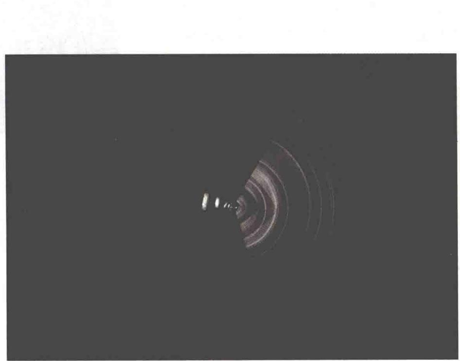

import QRCodeVideo from '@/components/QRCodeVideo.astro';

import Guide from '@/components/Guide.astro';
import Knowledge from '@/components/Knowledge.astro';
import Example from '@/components/Example.astro';
import Analysis from '@/components/Analysis.astro';
import Solution from '@/components/Solution.astro';
import Variant from '@/components/Variant.astro';
import Note from '@/components/Note.astro';
import Block from '@/components/Block.astro';
import Method from '@/components/Method.astro';
import Exercise from '@/components/Exercise.astro';

## 解答题

<Exercise title="习题 13.3.1">
衍射的本质是什么？衍射和干涉有什么联系和区别？
</Exercise>

<Exercise title="习题 13.3.2">
在单缝夫琅禾费衍射实验中,如果把狭缝沿凸透镜的光轴方向平移,衍射图样是否会跟着移动?若狭缝沿垂直于凸透镜的光轴方向平移,衍射图样是否会跟着移动?
</Exercise>

<Exercise title="习题 13.3.3">
什么叫半波带？单缝衍射中怎样划分半波带？对应于单缝衍射的第3级明纹和第4级暗纹，单缝处的波阵面各可分成几个半波带？
</Exercise>

<Exercise title="习题 13.3.4">
在单缝衍射中,为什么衍射角 $\varphi$ 愈大(级次愈大)的那些明纹的亮度愈小?
</Exercise>

<Exercise title="习题 13.3.5">
单缝衍射暗纹条件与双缝干涉明纹条件在形式上类似,两者是否矛盾?怎样说明?
</Exercise>

<Exercise title="习题 13.3.6">
光栅衍射与单缝衍射有何区别？为何光栅衍射的明纹特别明亮而暗纹很宽？
</Exercise>

<Exercise title="习题 13.3.7">
试指出当衍射光栅的光栅常量为下述3种情况时，哪些级次的衍射明纹缺级.(1) $a+b=2a$ ;(2) $a+b=3a$ ;(3) $a+b=4a$ .
</Exercise>

<Exercise title="习题 13.3.8">
若以白光垂直入射光栅,不同波长的光将会有不同的衍射角.问:(1)零级明纹能否分开不同波长的光?(2)在可见光中,哪种颜色的光的衍射角最大?不同波长的光的分开程度与什么因素有关?
</Exercise>

<Exercise title="习题 13.3.9">
一单色平行光垂直照射一狭缝, 若其第 3 级明纹位置正好与波长为 600 nm 的单色平行光的第 2 级明纹位置重合, 求前一种单色光的波长.
</Exercise>

<Exercise title="习题 13.3.10">
用橙黄色的平行光垂直照射一宽为 $a = 0.60 \mathrm{~mm}$ 的狭缝, 狭缝后凸透镜的焦距 $f = 40.0 \mathrm{~cm}$ , 在观察屏上形成衍射条纹, 屏上离中央明纹中心 $1.40 \mathrm{~mm}$ 的 $P$ 点处为一明纹. (1) 求入射光的波长; (2) 求 $P$ 点处条纹的级次; (3) 从 $P$ 点看, 对该光波而言, 狭缝处的波阵面可分成几个半波带?
</Exercise>

<Exercise title="习题 13.3.11">
用 $\lambda = 590\mathrm{nm}$ 的钠黄光垂直照射每毫米有500条刻痕的光栅，问最多能看到第几级明纹？
</Exercise>

<Exercise title="习题 13.3.12">
用波长 $\lambda = 600 \, nm$ 的单色光垂直照射一光栅，第 2、3 级明纹分别出现在 $\sin \varphi_{2} = 0.20$ 与 $\sin \varphi_{3} = 0.30$ 处，第 4 级缺级。求：(1) 光栅常量；(2) 光栅上狭缝的宽度；(3) 在 $-90^{\circ} < \varphi < 90^{\circ}$ 范围内，实际呈现的全部级次。
</Exercise>

<Exercise title="习题 13.3.13">
一双缝装置的两缝间距为0.1 mm，缝宽均为0.02 mm，用波长为480 nm的平行单色光垂直入射双缝，双缝后放一焦距为50 cm的透镜。（1）求透镜焦平面上单缝衍射中央明纹的宽度；（2）单缝衍射的中央明纹包迹内有多少条双缝衍射明纹？
</Exercise>

<Exercise title="习题 13.3.14">
在圆孔夫琅禾费衍射实验中, 设圆孔半径为 0.10 mm, 透镜焦距为 50 cm, 所用单色光波长为 500 nm, 求在透镜焦平面处屏幕上呈现的艾里斑的半径.
</Exercise>

<Exercise title="习题 13.3.15">
已知天空中两颗星相对于一望远镜的角距离为 $4.84 \times 10^{-6}$ rad，它们都发出波长为 550 nm 的光，试问望远镜的口径至少要多大，才能分辨出这两颗星？
</Exercise>

<Exercise title="习题 13.3.16">
已知入射的 X 射线束含有 $0.095 \sim 0.13 \, nm$ 范围内的各种波长，晶体的晶格常数为 $0.275 \, nm$ ，当用 X 射线以 $45^{\circ}$ 角照射该晶体时，问对哪些波长的 X 射线能产生强反射？

<QRCodeVideo title="本章提要" url="https://api.guangyiedu.com/v3/resource/resource/r/NewQrCode-WMPvIYtp28J4P2OAqSsw" />  
</Exercise>
