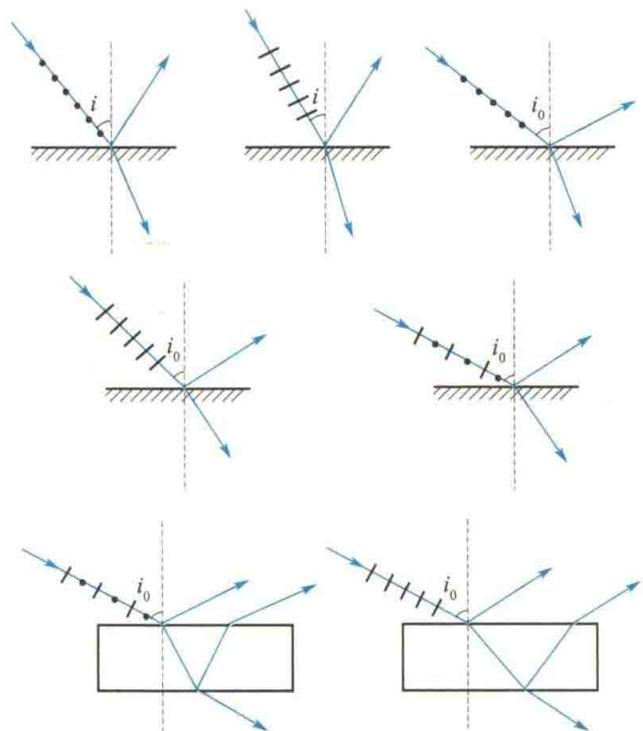

import Guide from '@/components/Guide.astro';
import Knowledge from '@/components/Knowledge.astro';
import Example from '@/components/Example.astro';
import Analysis from '@/components/Analysis.astro';
import Solution from '@/components/Solution.astro';
import Variant from '@/components/Variant.astro';
import Note from '@/components/Note.astro';
import Block from '@/components/Block.astro';
import Method from '@/components/Method.astro';
import Exercise from '@/components/Exercise.astro';

## 解答题

<Exercise title="习题 14.3.1">
自然光是否一定不是单色光？线偏振光是否一定是单色光？
</Exercise>

<Exercise title="习题 14.3.2">
用哪些方法可以获得线偏振光？怎样用实验来检验线偏振光、部分偏振光和自然光？
</Exercise>

<Exercise title="习题 14.3.3">
一束光入射到两种透明介质的分界面上时,发现只有透射光而无反射光,试说明这束光是怎样入射的,其偏振状态如何.
</Exercise>

<Exercise title="习题 14.3.4">
什么是光轴、主截面和主平面？什么是寻常光和非常光？它们的振动方向和各自的主平面有何关系？
</Exercise>

<Exercise title="习题 14.3.5">
在单轴晶体中，e 光是否总是以 $c/n_{e}$ 的速率传播？在哪个方向上以 $c/n_{0}$ 的速率传播？
</Exercise>

<Exercise title="习题 14.3.6">
是否只有自然光入射晶体时才能产生 o 光和 e 光？
</Exercise>

<Exercise title="习题 14.3.7">
投射到起偏器的自然光的光强为 $I_{0}$ ，开始时，起偏器和检偏器的透光轴方向平行，然后使检偏器绕入射光的传播方向转过 $30^{\circ}, 45^{\circ}, 60^{\circ}$ ，试分别求出在上述三种情况下，透过检偏器后光强是 $I_{0}$ 的几倍。
</Exercise>

<Exercise title="习题 14.3.8">
使自然光通过两个偏振化方向夹角为 $60^{\circ}$ 的偏振片时，透射光的光强为 $I_{1}$ ，今在这两个偏振片之间再插入一偏振片，它的偏振化方向与前两个偏振片均成 $30^{\circ}$ 角，此时透射光光强 $I$ 与 $I_{1}$ 之比为多少？
</Exercise>

<Exercise title="习题 14.3.9">
自然光入射到两个重叠的偏振片上. 如果透射光的光强为: (1) 透射光的最大光强的三分之一; (2) 入射光的光强的三分之一, 则这两个偏振片透光轴方向间的夹角为多少?
</Exercise>

<Exercise title="习题 14.3.10">
一束自然光从空气入射到折射率为 1.40 的液体表面上, 其反射光是完全偏振光. 试求: (1) 入射角; (2) 折射角.
</Exercise>

<Exercise title="习题 14.3.11">
利用布儒斯特定律怎样测定不透明介质的折射率？若测得某介质在空气中的起偏角为 $58^{\circ}$ ，求该介质的折射率.
</Exercise>

<Exercise title="习题 14.3.12">
光由空气射入折射率为 n 的玻璃. 在如题 14.3.12 图所示的各种情况中, 用黑点和短线把反射光和折射光的振动方向表示出来, 并标明是线偏振光还是部分偏振光. 图中, $i \neq i_{0}, i_{0} = \arctan n$ .

  

题14.3.12图
</Exercise>

<Exercise title="习题 14.3.13">
如果一个二分之一波片或四分之一波片的光轴与起偏器的偏振化方向成 $30^{\circ}$ 角，则要想分别得到下列三种偏振光，应使用二分之一波片还是四分之一波片？为什么？（1）线偏振光；（2）圆偏振光；（3）椭圆偏振光.
</Exercise>

<Exercise title="习题 14.3.14">
垂直于石英光轴切出厚度为 $1 \, mm$ 的晶片，将其放在两平行的偏振片之间，对某一波长的光波经过晶片后振动面旋转了 $20^{\circ}$ . 问：石英晶片的厚度变为多少时，该波长的光将完全不能通过？
</Exercise>
