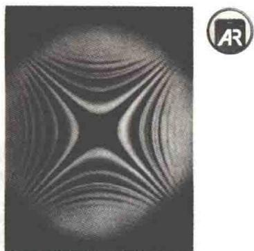
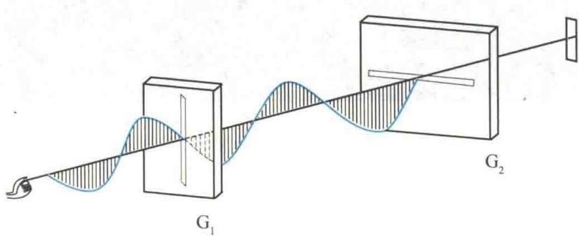
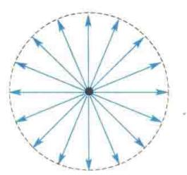
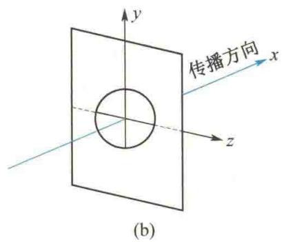
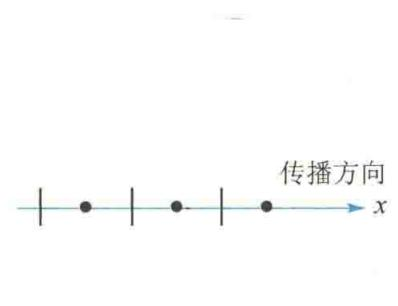
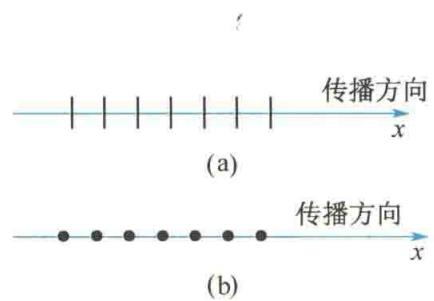
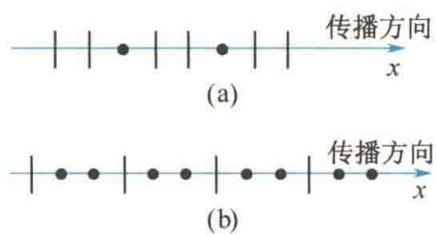

import Guide from '@/components/Guide.astro';
import Knowledge from '@/components/Knowledge.astro';
import Example from '@/components/Example.astro';
import Analysis from '@/components/Analysis.astro';
import Solution from '@/components/Solution.astro';
import Variant from '@/components/Variant.astro';
import Note from '@/components/Note.astro';
import Block from '@/components/Block.astro';
import Method from '@/components/Method.astro';
import Exercise from '@/components/Exercise.astro';

## 第14章 光的偏振

本章提要
光的干涉和衍射现象揭示了光的波动性,但通过这些现象还不能知道光是纵波还是横波.光的偏振现象清楚地显示出光具有横波的性质,这一点和光的电磁理论的预言一致.可以说,光的偏振现象为证明光是电磁波提供了进一步的证据.
光的偏振现象在自然界中普遍存在. 光的反射、折射以及光在晶体中传播时的双折射都与光的偏振现象有关. 利用光的这种性质, 可以研究晶体的结构, 也可以测定机械结构内部的应力分布情况. 此外, 糖量计、偏振光立体电影、袖珍计算器等都属于偏振光的应用.

## 14.1.1 横波的偏振性

波可以分为纵波和横波. 横波的传播方向和质点的振动方向垂直, 通过波的传播方向且包含振动矢量的那个平面称为振动面. 显然, 振动面与包含传播方向在内的其他平面不同. 波的振动方向相对于传播方向没有对称性, 这种不对称性叫作偏振. 实验表明, 只有横波才有偏振现象. 如图 14.1 所示, 将橡皮绳一端固定, 用手拉着穿过缝隙的橡皮绳的另一端上下抖动, 于是就有横波沿绳传播. 如果两缝的方向互相垂直, 那么通过 $G_{1}$ 的振动传到 $G_{2}$ 处时就被挡住, 在 $G_{2}$ 之后不再有波动. 如果以波
  
光的偏振
动的传播方向为轴转动 $G_{2}$ ，使两缝的方向一致，那么通过 $G_{1}$ 的振动可以无阻碍地通过 $G_{2}$ 。显然，这种现象只可能在横波的情况下发生。而纵波的振动方向与传播方向一致，转动 $G_{2}$ ，不论缝的方向如何，对纵波的传播都没有任何影响。
<figure class="vp-figure">
  
  <figcaption>图14.1 横波的偏振性</figcaption>
</figure>
光波是电磁波, 光波中光矢量的振动方向总是和光的传播方向垂直. 当光的传播方向确定以后, 在与光传播方向垂直的平面内, 光的振动方向仍然是不确定的, 光矢量可能有各种不同的振动状态, 这些振动状态通常称为光的偏振态. 按照光振动状态的不同, 可以把光分为五类: 自然光、线偏振光、部分偏振光、椭圆偏振光和圆偏振光. 下面对前三类光分别予以说明.

## 14.1.2 自然光

普通光源发出的光是大量原子或分子发光的总和. 不仅不同原子或同一原子不同时刻发出的光波的初相位彼此毫无关联, 其振动方向也是互不相关、随机分布的. 从宏观上看, 光源发出的光中包含了所有方向上的光振动, 没有哪一个方向上的光振动比其他方向占优势. 在垂直于光传播方向的平面内, 存在沿各个方向振动的光矢量. 平均来说, 光振动相对光的传播方向是轴对称且均匀分布的. 在各个方向上, 光矢量对时间的平均值是相等的. 也就是说, 光振动的振幅在垂直于光波的传播方向上, 既有时间分布的均匀性, 又有空间分布的均匀性, 具有这种特性的光就叫作自然光, 如图 14.2(a) 所示. 为研究问题方便起见, 常把自然光中各个方向上的光振动都分解为方向确定的两个相互垂直的分振动, 这样, 就可将自然光表示成两个相互垂直、振幅相等、独立的光振动, 如图 14.2(b) 所示. 这种分解不论在哪两个相互垂直的方向上进行, 其结果都是相同的. 显然, 每一独立光振动的光强都等于自然光光强的一半. 但应注意, 由于自然光光振动的随机性, 这两个相互垂直的光矢量之间没有恒定的相位差, 因而它们是不相干的. 图 14.2(c) 是自然光的表示法, 图中用短线和点分别表示在纸面内和垂直于纸面的光振动, 点和短线交替均匀画出, 表示光矢量对称且均匀分布.
(a)  

  
(c)  
图14.2 自然光

## 14.1.3 线偏振光

如果光波的光矢量的方向始终不变, 即只沿一个固定方向振动, 那么这种光称为线偏振光. 在光学实验中, 采用某些装置将自然光中相互垂直的两个分振动之一完全移去, 就可获得线偏振光, 所以线偏振光又称完全偏振光. 因线偏振光中沿传播方向各处的光矢量都在同一振动面内, 故线偏振光也称为平面偏振光, 简称偏振光. 图 14.3 是线偏振光的示意图. 图 14.3(a)
<figure class="vp-figure">
  
  <figcaption>图14.3 线偏振光</figcaption>
</figure>
表示光振动方向在纸面内的线偏振光, 图 14.3(b) 表示光振动方向垂直于纸面的线偏振光.
因为不可能把一个原子所发射的光波分离出来,所以在实验中获得的线偏振光,是包含众多原子的光波中光振动方向都已相互平行的成分.

## 14.1.4 部分偏振光

除了上述讨论的自然光和线偏振光,还有一种介于两者之间的偏振光,这种光在垂直于光的传播方向的平面内,各方向上的振动都有,但它们的振幅大小不相等,称为部分偏振光.部分偏振光可以看作偏振光与自然光的混合.其光振动通常可这样表示:在某一确定方向上的光振动较强,在与之垂直的方向上的光振动较弱.这两个方向上的光振动的强弱对比度愈高,表明其愈接近完全偏振光.图14.4是部分偏振光的表示法.图14.4(a)表示在纸面内的光振动较强,图14.4(b)表示垂直于纸面的光振动较强.

在同一方向上传播的两列频率相同的线偏振光,如果它们的振动方向相互垂直,且具有
图14.4 部分偏振光
固定的相位差 $\Delta\varphi$ ，则当 $\Delta\varphi = k\pi (k = 0, \pm1, \pm2, \cdots)$ 时，它们合成的光矢量末端的轨迹是一条直线，这时两列线偏振光合成后仍为线偏振光；当它们的振幅不相等， $\Delta\varphi \neq k\pi$ ，或振幅相等， $\Delta\varphi \neq k\pi$ 且 $\Delta\varphi \neq (2k+1)\frac{\pi}{2}$ 时，合成光矢量末端的轨迹是椭圆，这时两列线偏振光合成为椭圆偏振光；当它们的振幅相等， $\Delta\varphi = (2k+1)\frac{\pi}{2}$ 时，合成光矢量末端的轨迹是圆，这时两列线偏振光合成为圆偏振光。迎着光源看时，如果光矢量顺时针旋转，则称其为右旋椭圆偏振光或圆偏振光；如果光矢量逆时针旋转，则称其为左旋椭圆偏振光或圆偏振光。

