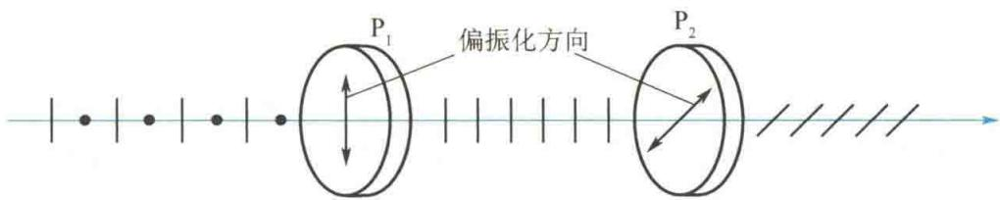
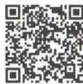
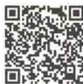
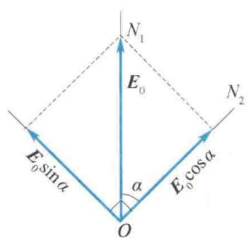
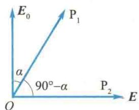

import Guide from '@/components/Guide.astro';
import Knowledge from '@/components/Knowledge.astro';
import Example from '@/components/Example.astro';
import Analysis from '@/components/Analysis.astro';
import Solution from '@/components/Solution.astro';
import Variant from '@/components/Variant.astro';
import Note from '@/components/Note.astro';
import Block from '@/components/Block.astro';
import Method from '@/components/Method.astro';
import Exercise from '@/components/Exercise.astro';

普通光源发出的光都是自然光. 利用偏振片从自然光中获取偏振光是最简便的方法. 除此之外, 利用光的反射和折射或晶体棱镜也可以获取偏振光. 从自然光中获得偏振光的装置称为起偏器. 下面介绍几种获取和检验偏振光的方法.

## 14.2.1 偏振片的起偏和检偏

偏振片是在透明的基片上蒸镀一层特殊的物质(如硫酸金鸡纳碱、碘化硫酸奎宁等)晶粒制成的.这种晶粒对相互垂直的两个分振动光矢量具有选择性吸收的性质,即对某一方向上的光振动有强烈的吸收性,而对与之垂直的光振动则吸收得很少,晶粒的这种性质称为二向色性.因此偏振片基本上只允许某一特定方向上的光振动通过,这一方向称为偏振片的偏振化方向,也称透光轴.如图14.5所示,当自然光垂直照射偏振片 $P_{1}$ 时,透过 $P_{1}$ 的光就成为光振动方向平行于该透光轴方向的线偏振光,这一过程称为起偏.透过的线偏振光的光强只有入射自然光光强的一半.
  
图14.5 起偏和检偏
偏振片也可用来检验某一光束是否为线偏振光，这一过程称为检偏。用作检验光的偏振状态的装置称为检偏器。图14.5中的偏振片 $\mathrm{P}_2$ 就是一种检偏器。当透过 $\mathrm{P}_1$ 所形成的线偏振光再垂直入射偏振片 $\mathrm{P}_2$ 时，如果 $\mathrm{P}_2$ 的透光轴与线偏振光的振动方向相同，则该线偏振光可全部透过 $\mathrm{P}_2$ ，在 $\mathrm{P}_2$ 的后面能观察到光；如果把 $\mathrm{P}_2$ 绕光的传播方向旋转 $90^{\circ}$ ，即当 $\mathrm{P}_2$ 的透光轴与线偏振光的振动方向相互垂直时，由于线偏振光全部被 $\mathrm{P}_2$ 吸收，在 $\mathrm{P}_2$ 的后面就观察不到光，即出现消光现象；如果让 $\mathrm{P}_2$ 绕入射线偏振光的传播方向缓慢转动一周，就会发现透过 $\mathrm{P}_2$ 的光的光强不断改变，并经历两次光强最大和两次光强为零的过程。如果入射 $\mathrm{P}_2$ 的是自然光，上述过程就不会出现；如果入射 $\mathrm{P}_2$ 的是部分偏振光，则会经历两次光强最大和两次光强最小的过程，但不会出现光强为零的现象。线偏振光透过 $\mathrm{P}_2$ 后，光强的变化遵循马吕斯定律。

怎样选择夏天戴的偏光太阳镜？

## 14.2.2 马吕斯定律

1809 年, 马吕斯在研究线偏振光通过检偏器后的透射光光强时发现, 如果入射线偏振光的光强为 $I_{0}$ , 则透过检偏器后, 透射光的光强 I 为
$$
I = I _ {0} \cos^ {2} \alpha\tag{14.1}
$$
式中， $\alpha$ 是线偏振光的振动方向与检偏器的透光轴方向之间的夹角. 式(14.1)称为马吕斯定律，现证明如下.
如图 14.6 所示, $ON_{1}$ 表示入射线偏振光的振动方向, $ON_{2}$ 表示检偏器的透光轴方向,两者的夹角为 $\alpha$ . 入射线偏振光的光矢量振幅为 $E_{0}$ , 将此光矢量沿 $ON_{2}$ 及垂直于 $ON_{2}$ 的方向分解为两个分量, 它们的大小分别为 $E_{0}\cos\alpha$ 和 $E_{0}\sin\alpha$ , 其中只有平行于检偏器透光轴方向 $ON_{2}$ 的分量可以透过检偏器. 由于光强和振幅的平方成正比, 所以透过检偏器的透射光的光强 I 和入射线偏振光的光强 $I_{0}$ 之比为

  
马吕斯定律  
图14.6 马吕斯定律的证明
$$
\frac {I}{I _ {0}} = \frac {(E _ {0} \cos \alpha) ^ {2}}{E _ {0} ^ {2}} = \cos^ {2} \alpha
$$
即
$$
I = I _ {0} \cos^ {2} \alpha
$$
如果入射检偏器的线偏振光是起偏器产生的透射光,如图 14.5 所示,那么上式中的 $\alpha$ 就等于起偏器与检偏器两透光轴方向之间的夹角.
从马吕斯定律可以看出，线偏振光透过检偏器后，光强随入射线偏振光的振动方向和检偏器的透光轴方向之间的夹角 $\alpha$ 的改变而改变。当 $\alpha = 0$ 时， $I = I_0$ ，透过检偏器的光强最大；当 $\alpha = 90^\circ$ 时， $I = 0$ ，没有光透过检偏器，即出现消光现象。

<Example title="例 14.1">
一光束由线偏振光和自然光混合而成,当它透过偏振片时,改变偏振片的透光轴的方向,发现透射光的光强的最大值是最小值的5倍.求入射光束中两种成分的光的相对强度.

<Solution title="解">
设光束的总光强为 I，其中线偏振光的光强为 $I_{1}$ ，自然光的光强为 $I_{0}$ ，则 $I = I_{1} + I_{0}$ .
透过偏振片后,自然光的光强为 $\frac{I_{0}}{2}$ ,且与偏振片的透光轴方向无关.线偏振光的最大光强出现在偏振片的透光轴方向平行于线偏振光的振动方向时，大小为 $I_{1}$ ；线偏振光的最小光强出现在偏振片的透光轴方向垂直于线偏振光的振动方向时，大小为零。故透过偏振片的混合光强最大为 $\frac{I_{0}}{2}+I_{1}$ ，最小为 $\frac{I_{0}}{2}$ ，所以有
$$
\frac {\frac {I _ {0}}{2} + I _ {1}}{\frac {I _ {0}}{2}} = 5
$$
由此得到
$$
I _ {1}: I _ {0} = 2: 1
$$
即线偏振光的光强 $I_{1} = \frac{2}{3} I$ ，自然光的光强 $I_0 = \frac{1}{3} I.$
</Solution>
</Example>

<Example title="例 14.2">
要使一束线偏振光透过偏振片后其振动方向转过 $90^{\circ}$ , 至少需要让这束光透过几块偏振片? 在此情况下, 透射光的最大光强是原来光的光强的多少倍?

<Solution title="解">
至少需要两块偏振片(见图 14.7). 其中第一块偏振片 $P_{1}$ 的透光轴方向与线偏振光振动方向的夹角为 $\alpha$ ，第二块偏振片 $P_{2}$ 的透光轴与 $P_{1}$ 的透光轴的夹角为 $(90^{\circ}-\alpha)$ . 设入射的线偏振光的光强为 $I_{0}$ ，则透射光的光强为
$$
\begin{array}{r l} I & = I _ {0} \cos^ {2} \alpha \cos^ {2} (9 0 ^ {\circ} - \alpha) = I _ {0} \cos^ {2} \alpha \sin^ {2} \alpha \\ & = \frac {I _ {0}}{4} \sin^ {2} 2 \alpha \end{array}
$$
当 $2\alpha = 90^{\circ}$ ，即 $\alpha = 45^{\circ}$ 时， $I_{\mathrm{max}} = \frac{I_0}{4}$ 所以，透射光的
最大光强是原来光的光强的 $\frac{1}{4}$ .
  
图14.7 例14.2图

</Solution>
</Example>
