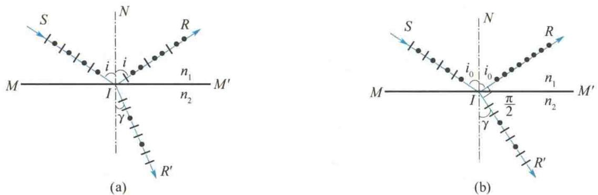
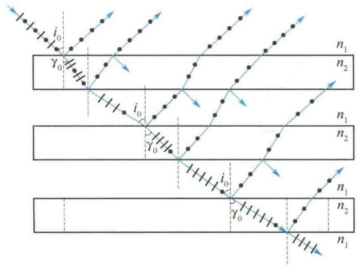
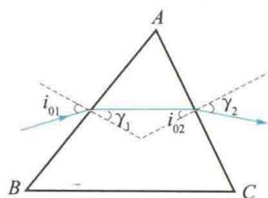
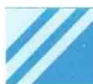

import QRCodeVideo from '@/components/QRCodeVideo.astro';

import Guide from '@/components/Guide.astro';
import Knowledge from '@/components/Knowledge.astro';
import Example from '@/components/Example.astro';
import Analysis from '@/components/Analysis.astro';
import Solution from '@/components/Solution.astro';
import Variant from '@/components/Variant.astro';
import Note from '@/components/Note.astro';
import Block from '@/components/Block.astro';
import Method from '@/components/Method.astro';
import Exercise from '@/components/Exercise.astro';

自然光在两种各向同性的介质分界面上发生反射和折射时,反射光和折射光都将成为部分偏振光;在特定情况下,反射光有可能成为完全偏振光,即线偏振光.
如图 14.8(a) 所示, $MM'$ 是两种介质(如空气和玻璃)的分界面, $SI$ 是一束自然光的入射线, $IR$ 和 $IR'$ 分别为反射线和折射线, $i$ 为入射角, $\gamma$ 为折射角. 可以把自然光分解为两个相互垂直的光振动, 一个与入射面垂直(图中用黑点表示), 称为垂直振动; 另一个和入射面平行(图中用短线表示), 称为平行振动. 实验发现, 在反射光束中, 垂直振动多于平行振动, 而在折射光束中, 平行振动多于垂直振动, 即反射光和折射光均为部分偏振光.
理论和实验都证明,反射光的偏振化程度和入射角有关,当入射角等于某一特定值 $i_{0}$ ,且满足
$$
\tan i _ {0} = \frac {n _ {2}}{n _ {1}}\tag{14.2}
$$
时，反射光中只有垂直于入射面的分振动，成为线偏振光；而折射光仍为部分偏振光，但这时折射光的偏振化程度最高，如图14.8(b)所示.式(14.2)称为布儒斯特定律， $i_{0}$ 称为布儒斯特角或起偏角，式中， $n_{1}$ 、 $n_{2}$ 为界面上、下介质的折射率.例如，自然光从空气射向折射率为1.50的玻璃面时，起偏角为 $56.3^{\circ}$ .
  
图 14.8 反射和折射时光的偏振
根据折射定律, $n_{1}\sin i_{0}=n_{2}\sin\gamma$ ,又由布儒斯特定律有
$$
\tan i _ {0} = \frac {\sin i _ {0}}{\cos i _ {0}} = \frac {n _ {2}}{n _ {1}}
$$
可得
$$
\sin \gamma = \cos i _ {0}
$$
故
$$
i _ {0} + \gamma = \frac {\pi}{2}
$$
这说明,当入射角为起偏角时,反射光与折射光相互垂直.
自然光以起偏角入射时,反射光虽然是线偏振光,但光强很弱.以自然光从空气入射到玻璃界面上为例,此时反射光的光强只占入射自然光中垂直振动光强的15%,折射光占入射自然光中垂直振动光强的85%和平行振动的全部光强.所以,虽然折射光的光强很大,但它的偏振化程度却不高.
<QRCodeVideo title="布儒斯特" url="https://api.guangyiedu.com/v3/resource/resource/r/NewQrCode-Dg4wpC3ELRARN5Uwn3zw" />  
为了增强反射光的光强和折射光的偏振化程度,可以把许多相互平行的玻璃片重叠,形成玻璃片堆,如图14.9所示.当自然光以起偏角 $i_{0}$ 入射到玻璃片堆上时,不仅光从空气入射到玻璃片的各层界面上时,反射光都是垂直于入射面的光振动,而且光从玻璃片入射到空气层的各界面上时,因为其入射角 $\gamma_{0}=\frac{\pi}{2}-i_{0}$ ,即 $\tan\gamma_{0}=\tan\left(\frac{\pi}{2}-i_{0}\right)=\cot i_{0}=\frac{n_{1}}{n_{2}}$ ,所以对这个界面来说 $\gamma_{0}$ 又是起偏角,即光从玻璃片入射到空气层的各界面上时,反射光也都是垂直于入射面的光振动.这样,折射光中的垂直振动因多次反射而不断减弱,因而其偏振化程度将会逐渐增强,当玻璃片足够多时,最后透射出来的光就近似为平行于入射面的线偏振光.同时,由于玻璃片堆各层反射光的累加,反射光的光强也得到增强.利用这种方法,可以获得两束振动方向相互垂直的线偏振光.
<QRCodeVideo title="布儒斯特定律" url="https://api.guangyiedu.com/v3/resource/resource/r/NewQrCode-Li69yD1BheItWr8fJw09" />  
  
图 14.9 利用玻璃片堆获取线偏振光

<Example title="例 14.3">
利用布儒斯特定律可以测定不透明介质(如珐琅等)的折射率. 当一束平行自然光从空气中以 $58^{\circ}$ 角入射到某介质材料表面上时, 检验出反射光是线偏振光, 求该介质的折射率.

<Solution title="解">
根据布儒斯特定律
$$
\tan i _ {0} = \frac {n _ {2}}{n _ {1}}
$$
$$
n _ {2} = n _ {1} \tan i _ {0} = \tan 5 8 ^ {\circ} = 1. 6 0
$$
</Solution>
</Example>

<Example title="例 14.4">
图 14.10 所示为一玻璃三棱镜, 材料的折射率为 n = 1.50, 设光在棱镜中传播时能量不被吸收。(1) 一束光强为 $I_{0}$ 的单色光, 从空气入射到棱镜左侧界面上折射进入棱镜。若要求入射光能全部进入棱镜, 则对入射光和入射角有何要求? (2) 若要求光束经棱镜从右侧折射出来, 光强仍保持不变, 则对棱镜顶角有何要求?

<Solution title="解">
（1）若要求入射光全部折射到棱镜里，则要求其反射光的光强为零.对于自然光，此条件无法满足.若入射光为光振动平行于入射面的线偏振光，则在入射角等于起偏角的情况下，反射光的光强为零，入射光将全部进入棱镜.因此要求入射光是振动方向平行于入射面的线偏振光.入射角 $i_{01}$ 为
$$
i _ {0 1} = \arctan n = \arctan 1. 5 0 = 5 6. 3 ^ {\circ}
$$
(2) 当进入棱镜的光射到棱镜右侧界面上时, 因它只包含平行于入射面的光振动, 只要以起偏角入射, 其反射光的光强就仍然为零, 进入棱镜的光将全部折射出棱镜而保持光强不变. 这时投射到界面 AC 的起偏角 $i_{02}$ 为
  
图14.10 例14.4图
$$
i _ {0 2} = \arctan {\frac {1}{n}} = \arctan {\frac {1}{1 . 5 0}} = 3 3. 7 ^ {\circ}
$$
因为 $i_{01} + \gamma_{1} = 90^{\circ}, i_{02} + \gamma_{2} = 90^{\circ}$ ，由图 14.10 中的几何关系可以看出
$$
\begin{array}{r l} \angle A & = \gamma_ {1} + i _ {0 2} = 9 0 ^ {\circ} - i _ {0 1} + i _ {0 2} \\ & = 9 0 ^ {\circ} - 5 6. 3 ^ {\circ} + 3 3. 7 ^ {\circ} \\ & = 6 7. 4 ^ {\circ} \end{array}
$$

</Solution>
</Example>
