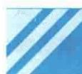
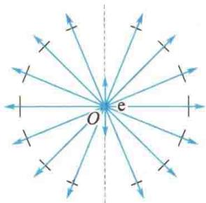
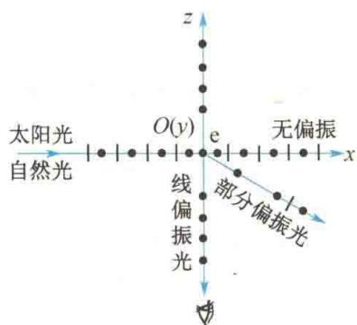

import Guide from '@/components/Guide.astro';
import Knowledge from '@/components/Knowledge.astro';
import Example from '@/components/Example.astro';
import Analysis from '@/components/Analysis.astro';
import Solution from '@/components/Solution.astro';
import Variant from '@/components/Variant.astro';
import Note from '@/components/Note.astro';
import Block from '@/components/Block.astro';
import Method from '@/components/Method.astro';
import Exercise from '@/components/Exercise.astro';

在人的眼前放一块偏振片，并通过这块偏振片向天空望去，当转动偏振片时，会发现透过它的“天光”有明暗的变化。这说明“天光”是部分偏振光，这种部分偏振光是大气中的微粒或分子对太阳光散射的结果。

一束光射到一个微粒或分子上, 就会使其中的电子在光束内的电场矢量的作用下振动. 此类振动中的电子会向其周围发射同频率的电磁波, 即光, 这种现象叫作光的散射. 这种散射使人们能从侧面看到有灰尘的室内的太阳光束或大型歌舞晚会上的彩色激光射线.

分子中的一个电子振动时发出的光是偏振光,它的光振动方向总是垂直于光的传播方向(横波), 并和电子的振动方向在同一个平面内, 但是往各方向发出的光强不同: 在垂直于电子振动的方向上, 光强最大; 在沿电子振动的方向上, 光强为零. 图14.11 表示了这种情形, O 点处有一电子沿竖直方向振动, 它发出的球面波向四周传播, 各条光线上的短线表示该方向上光振动的方向, 短线的长短大致表示该方向上光振动的振幅.

如图 14.12 所示, 设太阳光沿水平方向 (x 轴方向) 射来, 它的水平方向 (y 轴方向, 垂直于纸面向里) 和竖直方向 (z 轴方向) 的光矢量激起位于 O 点处的分子中的电子做同方向的振动而发生光的散射. 结合图 14.11 所示的规律, 沿竖直方向向上看去, 就只有振动方向沿 y 轴方向的线偏振光了. 实际上, 由于人们看到的“天光”是大气中许多微粒或分子从不同方向散射来的光, 也可能是经过几次散射后射来的光, 又由于微粒或分子的大小会影响其散射光的光强, 故人们看到的“天光”就是部分偏振光.

  

图 14.11 振动的电子发出的光的振幅和偏振方向示意图

  

图14.12 太阳光的散射

另外，按照电磁理论，每个散射光波的振幅均与它的频率的平方成正比，其光强又和它的振幅的平方成正比，所以散射光的光强和光的频率的4次方成正比。由于蓝光的频率比红光高，所以太阳光中的蓝色光成分比红色光成分散射强度更大些。因此，天空看起来是蓝色的。在早晨或傍晚，太阳光沿地平线射来，在大气层中传播的距离较长，其中的蓝色光成分大都散射掉了，余下的进入人眼的光主要是频率较低的红色光，这就是朝阳或夕阳看起来发红的原因。
