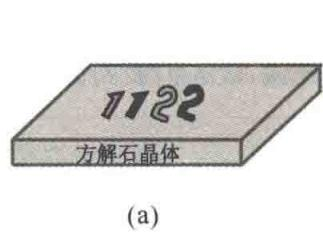
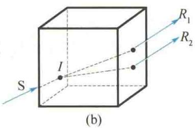
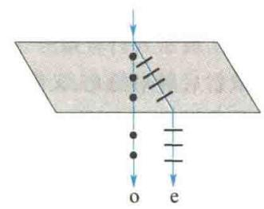
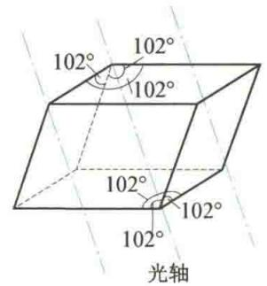
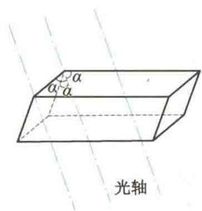
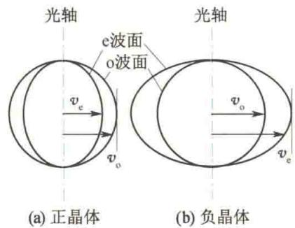
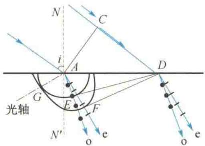
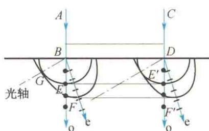
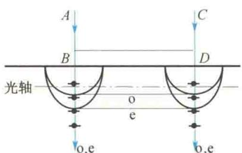

import Guide from '@/components/Guide.astro';
import Knowledge from '@/components/Knowledge.astro';
import Example from '@/components/Example.astro';
import Analysis from '@/components/Analysis.astro';
import Solution from '@/components/Solution.astro';
import Variant from '@/components/Variant.astro';
import Note from '@/components/Note.astro';
import Block from '@/components/Block.astro';
import Method from '@/components/Method.astro';
import Exercise from '@/components/Exercise.astro';

## 14.5.1 双折射现象 寻常光和非常光

当一束光射到两种各向同性介质（如空气和玻璃）的分界面上时，要发生反射和折射，并且反射光和折射光仍各为一束光。但是当光射入各向异性晶体（如方解石晶体）后，可以观察到有两束折射光，这种现象称为光的双折射现象。如图14.13(a)所示，把一块方解石晶体放在原印有一行字的纸面上，从上往下透过方解石晶体看字时，发现每个字都变成了相互错开的两个字，即每个字都有两个像。这是由光线进入方解石晶体后产生的两束折射光所致。图14.13(b)表示光在方解石晶体内的双折射现象。显然，晶体愈厚，透射出来的光线分得愈开。

实验发现,除立方晶系外,光线进入其他晶系时,一般都将产生双折射现象.

进一步的研究表明,两束折射光中的一束始终遵守折射定律,无论入射光的方向如何,其入射角 i 与折射角 $\gamma$ 的正弦之比始终为恒量,即 $\frac{\sin i}{\sin \gamma} = \frac{n_{2}}{n_{1}} =$ 恒量,这一束折射光称为寻常光,通常用 o表示，简称o光；另一束折射光不遵守折射定律，它不一定在入射面内，而且入射角 $i$ 改变时， $\frac{\sin i}{\sin\gamma}$ 的值不是一个常数，这束光称为非常光，通常用e表示，简称e光.让一束自然光垂直于方解石表面入射 $(i = 0)$ 时，o光沿原方向前进，e光一般会偏离原方向前进，如图14.14所示，这时，如果使方解石晶体以入射光线为轴旋转，将发现o光不动，而e光却随之绕轴旋转.用检偏器检验可知，o光和e光都是线偏振光.

  

图 14.13 方解石晶体内的双折射现象

  

图 14.14 寻常光和非常光

## 14.5.2 晶体的光轴与光线的主平面

晶体内存在着一个特殊方向, 光沿这个方向传播时不产生双折射现象, 即 o 光和 e 光重合, 在该方向上 o 光和 e 光的折射率相等, 光的传播速度相等. 这个特殊的方向称为晶体的光轴. 如天然方解石晶体是斜平行六面体, 两棱之间的夹角约为 $78^{\circ}$ 或 $102^{\circ}$ , 从其三个钝角面会合的顶点引出一条直线, 并使这条直线与三棱边都成等角, 这一直线的方向就是方解石晶体的光轴方向. 图 14.15(a) 所示为各棱边都相等的方解石晶体, 图 14.15(b) 所示为各棱边不相等的方解石晶体. 应该注意, 光轴不是指一条直线, 而是强调其“方向”.

  

(a)

  

(b)  

图14.15 方解石晶体的光轴

只有一个光轴的晶体称为单轴晶体,如方解石、石英等.有些晶体具有两个光轴方向,称为双轴晶体,如云母、蓝宝石等.

晶体中某条光线与晶体的光轴所确定的平面称为该光线的主平面。o 光和 e 光各有自己的主平面。实验发现，o 光的光振动垂直于 o 光的主平面，e 光的光振动在 e 光的主平面内。一般情况下，o 光和 e 光的主平面并不重合，它们之间有一不大的夹角。只有当光线沿光轴和晶体表面法线所确定的平面入射时，这两个主平面才严格重合，且就在入射面内，这时，o 光和 e 光的光振动方向相互垂直。这个由光轴和晶体表面法线确定的平面称为晶体的主截面。在实际应用中，一般都选择光线沿主截面入射，以简化双折射现象的研究。

## 14.5.3 用惠更斯原理解释双折射现象

双折射现象是由晶体中 o 光和 e 光的传播速度不同引起的. 在单轴晶体中, o 光沿各个方向传播的速度相同，而e光沿各个方向传播的速度不同，唯有沿光轴方向时，o光和e光的传播速度才相同.在垂直于光轴方向上，o光和e光的传播速度相差最大.假想在晶体内有一子波源，由它发出的光波在晶体内传播，则o光的波面是球面，而e光的波面是旋转椭球面，两个波面在光轴方向上相切.用 $\pmb{v}_{\circ}$ 表示o光的传播速度，用 $\pmb{v}_{\mathrm{e}}$ 表示e光沿垂直于光轴方向的传播速度. $v_{0} > v_{\mathrm{e}}$ 的一类晶体，如石英，称为正晶体，其子波波阵面如图14.16(a)所示；另一类晶体 $(v_{0} < v_{\mathrm{e}})$ ，如方解石，称为负晶体，其子波波阵面如图14.16(b)所示.

  

图 14.16 正晶体和负晶体的子波波阵面

根据折射率的定义,对于 o 光, $n_{o}=\frac{c}{v_{o}}$ 表示 o 光的主折射率,它是与方向无关而只由晶体材料决定的常数.对于 e 光,通常把真空中的光速 c 与 e 光沿垂直于光轴方向的传播速率 $v_{e}$ 之比 $n_{e}=\frac{c}{v_{e}}$ ,称为 e 光的主折射率.

知道了晶体光轴方向和 $n_{\mathrm{o}}$ 、 $n_{\mathrm{e}}$ 两个主折射率，应用惠更斯作图法，就可确定单轴晶体中 $\circ$ 光和e光的传播方向，从而说明双折射现象.

图 14.17(a) 为平行光以入射角 i 倾斜入射到方解石晶体上的情况. AC 是平面波的一个波面, 当入射波由 C 点传到 D 点时, AC 波面上除 C 点外的其他各点, 都已先后到达晶体表面 AD 上并向晶体内发出子波, 其中 A 点发出的 o 光球面子波和 e 光旋转椭球面子波波面如图 14.17(a) 所示, 两子波波面相切于光轴上的 G 点. A、D 间各点先后发出的球面子波波面的包迹平面 DE 就是 o 光在晶体中的新波面, AE 线即为 o 光在晶体中的折射方向; 各旋转椭球面子波波面的包迹平面 DF 就是 e 光在晶体中的新波面, AF 线即为 e 光在晶体中的折射方向. 从图 14.17(a) 中可见, o 光和 e 光的传播方向不同, 因而在晶体中出现了双折射现象. 值得注意的是, e 光的传播方向并不与它的波面垂直. 图 14.17(b) 和图 14.17(c) 为平行光正入射到晶体表面的情况. 在图 14.17(c) 中, o 光和 e 光的传播方向相同, 但传播速度和折射率均不相同, 仍属于双折射现象. 这一情况与光在晶体内沿光轴方向传播时具有同速度、同折射率、无双折射现象是有区别的.

  

(a) 平面波倾斜射入方解石的双折射现象

  

(b) 平面波垂直射入方解石的双折射现象

  

(c) 平面波垂直射入方解石（光轴在折射面内并平行于晶面）的双折射现象  

图 14.17 用惠更斯原理解释双折射现象
