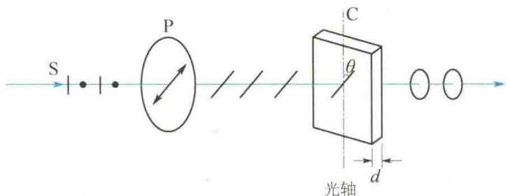
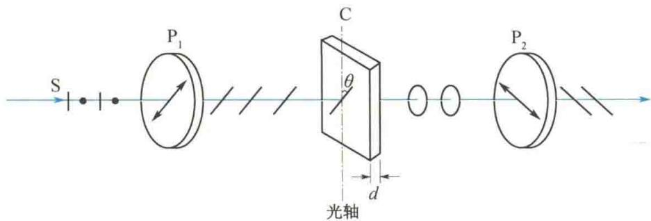
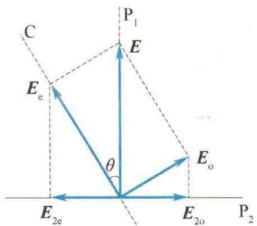
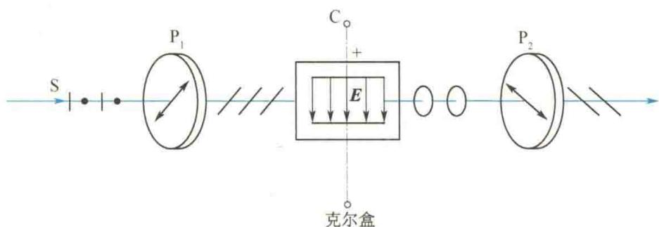

import Guide from '@/components/Guide.astro';
import Knowledge from '@/components/Knowledge.astro';
import Example from '@/components/Example.astro';
import Analysis from '@/components/Analysis.astro';
import Solution from '@/components/Solution.astro';
import Variant from '@/components/Variant.astro';
import Note from '@/components/Note.astro';
import Block from '@/components/Block.astro';
import Method from '@/components/Method.astro';
import Exercise from '@/components/Exercise.astro';

目前在矿物学、冶金学和生物学方面广泛使用的偏振光显微镜，其基本原理就是利用偏振光的干涉。而光测弹性方法既属于人为双折射现象的应用，又属于偏振光的干涉的应用。本节讨论有关这两个方面的一些基本原理。

## 14.6.1 椭圆偏振光与圆偏振光 波片

利用振动方向相互垂直的两个同频率简谐振动，可以获得椭圆偏振光和圆偏振光。获得椭圆偏振光的原理如图14.18所示，P为偏振片，C为单轴薄晶片，其光轴平行于晶面且与P的透光轴的夹角为 $\theta$ 。单色自然光透过偏振片后，成为线偏振光，设其振幅为 $E$ ，光振动方向与晶片C光轴方向的夹角为 $\theta$ ，该线偏振光垂直于光轴进入晶片后分解为o光、e光，仍沿原方向前进（此时o光、e光两主平面重合，且就在它们的传播方向与光轴所在的平面内），o光的光振动垂直于主平面（垂直于光轴），e光的光振动则平行于光轴，其振幅分别为 $E_{\mathrm{o}} = E\sin \theta, E_{\mathrm{e}} = E\cos \theta$ 。由于两光在晶片中的传播速度不同，晶片对o光、e光的主折射率（e光在垂直于光轴方向上的折射率） $n_{\mathrm{o}}$ 和 $n_{\mathrm{e}}$ 亦不相同，所以透过厚度为 $d$ 的晶片后，它们之间将出现相位差：

$$

\Delta \varphi = \frac {2 \pi}{\lambda} (n _ {\mathrm{o}} - n _ {\mathrm{e}}) d\tag{14.3}

$$

式中， $\lambda$ 是入射单色光的波长。这样两束频率相同、振动方向相互垂直且具有一定相位差的光就合成为椭圆偏振光。合成光矢量末端的轨迹在一般情况下是一个椭圆。适当选择晶片厚度 $d$ ，使得相位差

$$

\Delta \varphi = \frac {2 \pi}{\lambda} (n _ {\mathrm{o}} - n _ {\mathrm{e}}) d = \frac {\pi}{2}

$$

则透过晶片后的合成光为正椭圆偏振光. 因为这时 o 光、e 光透过晶片后的光程差为

$$

\Delta = (n _ {\mathrm{o}} - n _ {\mathrm{e}}) d = \frac {\lambda}{4}

$$

这样厚度的晶片称为四分之一波片. 如果光程差等于半波长, 晶片就称为二分之一波片. 显然, 这是对特定波长而言的.

  

图 14.18 获得椭圆偏振光的原理

当图 14.18 中的晶片 C 为四分之一波片，且 $\theta = \frac{\pi}{4}$ 时，晶片中 o 光与 e 光的振幅相等，即 $E_{o} = E_{e}$ ，此时透过晶片后的光成为圆偏振光。

如果将晶片 C 换成二分之一波片， $\theta$ 仍保持 $\frac{\pi}{4}$ ，则 o 光、e 光透过晶片后的相位差为 $\pi$ ，且振幅相等，合成后仍为线偏振光，不过振动方向将旋转 $90^{\circ}$ .

## 14.6.2 偏振光的干涉

只要满足相干条件，偏振光就和自然光一样，也可以产生干涉现象。图14.19所示是观察偏振光干涉的实验装置。在图14.19中， $\mathrm{P_1}$ 、 $\mathrm{P_2}$ 是两个透光轴相互垂直的偏振片，C为薄晶片，其光轴平行于晶体表面。单色自然光垂直入射偏振片 $\mathrm{P_1}$ ，透过偏振片 $\mathrm{P_1}$ 后成为线偏振光，入射到晶片上时分解为o光和e光，透过晶片后则成为光振动方向相互垂直且有一定相位差的两束光。这两束光射入偏振片 $\mathrm{P_2}$ 时，只有与偏振片 $\mathrm{P_2}$ 透光轴平行的分振动才可以通过，这样就得到了两束相干的线偏振光。

  

图 14.19 观察偏振光干涉的实验装置

图 14.20 是透过偏振片 $P_{1}$ 、薄晶片 C 和偏振片 $P_{2}$ 的光的振幅矢量图。图中， $P_{1}$ 、 $P_{2}$ 为两偏振片的透光轴方向，C 为晶片的光轴方向，E 为入射晶片 C 的线偏振光的振幅。透过晶片 C 后，两束光的振幅分别为 $E_{o} = E \sin \theta, E_{e} = E \cos \theta$ ，它们的振动方向为 o 光垂直于光轴 C，e 光平行于光轴 C。这两束光透过 $P_{2}$ 后的振幅分别为

$$

\begin{array}{r l} & E _ {2 \mathrm{o}} = E _ {\mathrm{o}} \cos \theta = E \sin \theta \cos \theta \\ & E _ {2 \mathrm{e}} = E _ {\mathrm{e}} \sin \theta = E \cos \theta \sin \theta \end{array}

$$

二者振幅相等. 由以上分析可知, 透过 $\mathrm{P}_{2}$ 的两束光是频率相同、振动方向相同、振幅相等和相位差恒定的相干光, 因而可以观察到偏振光的干涉现象. 在 $\mathrm{P}_{2}$ 后观察到的光强取决于两束透射光的总相位差

$$

\Delta \varphi = \frac {2 \pi}{\lambda} (n _ {\mathrm{o}} - n _ {\mathrm{e}}) d + \pi\tag{14.4}

$$

式中，等号右端第一项为两光通过厚度为 $d$ 的晶片后所产生的相位差；第二项是由于 $\pmb{E}_{2\mathrm{o}}$ 和 $\pmb{E}_{2\mathrm{e}}$ 方向相反而引起的附加相位差.由此可知，干涉的明暗条件为

$$

\Delta \varphi = \frac {2 \pi}{\lambda} (n _ {\mathrm{o}} - n _ {\mathrm{e}}) d + \pi = \left\{ \begin{array}{l l} 2 k \pi & (k = 1, 2, 3, \dots) (\text {干涉加强，视场最亮}) \\ (2 k + 1) \pi & (k = 1, 2, 3, \dots) (\text {干涉减弱，视场最暗}) \end{array} \right.\tag{14.5}

$$

如果晶片 C 是劈尖形状, 则视场中将出现明暗相间的干涉条纹.

  

图 14.20 偏振光干涉振幅矢量图

如果所用入射光源为白光,则对应不同波长的光,满足各自的干涉条件,视场中将出现彩色干涉图样,这种现象称为色偏振.

## 14.6.3 人为双折射现象

某些非晶体在受到外界作用(如机械力、电场或磁场等作用)时,失去各向同性的性质,也呈现出双折射现象,称为人为双折射现象.

### 1. 光弹性效应 —— 应力双折射

  

液晶

本来透明的各向同性的介质在机械应力作用下，显示光学上的各向异性，这种现象叫作光弹性效应，有时也称作机械双折射或应力双折射。对物体施以压力或张力时，其有效光轴都在应力方向上，并且引起的双折射参数与应力有关。设 $n_{0}$ 和 $n_{e}$ 分别为受力介质对o光和e光的折射率，则由实验可得

$$

n _ {\mathrm{o}} - n _ {\mathrm{e}} = K P

$$

式中，K 为比例系数，取决于介质的性质；P 是应力（压强）.

两偏振光通过厚度为 $d$ 的介质后所产生的相位差为

$$

\Delta \varphi = \frac {2 \pi}{\lambda} (n _ {\mathrm{o}} - n _ {\mathrm{e}}) d\tag{14.6}

$$

式中， $\lambda$ 为光在真空中的波长.

利用光弹性效应可以研究机械物体内部应力的分布情况. 把待分析的机械零件用透明材料制成模型, 并按实际使用时的受力情况对模型施力, 于是在各受力部分产生相应的双折射. 把模型放在正交的起偏器与检偏器之间, 就可以观察到干涉条纹. 根据条纹的色彩和形状, 可以计算出应力分布情况, 这种方法叫作光弹性方法. 它在工程技术上已得到广泛应用.

### 2. 克尔效应 —— 电致双折射

克尔于1875年发现，某些非晶体或液体在强电场作用下，其分子定向排列，从而获得类似于晶体的各向异性性质，这一现象称为克尔效应.

如图14.21所示，C是装有平板电极且储有非晶体或液体（如硝基苯）的容器，叫作克尔盒. $\mathrm{P_1}$ 、 $\mathrm{P_2}$ 是两个正交的偏振片，使用时最好让它们的偏振化方向与电场方向分别成 $\pm 45^{\circ}$ 角.未接通电源时，视场中是暗的.接通电源后，视场中由暗转明，说明在电场作用下，非晶体变成双折射晶体.实验表明，盒内非晶体或液体在电场作用下获得单轴晶体的性质，其光轴方向与电场强度 $E$ 的方向平行，入射单色光的波长 $\lambda$ 与 $n_{\mathrm{o}}$ 和 $n_{\mathrm{e}}$ 之间的关系是

$$

n _ {\mathrm{o}} - n _ {\mathrm{e}} = K E ^ {2} \lambda\tag{14.7}

$$

式中，K 为克尔常数，与材料有关.

  

图 14.21 研究克尔效应的实验装置

利用克尔效应可制成光断续器——光开关.这种开关的优点在于几乎没有惯性,能随着电场的产生和消失迅即开启和关闭(不超过 $10^{-9}$ s),因而可使光强的变化非常迅速.这种光断续器已广泛用于高速摄影、光速测量及电影、电视等装置中,近年来更多地用作脉冲激光器的Q开关.

在强磁场的作用下,非晶体也能呈现双折射现象,这种现象叫作磁致双折射,详细情况本书不再介绍,感兴趣的读者可自行查阅有关资料.
