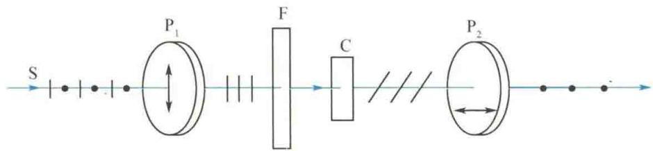
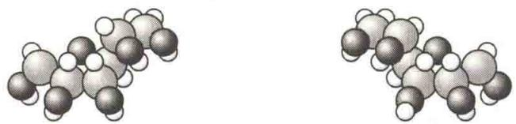

import Guide from '@/components/Guide.astro';
import Knowledge from '@/components/Knowledge.astro';
import Example from '@/components/Example.astro';
import Analysis from '@/components/Analysis.astro';
import Solution from '@/components/Solution.astro';
import Variant from '@/components/Variant.astro';
import Note from '@/components/Note.astro';
import Block from '@/components/Block.astro';
import Method from '@/components/Method.astro';
import Exercise from '@/components/Exercise.astro';

1811年，阿拉果发现，当线偏振光通过某些透明物质时，线偏振光的振动面将旋转一定的角度，这种现象称为振动面的旋转，也称为旋光现象。能使振动面旋转的物质称为旋光物质，如石英、糖溶液和酒石酸溶液等都是旋光物质。实验证明，振动面旋转的角度取决于旋光物质的性质、厚度或浓度，以及入射光的波长等。
图 14.22 所示是研究物质旋光性的实验装置。图 14.22 中，F 是滤光器，用以获取单色光；C 是旋光物质，如晶面与光轴垂直的石英片。当旋光物质放在两个相互正交的偏振片 $P_{1}$ 和 $P_{2}$ 之间时，会看到视场由原来的黑暗变为明亮。将偏振片 $P_{2}$ 绕光的传播方向旋转某一角度后，视场又由明亮变为黑暗。这说明线偏振光透过旋光物质后仍然是线偏振光，但是振动面旋转了一个角度，旋转角等于偏振片 $P_{2}$ 旋转的角度。
<figure class="vp-figure">
  
  <figcaption>图 14.22 研究物质旋光性的实验装置</figcaption>
</figure>
应用上述方法进行实验,可得出以下结论.
(1) 不同的旋光物质可以使线偏振光的振动面向不同的方向旋转. 如果面对光源观察, 使振动面向右 (顺时针方向) 旋转的物质称为右旋物质; 使振动面向左 (逆时针方向) 旋转的物质称为左旋物质. 如石英晶体, 由于结晶形态的不同, 具有右旋和左旋两种类型; 葡萄糖为右旋糖; 果糖为左旋糖. 溶液的左右旋光性是由其中分子本身的特殊结构引起的. 左、右旋分子, 如蔗糖分子, 它们的原子组成一样, 都是 $\mathrm{C}_{6} \mathrm{H}_{12} \mathrm{O}_{6}$ , 但空间结构不同, 这两种分子叫作同分异构体, 它们的结构互为镜像 (见图 14.23). 令人费解的是, 人工合成的同分异构体, 如左旋糖和右旋糖, 总是左、右旋分子各半, 而来自生命物质的同分异构体, 如由甘蔗或甜菜榨出来的蔗糖以及生物体内的葡萄糖, 则都是右旋糖. 生物总是选择右旋糖消化吸收, 而对左旋糖不感兴趣.
<figure class="vp-figure">
  
  <figcaption>图 14.23 蔗糖分子的两种同分异构体的结构</figcaption>
</figure>
(2) 振动面的旋转角 $\varphi$ 与波长有关, 当波长给定时, 则与旋光物质的厚度 d 有关. 它们满足关系式
$$
\varphi = \alpha d\tag{14.8}
$$
式中，d 用 mm 计； $\alpha$ 称为旋光恒量，与物质的性质、入射光的波长等有关。如 1 mm 厚的石英片能产生的旋转角对红光为 $15^{\circ}$ ，对钠黄光为 $21.7^{\circ}$ ，对紫光为 $51^{\circ}$ 。
(3) 偏振光通过糖溶液、松节油时, 振动面的旋转角可表示为
$$
\varphi = \alpha c d\tag{14.9}
$$
式中， $\alpha$ 和 $d$ 的意义同上， $c$ 是旋光物质的浓度。在制糖工业中，测定糖溶液浓度的糖量计就是根据这一原理制成的。

