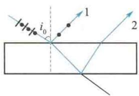
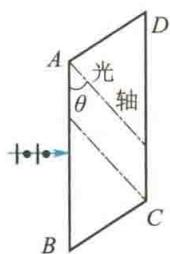

import Guide from '@/components/Guide.astro';
import Knowledge from '@/components/Knowledge.astro';
import Example from '@/components/Example.astro';
import Analysis from '@/components/Analysis.astro';
import Solution from '@/components/Solution.astro';
import Variant from '@/components/Variant.astro';
import Note from '@/components/Note.astro';
import Block from '@/components/Block.astro';
import Method from '@/components/Method.astro';
import Exercise from '@/components/Exercise.astro';

## 选择题

<Exercise title="习题 14.1.1">
一束光强为 $I_{0}$ 的自然光垂直穿过两个偏振片，且这两个偏振片的偏振化方向成 $45^{\circ}$ 角，则穿过两个偏振片后的光强 $I$ 为 （）A. $I_{0} / 4\sqrt{2}$ . B. $I_{0} / 4$ . C. $I_{0} / 2$ . D. $\sqrt{2} I_{0} / 2$ .
</Exercise>

<Exercise title="习题 14.1.2">
自然光以布儒斯特角由空气入射到一玻璃表面上,反射光是

A. 在入射面内振动的线偏振光.

B. 平行于入射面的振动占优势的部分偏振光.

C. 垂直于入射面振动的线偏振光.

D. 垂直于入射面的振动占优势的部分偏振光.
</Exercise>

<Exercise title="习题 14.1.3">
在双缝干涉实验中,用单色自然光,在屏幕上形成干涉条纹.若在两缝后放一个偏振片,则 ( )

A. 干涉条纹的间距不变,但明纹的亮度加强.

B. 干涉条纹的间距不变,但明纹的亮度减弱.

C. 干涉条纹的间距变窄,且明纹的亮度减弱.

D. 无干涉条纹.
</Exercise>

<Exercise title="习题 14.1.4">
一束自然光自空气射向一块平板玻璃(见题14.1.4图),设入射角等于布儒斯特角 $i_{0}$ ,则在界面2上的反射光是

A. 自然光.

B. 线偏振光且光矢量的振动方向垂直于入射面.

C. 线偏振光且光矢量的振动方向平行于入射面.

D. 部分偏振光.
</Exercise>

<Exercise title="习题 14.1.5">
ABCD 为一块方解石的一个主截面, AB 为垂直于纸面的晶体平面与纸面的交线. 光轴方向在纸面内且与 AB 成一锐角 $\theta$ , 如题 14.1.5 图所示. 一束平行的单色自然光垂直于 AB 端面入射. 在方解石内折射光分解为 o 光和 e 光, o 光和 e 光的 ( )

A. 传播方向相同, 电场强度的振动方向相互垂直.

B. 传播方向相同, 电场强度的振动方向不相互垂直.

C. 传播方向不同, 电场强度的振动方向相互垂直.

D. 传播方向不同, 电场强度的振动方向不相互垂直.

  

题14.1.4图

  

题14.1.5图

</Exercise>
