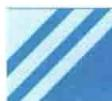

import Guide from '@/components/Guide.astro';
import Knowledge from '@/components/Knowledge.astro';
import Example from '@/components/Example.astro';
import Analysis from '@/components/Analysis.astro';
import Solution from '@/components/Solution.astro';
import Variant from '@/components/Variant.astro';
import Note from '@/components/Note.astro';
import Block from '@/components/Block.astro';
import Method from '@/components/Method.astro';
import Exercise from '@/components/Exercise.astro';

Li、Na、K、Rb、Cs、Fr 等元素称为碱金属元素。用分辨率较高的光谱仪观测光谱的每一条谱线，可以发现，每条谱线由两条或三条线组成，称作光谱线的精细结构。其实所有原子的光谱线都有精细结构，只是碱金属原子的光谱线较为明显。

1925 年, 乌伦贝克和高德斯密特为了解释碱金属原子光谱线的精细结构, 同时考虑施特恩-格拉赫实验对于基态 Li、Na、K、Cu、Ag、Au 等原子得出的实验结果, 提出: 除轨道运动外, 电子还存在一种自旋运动. 电子本身具有自旋角动量 S 及相应的自旋磁矩 $\mu_{s}$ . 自旋角动量大小为

$$

S = \sqrt {s (s + 1)} \hbar

$$

式中， $s$ 称为自旋量子数.每个电子都具有同样的数值 $s = \frac{1}{2}$ ，则

$$

S = \frac {\sqrt {3}}{2} \hbar

$$

根据角动量的一般理论,自旋角动量的空间取向也应是量子化的,它在外磁场方向上的投影为

$$

S _ {z} = m _ {s} \hbar

$$

$m_{s}$ 称为自旋磁量子数, 它只能取两个值, 即

$$

m _ {s} = \frac {1}{2}, - \frac {1}{2}

$$

自旋磁矩为

$$

\mu_ {s} = - \frac {e}{m} S

$$

取负号是因为电子带负电， $\mu_{s}$ 与 S 的方向相反，它在外磁场方向上的投影为

$$

\mu_ {s _ {z}} = - \frac {e}{m} S _ {z} = \mp \frac {e \hbar}{2 m} = \mp \mu_ {\mathrm{B}}

$$

式中， $\mu_{B}=\frac{e\hbar}{2m}$ 是玻尔磁子.值得注意的是

$$

\frac {| \boldsymbol {\mu} _ {s} |}{| \boldsymbol {S} |} = \frac {e}{m}

$$

而轨道磁矩 $\mu$ 与轨道角动量 L 的比值为

$$

\frac {| \mu |}{| L |} = \frac {e}{2 m}

$$

上述两个比值之比为 2, 这是两种运动的重要差别.

施特恩-格拉赫实验对 Li、Na、K 等原子测得的斑纹条数为 2，现在可以这样解释：这些原子的磁矩取决于价电子，而价电子的轨道磁矩为零，因此原子的磁矩由电子自旋磁矩决定。自旋磁矩在 z 轴方向上的投影 $\mu_{s_{z}}$ 只可能取两个数值，于是屏幕上得到两条斑纹。测出两条斑纹的距离 s，就可以算出 $\mu_{s_{z}}$ 。测量结果为一个玻尔磁子。这不但证实了电子自旋的正确性，同时也证明了自旋磁矩与自旋角动量关系的正确性。

碱金属光谱线的精细结构,其产生的原因是比电相互作用小的磁相互作用,即电子的轨道运动产生的磁场和电子自旋磁矩的作用,使得原子的能级发生改变.这种能量称为自旋-轨道相互作用能,是一个小量,因此表现为光谱线的精细结构.

电子的自旋运动是电子的重要特征. 但是电子自旋的物理图像是什么? 这是至今尚未解决的问题. 不要把“自旋”想象成宏观物体的“自转”, 因为微观粒子的运动与宏观物体的运动并不相同, 简单的类比会产生错误的概念. 现代物理实验表明, 电子的自旋与电子的内部结构有关, 而电子的内部结构至今尚不清楚. 只能说电子的自旋是电子的一种内禀(内部)运动.

