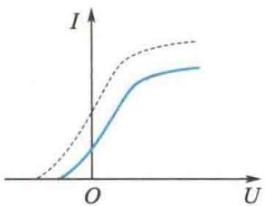
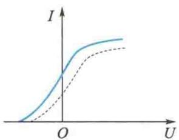
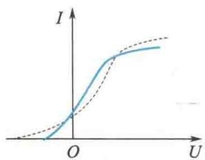
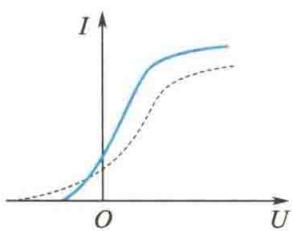

import Guide from '@/components/Guide.astro';
import Knowledge from '@/components/Knowledge.astro';
import Example from '@/components/Example.astro';
import Analysis from '@/components/Analysis.astro';
import Solution from '@/components/Solution.astro';
import Variant from '@/components/Variant.astro';
import Note from '@/components/Note.astro';
import Block from '@/components/Block.astro';
import Method from '@/components/Method.astro';
import Exercise from '@/components/Exercise.astro';

## 选择题

<Exercise title="习题 15.1.1">
用一定频率的单色光照射在某种金属上,测出其光电流 I 与电势差 U 的关系曲线如题 15.1.1 图中实线所示.然后在光强不变的条件下增大照射光的频率,测出其光电流与电势差的关系曲线,用虚线表示.符合题意的图是

  

B

  

C  

题15.1.1图

  

D
</Exercise>

<Exercise title="习题 15.1.2">
康普顿散射的主要特点是

A. 散射光的波长均与入射光的波长相同, 与散射角、散射体的性质无关.

B. 散射光中既有与入射光波长相同的, 也有比入射光波长长的和比入射光波长短的, 这与散射体的性质有关.

C. 散射光的波长均比入射光的波长短, 且随散射角的增大而减小, 但与散射体的性质无关.

D. 散射光中有些光的波长比入射光的波长长, 且随散射角的增大而增大, 有些散射光的波长与入射光波长相同, 这都与散射体的性质无关.
</Exercise>

<Exercise title="习题 15.1.3">
假定氢原子原是静止的,质量为 $1.67 \times 10^{-27}$ kg,则氢原子从 n = 3 的激发态直接通过辐射跃迁到基态时的反冲速度大约是

A. 4 m/s. B. 10 m/s. C. 100 m/s. D. 400 m/s.
</Exercise>

<Exercise title="习题 15.1.4">
关于不确定关系 $\Delta p_{x}\Delta x\geqslant\frac{\hbar}{2}$ ，有以下几种理解：

(a) 粒子的动量不可能确定；

(b) 粒子的坐标不可能确定；

(c) 粒子的动量和坐标不可能同时准确地确定；

(d) 不确定关系不仅适用于电子和光子，也适用于其他粒子。

其中正确的是

A.(a)、(b). B.(c)、(d). C.(a)、(d). D.(b)、(d).
</Exercise>

<Exercise title="习题 15.1.5">
直接证实了电子自旋存在的最早的实验之一是

A.康普顿散射实验.

B.卢瑟福散射实验.

C.戴维孙-革末实验.

D.施特恩-格拉赫实验.

</Exercise>
