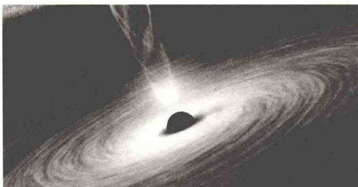
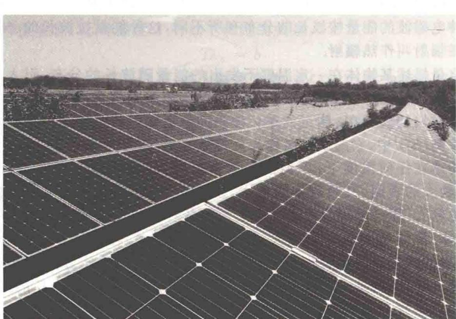
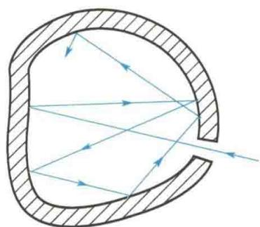
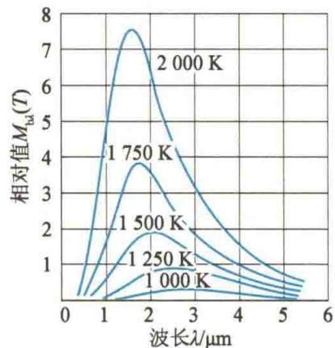
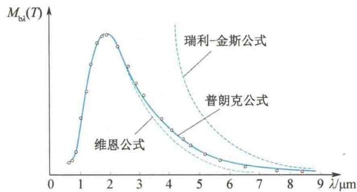

import QRCodeVideo from '@/components/QRCodeVideo.astro';

import Guide from '@/components/Guide.astro';
import Knowledge from '@/components/Knowledge.astro';
import Example from '@/components/Example.astro';
import Analysis from '@/components/Analysis.astro';
import Solution from '@/components/Solution.astro';
import Variant from '@/components/Variant.astro';
import Note from '@/components/Note.astro';
import Block from '@/components/Block.astro';
import Method from '@/components/Method.astro';
import Exercise from '@/components/Exercise.astro';

## 第15章 量子物理基础

量子物理是研究微观粒子(线度约为 $10^{-10}$ m) 运动规律及物质的微观结构的理论. 量子论和相对论是 20 世纪初的重大理论成果, 是近、现代物理学的理论支柱.
1900 年, 普朗克用能量量子化的假设成功地解释了黑体辐射规律, 标志着量子论的诞生. 1905 年, 爱因斯坦提出了光量子的概念, 成功地解释了光电效应. 1913 年, 玻尔在卢瑟福提出的原子有核模型的基础上, 应用量子化概念, 解释了氢原子光谱的规律. 1922 年, 康普顿进一步证实了光的量子性. 这一时期的量子论, 对微观粒子的本性还缺乏全面认识, 因此称为早期量子论或旧量子论.
1924 年, 德布罗意提出微观粒子的波粒二象性的假说, 指出微观粒子也具有波动性. 1927 年, 戴维孙和革末的电子衍射实验证实了电子具有波动性. 1926 年, 薛定谔发表《波动力学》, 提出微观实物粒子所遵守的波动方程, 即薛定谔方程, 这与 1925 年海森伯建立的矩阵力学是等价的, 它们是量子力学最初的两种不同形式. 1926 年, 玻恩对物质波作出统计解释. 1927 年, 海森伯提出不确定关系. 1928 年, 狄拉克把量子力学和狭义相对论相结合, 创立了相对论量子力学. 至此, 量子力学的体系基本建立起来了.
量子力学的建立,开辟了人们认识微观世界的道路,帮助人们找到了探索原子、分子的微观结构及在原子、分子水平上探索物质结构的理论武器.1927年以后,量子
力学被广泛应用于研究微观物理学的各领域中,如原子、原子核、固体、半导体等,取得了巨大成就.这些研究成果,催生了新的技术,促进了生产力的发展.
量子论在解决实际问题中不断发展.1939年,海森伯和泡利建立了量子场论.而量子电动力学就是关于电磁场

的量子论.20世纪70年代又出现了量子色动力学、量子味动力学,这些理论都还在发展之中.
现在,从粒子物理到天体物理、从化学到生物和医学、从晶体管到大规模集成电路、从激光到超导材料,几乎一切高新技术都离不开量子论. 可以说,人们的日常生活已经和量子论密切相关,没有量子论就没有现代物质文明.
本篇首先介绍早期量子论, 只介绍薛定谔方程及其在几个一维问题中的应用, 以及量子力学对氢原子和多电子原子的应用的几个主要结论; 其次简单介绍原子核物理、粒子物理、固体的能带理论、激光、超导、纳米科学技术; 最后介绍玻色-爱因斯坦凝聚态.

<QRCodeVideo title="本章提要" url="https://api.guangyiedu.com/v3/resource/resource/r/NewQrCode-bAnu73MM6QthwjE1w02r" />  
<QRCodeVideo title="量子力学的十大应用" url="https://api.guangyiedu.com/v3/resource/resource/r/NewQrCode-RycnPH3WeMKsvOBxdL5I" />  

章按照量子论发展史,首先介绍早期量子论,其次介绍量子力学,最后介绍原子物理学的主要内容.

## 15.1.1 热辐射 黑体辐射定律

当加热一铁块时, 温度在 $300^{\circ}$ C 以下, 只感觉到它发热, 看不见发光. 随着温度的升高, 不仅物体辐射的能量愈来愈大, 而且物体颜色开始呈暗红色, 继而变为赤红、橙红、黄白色, 温度达到 $1500^{\circ}$ C 后, 出现白光. 其他物体加热时发光的颜色也有类似的随温度而改变的现象. 这说明在不同温度下物体能发出不同波长的电磁波. 实验表明, 任何物体在任何温度下, 都向外发射波长不同的电磁波. 在不同的温度下发出的各种电磁波的能量按波长的分布有所不同, 这种能量按波长的分布随温度而不同的电磁辐射叫作热辐射.
为了定量描述某物体在一定温度下发出的能量随波长的分布,引入单色辐射本领(也叫作单色辐出度)的概念.波长为 $\lambda$ 的单色辐射本领是指单位时间内从物体的单位面积上发出的波长在 $\lambda$ 附近的单位波长间隔所辐射的能量.通常用 $M_{\lambda}(T)$ 表示.在国际单位制(SI)中,它的单位名称为瓦每立方米,符号为 $W/m^{3}$ .
任何物体在任何温度下,不但能辐射电磁波,还能吸收电磁波.理论和实验表明,辐射本领大的表面,其吸收本领也大,反之亦然.物体表面越黑,吸收本领越大,辐射本领也越大.能全部吸收投射在它上面的各种波长的电磁波的物体叫作绝对黑体,简称黑体.黑体的吸收本领最大,辐射本领也最大.在自然界中,黑体是不存在的,即使最黑的烟煤也只能吸收99%的入射光能.若不管用什么材料制成一个空腔,在腔壁上开一小孔,就是一个黑体模型,如图15.1所示.入射到小孔的电磁波,进入小孔后在腔内多次反射被吸收,几乎没有电磁波再从小孔出来,这与构成空腔的材料无关.从辐射的角度看,如果将空腔加热到一定温度,内壁发出的辐射也是经过多次反射后射出小孔,所以小孔的辐射实际上就是黑体辐射.
黑体辐射只与温度有关. 保持一定温度, 用实验方法测出黑体单色辐射本领随波长变化的曲线. 取不同的温度得到不同的实验曲线, 如图 15.2 所示. 由图 15.2 可看出, 在任何确定的温度下, 黑体对不同波长的单色辐射本领是不同的, 在某一波长值 $\lambda_{\mathrm{m}}$ 处有极大值, 当温度升高时, 极大值向短波方向移动, 同时曲线向上抬高并变得更为尖锐. 根据实验结果, 可得下面两条黑体辐射定律.
  
图15.1 黑体模型
  
图 15.2 黑体单色辐射本领随波长变化的实验曲线

### 1. 斯特藩-玻尔兹曼定律

由实验曲线可得黑体辐射的总辐射本领(也叫作辐射出射度,可用曲线与x轴所围的区域的面积表示)为
$$
M _ {\mathrm{b}} (T) = \int_ {0} ^ {\infty} M _ {\mathrm{b} \lambda} (T) \mathrm{d} \lambda
$$
它与温度的 4 次方成正比, 即
$$
M _ {\mathrm{b}} (T) = \sigma T ^ {4}\tag{15.1}
$$
实验测得 $\sigma = 5.670 \times 10^{-8} \, \text{W/(m}^2 \cdot \text{K}^4)$ ，称为斯特藩常量。这个规律称为斯特藩-玻尔兹曼定律。可见，黑体的总辐射本领随温度的升高而急剧增加。

### 2. 维恩位移定律

在任意温度下，黑体的辐射本领都有一个极大值，这个极大值对应的波长用 $\lambda_{m}$ 表示，称为峰值波长。 $\lambda_{m}$ 与温度 T 有如下确定的关系：
$$
T \lambda_ {\mathrm{m}} = b\tag{15.2}
$$
实验测得 $b = 2.898 \times 10^{-3} \, m \cdot K$ ，称为维恩常数。式(15.2)称为维恩位移定律。
根据维恩位移定律, 可知温度升高, 峰值波长向短波方向移动. 可以得出, 温度较低(常温), 辐射波长在红外区, 随着温度的升高, $\lambda_{m}$ 向短波方向移动, 辐射则由红变黄、变白.

<Example title="例 15.1">
在地球大气层外的飞船上,测得太阳辐射本领的峰值在 465 nm 处.假定太阳是一个黑体,试计算太阳表面的温度和单位面积辐射的功率.
<table><tr><td>解 根据维恩位移定律 $T\lambda_{m}=b$ 可得太阳表面的温度为 $T=\frac{b}{\lambda_{m}}=\frac{2.898\times10^{-3}}{465\times10^{-9}}K=6232K$ </td><td>根据斯特藩-玻尔兹曼定律,太阳单位面积所辐射的功率为 $M=\sigma T^{4}=5.670\times10^{-8}\times6232^{4}W/m^{2}$  $=8.552\times10^{7}W/m^{2}$ </td></tr></table>
</Example>

## 15.1.2 普朗克量子假设

要从理论上解释黑体辐射定律，就必须从理论上找出黑体的单色辐射本领 $M_{\mathrm{b}\lambda}(T)$ 与 $\lambda, T$ 的具体函数形式。19世纪末，许多物理学家在经典物理学的基础上寻找这一关系式，结果都失败了。其中最典型的是维恩公式和瑞利-金斯公式。1896年，维恩利用辐射按波长的分布类似于麦克斯韦分子速度分布的思想，得出理论公式：
$$
M _ {\mathrm{b} \lambda} (T) = C _ {1} \lambda^ {- 5} \mathrm{e} ^ {- \frac {C _ {2}}{\lambda T}}
$$
这个公式在短波部分与实验结果接近,但在长波部分与实验结果偏差较大.瑞利(1900年)和金斯(1905年)根据经典电磁理论和线性谐振子能量按自由度均分的思想,得到的理论公式为
$$
M _ {\mathrm{b} \lambda} (T) = C _ {3} \lambda^ {- 4} T
$$
这个公式在波长很长的情况下与实验结果接近，在短波部分则与实验结果完全不符，物理学史上称其为“紫外区的灾难”。以上两式中的 $C_1, C_2, C_3$ 都是常数。
<QRCodeVideo title="1900 年,普朗克从理论上推导出一个与实验结果符合得非常好的公式:普朗克" url="https://api.guangyiedu.com/v3/resource/resource/r/NewQrCode-CJa0G07kzhD17mnoz5K3" />
$$
M _ {\mathrm{b} \lambda} (T) = 2 \pi h c ^ {2} \lambda^ {- 5} \frac {1}{\mathrm{e} ^ {h c / \lambda k T} - 1}\tag{15.3}
$$
称为普朗克公式. 式中, c 为真空中的光速, k 为玻尔兹曼常量, e 为自然对数的底, h 为普朗克常量. 由实验测定
$$
h = 6. 6 2 6 0 7 0 1 5 \times 1 0 ^ {- 3 4} \mathrm{J} \cdot \mathrm{s}
$$
为推导出这个公式,普朗克提出了如下两条假设,其中第二条假设是与经典理论互相矛盾的.
（1）黑体由带电谐振子组成（即把组成空腔壁的分子、原子的振动看作线性谐振子）。这些谐振子辐射电磁波，并和周围的电磁场交换能量。
中国物理学家
（2）这些谐振子的能量不能连续变化，只能取一些分立值，这些分立值是最小能量 $\varepsilon$ 的整数倍，即
<QRCodeVideo title="叶企孙" url="https://api.guangyiedu.com/v3/resource/resource/r/NewQrCode-fEls74VSnaNVwu0mzNRs" />  
$$
\varepsilon , 2 \varepsilon , 3 \varepsilon , \dots , n \varepsilon , \dots \quad (n \text {为正整数，称为量子数})
$$
而且假设频率为 $\nu$ 的谐振子的最小能量为
$$
\varepsilon = h \nu
$$
称为能量子，h 称为普朗克常量。
根据普朗克公式可以推导出斯特藩-玻尔兹曼定律和维恩位移定律,这说明理论与实验结果符合得很好.图 15.3 所示为热辐射的理论公式与实验结果的比较.
  
图 15.3 热辐射的理论公式与实验结果的比较(○表示实验结果)  
普朗克的量子假设打破了经典物理认为能量连续的概念,这是一个新的重大发现,开创了物理学的新时代.普朗克常量 h 是近代物理学最重要的常量之一,它是近代物理学和经典物理学的判据.因此,把 1900 年普朗克提出的量子假设作为量子论的起点.

<Example title="例 15.2">
某物体辐射频率为 $6.0 \times 10^{14}$ Hz 的黄光, 这种辐射的能量子的能量是多大?
<table><tr><td>解 根据普朗克能量子公式 $\varepsilon = h\nu = 6.63 \times 10^{-34} \times 6.0 \times 10^{14} \text{ J}$  $= 4.0 \times 10^{-19} \text{ J}$ </td><td>此能量就是辐射体在辐射或吸收黄光过程中最小的能量单元.</td></tr></table>
</Example>

<Example title="例 15.3">
质量 $m = 1.0 \, kg$ 的物体和刚度系数 $k = 20 \, N/m$ 的弹簧组成谐振子系统，系统以振幅 $A = 0.01 \, m$ 振动。（1）如果该系统的能量是按照普朗克假设量子化的，则量子数 n 为多大？（2）如果 n 改变一个单位，则系统能量的变化量与原系统能量的比值为多大？

<Solution title="解">
（1）该谐振子的振动频率
$$
\begin{array}{r l} \nu & = \frac {1}{2 \pi} \sqrt {\frac {k}{m}} = \frac {1}{2 \pi} \sqrt {\frac {2 0}{1 . 0}} \mathrm{Hz} \\ & = 0. 7 1 \mathrm{Hz} \end{array}
$$
量子数为
系统的机械能为
$$
\begin{array}{r l} n & = \frac {E}{\varepsilon} = \frac {E}{h \nu} = \frac {1 . 0 \times 1 0 ^ {- 3}}{6 . 6 3 \times 1 0 ^ {- 3 4} \times 0 . 7 1} \\ & = 2. 1 \times 1 0 ^ {3 0} \end{array}
$$
$$
\begin{array}{r l} E & = \frac {1}{2} k A ^ {2} = \frac {1}{2} \times 2 0 \times 0. 0 1 ^ {2} \mathrm{J} \\ & = 1. 0 \times 1 0 ^ {- 3} \mathrm{J} \end{array}
$$
(2) 如果改变一个单位, 系统能量的变化量与原系统能量的比值为
$$
\frac {\Delta E}{E} = \frac {h \nu}{n h \nu} = \frac {1}{n} = \frac {1}{2 . 1 \times 1 0 ^ {3 0}} = 5 \times 1 0 ^ {- 3 1}
$$
可见，对宏观谐振子，量子数 $n$ 非常大， $n$ 每改变一个单位，能量的变化非常小，实际上是无法观察到的，所以可认为能量是连续变化的。对于宏观物体（系统），因为普朗克常量 $h$ 非常小，可认为趋近于零，量子化的特性显示不出来；对于微观振子（分子、原子等）， $\Delta E = h\nu$ 和 $E$ 的数量级可以比拟，普朗克常量 $h$ 不可忽略，量子化的特性便突出显现出来了。

</Solution>
</Example>
