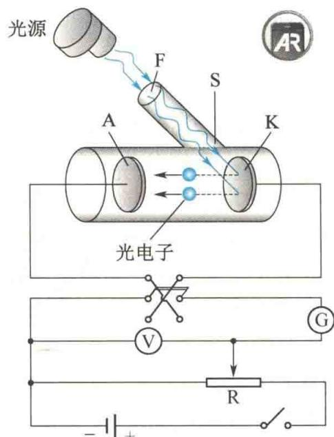
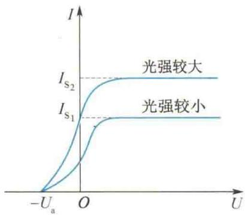
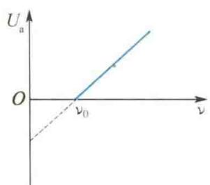
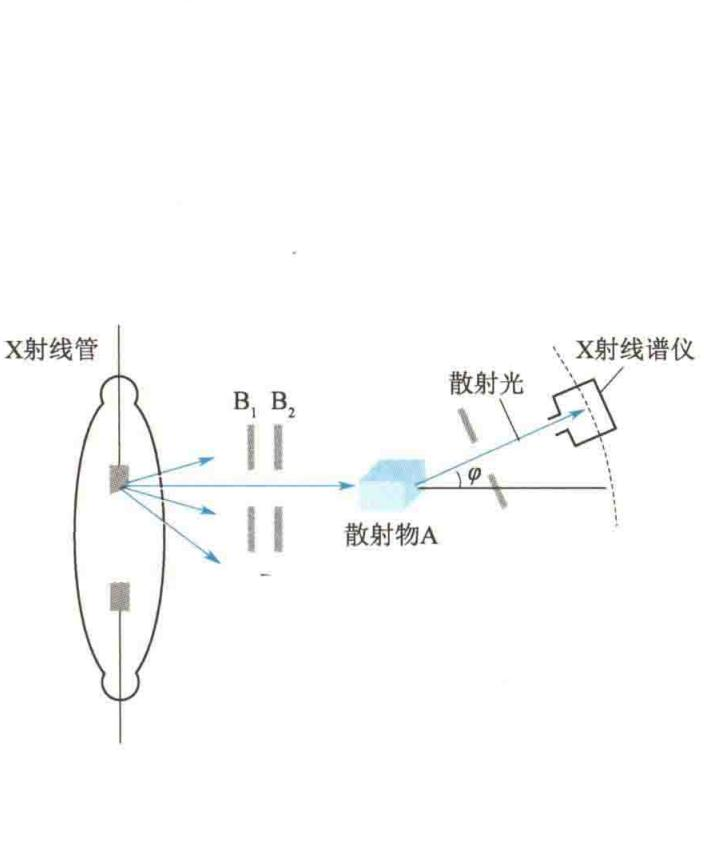
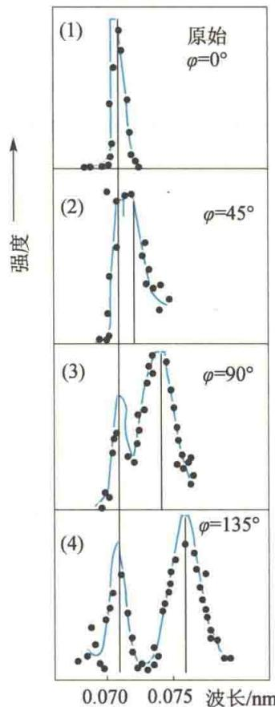
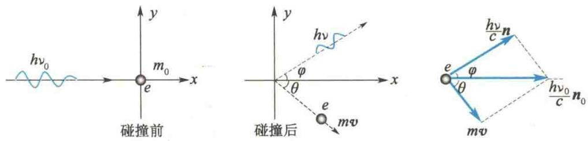
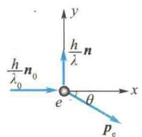

import Guide from '@/components/Guide.astro';
import Knowledge from '@/components/Knowledge.astro';
import Example from '@/components/Example.astro';
import Analysis from '@/components/Analysis.astro';
import Solution from '@/components/Solution.astro';
import Variant from '@/components/Variant.astro';
import Note from '@/components/Note.astro';
import Block from '@/components/Block.astro';
import Method from '@/components/Method.astro';
import Exercise from '@/components/Exercise.astro';

## 15.2.1 光电效应 爱因斯坦光电效应方程

光照射到金属表面上时,有电子从金属表面逸出,这种现象称为光电效应.逸出的电子称为光电子.光电效应的研究揭示出光具有粒子性.

图 15.4 所示为研究光电效应的实验装置. S 是一个抽成真空的玻璃管, K 为发出电子的阴极, A 为阳极. 石英玻璃窗 F 对紫外线吸收很少 (光电效应的入射光一般为可见光或紫外光). 当用单色光照射 K 时, K 释放出光电子. K、A 之间加上一定的电势差 (由电压表 V 读出), 光电子由 K 飞向 A, 回路中形成电流 (由检流计 G 读出), 称其为光电流. 从实验结果得到如下规律.

（1）保持入射光的频率不变且光强一定时，光电流 $I$ 和两极A、K之间电势差 $U$ 的关系可用如图15.5所示的一条伏安特性曲线表示，曲线表明光电流 $I$ 随 $U$ 的增大而增大，但当 $U$ 增大到一定值时，光电流不再增大而达到一饱和值 $I_{\mathrm{s}}$ .饱和现象说明，这时单位时间内从阴极K逸出的光电子已全

  

爱因斯坦

  

图 15.4 研究光电效应的实验装置

部被阳极 A 接收了. 改变光强, 实验表明, 饱和电流与光强成正比, 即单位时间内从

阴极逸出的光电子数与入射光的强度成正比.

（2）从如图15.5所示的实验曲线可以看出，当电势差 $U$ 减小到零时，光电流 $I$ 并不等于零，仅当电势差 $U = U_{\mathrm{A}} - U_{\mathrm{K}}$ 变为负值时（实验时利用换向开关换向），光电流 $I$ 才迅速减小为零.当逸出阴极K后具有最大初动能的光电子也不能到达阳极A时，对应的电势差 $U_{\mathrm{a}}(U_{\mathrm{a}} > 0)$ 称作遏止电压（或遏止电势差).此时有

$$

\frac {1}{2} m v _ {\mathrm{m}} ^ {2} = e U _ {\mathrm{a}}\tag{15.4}

$$

式中，m 为光电子的质量， $v_{m}$ 为光电子的最大初速度，e 为光电子的电量。实验表明， $U_{a}$ 与光强无关，与入射光的频率呈线性关系（见图 15.6），即光电子的最大初动能随入射光的频率线性变化，用数学式表示为

$$

U _ {\mathrm{a}} = k \nu - U _ {0}\tag{15.5}

$$

式中， $k$ 是直线斜率，它是与金属材料无关的常量； $U_{0}$ 对同一金属是一个常量，不同金属的 $U_{0}$ 不同.将式(15.5）代入式(15.4)，可得

$$

\frac {1}{2} m v _ {\mathrm{m}} ^ {2} = e k \nu - e U _ {0}\tag{15.6}

$$

由式(15.6)可以看出， $\frac{1}{2}mv_{m}^{2}\geqslant0$ ，入射光频率 $\nu$ 必须满足 $\nu\geqslant\frac{U_{0}}{k}$ ，即当 $\nu>\nu_{0}=\frac{U_{0}}{k}$ 时，才有光电子产生， $\nu_{0}$ 称为光电效应的红限频率，相应的波长称为红限波长。也就是说，当光照射某一给定的金属时，如果入射光的频率小于该金属的红限频率 $\nu_{0}$ ，则无论光强如何，都不会产生光电效应。

  

图 15.5 光电效应的伏安特性曲线

  

图15.6 遏止电压与入射光频率的关系

（3）实验发现，从光线开始照射到光电子逸出，几乎是瞬时的，时间不超过 $10^{-9}$ s.

光电效应的这些实验规律无法用光的波动理论解释. 按照光的波动理论, 金属中的电子在光波作用下做受迫振动, 其振动频率就是入射光的频率. 由于光强与入射光振幅的平方成正比, 因此无论入射光的频率多么低, 只要光强足够大 (振幅足够大), 光照时间足够长, 电子就能从入射光中获得足够的能量而脱离原子核的束缚, 并逸出金属表面产生光电效应. 即光电效应只与入射光的强度、光照时间有关, 而与入射光的频率无关. 可见, 要解释光电效应必须用新的理论.

1905年，爱因斯坦在普朗克量子概念的基础上提出了光子理论，圆满地解释了光电效应。该理论认为，光在空间传播时，也具有粒子性，一束光就是一束以光速运动的粒子流。这些粒子称为光量子，简称光子。频率为 $\nu$ 的光的一个光子具有的能量为

$$

\varepsilon = h \nu

$$

式中，h 为普朗克常量。

光子理论对光电效应的解释如下.

用频率为 $\nu$ 的单色光照射金属时，一个光子被一个电子吸收而使电子的能量增加 $h\nu$ . 能量增大的电子，将其能量的一部分用于脱离金属表面时所需的逸出功 W，另一部分则成为电子离开金属表面后的最大初动能. 根据能量守恒定律，得

$$

\frac {1}{2} m v _ {\mathrm{m}} ^ {2} = h \nu - W\tag{15.7}

$$

或者

$$

h \nu = \frac {1}{2} m v _ {\mathrm{m}} ^ {2} + W

$$

这就是爱因斯坦光电效应方程.

将式 $(15.7)$ 与式 $(15.6)$ 比较,可得

$$

h = e k

$$

1916年，密立根曾利用式(15.5)，从直线的斜率 $k$ 出发，算出了普朗克常量 $h$ ，其结果和当时用其他方法测得的值相符.这也是爱因斯坦光子理论正确性的一个证明.

  

密立根

$$

W = e U _ {0}

$$

则

$$

\nu_ {0} = \frac {U _ {0}}{k} = \frac {W}{h}

$$

此式说明了红限频率 $\nu_{0}$ 与逸出功 $W$ 的关系. 可由红限频率算出逸出功 $W = h\nu_{0}$ . 同一种金属的逸出功 $W$ 具有确定值, 光子能量 $h\nu < W$ 时, 不能产生光电效应. 几种金属的红限频率和逸出功如表15.1所示.

表 15.1 几种金属的红限频率和逸出功

<table><tr><td>金属</td><td>钨</td><td>钙</td><td>钠</td><td>钾</td><td>铷</td><td>铯</td></tr><tr><td>红限频率 $\nu_0/(10^{14}Hz)$ </td><td>10.95</td><td>7.73</td><td>5.53</td><td>5.44</td><td>5.15</td><td>4.69</td></tr><tr><td>逸出功W/eV</td><td>4.54</td><td>3.20</td><td>2.29</td><td>2.25</td><td>2.13</td><td>1.94</td></tr></table>

饱和电流和光强成正比的解释是:入射光的强度取决于单位时间内通过垂直于光传播方向单位面积的能量(即能流密度).设单位时间内通过单位面积的光子数为N,则入射光的能流密度为 $Nh\nu$ ,当 $\nu$ 一定时,入射光越强,N越大,照射到阴极K上的光子数越多,逸出的光电子数越多,因此饱和电流越大.

光电效应的延迟时间非常短,这是因为光子被电子一次性吸收而增大能量的过程时间很短,几乎是瞬时的.

在波动光学中,实验证明光是一种波动——光波.进入20世纪后,人们又认识到光是粒子——光子.综合起来,光既具有波动性,又具有粒子性,即光具有波粒二象性.

光的波动性用波长 $\lambda$ 和频率 $\nu$ 描述, 光的粒子性用光子的质量、能量、动量描述. 按照量子论, 光子的能量为

$$

\varepsilon = h \nu\tag{15.8}

$$

根据相对论的质能关系：

得光子的质量为

$$

\varepsilon = m c ^ {2}

$$

$$

m = \frac {h \nu}{c ^ {2}}\tag{15.9}

$$

由粒子的质速关系

$$

m = \frac {m _ {0}}{\sqrt {1 - \frac {v ^ {2}}{c ^ {2}}}}

$$

可知，对光子有 v = c，而 m 是有限的，只能 $m_{0} = 0$ ，即光子的静止质量为零。

光子的动量 $p = mc$ ，将式(15.9)代入可得

$$

p = \frac {h}{\lambda}\tag{15.10}

$$

式(15.8)和式(15.10)是描述光的性质的基本关系式.等式左边描述光的粒子性,等式右边描述光的波动性.这两种性质在数量上是通过普朗克常量h联系起来的.

<Example title="例 15.4">
已知一单色光源的功率 P = 1 W，光波波长为 589 nm。在与光源距离为 R = 3 m 处放一块金属板，求单位时间内打到金属板单位面积上的光子数。

<Solution title="解">
单位时间内照射到金属板单位面积上的光能量为

$$

\begin{array}{r l} E & = \frac {P}{4 \pi R ^ {2}} = \frac {1}{4 \pi \times 3 ^ {2}} \mathrm {J / (m^ {2} \cdot s)} \\ & = 8. 8 \times 1 0 ^ {- 3} \mathrm {J / (m^ {2} \cdot s)} \\ & = 5. 5 \times 1 0 ^ {1 6} \mathrm {eV / (m^ {2} \cdot s)} \end{array}

$$

$$

\begin{array}{r l} \varepsilon = h \nu & = \frac {h c}{\lambda} = \frac {6 . 6 3 \times 1 0 ^ {- 3 4} \times 3 . 0 \times 1 0 ^ {8}}{5 . 8 9 \times 1 0 ^ {- 7}} \mathrm{J} \\ & = 3. 4 \times 1 0 ^ {- 1 9} \mathrm{J} = 2. 1 \mathrm{eV} \end{array}

$$

所以，单位时间内打到金属板单位面积上的光子数为

每个光子的能量为

$$

\begin{array}{r l} N & = \frac {E}{\varepsilon} = \frac {5 . 5 \times 1 0 ^ {1 6}}{2 . 1} \mathrm{m} ^ {- 2} \cdot \mathrm{s} ^ {- 1} \\ & = 2. 6 \times 1 0 ^ {1 6} \mathrm{m} ^ {- 2} \cdot \mathrm{s} ^ {- 1} \end{array}

$$
</Solution>
</Example>

<Example title="例 15.5">
钾的光电效应红限波长是 $550\mathrm{nm}$ ，求：(1)钾电子的逸出功；(2)当用波长 $\lambda = 300\mathrm{nm}$ 的紫外光照射时，钾的遏止电压 $U_{\mathrm{a}}$ 。

解（1）由爱因斯坦光电效应方程

$$

h \nu = \frac {1}{2} m v _ {\mathrm{m}} ^ {2} + W

$$

当 $\frac{1}{2} mv_{\mathrm{m}}^2 = 0$ 时

$$

\begin{array}{r l} W & = h \nu_ {0} = h \frac {c}{\lambda_ {0}} = \frac {6 . 6 3 \times 1 0 ^ {- 3 4} \times 3 . 0 \times 1 0 ^ {8}}{5 5 0 \times 1 0 ^ {- 9}} \mathrm{J} \\ & = 3. 6 1 6 \times 1 0 ^ {- 1 9} \mathrm{J} = 2. 2 6 \mathrm{eV} \end{array}

$$

$$

\begin{array}{r l} (2) e U _ {\mathrm{a}} & = \frac {1}{2} m v _ {\mathrm{m}} ^ {2} = \frac {h c}{\lambda} - W \\ & = \frac {6 . 6 3 \times 1 0 ^ {- 3 4} \times 3 . 0 \times 1 0 ^ {8}}{3 0 0 \times 1 0 ^ {- 9}} - \\ & \quad 3. 6 1 6 \times 1 0 ^ {- 1 9} \mathrm{J} \\ & = 3. 0 1 4 \times 1 0 ^ {- 1 9} \mathrm{J} = 1. 8 8 \mathrm{eV} \end{array}

$$

所以，遏止电压 $U_{a}=1.88\ V$ .
</Example>

## 15.2.2 康普顿效应

1922—1923年，康普顿研究了X射线被较轻物质（石墨、石蜡等）散射后光的成分,发现散射谱线中除了有波长与原波长相同的成分外,还有波长较长的成分.这种散射现象称为康普顿散射或康普顿效应.康普顿效应进一步证实了光的量子性.

图 15.7 所示是康普顿效应的实验装置示意图和实验结果. 从 X 射线管发出的波长为 $\lambda_{0}$ 的 X 射线, 经光阑 $B_{1}$ 和 $B_{2}$ 后被散射物 A 散射. 散射光的波长和强度利用晶体衍射 X 射线谱仪测量(照相法或游离室法). 散射方向和入射方向之间的夹角 $\varphi$ 称为散射角. 实验结果如下.

  

康普顿

(1) 散射光中除和原波长 $\lambda_{0}$ 相同的谱线外, 还有 $\lambda > \lambda_{0}$ 的谱线.

(2) 波长的改变量 $\Delta\lambda = \lambda - \lambda_{0}$ 随散射角 $\varphi$ 的增大而增加.

（3）对于不同元素的散射物质，在同一散射角下，波长的改变量 $\Delta\lambda$ 相同。波长为 $\lambda$ 的散射光的强度随散射物原子序数的增加而减小。

  

(a) 康普顿效应的实验装置示意图  

(b) 康普顿效应的实验结果（石墨材料）  

图 15.7 康普顿效应的实验装置示意图和实验结果

按照波动理论,散射光的波长只应与入射光的波长 $\lambda_{0}$ 相同(散射物的受迫振动频率等于入射光波的频率),不应出现波长变长的现象.

康普顿利用光子理论成功地解释了这些实验结果. X 射线的散射是单个电子和单个光子发生弹性碰撞的结果. 分析计算如下.

在固体中有许多和原子核联系较弱的电子可以看作自由电子. 由于这些电子的热运动平均动能(百分之几电子伏特) 和入射的 X 射线光子的能量 $(10^{4} \sim 10^{5} \text{ eV})$ 相比可以略去不计, 因而这些电子在碰撞前可以看作是静止的. 一个电子的静止能量为 $m_{0}c^{2}$ , 动量为零. 设入射光的频率为 $\nu_{0}$ , 则一个光子的能量为 $h\nu_{0}$ , 动量为 $\frac{h\nu_{0}}{c}n_{0}$ . 再设弹性碰撞后, 电子的能量变为 $mc^{2}$ , 动量变为 $m\pmb{v}$ ; 散射光子的能量为 $h\nu$ , 动量为$\frac{h\nu}{c}\boldsymbol{n}$ ，散射角为 $\varphi$ .这里 $n_0$ 和 $\pmb{n}$ 分别为碰撞前和碰撞后的光子运动方向上的单位矢量，如图15.8所示.

  

图 15.8 光子与静止的自由电子碰撞

按照能量守恒定律和动量守恒定律,有

$$

h \nu_ {0} + m _ {0} c ^ {2} = h \nu + m c ^ {2}\tag{15.11}

$$

$$

\frac {h \nu_ {0}}{c} \pmb {n} _ {0} = \frac {h \nu}{c} \pmb {n} + m \pmb {v}\tag{15.12}

$$

考虑到反冲电子的速度可能很大,式中

$$

m = \frac {m _ {0}}{\sqrt {1 - \frac {v ^ {2}}{c ^ {2}}}}

$$

将式(15.12)写成

$$

m \pmb {v} = \frac {h \nu_ {0}}{c} \pmb {n} _ {0} - \frac {h \nu}{c} \pmb {n}

$$

两边平方得

$$

m ^ {2} v ^ {2} = \left(\frac {h \nu_ {0}}{c}\right) ^ {2} + \left(\frac {h \nu}{c}\right) ^ {2} - 2 \frac {h ^ {2} \nu_ {0} \nu}{c ^ {2}} \boldsymbol {n} _ {0} \cdot \boldsymbol {n}

$$

因为 $n_0 \cdot n = \cos \varphi$ ，所以由上式可得

$$

m ^ {2} v ^ {2} c ^ {2} = h ^ {2} \nu_ {0} ^ {2} + h ^ {2} \nu^ {2} - 2 h ^ {2} \nu_ {0} \nu \cos \varphi\tag{15.13}

$$

将式 $(15.11)$ 改写成

$$

m c ^ {2} = h (\nu_ {0} - \nu) + m _ {0} c ^ {2}

$$

将此式平方,再减去式(15.13),并将 $m^{2}=\frac{m_{0}^{2}}{1-\frac{v^{2}}{c^{2}}}$ 代入,化简后即可得

中国物理学家

$$

\frac {c}{\nu} - \frac {c}{\nu_ {0}} = \frac {h}{m _ {0} c} (1 - \cos \varphi)

$$

即

$$

\Delta \lambda = \lambda - \lambda_ {0} = \frac {2 h}{m _ {0} c} \sin^ {2} \frac {\varphi}{2}\tag{15.14}

$$

吴有训

称为康普顿散射公式. 式中, $\frac{h}{m_0c}$ 具有波长量纲, 称为电子的康普顿波长, 用 $\lambda_{\mathrm{C}}$ 表示, 即

$$

\lambda_ {\mathrm{C}} = \frac {h}{m _ {0} c} = 0. 0 0 2 4 2 6 3 \mathrm{nm}

$$

它与短波 X 射线的波长相当. 式(15.14) 表明波长的改变量与散射物质的种类及入射光的波长无关, 只与散射角 $\varphi$ 有关, 与实验数据相符.

为什么散射光中还有与入射光波长 $\lambda_0$ 相同的谱线？这是因为上面的计算中假定了电子是自由的, 这仅对轻原子中的电子和重原子中外层结合不太紧的电子近似成立. 而内层电子, 特别是重原子中数目较多、束缚又较紧的内层电子, 就不能当成自由电子. 光子和这种电子碰撞, 相当于和整个原子相碰, 碰撞中光子传给原子的能量很小, 几乎保持自己的能量不变. 这样散射光中就保留了波长为 $\lambda_0$ 的谱线. 因为内层电子的数目随散射物原子序数的增加而增加, 所以波长为 $\lambda_0$ 的散射光的强度随之增强, 而波长为 $\lambda$ 的散射光的强度随之减弱.

只有在入射光的波长可与电子的康普顿波长相比拟时,康普顿效应才显著,这就是选用X射线观察康普顿效应的原因.在光电效应中,因为入射光是可见光或紫外光,所以康普顿效应不明显.

康普顿效应不仅证实了光的粒子性,而且证实了在微观粒子相互作用的过程中,能量守恒定律和动量守恒定律同样适用.

<Example title="例 15.6">
波长 $\lambda_{0}=0.01\ nm$ 的 X 射线与静止的自由电子碰撞。在与入射方向成 $90^{\circ}$ 角的方向上观察时，散射 X 射线的波长为多大？反冲电子的动能和动量分别为多少？

<Solution title="解">
将 $\varphi = 90^{\circ}$ 代入康普顿散射公式得

$$

\begin{array}{r l} \Delta \lambda & = \lambda - \lambda_ {0} = \frac {h}{m _ {0} c} (1 - \cos 9 0 ^ {\circ}) \\ & = \frac {h}{m _ {0} c} = \lambda_ {c} \end{array}

$$

所以

  

图 15.9 光子与静止的自由电子碰撞

$$

\begin{array}{r l} \lambda & = \lambda_ {0} + \lambda_ {\mathrm{C}} = 0. 0 1 \mathrm{nm} + 0. 0 0 2 4 \mathrm{nm} \\ & = 0. 0 1 2 4 \mathrm{nm} \end{array}

$$

当然，在这一方向上还有波长不变的射线.

对于反冲电子,其获得的动能 $E_{k}$ 等于入射光子损失的能量,故

$$

\begin{array}{r l} E _ {\mathrm{k}} & = h \nu_ {0} - h \nu = h c \left(\frac {1}{\lambda_ {0}} - \frac {1}{\lambda}\right) = \frac {h c \Delta \lambda}{\lambda_ {0} \lambda} \\ & = \frac {6 . 6 3 \times 1 0 ^ {- 3 4} \times 3 \times 1 0 ^ {8} \times 0 . 0 0 2 4 \times 1 0 ^ {- 9}}{0 . 0 1 \times 1 0 ^ {- 9} \times 0 . 0 1 2 4 \times 1 0 ^ {- 9}} \mathrm{J} \\ & = 3. 8 \times 1 0 ^ {- 1 5} \mathrm{J} = 2. 4 \times 1 0 ^ {4} \mathrm{eV} \end{array}

$$

设电子的动量为 $p_{e}$ ，根据动量守恒定律得

$$

\frac {h}{\lambda_ {0}} \pmb {n} _ {0} = \frac {h}{\lambda} \pmb {n} + \pmb {p} _ {\mathrm{e}}

$$

已知 $n_{0}$ 与 n 的夹角为 $90^{\circ}$ ，设 $p_{e}$ 与 $n_{0}$ 的夹角为 $\theta$ ，如图 15.9 所示，则

$$

p _ {\mathrm{e}} \cos \theta = \frac {h}{\lambda_ {0}}, \quad p _ {\mathrm{e}} \sin \theta = \frac {h}{\lambda}

$$

两式平方相加并开方，得

$$

\begin{array}{r l} p _ {\mathrm{e}} & = \frac {(\lambda_ {0} ^ {2} + \lambda^ {2}) ^ {1 / 2}}{\lambda_ {0} \lambda} h \\ & = \frac {[ (0 . 0 1 \times 1 0 ^ {- 9}) ^ {2} + (0 . 0 1 2 4 \times 1 0 ^ {- 9}) ^ {2} ] ^ {1 / 2}}{0 . 0 1 \times 1 0 ^ {- 9} \times 0 . 0 1 2 4 \times 1 0 ^ {- 9}} \times \\ & \quad 6. 6 3 \times 1 0 ^ {- 3 4} \mathrm{kg} \cdot \mathrm{m/s} \\ & = 8. 5 \times 1 0 ^ {- 2 3} \mathrm{kg} \cdot \mathrm{m/s} \\ & \cos \theta = \frac {h}{p _ {\mathrm{e}} \lambda_ {0}} = \frac {6 . 6 3 \times 1 0 ^ {- 3 4}}{8 . 5 \times 1 0 ^ {- 2 3} \times 0 . 0 1 \times 1 0 ^ {- 9}} \\ & = 0. 7 8 \\ & \theta = 3 8 ^ {\circ} 4 4 ^ {\prime} \end{array}

$$

</Solution>
</Example>
