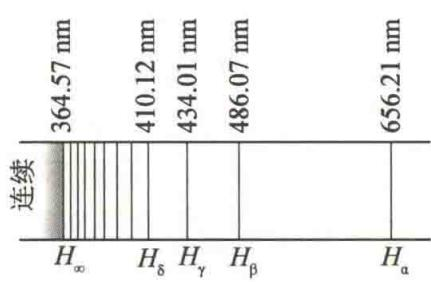
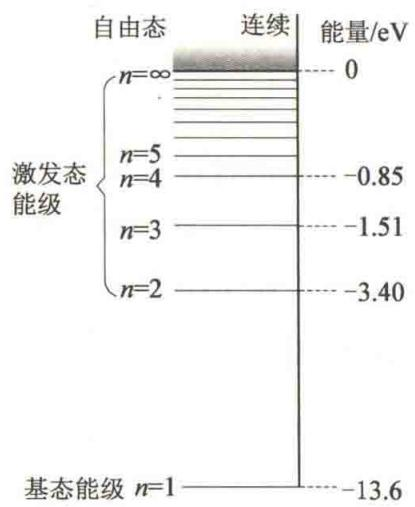
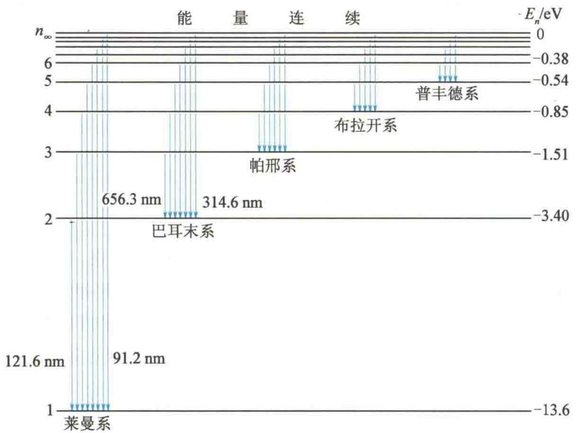

import QRCodeVideo from '@/components/QRCodeVideo.astro';

import Guide from '@/components/Guide.astro';
import Knowledge from '@/components/Knowledge.astro';
import Example from '@/components/Example.astro';
import Analysis from '@/components/Analysis.astro';
import Solution from '@/components/Solution.astro';
import Variant from '@/components/Variant.astro';
import Note from '@/components/Note.astro';
import Block from '@/components/Block.astro';
import Method from '@/components/Method.astro';
import Exercise from '@/components/Exercise.astro';

## 15.3.1 氢原子光谱的实验规律

光谱是电磁辐射的波长成分和强度分布的记录；有时只是波长成分的记录.原子光谱的规律性提供了原子内部结构的重要信息. 氢原子是结构最简单的原子, 历史上就是从研究氢原子光谱规律开始研究原子的. 在可见光和近紫外区, 氢原子光谱如图 15.10 所示, 其中 $H_{\alpha}, H_{\beta}, H_{\gamma}, H_{\delta}$ 均在可见光区. 由图 15.10 可见, 谱线是线状分立的, 光谱线从长波方向的 $H_{\alpha}$ 线起向短波方向展开, 谱线的间距越来越小, 最后趋近一个极限位置, 称为线系极限,
<figure class="vp-figure">
  
  <figcaption>图15.10 氢原子光谱</figcaption>
</figure>
用 $H_{\infty}$ 表示.1885年，巴耳末发现这些谱线的波长可用简单的整数关系公式计算出来，即
$$
\lambda = B \frac {n ^ {2}}{n ^ {2} - 4}
$$
式中， $B = 364.57 \, nm$ . 当 $n = 3, 4, 5, \cdots$ 时，就可以算出 $H_{\alpha}, H_{\beta}, H_{\gamma}, H_{\delta}, \cdots$ 的波长. 这个公式称为巴耳末公式. 公式值与实验值符合得很好.
光谱学上常用波长的倒数(称为波数) $\tilde{\nu}=\frac{1}{\lambda}$ 来表征谱线.它的物理意义是单位长度内所包含完整波长的数目,则巴耳末公式可写成
$$
\tilde {\nu} = \frac {1}{\lambda} = R \left(\frac {1}{2 ^ {2}} - \frac {1}{n ^ {2}}\right) (n = 3, 4, 5, \dots)
$$
式中， $R=\frac{4}{B}=1.096\ 775\ 8\times10^{7}\ m^{-1}$ ，称为氢原子的里德伯常量.
后来,又在光谱的紫外区、近红外区及远红外区发现了其他线系,它们的波数公式也有类似的形式.这些线系有
莱曼系： $\tilde{\nu}=R\left(\frac{1}{1^{2}}-\frac{1}{n^{2}}\right)\quad(n=2,3,4,\cdots)$ （在紫外区）
帕邢系： $\tilde{\nu}=R\left(\frac{1}{3^{2}}-\frac{1}{n^{2}}\right)\quad(n=4,5,6,\cdots)$ （在近红外区）
布拉开系： $\tilde{\nu}=R\left(\frac{1}{4^{2}}-\frac{1}{n^{2}}\right)\quad(n=5,6,7,\cdots)$ （在远红外区）
普丰德系： $\tilde{\nu}=R\left(\frac{1}{5^{2}}-\frac{1}{n^{2}}\right)\quad(n=6,7,8,\cdots)$ （在远红外区）
这些线系可统一用一个公式表示为
$$
\tilde {\nu} = R \left(\frac {1}{k ^ {2}} - \frac {1}{n ^ {2}}\right) (k = 1, 2, 3, \dots , n = k + 1, k + 2, k + 3, \dots)\tag{15.15}
$$
此式称为广义巴耳末公式,再将它改写成
$$
\tilde {\nu} = T (k) - T (n)
$$
式中， $T(k)=\frac{R}{k^{2}}$ ， $T(n)=\frac{R}{n^{2}}$ 称为光谱项。可见，氢原子光谱的任何一条谱线的波数都可由两个光谱项之差表示。改变前项 $T(k)$ 中的整数k可给出不同谱线系；前项中的整数保持定值，后项 $T(n)$ 中的整数n取不同数值，可给出同一谱线系中各谱线的波数。不同的线系中可以有共同的光谱项。

## 15.3.2 玻尔的氢原子理论

原子光谱的实验规律确定之后, 许多人尝试为原子的内部结构建立一个模型, 以解释光谱的实验规律. 1912年, 卢瑟福根据 $\alpha$ 粒子散射实验结果建立了原子的有核模型. 原子的中心有一带正电荷 $Ze(Z$ 为原子序数, $e$ 为电子电量) 的原子核, 其线度不超过 $10^{-15} \mathrm{~m}$ , 却集中了绝大部分的原子质量, 原子核外有 $Z$ 个带负电的电子, 它们围绕着原子核运动. 从经典电磁学看来, 电子绕核的加速运动应该产生电磁辐射, 所辐射的电磁波的频率等于电子绕核转动的频率. 由于电子辐射电磁波, 电子能量逐渐减少, 运动轨道越来越小, 相应的转动频率越来越高, 因此原子光谱应该是连续谱, 而电子最终落到核上, 原子系统是一个不稳定系统. 但实验事实表明, 原子光谱是线状光谱, 原子一般处于某一稳定状态. 可见, 运用经典理论不能找出原子光谱和原子内部电子运动的联系.
<QRCodeVideo title="玻尔" url="https://api.guangyiedu.com/v3/resource/resource/r/NewQrCode-j7aKmRCcb7QVKXo14QXX" />  
为了解决经典理论所遇到的困难,玻尔于1913年在卢瑟福建立的原子有核模型的基础上,把普朗克能量子的概念和爱因斯坦光子的概念运用到原子系统中,提出了以下三条基本假设.

### 1. 定态假设

原子系统存在一系列不连续的能量状态,处于这些状态的原子中的电子只能在一定的轨道上绕核做圆周运动,但不辐射能量.这些状态为原子系统的稳定状态,简称定态,相应的能量只能是不连续的值 $E_{1},E_{2},E_{3},\cdots$ .

### 2. 频率假设

当原子从一个较高能量 $E_{n}$ 的定态跃迁到另一个较低能量 $E_{k}$ 的定态时，原子辐射出一个光子，其频率由下式决定：
$$
h \nu = E _ {n} - E _ {k}
$$
式中，h 为普朗克常量。
反之，当原子处于较低能量 $E_{k}$ 的定态时，吸收一个能量为 $h\nu$ 的光子，则可跃迁到较高能量 $E_{n}$ 的定态.频率假设也称为频率条件.

### 3. 轨道角动量量子化假设

原子中的电子绕核做圆周运动的轨道角动量 L 必须等于 $\frac{h}{2\pi}$ 的整数倍，即
$$
L = n \frac {h}{2 \pi} (n = 1, 2, 3, \dots)
$$
式中，n 只能取不为零的正整数，称为量子数。此式也称为轨道角动量量子化条件。
玻尔根据上述假设计算了氢原子在稳定态中的轨道半径和能量. 他认为, 原子核不动, 电子以核为中心做半径为 $r$ 的圆周运动. 电子质量为 $m$ , 速率为 $v$ , 向心加速度为 $\frac{v^2}{r}$ , 向心力为静电力, 根据牛顿第二定律有
$$
m \frac {v ^ {2}}{r} = \frac {e ^ {2}}{4 \pi \varepsilon_ {0} r ^ {2}}\tag{15.16}
$$
根据第三条假设有
$$
L = m v r = n \frac {h}{2 \pi} (n = 1, 2, 3, \dots)\tag{15.17}
$$
联立式(15.16)、式(15.17)，消去 $v$ ，并用 $r_n$ 代替 $r, r_n$ 表示第 $n$ 个稳定轨道的半径，得
$$
r _ {n} = n ^ {2} \left(\frac {\varepsilon_ {0} h ^ {2}}{\pi m e ^ {2}}\right) = n ^ {2} r _ {1}\tag{15.18}
$$
式中， $r_{1}=\frac{\varepsilon_{0}h^{2}}{\pi me^{2}}=5.29\times10^{-11}$ m，称为第一玻尔轨道半径，是氢原子核外电子最小的轨道半径.
玻尔还认为原子系统的能量等于电子的动能和电子与核的势能之和,即
$$
E _ {n} = \frac {1}{2} m v _ {n} ^ {2} - \frac {e ^ {2}}{4 \pi \varepsilon_ {0} r _ {n}}\tag{15.19}
$$
由式(15.16)可知
$$
\frac {1}{2} m v _ {n} ^ {2} = \frac {e ^ {2}}{8 \pi \varepsilon_ {0} r _ {n}}
$$
代入式(15.19)，并将式(15.18)中 $r_{n}$ 的值代入，得
$$
E _ {n} = - \frac {e ^ {2}}{8 \pi \varepsilon_ {0} r _ {n}} = - \frac {1}{n ^ {2}} \frac {m e ^ {4}}{8 \varepsilon_ {0} ^ {2} h ^ {2}} (n = 1, 2, 3, \dots)\tag{15.20}
$$
可见,能量是量子化的.这些分立的能量值 $E_{1}, E_{2}, E_{3}, \cdots$ 称为能级.当 n = 1 时,得
$$
E _ {1} = - \frac {m e ^ {4}}{8 \varepsilon_ {0} ^ {2} h ^ {2}} = - 1 3. 6 \mathrm{eV}
$$
则有
$$
E _ {n} = - \frac {1 3 . 6}{n ^ {2}} \mathrm{eV}
$$
当 n=1 时， $E_{1}$ 为能量最小值，即原子处于能量最低的状态，称为正常态或基态。当 $n=2,3,4,\cdots$ 时，对应的能量分别为 $E_{2},E_{3},E_{4},\cdots$ ，分别称为第一激发态、第二激发态、第三激发态……当 $n\to\infty$ 时， $E_{\infty}=0$ ，这时电子已脱离原子核成为自由电子。图 15.11 所示为氢原子的能级。基态和各激发态中电子都没脱离原子，统称为束缚态。能量在 $E_{\infty}=0$ 以上时，电子脱离了原子，这种状态称为电离态，此时电子的能量是连续的，不受量子化条件限制。电子从基态到脱离原子核的束缚所需要的能量称为电离能。可见，氢原子的电离能为 13.6 eV。
<figure class="vp-figure">
  
  <figcaption>图15.11 氢原子的能级</figcaption>
</figure>
根据玻尔的频率条件有
$$
\nu = \frac {E _ {n} - E _ {k}}{h} = \frac {m e ^ {4}}{8 \varepsilon_ {0} ^ {2} h ^ {3}} \left(\frac {1}{k ^ {2}} - \frac {1}{n ^ {2}}\right)
$$
用波数表示为
$$
\tilde {\nu} = \frac {\nu}{c} = \frac {m e ^ {4}}{8 \varepsilon_ {0} ^ {2} h ^ {3} c} \left(\frac {1}{k ^ {2}} - \frac {1}{n ^ {2}}\right)
$$
与式 $(15.15)$ 比较,得到里德伯常量
$$
R = \frac {m e ^ {4}}{8 \varepsilon_ {0} ^ {2} h ^ {3} c}
$$
式中，m 为电子质量。将各量值代入，得到理论值为
$$
R _ {\mathrm{理论}} = 1. 0 9 7 3 7 3 \times 1 0 ^ {7} \: \mathrm{m} ^ {- 1}
$$
实验值为
$$
R _ {\mathrm{实验}} = 1. 0 9 6 7 7 6 \times 1 0 ^ {7} \: \mathrm{m} ^ {- 1}
$$
可见,理论值与实验值符合得非常好.这是玻尔理论成功的一个方面.于是氢原子能级的表达式[式(15.20)]可写为
$$
E _ {n} = - \frac {R c h}{n ^ {2}} (n = 1, 2, 3, \dots)
$$
要产生氢原子光谱,必须先使氢原子处于激发态.通常是在放电管中加速电子或其他粒子使其与氢原子碰撞,使氢原子激发到各激发态,然后氢原子从高能态自发跃迁到低能态.从n>1的能级向n=1的能级跃迁,产生莱曼系各谱线;从n>2的能级向n=2的能级跃迁,产生巴耳末系各谱线;从n>3的能级向n=3的能级跃迁,产生帕邢系各谱线;其余线系以此类推.图15.12所示为氢原子光谱各线系的能级跃迁.
<figure class="vp-figure">
  
  <figcaption>图 15.12 氢原子光谱各线系的能级跃迁</figcaption>
</figure>
应当注意,某时刻一个氢原子一次跃迁只发出一条谱线,而实验中是大量原子处于不同的激发态向低能级跃迁,所以能同时观察到全部发射谱线.

<Example title="例 15.7">
计算氢原子的电离电势和第一激发电势.

<Solution title="解">
由氢原子能级公式
$$
E _ {n} = - \frac {1 3 . 6}{n ^ {2}} \mathrm{eV}
$$
$$
\begin{array}{r l} E _ {\text {电离}} & = E _ {\infty} - E _ {1} = 0 - \left(- \frac {1 3 . 6}{1 ^ {2}}\right) \\ & = 1 3. 6 \mathrm{eV} \end{array}
$$
电离能为
$$
V _ {\mathrm{电离}} = \frac {E _ {\mathrm{电离}}}{e} = 1 3. 6 \: \mathrm{V}
$$
所以第一激发电势为
从基态到第一激发态所需能量为
$$
V = \frac {E}{e} = 1 0. 2 \mathrm{V}
$$
$$
\begin{array}{r l} E & = E _ {2} - E _ {1} = \left(- \frac {1 3 . 6}{2 ^ {2}}\right) - \left(- \frac {1 3 . 6}{1 ^ {2}}\right) \\ & = 1 0. 2 \mathrm{eV} \end{array}
$$
</Solution>
</Example>

<Example title="例 15.8">
以动能为 12.5 eV 的电子通过碰撞使基态氢原子激发时, 最高能激发到哪一能级? 当回到基态时能产生哪些谱线? 分别属于什么线系?

<Solution title="解">
设氢原子全部吸收 12.5 eV 的能量后最高能激发到第 n 个能级，由 $E_{n} = -\frac{Rhc}{n^{2}}$ ，有
$$
2 \rightarrow 1: \tilde {\nu} _ {2} = R \left(\frac {1}{1 ^ {2}} - \frac {1}{2 ^ {2}}\right) = \frac {3}{4} R
$$
$$
E _ {n} - E _ {1} = R h c \left(1 - \frac {1}{n ^ {2}}\right) = 1 2. 5 \mathrm{eV}
$$
$$
\lambda_ {2} = \frac {4}{3 R} = 1 2 1. 6 \mathrm{nm}
$$
Rhc 等于电离能 13.6 eV, 解得 n = 3.5. n 只能取整数, 所以氢原子最高能激发到 n = 3 的能级. 于是将产生三条谱线.
$$
3 \rightarrow 2: \tilde {\nu} _ {3} = R \left(\frac {1}{2 ^ {2}} - \frac {1}{3 ^ {2}}\right) = \frac {5}{3 6} R
$$
$$
3 \rightarrow 1: \tilde {\nu} _ {1} = R \left(\frac {1}{1 ^ {2}} - \frac {1}{3 ^ {2}}\right) = \frac {8}{9} R
$$
$$
\lambda_ {1} = \frac {9}{8 R} = 1 0 2. 6 \mathrm{nm}
$$
$$
\lambda_ {3} = \frac {3 6}{5 R} = 6 5 6. 3 \mathrm{nm}
$$
$\lambda_{1}$ 、 $\lambda_{2}$ 属于莱曼系， $\lambda_{3}$ 属于巴耳末系。对于单个氢原子来说，一次跃迁只能发出一种波长，实际观测时是大量氢原子发光，所以三种波长同时存在。
</Solution>
</Example>

## 15.3.3 玻尔理论的成功和局限性

<QRCodeVideo title="量子力学的争论和非线性量子力学" url="https://api.guangyiedu.com/v3/resource/resource/r/NewQrCode-iT0jiwB3uCGQwe9SmbbX" />
玻尔的氢原子理论是原子结构理论发展中的一个重要阶段，在处理氢原子（及类氢离子）的光谱问题上取得了成功：能从理论上算出里德伯常量；理论上能定量地解释氢原子光谱的实验规律。玻尔首先指出经典物理学对原子内部现象不适用，提出了原子系统能量量子化的概念和角动量量子化的概念。玻尔还创造性地提出了定态假设和能级跃迁决定谱线频率的假设，这在现代量子力学理论中仍然是两个最重要的基本概念。
量子力学的争论和非线性量子力学
玻尔理论也有很大的局限性. 它只能计算氢原子谱线的频率, 无法计算光谱的强度、宽度、偏振等问题. 对稍复杂的原子 (如氦原子) 的光谱则不能计算. 它虽然指出经典物理不适用于原子内部, 但未能完全脱离经典物理的影响, 仍采用经典物理的思想和处理方法. 例如, 把电子看成一个经典粒子, 做轨道运动, 轨道半径和能量公式的推导完全采用经典物理的方法. 它是把经典理论和量子化条件生硬地结合起来, 缺乏统一的理论体系. 它还没有抓住微观粒子的本质特征 (波粒二象性). 严格地说 (从量子力学角度), 它的物理图像 (如轨道) 和某些结果 $\left(如 L = n\frac{h}{2\pi}\right)$ 是不正确的. 所以, 玻尔理论必然被进一步发展起来的更正确的理论 (量子力学) 所代替.

