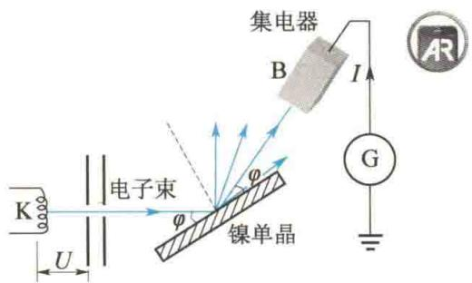
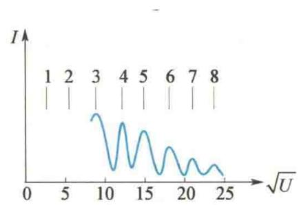
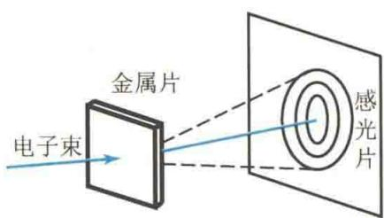

import QRCodeVideo from '@/components/QRCodeVideo.astro';

import Guide from '@/components/Guide.astro';
import Knowledge from '@/components/Knowledge.astro';
import Example from '@/components/Example.astro';
import Analysis from '@/components/Analysis.astro';
import Solution from '@/components/Solution.astro';
import Variant from '@/components/Variant.astro';
import Note from '@/components/Note.astro';
import Block from '@/components/Block.astro';
import Method from '@/components/Method.astro';
import Exercise from '@/components/Exercise.astro';

## 15.4.1 德布罗意波

1924 年,法国青年物理学家德布罗意在光的波粒二象性的启发下想到:自然界在许多方面都是明显地对称的,既然光具有波粒二象性,那么实物粒子,如电子、质子、中子等也应该具有波粒二象性.他假设:实物粒子也具有波动性.一个实物粒子的能量为 E、动量大小为 p,跟它们联系的波的频率 $\nu$ 和波长 $\lambda$ 的关系为
$$
E = m c ^ {2} = h \nu\tag{15.21}
$$
<QRCodeVideo title="德布罗意" url="https://api.guangyiedu.com/v3/resource/resource/r/NewQrCode-ud9HmwuzOOGSgUM7g94W" />  
$$
p = m v = \frac {h}{\lambda}
$$
(15.22)
这两个公式称为德布罗意公式. 它是从光子所遵从的式(15.8)、式(15.10)推广而得出的. 和实物粒子相联系的波, 称为德布罗意波或物质波.

<Example title="例 15.9">
由德布罗意公式计算微粒的德布罗意波长. 设电子由静止被加速电压 U 加速, 求加速后电子的德布罗意波长.

<Solution title="解">
电子加速后获得的动能 $E_{k} = eU$ ，按照相对论公式 $E = E_{k} + m_{0}c^{2}$ ，E 为电子的总能量 $E = mc^{2}$ ，则
$$
E - m _ {0} c ^ {2} = e U
$$
若忽略相对论效应,则有
$$
E _ {\mathrm{k}} = \frac {1}{2} m _ {0} v ^ {2} = e U
$$
又
$$
E ^ {2} = c ^ {2} p ^ {2} + m _ {0} ^ {2} c ^ {4}
$$
$$
\lambda = \frac {h}{p} = \frac {h}{m _ {0} v}
$$
从以上两式解得电子加速后的动量为
$$
\begin{array}{r l} p & = \frac {1}{c} \sqrt {2 E _ {0} E _ {\mathrm{k}} + E _ {\mathrm{k}} ^ {2}} \\ & = \frac {1}{c} \sqrt {2 m _ {0} c ^ {2} e U + (e U) ^ {2}} \end{array}
$$
$$
\lambda = \frac {h}{p} = \frac {h c}{\sqrt {2 m _ {0} c ^ {2} e U + (e U) ^ {2}}}
$$
由式(15.22)，得
由上两式消去 $v$ ，得电子的德布罗意波长为
$$
\begin{array}{r l} \lambda & = \sqrt {\frac {h ^ {2}}{2 m _ {0} e U}} \\ & = \sqrt {\frac {(6 . 6 3 \times 1 0 ^ {- 3 4}) ^ {2}}{2 \times 9 . 1 1 \times 1 0 ^ {- 3 1} \times 1 . 6 0 \times 1 0 ^ {- 1 9}}} \frac {1}{\sqrt {U}} \\ & = \frac {1 . 2 3 \times 1 0 ^ {- 9}}{\sqrt {U}} (\mathrm{m}) = \frac {1 . 2 3}{\sqrt {U}} (\mathrm{nm}) \end{array}
$$
若 U = 150 V，则 $\lambda = 0.1 \, nm$ ，与软 X 射线的波长同数量级。可见，微粒的德布罗意波长一般非常短。
</Solution>
</Example>

<Example title="例 15.10">
计算质量 $m = 0.01 \, kg$ 、速率 $v = 300 \, m/s$ 的子弹的德布罗意波长.

<Solution title="解">
根据德布罗意公式,可得子弹的德布罗意波长为
$$
\lambda = \frac {h}{m v} = \frac {6 . 6 3 \times 1 0 ^ {- 3 4}}{0 . 0 1 \times 3 0 0} \mathrm{m} = 2. 2 1 \times 1 0 ^ {- 3 4} \mathrm{m}
$$
可以看出,因为普朗克常量很小,所以宏观物体的波长小到实验难以测量的程度,因而宏观物体仅表现出粒子性.
<table><tr><td>证明波的相速度u=λv.根据德布罗意公式,λ=h/mv,ν=mc2/h,两式相乘,得u=λν=c2/v.因为v</td></tr></table>
德布罗意假设为许多实验所证实.1927年，戴维孙和革末做了电子束在晶体表面的散射实验，证实了电子的波动性，实验装置如图15.13所示.把电子束看作X射线，整个实验和X射线在晶体点阵结构上的衍射完全类同，只有满足布拉格公式
$$
2 d \sin \varphi = k \lambda = k \frac {1 . 2 3}{\sqrt {U}} (k = 1, 2, 3, \dots)
$$
时，电子束才有最强的反射，进入集电器的电子流最大。实验结果如图15.14所示。该曲线是取 $\varphi = 80^{\circ}, d = 0.203\mathrm{nm}$ （镍单晶）代入上式得到的。当 $\sqrt{U} = k \times 3.06$ 时，电流出现峰值。实验结果与理论一致，证实了电子的波动性。
  
图 15.13 戴维孙-革末电子衍射实验装置示意图
  
图 15.14 电子在镍单晶上衍射时, 电子束强度与加速电压的关系
同年(1927年)，汤姆孙做了电子衍射实验，实验装置如图15.15所示。将电子束穿过金属片（多晶膜），在感光片上产生的圆环衍射图样和X射线通过多晶膜产生的衍射图样极其相似，这也证实了电子的波动性。后来，人们又分别做了中子、质子、原子、分子的衍射实验，实验结果都说明这些粒子具有波动性。波粒二象性是光子和一切微观粒子共同具有的特性，
  
图 15.15 电子衍射实验装置
德布罗意公式是描述微观粒子波粒二象性的基本公式.
</Solution>
</Example>

## 15.4.2 德布罗意波的统计解释

对于实物粒子波动性的解释, 是 1926 年玻恩提出概率波的概念后得到一致公认的.
对比光和实物粒子的衍射图样,可以看出实物粒子的波动性和粒子性之间的联系.对光的强度问题,爱因斯坦已从统计学的观点提出:光强的地方,光子到达的概率大;光弱的地方,光子到达的概率小.玻恩用同样的观点来分析戴维孙-革末实验(或电子衍射图样),他认为:电子流出现峰值(或衍射图样出现亮条纹)处,电子出现的概率大;不是峰值处,电子出现的概率小.此结论对其他微观粒子也同样适用.至于个别粒子在何处出现,则有一定的偶然性,但是大量粒子在空间何处出现的空间分布却服从一定的统计规律.物质波的这种统计解释把粒子的波动性和粒子性正确地联系起来了,成为量子力学的基本观点之一.
有人让电子一个一个地照射金属片做汤姆孙电子衍射实验，发现一个一个的衍射电子出现在感光片上的位置好像是无规律的。但长时间照射，衍射电子越来越多，大量的衍射电子才形成了确定的衍射图样。1909年，泰勒用极弱的光照射缝衣针的针孔，曝光三个月才获得衍射图样，与用强光短时间曝光的结果相同。这些实验都说明了德布罗意波是概率波。
