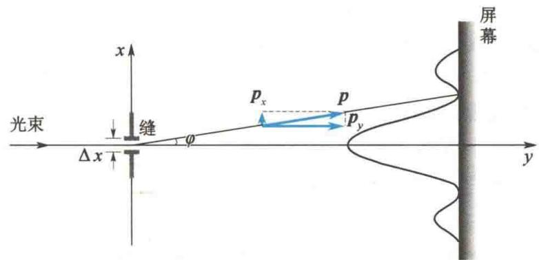

import Guide from '@/components/Guide.astro';
import Knowledge from '@/components/Knowledge.astro';
import Example from '@/components/Example.astro';
import Analysis from '@/components/Analysis.astro';
import Solution from '@/components/Solution.astro';
import Variant from '@/components/Variant.astro';
import Note from '@/components/Note.astro';
import Block from '@/components/Block.astro';
import Method from '@/components/Method.astro';
import Exercise from '@/components/Exercise.astro';

在经典力学中,一个粒子(质点)的运动状态是用位置(坐标)和速度(动量)来描述的,因而质点的运动也就有一定的轨道.但对微观粒子,由于具有波粒二象性,它的空间位置需要用概率波来描述,而概率波只能给出粒子在各处出现的概率,因此任意时刻粒子不具有确定的位置.与此相联系,粒子在各时刻也不具有确定的动量.粒子在某一方向(x轴方向)上位置的不确定量 $\Delta x$ 和在该方向上动量的不确定量 $\Delta p_{x}$ 的关系为

$$

\Delta x \Delta p _ {x} \geqslant h

$$

这种关系称为海森伯不确定关系. 量子力学认为, 这种位置和动量的不能同时测定性, 不是由仪器和测量方法引起的, 而完全是由微观粒子的波粒二象性造成的. 如果仍然使用坐标和动量来描述微观粒子的运动, 则必然存在这种不确定性. 下面以光 (或电子) 的单缝衍射为例来说明这一关系.

图 15.16 所示为一束波长为 $\lambda$ 的单色光沿 y 轴方向入射到缝宽为 $\Delta x$ 的单缝上，通过缝后在屏幕上观测到衍射条纹。对于一个光子来说，不能确切地说它从缝中哪一点通过，只能说它是从宽为 $\Delta x$ 的缝中通过的，因此它在 x 轴方向上位置的不确定量为 $\Delta x$ 。通过缝后，在 x 轴方向上的动量 $p_{x}$ 的大小不为零，衍射条纹表明，如果 $p_{x}$ 的大小为零，则只能观测到与缝同宽的一条明纹，而实际衍射条纹比缝宽大得多。这里只考虑中央明纹的宽度，则对于其半角宽 $\varphi$ （第 1 级暗纹的衍射角），根据单缝衍射公式，有

$$

\Delta x \sin \varphi = \lambda

$$

对应于该衍射方向，光子在 $x$ 轴方向上的动量大小为 $p_x = p\sin \varphi$ 。所以， $p_x$ 的不确定量 $\Delta p_x \approx p_x = p\sin \varphi$ ，故

$$

\Delta p _ {x} = p \frac {\lambda}{\Delta x}

$$

  

图 15.16 光子(或电子)的单缝衍射

再利用德布罗意公式 $\lambda = \frac{h}{p}$ ，可得

$$

\Delta x \Delta p _ {x} \approx h

$$

考虑一级以上的条纹,则得

$$

\Delta x \Delta p _ {x} \geqslant h

$$

量子力学给出的结果为

$$

\Delta x \Delta p _ {x} \geqslant \frac {\hbar}{2}

$$

式中

$$

\hbar = \frac {h}{2 \pi} = 1. 0 5 4 5 8 8 7 \times 1 0 ^ {- 3 4} \mathrm{J} \cdot \mathrm{s}

$$

称为约化普朗克常量.

由于实际上此公式通常只用于数量级的估计,因此又常简写为

$$

\Delta x \Delta p _ {x} \geqslant \hbar\tag{15.23}

$$

同理可得

$$

\Delta y \Delta p _ {y} \geqslant \frac {\hbar}{2}

$$

$$

\Delta z \Delta p _ {z} \geqslant \frac {\hbar}{2}

$$

这就是说,坐标(位置)越准确,动量就越不准确;动量越准确,坐标就越不准确.这和衍射实验的结果一致,单缝宽 $\Delta x$ 越小,衍射条纹越宽,即 $\Delta p_{x}$ 越大.

可以证明,能量和时间也有类似的不确定关系

$$

\Delta E \Delta t \geqslant \frac {\hbar}{2}\tag{15.24}

$$

式中， $\Delta E$ 是系统能量的不确定量， $\Delta t$ 是时间的不确定量。下面用一特例说明上式。设一质量为 $m$ 的粒子以速率 $v$ 做直线运动，其动能为

$$

E = \frac {1}{2} m v ^ {2} = \frac {p ^ {2}}{2 m}

$$

将上式两端取微分, 得

$$

\Delta E = \frac {p}{m} \Delta p = \frac {m v}{m} \Delta p = v \Delta p

$$

另外， $x = vt$ ，则有 $\Delta x = v\Delta t$ ，利用式(15.23)有

$$

\Delta x \Delta p _ {x} = \frac {\Delta E}{v} v \Delta t = \Delta E \Delta t \geqslant \hbar

$$

原子处于某激发能级的平均时间称为平均寿命,用 $\tau$ 表示.利用能量和时间的不确定关系,可见能级宽度 $\Delta E$ 与它的平均寿命 $\tau$ 成反比,能级寿命越短,能级宽度越宽,反之越窄.

<Example title="例 15.12">
原子的线度为 $10^{-10}$ m，求原子中电子速度的不确定量.

<Solution title="解">
“电子在原子中” 就意味着电子位置的不确定量为 $\Delta x = 10^{-10}$ m. 根据不确定关系, 可得

$$

\begin{array}{r l} \Delta v _ {x} & = \frac {\hbar}{m \Delta x} = \frac {1 . 0 5 \times 1 0 ^ {- 3 4}}{9 . 1 1 \times 1 0 ^ {- 3 1} \times 1 0 ^ {- 1 0}} \mathrm{m/s} \\ & = 1. 2 \times 1 0 ^ {6} \mathrm{m/s} \end{array}

$$

按玻尔理论算得氢原子中电子的运动速度约为 $10^{6}\ m/s$ ，它与上面计算的速度不确定量同数量级。因此对于原子中的电子，讨论它的轨道与速度是没有实际意义的。
</Solution>
</Example>

<Example title="例 15.13">
假定原子中的电子在某激发态的平均寿命 $\tau = 10^{-8}$ s，该激发态的能级宽度是多少？

<table><tr><td>解</td><td> $\Delta E \geqslant \frac{\hbar}{\tau} = \frac{1.05 \times 10^{-34}}{10^{-8}} \text{ J}$  $= 1.05 \times 10^{-26} \text{ J}$  $= 6.56 \times 10^{-8} \text{ eV}$ </td><td>当原子从激发态向基态跃迁时,由于能级有一定的宽度,故光谱线也有一定的宽度,称为自然宽度.反过来,根据谱线的自然宽度,可以确定原子在激发态的平均寿命.</td></tr></table>
</Example>

<Example title="例 15.14">
一维运动的粒子被限制在宽为 a 的范围内运动, 应用不确定关系估计质量为 m 的粒子的零点能(即最小能量).

<Solution title="解">
位置的不确定量为 $\Delta x = a$ ，则动量的最小不确定量为 所以最小能量为

$$

\Delta p _ {x} = \frac {\hbar}{a}

$$

$$

E = \frac {p _ {x} ^ {2}}{2 m} = \frac {\Delta p _ {x} ^ {2}}{2 m} = \frac {\hbar^ {2}}{2 m a ^ {2}}

$$

这便是零点能.
</Solution>
</Example>

<Example title="例 15.15">
氦氖激光器发出波长 $\lambda = 632.8 \, nm$ 的光，谱线宽度 $\Delta\lambda = 10^{-9} \, nm$ ，求这种光子沿 x 轴方向传播时，它的 x 轴坐标的不确定量。

<Solution title="解">
根据德布罗意公式 $p_x = \frac{h}{\lambda}$ , 对等式两边微分并只取其绝对值, 得

$$

\Delta p _ {x} = \frac {h}{\lambda^ {2}} \Delta \lambda

$$

这就是光学中的相干长度,即波列的长度.将 $\lambda$ 、 $\Delta\lambda$ 的数值代入,可得

根据不确定关系,可得

$$

\Delta x = \frac {\hbar}{\Delta p _ {x}} = \frac {\lambda^ {2}}{2 \pi \Delta \lambda} \approx \frac {\lambda^ {2}}{\Delta \lambda}

$$

$$

\begin{array}{r l} \Delta x & \approx \frac {\lambda^ {2}}{\Delta \lambda} = \frac {(6 3 2 8 \times 1 0 ^ {- 1 0}) ^ {2}}{1 0 ^ {- 9} \times 1 0 ^ {- 9}} \mathrm{m} \\ & = 4 \times 1 0 ^ {5} \mathrm{m} = 4 0 0 \mathrm{km} \end{array}

$$

</Solution>
</Example>
