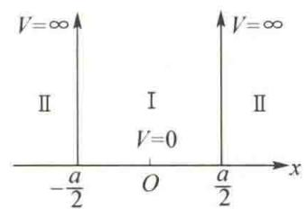
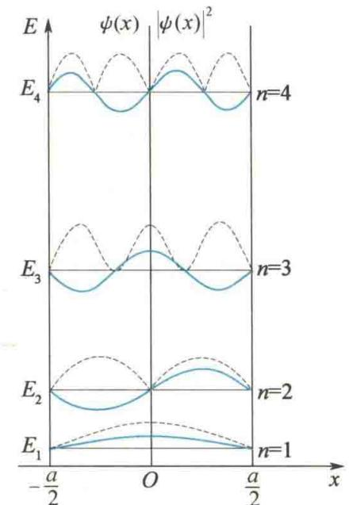
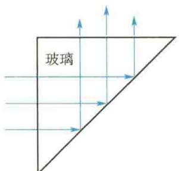
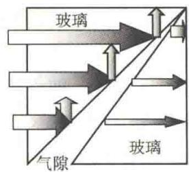
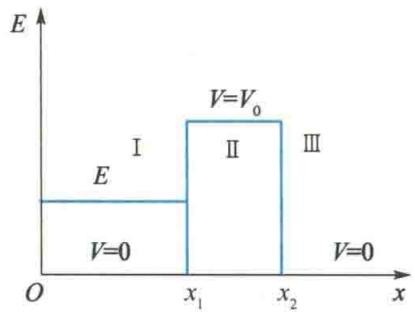
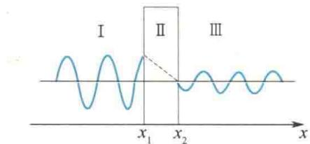
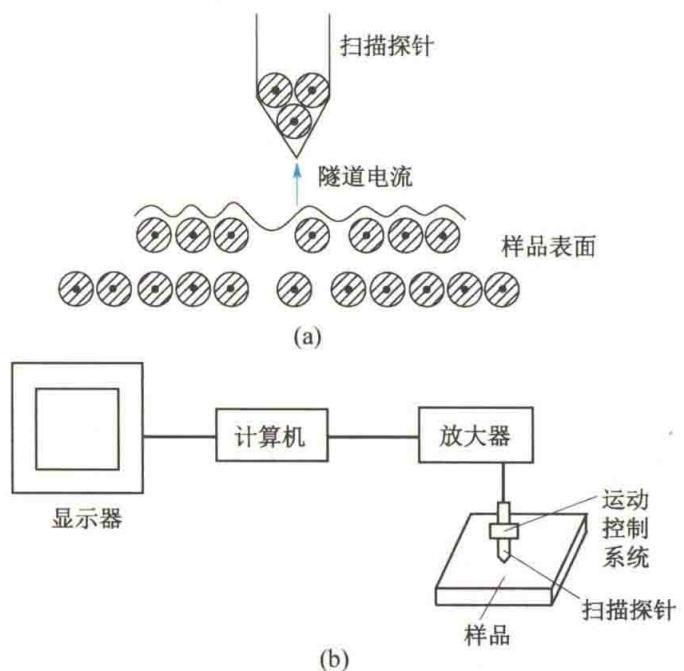
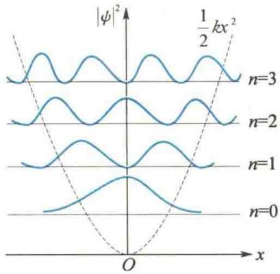

import Guide from '@/components/Guide.astro';
import Knowledge from '@/components/Knowledge.astro';
import Example from '@/components/Example.astro';
import Analysis from '@/components/Analysis.astro';
import Solution from '@/components/Solution.astro';
import Variant from '@/components/Variant.astro';
import Note from '@/components/Note.astro';
import Block from '@/components/Block.astro';
import Method from '@/components/Method.astro';
import Exercise from '@/components/Exercise.astro';

## 15.7.1 一维无限深势阱

可以假定在金属内部的自由电子不受力,势能为零.但电子要逸出金属表面,必须克服正电荷的引力做功,就相当于在金属表面处势能突然增大而不能逸出.粗略分析自由电子的这种运动时,可提出一个理想化的模型:假设电子在一维无限深势阱中运动,它的势能函数为
$$
V (x) = \left\{ \begin{array}{l l} 0 & \left(- \frac {a}{2} \leqslant x \leqslant \frac {a}{2}\right) \\ \infty & \left(x <   - \frac {a}{2} \text {或} x > \frac {a}{2}\right) \end{array} \right.
$$
一维无限深势阱如图 15.17 所示, 分为 I 区和 II 区.
对Ⅰ区，V=0，代入式(15.34)，得
$$
\frac {\mathrm{d} ^ {2} \psi (x)}{\mathrm{d} x ^ {2}} + \frac {2 m E}{\hbar^ {2}} \psi (x) = 0\tag{15.35}
$$
令
$$
k ^ {2} = \frac {2 m E}{\hbar^ {2}}
$$
<figure class="vp-figure">
  
  <figcaption>图 15.17 一维无限深势阱</figcaption>
</figure>
则上式变为
$$
\frac {\mathrm{d} ^ {2} \psi (x)}{\mathrm{d} x ^ {2}} + k ^ {2} \psi (x) = 0
$$
此式的通解为
$$
\psi (x) = A \mathrm{e} ^ {\mathrm{i} k x} + B \mathrm{e} ^ {- \mathrm{i} k x}
$$
或
(15.36)
A、B 或 C、D 是待定常数，其与 k 的取值要用标准条件和归一化条件来确定.
对Ⅱ区， $V=\infty$ .为了后面讨论方便，暂设V的值是一个很大的数，且V>E，再使 $V\to\infty$ ，则式(15.34)变为
$$
\frac {\mathrm{d} ^ {2} \psi (x)}{\mathrm{d} x ^ {2}} = \frac {2 m}{\hbar^ {2}} (V - E) \psi (x)
$$
令 $\lambda^2 = \frac{2m(V - E)}{\hbar^2}$ ，当 $V\to \infty$ 时， $\lambda \rightarrow \infty$ ，则有
$$
\frac {\mathrm{d} ^ {2} \psi (x)}{\mathrm{d} x ^ {2}} = \lambda^ {2} \psi (x)
$$
此式的通解为
$$
\psi (x) = A ^ {\prime} \mathrm{e} ^ {\lambda x} + B ^ {\prime} \mathrm{e} ^ {- \lambda x}
$$
当 $x > \frac{a}{2}$ 时， $\lambda \to \infty$ ，则
$$
\psi (x) = A ^ {\prime} \cdot \infty + B ^ {\prime} \cdot 0
$$
第一项无限大,不符合标准条件,应舍去.第二项是零,故 $\psi(x)=0$ . 当 $x<-\frac{a}{2}$ 时,x 是负值,则有 $\psi(x)=A'\cdot0+B'\cdot\infty$ , 舍去第二项,还是 $\psi(x)=0$ . 所以,在Ⅱ区中, $\psi=0$ , 即粒子出现的概率为零,这是因为 $V\to\infty$ 时,粒子受到无限大指向阱内的力, 不可能进入Ⅱ区.
现在考虑Ⅰ区的波函数[式(15.36)].根据波函数必须连续的条件,在 $x=\pm\frac{a}{2}$ 处,Ⅰ区与Ⅱ区的波函数应相等,但Ⅱ区的波函数为零,则Ⅰ区的波函数也应为零,有
$$
\left\{ \begin{array}{l} C \cos \frac {k a}{2} + D \sin \frac {k a}{2} = 0 \\ C \cos \frac {k a}{2} - D \sin \frac {k a}{2} = 0 \end{array} \right.
$$
这是关于 C、D 的线性方程组，要使 C、D 有非零解，系数行列式必须为零，即
$$
\left| \begin{array}{c c} \cos \frac {k a}{2} & \sin \frac {k a}{2} \\ \cos \frac {k a}{2} & - \sin \frac {k a}{2} \end{array} \right| = 0
$$
展开行列式,得
$$
2 \cos {\frac {k a}{2}} \sin {\frac {k a}{2}} = \sin k a = 0
$$
这个条件限制了 $k$ ，使它只能取一些不连续的数值，即
$$
k a = n \pi (n = 1, 2, 3, \dots)
$$
由于 $k^2 = \frac{2mE}{\hbar^2}$ ，则
$$
k = \frac {n \pi}{a} = \frac {\sqrt {2 m E}}{\hbar}
$$
故
$$
E = \frac {\pi^ {2} \hbar^ {2}}{2 m a ^ {2}} n ^ {2} (n = 1, 2, 3, \dots)\tag{15.37}
$$
式(15.37)说明,能量是量子化的,整数n称为粒子能量的量子数.可见,在量子力学中,能量量子化是自然得到的结果.但这里n不能为零.如果n=0,则E=0,粒子的动能为零,即粒子静止,这是不可能的,所以n从1开始取值.能量的最小值 $E_{1}=\frac{\pi^{2}\hbar^{2}}{2ma^{2}}$ ,称为零点能.在量子力学中这是可以理解的.因为处于势阱中的粒子的能量若为零,则粒子的动量也为零,于是动量的不确定量 $\Delta p=0$ ,按不确定关系式 $\Delta p\Delta x\geqslant\hbar$ ,只有当 $\Delta x\to\infty$ 时该式才可能成立.实际上,粒子处于势阱中, $\Delta x=a$ 是被势阱宽度限制的结果,所以E不能为零,从而导致零点能的出现.从式(15.37)中还可以看到,只有当a和m与 $\hbar$ 同数量级时,能量量子化才明显.如果m是宏观物体的质量,a是宏观距离,则能级宽度非常小,可以认为能量是连续的.
把 $k$ 值代入式(15.36)得
$$
\psi (x) = C \cos {\frac {n \pi}{a}} x + D \sin {\frac {n \pi}{a}} x
$$
当 $x = \pm \frac{a}{2}$ 时，有
$$
\begin{array}{r l} \psi \Big (\pm \frac {a}{2} \Big) & = C \cos \frac {n \pi}{2} + D \sin \Big (\pm \frac {n \pi}{2} \Big) \\ & = \left\{ \begin{array}{l l} C \cdot 0 + D \cdot (\pm 1) & (n = 1, 3, 5, \dots) \\ C \cdot (\pm 1) + D \cdot 0 & (n = 2, 4, 6, \dots) \end{array} \right. \end{array}
$$
因为 $\psi \left(\pm \frac{a}{2}\right) = 0$ ，所以当 $n$ 为奇数时， $D$ 应等于零；当 $n$ 为偶数时， $C$ 应等于零。这样波函数为
$$
\psi (x) = C \cos {\frac {n \pi}{a}} x \quad (n = 1, 3, 5, \dots)
$$
$$
\psi (x) = D \sin {\frac {n \pi}{a}} x \quad (n = 2, 4, 6, \dots)
$$
C、D 这两个常数可由归一化条件确定：
$$
\int_ {- \frac {a}{2}} ^ {+ \frac {a}{2}} C ^ {2} \cos^ {2} \frac {n \pi}{a} x \mathrm{d} x = 1
$$
$$
\int_ {- \frac {a}{2}} ^ {+ \frac {a}{2}} D ^ {2} \sin^ {2} \frac {n \pi}{a} x \mathrm{d} x = 1
$$
由此算出
$$
C = D = \sqrt {\frac {2}{a}}
$$
则归一化的波函数为
$$
\psi (x) = \sqrt {\frac {2}{a}} \cos \frac {n \pi}{a} x \quad (n = 1, 3, 5, \dots)\tag{15.38}
$$
$$
\psi (x) = \sqrt {\frac {2}{a}} \sin \frac {n \pi}{a} x \quad (n = 2, 4, 6, \dots)\tag{15.39}
$$
粒子在势阱中的概率密度 $|\psi (x)|^2$ 随 $x$ 和 $n$ 的变化发生改变，这与经典力学不同.按照经典力学，粒子在势阱内是自由的，各点出现的概率应该相等.同时由式(15.39）知，若 $n = 0$ ，则 $\psi (x) = 0$ 和 $|\psi (x)|^2 = 0$ ，即在有限阱宽内找不到粒子（不可能存在这种状态).这与前面关于零点能的说明是一致的.图15.18所示为一维无限深势阱中的波函数 $\psi (x)$ （实线）、概率密度 $|\psi (x)|^2$ （虚线）和能级 $E_{n}$ 的关系曲线.把这两个空间波函数代回式(15.32)，则得到两个包含时间的波函数，它们是驻波方程。粒子被限制在势阱中，它的状态称为束缚态。定态束缚态的薛定谔方程必然对应驻波解，这具有普遍意义。在势阱中自由运动的粒子，在边界 $\left(x=\pm\frac{a}{2}\right)$ 上发生反射，从波动的图像看，应该是沿两个相反方向传播的德布罗意平面波叠加成驻波，在边界处应是波节。显然，要在势阱内形成稳定的驻波，阱宽必须满足 $a=n\cdot\frac{\lambda}{2}(n=1,2,3,\cdots)$ 。可见，半波数越多，波长越短，能级越高。将 $\lambda=\frac{2a}{n}$ 代入德布罗意公式 $p=\frac{h}{\lambda}$ 中，就得到粒子的能量为
<figure class="vp-figure">
  
  <figcaption>图15.18 一维无限深势阱中的波函数、概率密度和能级的关系曲线</figcaption>
</figure>
$$
E = \frac {p ^ {2}}{2 m} = \frac {h ^ {2}}{2 m \lambda^ {2}} = \frac {4 \pi^ {2} \hbar^ {2}}{2 m} \frac {n ^ {2}}{4 a ^ {2}} = \frac {\pi^ {2} \hbar^ {2}}{2 m a ^ {2}} n ^ {2}
$$
这与式(15.37)一致. 当 n=1 时, 最低能量的基态波函数为半个正弦波, 中间没有波函数为零的节点(边界节点不计入); 当 n=2 时, 波函数是一个正弦波, 波节在 x=0 处; 对第 n 个能级, 波函数有 n-1 个节点. 这一性质对一般束缚态的波函数也是相同的.
式(15.38)具有这样的性质：
$$
\psi (- x) = \psi (x)
$$
表明其相对于原点是对称的,这样的空间对称性称为正宇称或偶宇称,而对式(15.39),则有
$$
\psi (- x) = - \psi (x)
$$
表明其相对于原点是反对称的,即在关于原点对称位置上的函数值相等,而符号相反,这样的空间对称性称为负宇称或奇宇称.

## \*15.7.2 隧道效应

光从玻璃入射到空气的界面上, 当入射角大于临界角时, 会发生全反射. 光子不能进入空气中, 就像小球撞在弹性壁上一样被反弹, 如图 15.19(a) 所示. 然而, 事实上也不是完全没有一点光透过, 光能透过界面进入空气达数个波长的深度, 这个深度称为渗透深度. 如果空气是夹在两块玻璃棱镜中的一薄层, 当气隙足够薄(小于渗透深度) 时, 一部分光被气隙反射, 另一部分光透过气隙进入第二块玻璃. 气隙越薄, 反射越少, 透射越多. 如图 15.19(b) 所示, 光可以透过气隙进入第二块玻璃, 就像小球撞在壁上, 壁上有隧道, 因此有一定的概率穿过去, 这就是光子的隧道效应. 隧道效应不能用经典粒子图像来解释, 只能用量子力学来解释. 在空气中光发生全反射时, 光强按指数规律减小, 在很短的距离内就衰减为零. 如果气隙很薄, 在光强还没有衰减到零时光便进入第二块玻璃. 气隙越薄, 衰减越少, 进入玻璃的光子也就越多.
  
(a)
<figure class="vp-figure">
  
  <figcaption>图 15.19 光子的隧道效应</figcaption>
</figure>
(b)
在两层金属导体之间夹一薄绝缘层, 就构成一个电子的隧道结. 例如, 在玻璃片基上淀积一层铝(Al)箔, 在高温下使它的表面氧化, 然后再淀积一层锡(Sn)箔, 就做成一个 $\mathrm{Al}-\mathrm{Al}_{2} \mathrm{O}_{3}-\mathrm{Sn}$ 隧道结. Al箔和 Sn箔的厚度均为 $100 \sim 300 \mathrm{~nm}$ , 绝缘层 $\mathrm{Al}_{2} \mathrm{O}_{3}$ 的厚度为 $1 \sim 2 \mathrm{~nm}$ , 像是在 Al箔和 Sn箔之间加了一堵隔绝电子的墙. 实验发现, 电子可以通过隧道结, 即电子可以穿过绝缘层, 这便是电子的隧道效应.
使电子从金属中逸出需要逸出功,这说明金属中电子的势能比空气或绝缘层中的低.于是电子隧道结对电子的作用可用一个势垒来表示,为了简化运算,我们把势垒简化成一个一维方势垒,如图15.20所示.在金属中,电子的能量E低于势垒高度V,即E&lt;V,按经典理论,电子不能越过势垒,而量子力学的结论是:电子有一定的概率穿过势垒.下面来计算穿过势垒的概率.
<figure class="vp-figure">
  
  <figcaption>图15.20 一维方势垒</figcaption>
</figure>
把势场划分成 I、Ⅱ、Ⅲ区. 在 I 区中，0 &lt; x &lt; $x_{1}$ ，V = 0，粒子具有能量 E > 0；在Ⅱ区中， $x_{1} \leqslant x \leqslant x_{2}$ ，
$V = V_{0}, V > E$ ; 在Ⅲ区中， $x > x_{2}, V = 0$ . 要求计算粒子在三个区中出现的概率. 为此，先列出定态薛定谔方程，再求解.
对 I 区, V = 0, 薛定谔方程为
$$
\frac {\mathrm{d} ^ {2} \psi_ {1}}{\mathrm{d} x ^ {2}} = - \frac {2 m E}{\hbar^ {2}} \psi_ {1} = - k _ {1} ^ {2} \psi_ {1}
$$
式中
$$
k _ {1} ^ {2} = \frac {2 m E}{\hbar^ {2}}
$$
则方程的解为
$$
\psi_ {1} = A \mathrm{e} ^ {\mathrm{i} k _ {1} x} + B \mathrm{e} ^ {- \mathrm{i} k _ {1} x} = C \cos k _ {1} x + D \sin k _ {1} x = A _ {1} \sin (k _ {1} x + \varphi_ {1})
$$
对Ⅱ区， $V = V_{0} > E$ ，则有
$$
\frac {\mathrm{d} ^ {2} \psi_ {\mathrm{II}}}{\mathrm{d} x ^ {2}} = \frac {2 m}{\hbar^ {2}} (V _ {0} - E) \psi_ {\mathrm{II}} = k _ {2} ^ {2} \psi_ {\mathrm{II}}
$$
式中， $k_{2}^{2} = \frac{2m}{\hbar^{2}} (V_{0} - E)$ ，这里 $k_{2}$ 为实数.所以，方程的解为
$$
\psi_ {\mathrm{II}} = A _ {2} \mathrm{e} ^ {k _ {2} x} + B _ {2} \mathrm{e} ^ {- k _ {2} x}
$$
式中，等号右边的第一项随 $x$ 的增大而增大，第二项随 $x$ 的增大而减小.在Ⅱ区中， $\psi_{\mathrm{II}}\neq 0$ ，表示I区的粒子有进入Ⅱ区的概率.Ⅲ区原来没有粒子，如果粒子从I区进入Ⅱ区再到Ⅲ区，那么在Ⅲ区中粒子出现的概率一定比I区小.所以对于 $\psi_{\mathrm{II}}$ ，应用边界连续的条件时，靠近I区一定大，靠近Ⅲ区一定小.因此，上式中等号右边的第一项随 $x$ 的增大而增大与实际不符，应令 $A_{2} = 0$ 只保留第二项，即
$$
\psi_ {\mathrm{II}} = B _ {2} \mathrm{e} ^ {- k _ {2} x}
$$
对Ⅲ区，V=0，从Ⅰ区透过Ⅱ区进入Ⅲ区的粒子仍保持能量E，则薛定谔方程与Ⅰ区相同，它的解为
$$
\psi_ {\mathrm{III}} = A _ {3} \sin (k _ {1} x + \varphi_ {3})
$$
现在三个波函数在各自的区域内已满足单值、有限、连续的条件，再根据在边界上（如图15.21所示的 $x_{1}$ 和 $x_{2}$ 处）函数连续和一阶导数连续的条件来确定常数（这里不进行计算).下面计算粒子透过Ⅱ区进入Ⅲ区的概率.用 $|\psi_{\mathrm{III}}|_{x_2}^2 /|\psi_1|^2_{x_1}$ 代表I区粒子进入Ⅲ区的概率，则有
<figure class="vp-figure">
  
  <figcaption>图15.21 隧道效应</figcaption>
</figure>
$$
P = \frac {\left| \psi_ {\mathrm{III}} \right| _ {x _ {2}} ^ {2}}{\left| \psi_ {\mathrm{I}} \right| _ {x _ {1}} ^ {2}} = \frac {\left| \psi_ {\mathrm{II}} \right| _ {x _ {2}} ^ {2}}{\left| \psi_ {\mathrm{II}} \right| _ {x _ {1}} ^ {2}} = \frac {B _ {2} ^ {2} \mathrm{e} ^ {- 2 k _ {2} x _ {2}}}{B _ {2} ^ {2} \mathrm{e} ^ {- 2 k _ {2} x _ {1}}} = \mathrm{e} ^ {- 2 k _ {2} (x _ {2} - x _ {1})} = \mathrm{e} ^ {- \frac {2 a}{\hbar} \sqrt {2 m (V _ {0} - E)}}
$$
$$
\ln P = - \frac {2 a}{\hbar} \sqrt {2 m (V _ {0} - E)}
$$
式中， $a = x_{2} - x_{1}$ ，为势垒的宽度.可见势垒越宽，粒子透过的概率越小， $(V_{0} - E)$ 越大，粒子透过的概率也越小.虽然 $(V_{0} - E) > 0$ ，但 $a$ 较小时，粒子透过的概率 $P$ 不能忽略，而且 $a$ 和 $P$ 是指数关系，对 $V_{0}$ 和 $a$ 的变化十分敏感.扫描隧道显微镜就是根据这一原理制成的.
1981年,宾尼(G. Binnig)和罗雷尔(H. Rohrer)发明了扫描隧道显微镜(简称STM).利用这种显微镜,人类第一次观察到了物质表面上排列着的一个个原子,它的发明对表面科学、材料科学乃至生命科学等领域都具有重大的意义. STM的工作原理是将极细小的扫描探针(针尖上只有单个原子)和被研究的样品表面作为两个电极,当样品表面与针尖接近到约1 nm时,在所加电场作用下,由于隧道效应,电子会穿越两电极间的空气或液体间隙(势垒)而产生隧道电流[见图15.22(a)].实验发现,此隧道电流的大小对针尖与样品表面原子间的距离的变化十分敏感.实验时,使针尖在样品上进行水平横向电控扫描,同时又保持针尖与样品表面原子间的距离不变(维持隧道电流恒定),这样就使针尖随着样品表面原子排列的高低起伏上下移动,通过计算机处理和图像显示系统[见图15.22(b)],便能得到0.1 nm数量级超高分辨率的表面原子排布图像.
利用扫描探针不仅能直接观察到原子,还可以搬动单个原子,使其按人们的需要进行排列,从而实现了对单个原子的人为操纵.
<figure class="vp-figure">
  
  <figcaption>图 15.22 扫描隧道显微镜示意图</figcaption>
</figure>

## \*15.7.3 一维谐振子

在研究电磁振荡、固体中原子在平衡位置附近振动、分子中的原子振动等问题时，都要使用谐振子模型.设质量为 $m$ 的粒子的势能函数为
$$
V = \frac {1}{2} k x ^ {2} = \frac {1}{2} m \omega^ {2} x ^ {2}
$$
式中， $\omega$ 是振子的角频率， $\omega^2 = \frac{k}{m}$ ； $x$ 是谐振子离开平衡位置的位移.则薛定谔方程为
$$
\frac {\mathrm{d} ^ {2} \psi}{\mathrm{d} x ^ {2}} + \frac {2 m}{\hbar^ {2}} \left(E - \frac {1}{2} m \omega^ {2} x ^ {2}\right) \psi = 0
$$
势能 $V$ 是 $x$ 的函数，解答起来比较复杂，这里不作进一步研究.图15.23所示为一维谐振子的能级和概率密度.由解方程后的结果得到，只有当能量
$$
E = \left(n + \frac {1}{2}\right) \hbar \omega = \left(n + \frac {1}{2}\right) h \nu (n = 0, 1, 2, \dots)
$$
时,相应的波函数才能满足标准条件.谐振子的能量是量子化的,这是由量子力学自然得出的.普朗克在推导黑体辐射公式时,对谐振子的能量取值作出了基本假设:谐振子相邻两能级之差为 $h\nu$ ,振子的能量是量子化的.量子力学的结果与普朗克假设是一致的.但是量子力学表明,谐振子的最小能量是 $\frac{1}{2}h\nu$ ,称为零点能,不存在静止的谐振子,这是微观粒子波动性的表现.下面用不确定关系来估算这一能量.谐振子的能量可写成
$$
E = \frac {\overline {{p ^ {2}}}}{2 m} + \frac {1}{2} m \omega^ {2} \overline {{x ^ {2}}}
$$
<figure class="vp-figure">
  
  <figcaption>图15.23 一维谐振子的能级和概率密度</figcaption>
</figure>
式中， $\overline{p^{2}}$ 和 $\overline{x^{2}}$ 均是平均值. 根据 $V(x)$ 关于坐标原点对称，有 $\overline{x}=0, \overline{p}=0$ ，于是坐标和动量的不确定量 $\Delta x$ 和 $\Delta p$ 分别满足
$$
\begin{array}{l} (\Delta x) ^ {2} = \overline {{(x - \bar {x}) ^ {2}}} = \overline {{x ^ {2}}} \\ (\Delta p) ^ {2} = \overline {{(p - \bar {p}) ^ {2}}} = \overline {{p ^ {2}}} \end{array}
$$
从而谐振子的能量为
$$
E = \frac {(\Delta p) ^ {2}}{2 m} + \frac {1}{2} m \omega^ {2} (\Delta x) ^ {2} = \left(\frac {\Delta p}{\sqrt {2 m}} - \sqrt {\frac {m}{2}} \omega \Delta x\right) ^ {2} + \omega \Delta x \Delta p \geqslant \frac {1}{2} h \omega = \frac {1}{2} h \nu
$$
这里用了 $\Delta x \Delta p \geqslant \frac{\hbar}{2}$ . 此式表明, 由于不确定关系, $\Delta x$ 越小, 即粒子运动范围越小, 势能越小, 此时 $\Delta p$ 越大, 动能越大, 因此确定了能量的极小值为 $\frac{1}{2} h\nu$ .
