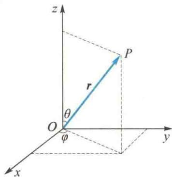
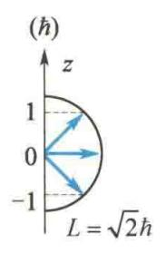
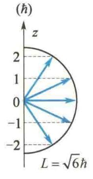
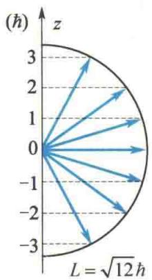

import Guide from '@/components/Guide.astro';
import Knowledge from '@/components/Knowledge.astro';
import Example from '@/components/Example.astro';
import Analysis from '@/components/Analysis.astro';
import Solution from '@/components/Solution.astro';
import Variant from '@/components/Variant.astro';
import Note from '@/components/Note.astro';
import Block from '@/components/Block.astro';
import Method from '@/components/Method.astro';
import Exercise from '@/components/Exercise.astro';

玻尔的氢原子理论有很大的局限性,不能圆满地解决氢原子的结构和其中电子运动的规律,而量子力学较圆满地解决了氢原子问题.这里不进行严格的计算,只给出一些重要结果.
氢原子原子核的质量比电子的质量大得多(约为1837倍), 因此可以近似认为原子核不动, 电子在核的库仑电场中运动. 电子的势能函数为
$$
V (r) = - \frac {e ^ {2}}{4 \pi \varepsilon_ {0} r}
$$
这里 r 是电子到核的距离. $V(r)$ 只是空间坐标的函数, 因此是一个定态问题. 由式(15.33), 得氢原子中电子的定态薛定谔方程为
$$
\nabla^ {2} \psi + \frac {2 m}{\hbar^ {2}} \left(E + \frac {e ^ {2}}{4 \pi \varepsilon_ {0} r}\right) \psi = 0
$$
因为势能仅为 r 的函数, 所以利用球坐标系计算较方便, 如图 15.24 所示. 因为 $x = r \sin \theta \cos \varphi$ ,$y = r \sin \theta \sin \varphi, z = r \cos \theta,$ 所以用球坐标表示的拉普拉斯算符为
<figure class="vp-figure">
  
  <figcaption>图15.24 球坐标系</figcaption>
</figure>
$$
\nabla^ {2} = \frac {1}{r ^ {2}} \frac {\partial}{\partial r} \left(r ^ {2} \frac {\partial}{\partial r}\right) + \frac {1}{r ^ {2} \sin \theta} \frac {\partial}{\partial \theta} (\sin \theta \frac {\partial}{\partial \theta}) + \frac {1}{r ^ {2} \sin^ {2} \theta} \frac {\partial^ {2}}{\partial \varphi^ {2}}
$$
用球坐标表示的波函数为
$$
\psi = \psi (r, \theta , \varphi)
$$
则薛定谔方程为
$$
\frac {1}{r ^ {2}} \frac {\partial}{\partial r} \left(r ^ {2} \frac {\partial \psi}{\partial r}\right) + \frac {1}{r ^ {2} \sin \theta} \frac {\partial}{\partial \theta} \left(\sin \theta \frac {\partial \psi}{\partial \theta}\right) + \frac {1}{r ^ {2} \sin^ {2} \theta} \frac {\partial^ {2} \psi}{\partial \varphi^ {2}} + \frac {2 m}{\hbar^ {2}} \left(E + \frac {e ^ {2}}{4 \pi \varepsilon_ {0} r}\right) \psi = 0\tag{15.40}
$$
由于势能仅为 r 的函数，与 $\theta, \varphi$ 无关，故通常用分离变量法求解。设
$$
\psi (r, \theta , \varphi) = R (r) \Theta (\theta) \Phi (\varphi)
$$
式中， $R$ 仅为 $r$ 的函数， $\Theta$ 仅为 $\theta$ 的函数， $\Phi$ 仅为 $\varphi$ 的函数.代入式（15.40）并用 $R(r)\Theta (\theta)\Phi (\varphi)$ 除全式，然后乘以 $r^2$ ，得
$$
\frac {1}{R} \frac {\mathrm{d}}{\mathrm{d} r} \left(r ^ {2} \frac {\mathrm{d} R}{\mathrm{d} r}\right) + \frac {1}{\Theta} \frac {1}{\sin \theta} \frac {\mathrm{d}}{\mathrm{d} \theta} \left(\sin \theta \frac {\mathrm{d} \Theta}{\mathrm{d} \theta}\right) + \frac {1}{\Phi} \frac {1}{\sin^ {2} \theta} \frac {\mathrm{d} ^ {2} \Phi}{\mathrm{d} \varphi^ {2}} + \frac {2 m}{\hbar^ {2}} \left(E + \frac {e ^ {2}}{4 \pi \varepsilon_ {0} r}\right) r ^ {2} = 0\tag{15.41}
$$
式中，第三项与 $\varphi$ 有关，当 $\varphi$ 取任意值时，不会引起其他三项之和的变化，且四项之和仍然为零，这就要求第三项中含 $\varphi$ 的因子等于常数.设这一常数为 $-m_l^2$ ，即令
$$
\frac {1}{\Phi} \frac {\mathrm{d} ^ {2} \Phi}{\mathrm{d} \varphi^ {2}} = - m _ {l} ^ {2}\tag{15.42}
$$
式 $(15.41)$ 可改写为
$$
\left[ \frac {1}{R} \frac {\mathrm{d}}{\mathrm{d} r} \left(r ^ {2} \frac {\mathrm{d} R}{\mathrm{d} r}\right) + \frac {2 m}{\hbar^ {2}} \left(E + \frac {e ^ {2}}{4 \pi \varepsilon_ {0} r}\right) r ^ {2} \right] + \left[ \frac {1}{\Theta} \frac {1}{\sin \theta} \frac {\mathrm{d}}{\mathrm{d} \theta} \left(\sin \theta \frac {\mathrm{d} \Theta}{\mathrm{d} \theta}\right) - \frac {m _ {l} ^ {2}}{\sin^ {2} \theta} \right] = 0\tag{15.43}
$$
同理,式(15.43)中含有 r 部分和含有 $\theta$ 部分也应当分别等于一常数,且这一常数必须大小相等、符号相反才能使等式成立.为此,令常数为 $\lambda$ ,则有
$$
\frac {1}{R} \frac {\mathrm{d}}{\mathrm{d} r} \left(r ^ {2} \frac {\mathrm{d} R}{\mathrm{d} r}\right) + \frac {2 m}{\hbar^ {2}} \left(E + \frac {e ^ {2}}{4 \pi \varepsilon_ {0} r}\right) r ^ {2} = \lambda\tag{15.44}
$$
$$
\frac {1}{\Theta} \frac {1}{\sin \theta} \frac {\mathrm{d}}{\mathrm{d} \theta} \left(\sin \theta \frac {\mathrm{d} \Theta}{\mathrm{d} \theta}\right) - \frac {m _ {l} ^ {2}}{\sin^ {2} \theta} = - \lambda\tag{15.45}
$$
这两个方程的求解比较繁杂. 下面解这些方程时略去冗长的数学运算, 只给出角动量和能量量子化的结果.
式 $(15.42)$ 可改写为
$$
\frac {\mathrm{d} ^ {2} \Phi}{\mathrm{d} \varphi^ {2}} + m _ {l} ^ {2} \Phi = 0
$$
其解的形式为
$$
\Phi = A \mathrm{e} ^ {\mathrm{i} m _ {l} \varphi}
$$
式中， $m_{l}$ 是一个常数。由于波函数必须为单值函数，即
$$
\Phi (\varphi) = \Phi (\varphi + 2 \pi)
$$
这要求 $m_{l}$ 是零或整数，即
$$
m _ {l} = 0, \pm 1, \pm 2, \dots
$$
已知动量为 p、沿 x 轴方向运动的粒子的一维波函数为 $e^{\frac{i}{h}px}$ . 与此相似, 一个线动
量为 p 的粒子绕 z 轴运动，在局部空间小区域内可近似为一德布罗意波，即
$$
\Phi (\varphi) = A \mathrm{e} ^ {\frac {\mathrm{i}}{\hbar} p s}
$$
式中， $s$ 是环绕 $z$ 轴圆弧上的一小弧长， $p$ 是该点切线方向上的动量.弧长 $s$ 等于半径 $r$ 与转角 $\varphi$ 的积，则 $\varphi = \frac{s}{r}$ ，角动量 $L_{z} = rp$ ，则
$$
\Phi (\varphi) = A \mathrm{e} ^ {\frac {\mathrm{i}}{\hbar} L _ {z} \varphi} = A \mathrm{e} ^ {\mathrm{i} m _ {l} \varphi}
$$
比较等式两边的指数,则有
$$
L _ {z} = m _ {l} \hbar \quad (m _ {l} = 0, \pm 1, \pm 2, \dots)\tag{15.46}
$$
式(15.46)说明处于稳定环状行波的粒子,其角动量在转轴方向上的投影是量子化的,只能取h的整数倍, $m_{l}$ 称为角动量投影量子数,或磁量子数.按照电子绕核做轨道运动的观点,电子的轨道角动量矢量L与轨道平面有对应关系(电子的绕行方向与L方向的关系符合右手螺旋定则),式(15.46)说明电子的轨道平面在空间内不能取任意方位,只能取有限的特定方位,称为轨道的空间量子化.
关于 $\Theta$ 的方程[式(15.45)]可写成
$$
\frac {1}{\sin \theta} \frac {\mathrm{d}}{\mathrm{d} \theta} \Big (\sin \theta \frac {\mathrm{d} \Theta}{\mathrm{d} \theta} \Big) + \Big (\lambda - \frac {m _ {l} ^ {2}}{\sin^ {2} \theta} \Big) \Theta = 0
$$
这是勒让德方程,其解为勒让德多项式.为了使 $\theta=0$ 及 $\theta=\pi$ 时, $\Theta$ 为有限值,必须限定
$$
\lambda = l (l + 1) \quad (l = 0, 1, 2, \dots \text {且} l \geqslant | m _ {l} |)
$$
因此，关于 $R(r)$ 的方程式(15.44)可写成
$$
- \frac {\hbar^ {2}}{2 m} \frac {1}{r ^ {2}} \frac {\mathrm{d}}{\mathrm{d} r} \left(r ^ {2} \frac {\mathrm{d} R}{\mathrm{d} r}\right) + \left[ \frac {l (l + 1) \hbar^ {2}}{2 m r ^ {2}} - \frac {e ^ {2}}{4 \pi \varepsilon_ {0} r} \right] R = E R\tag{15.47}
$$
与经典力学中粒子的能量 $E = \frac{p^2}{2m} + V(r)$ 对照起来，并把动量 $\pmb{p}$ 沿径向和垂直于径向分解成 $p_r$ 和 $p_\perp$ 两个分量，粒子的角动量 $L = rp_{\perp}$ ，因此
$$
p ^ {2} = p _ {r} ^ {2} + p _ {\perp} ^ {2} = p _ {r} ^ {2} + \frac {L ^ {2}}{r ^ {2}}
$$
则总能量为
$$
E = \frac {p _ {r} ^ {2}}{2 m} + \frac {L ^ {2}}{2 m r ^ {2}} + V (r)
$$
与式(15.47)加以对比,式(15.47)等号左边第一项是径向动能项,括号内的第二项是势能项,则括号内的第一项应该是转动动能项.所以
$$
L ^ {2} = l (l + 1) \hbar^ {2}
$$
即
$$
L = \sqrt {l (l + 1)} \hbar \quad (l = 0, 1, 2, \dots \text {且} l \geqslant | m _ {l} |)
$$
l 称为角动量量子数, 简称角量子数或副量子数.
对于式(15.47)，只要 $E > 0$ ，就有单值、有限、连续的解；但 $E > 0$ 表示电子有足够的动能克服原子核的束缚，成为自由电子，能量是连续分布的。而我们研究的是 $E < 0$ 的情况，即电子为束缚状态时方程的解。当 $r\to \infty$ 时， $R(r)\rightarrow 0$ ；当 $r\rightarrow 0$ 时， $R(r)$ 不发散。由式(15.47）求得
$$
E = - \frac {m e ^ {4}}{8 \varepsilon_ {0} ^ {2} h ^ {2}} \frac {1}{n ^ {2}} (n = 1, 2, 3, \dots)
$$
且 $n \geqslant l + 1$ . 这与玻尔理论中的能级公式是相同的, 但这里是解方程自然得出的结果， $n$ 称为主量子数. 径向波函数 $R(r)$ 与 $n$ 和 $l$ 这两个量子数有关. 下面求解基态波函数和能量. 基态时 $n = 1, l = 0$ ，则式(15.47)可写成
$$
r ^ {2} \frac {\mathrm{d} ^ {2} R}{\mathrm{d} r ^ {2}} + 2 r \frac {\mathrm{d} R}{\mathrm{d} r} + \frac {2 m r ^ {2}}{\hbar^ {2}} \left(E + \frac {e ^ {2}}{4 \pi \varepsilon_ {0} r}\right) R = 0\tag{15.48}
$$
设这个方程的解为
$$
R (r) = N \mathrm{e} ^ {- r / a _ {1}}\tag{15.49}
$$
式中， $N$ 和 $a_1$ 为待定常数.把 $R(r)$ 代入式(15.48）得
$$
\frac {r ^ {2}}{a _ {1} ^ {2}} - 2 \frac {r}{a _ {1}} + \frac {2 m r ^ {2}}{\hbar^ {2}} E + \frac {2 m r}{\hbar^ {2}} \frac {e ^ {2}}{4 \pi \varepsilon_ {0}} = 0
$$
或
$$
\left(\frac {1}{a _ {1} ^ {2}} + \frac {2 m E}{\hbar^ {2}}\right) r ^ {2} - \left(\frac {2}{a _ {1}} - \frac {2 m e ^ {2}}{4 \pi \varepsilon_ {0} \hbar^ {2}}\right) r = 0
$$
为了使等式对任何 $r$ 都成立，等号左边两个括号内的值应分别等于零，即
$$
\frac {1}{a _ {1} ^ {2}} + \frac {2 m}{\hbar^ {2}} E = 0
$$
$$
\frac {2}{a _ {1}} - \frac {2 m e ^ {2}}{4 \pi \varepsilon_ {0} \hbar^ {2}} = 0
$$
由此两式解得
$$
a _ {1} = \frac {4 \pi \varepsilon_ {0} \hbar^ {2}}{m e ^ {2}} = 5. 2 9 \times 1 0 ^ {- 1 1} \mathrm{m}
$$
$$
E _ {1} = - \frac {\hbar^ {2}}{2 m a _ {1} ^ {2}} = - \frac {m e ^ {4}}{8 \varepsilon_ {0} ^ {2} h ^ {2}} = - 1 3. 6 \mathrm{eV}
$$
可见, $a_{1}$ 在数值上等于第一玻尔轨道半径, $E_{1}$ 是氢原子基态能量.
氢原子中电子的波函数为
$$
\psi_ {n, l, m _ {l}} (r, \theta , \varphi) = R _ {n l} (r) \Theta_ {l m _ {l}} (\theta) \Phi_ {m _ {l}} (\varphi)
$$
在体积元 $\mathrm{d}V = r^2\sin \theta \mathrm{d}r\mathrm{d}\theta \mathrm{d}\varphi$ 内，电子出现的概率为
$$
\mid \psi_ {n, l, m _ {l}} (r, \theta , \varphi) \mid^ {2} \mathrm{d} V = \mid R _ {n l} (r) \mid^ {2} \mid \Theta_ {l m _ {l}} (\theta) \mid^ {2} \mid \Phi_ {m _ {l}} (\varphi) \mid^ {2} r ^ {2} \sin \theta \mathrm{d} r \mathrm{d} \theta \mathrm{d} \varphi
$$
对 $\theta$ 和 $\varphi$ 变化的全部区域积分，并注意 $\Theta (\theta)$ 和 $\Phi (\varphi)$ 都是归一化函数，就得到电子在距离核 $r\sim r + \mathrm{d}r$ 范围的球壳内出现的概率为
$$
P _ {n l} (r) \mathrm{d} r = | R _ {n l} (r) | ^ {2} r ^ {2} \mathrm{d} r \int_ {0} ^ {\pi} | \Theta_ {l m _ {l}} (\theta) | ^ {2} \sin \theta \mathrm{d} \theta \int_ {0} ^ {2 \pi} | \Phi_ {m _ {l}} (\varphi) | ^ {2} \mathrm{d} \varphi = | R _ {n l} (r) | ^ {2} r ^ {2} \mathrm{d} r
$$
这个概率称为电子的径向分布. 现在根据归一化条件, 确定径向波函数[式(15.49)]中的常数 N.
$$
\int_ {0} ^ {\infty} | R (r) | ^ {2} r ^ {2} \mathrm{d} r = \int_ {0} ^ {\infty} N ^ {2} \mathrm{e} ^ {- 2 r / a _ {1}} r ^ {2} \mathrm{d} r = N ^ {2} \frac {a _ {1} ^ {3}}{4} = 1
$$
得
$$
N = \frac {2}{\sqrt {a _ {1} ^ {3}}}
$$
于是基态径向波函数为
$$
R _ {1 0} = \frac {2}{\sqrt {a _ {1} ^ {3}}} \mathrm{e} ^ {- \frac {r}{a _ {1}}}\tag{15.50}
$$
在量子力学中,关于电子,没有轨道的概念,故只能给出其空间的分布概率.例如,在基态氢原子中,电子位于 $r\sim r+dr$ 球壳内的概率为
$$
P (r) \mathrm{d} r = | R _ {1 0} (r) | ^ {2} r ^ {2} \mathrm{d} r = \frac {4}{a _ {1} ^ {3}} \mathrm{e} ^ {- 2 r / a _ {1}} r ^ {2} \mathrm{d} r
$$
$r$ 的取值范围是 $(0, \infty)$ ，即在 $0 < r < \infty$ 范围内电子都有可能出现，只是概率大小不同。下面求电子最大概率处到核的距离 $r_{\max}$ 。因为
$$
\frac {\mathrm{d} P (r)}{\mathrm{d} r} = \frac {4}{a _ {1} ^ {3}} \mathrm{e} ^ {- 2 r / a _ {1}} \left(2 r - \frac {2 r ^ {2}}{a _ {1}}\right) = 0
$$
所以
$$
r _ {\max} = a _ {1}
$$
其数值等于第一玻尔轨道半径,但这里是最概然距离,只表示电子在 $a_{1}$ 附近单位薄层中出现的概率最大.
关于 $n > 1$ 的激发态波函数，由于数学计算冗长，这里省略.但要注意， $\Psi_{n,l,m_l}(r,\theta ,\varphi)$ 应由三个量子数决定.给定一个 $n$ 值，能量就确定了，但波函数并没有完全确定.因为给定一 $n$ 值， $l$ 可以有 $n$ 个不同的值，而对于每一个 $l$ 值， $m_{l}$ 又可以有 $2l + 1$ 个不同的值. $l,m_l$ 不同，波函数也不同，电子的运动状态不同，通常说是量子态不同.所以，对应一个能级 $E_{n}$ ，有
$$
\sum_ {l = 0} ^ {n - 1} (2 l + 1) = n ^ {2}
$$
个量子态. 不同的量子态有相同的能级, 则称该能级是简并的, 这个能级的量子态的数目称为该能级的简并度. 氢原子能级的简并度为 $n^2$ . 例如, $n = 1, l = 0, m_l = 0$ , 轨道角动量为零, 简并度为 $1; n = 2$ , 简并度为 $4 \cdots \cdots$
根据氢原子的定态薛定谔方程求解过程可以得到如下重要结果: 氢原子只能处于一些分立的状态, 这些状态可用三个量子数 $n, l, m_{l}$ 来描述. 它们所代表的物理内容和取值如下.

### (1) 主量子数 n

$$
n = 1, 2, 3, \dots
$$
决定氢原子的能量 E，而且 E 与 n 的关系和玻尔理论相同.

### (2) 角量子数 l

$$
l = 0, 1, 2, \dots , n - 1
$$
决定原子的角动量. 角动量的大小为
$$
L = \sqrt {l (l + 1)} \hbar
$$
$h$ 具有角动量的量纲.为了和后面讲的自旋角动量相区别， $L$ 也称为轨道角动量.在量子力学中，轨道的概念已无意义，而且这里也不需要轨道的概念.角动量的矢量表示是量子力学的近似且直观的表示.当 $l = 0$ 时， $L = 0$ ，说明电子在核外分布的概率是球对称的.当 $n$ 确定之后， $l$ 有 $n$ 个可能的取值，最大值是 $n - 1$ .由于 $l$ 对能量也有些许影响(后述)，即由 $n$ 的一个值所确定的能级实际上包含了若干个与 $l$ 有关、靠得很近的分能级，故 $l$ 也称为副量子数.

### (3) 磁量子数 $m_{l}$

$$
m _ {l} = 0, \pm 1, \pm 2, \dots , \pm l
$$
决定角动量在空间的可能取向. 选定某一特定的方向为 z 轴(实验时取外磁场的方向), 角动量矢量在 z 轴方向上的分量为
$$
L _ {z} = m _ {l} \hbar
$$
$L_{z}$ 的最小值是零, 最大值是 $lh$ , 共有 $2l+1$ 个值. 说明角动量在空间的取向是分立的, 共有 $2l+1$ 个可能的取向, 称为空间量子化. 图 15.25 所示为 l 分别等于 1、2、3 的三种
情况下角动量的空间量子化.
  
(a) l=1
  
(b) l=2
<figure class="vp-figure">
  
  <figcaption>图15.25 角动量的空间量子化</figcaption>
</figure>
(c) l=3

