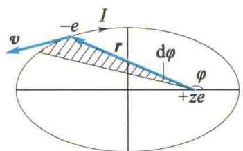
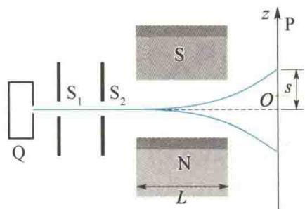
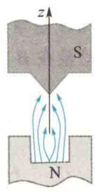
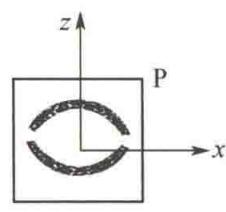

import Guide from '@/components/Guide.astro';
import Knowledge from '@/components/Knowledge.astro';
import Example from '@/components/Example.astro';
import Analysis from '@/components/Analysis.astro';
import Solution from '@/components/Solution.astro';
import Variant from '@/components/Variant.astro';
import Note from '@/components/Note.astro';
import Block from '@/components/Block.astro';
import Method from '@/components/Method.astro';
import Exercise from '@/components/Exercise.astro';

1921年，施特恩和格拉赫用实验证实了原子的磁矩在外磁场中的取向是量子化的。由于原子磁矩和角动量之间有关系，这也就证明了角动量在空间的取向是量子化的。
原子中电子的绕核运动和闭合小线圈中的电流相似,所以原子也有磁矩.按照磁矩的定义,磁矩 $\mu$ 的大小为
$$
\mu = I A
$$
式中， $I$ 是电流， $A$ 是回路所包围的面积. $\pmb{\mu}$ 的方向垂直于 $A$ ，而且和电流的方向的关系满足右手螺旋定则.一般地，电子绕核做椭圆运动（见图15.26).电子的电量为 $e$ ，周期为 $T$ ，则
  
图 15.26 电子绕核做椭圆运动
$$
I = \frac {e}{T}
$$
电流的方向和电子运动的方向相反. 在 dt 时间内, 电子矢径 r 扫过的面积为 $\frac{1}{2}r^{2}d\varphi$ , 绕行一周扫过的面积为
$$
A = \int_ {0} ^ {2 \pi} \frac {1}{2} r ^ {2} \mathrm{d} \varphi = \int_ {0} ^ {T} \frac {1}{2} r ^ {2} \frac {\mathrm{d} \varphi}{\mathrm{d} t} \mathrm{d} t
$$
电子的角动量为 $mr^2\frac{\mathrm{d}\varphi}{\mathrm{d}t}$ ，所以 $r^2\frac{\mathrm{d}\varphi}{\mathrm{d}t} = \frac{L}{m}$ （ $L$ 是角动量的大小， $m$ 是电子的质量）。在有心力场中运动时，角动量守恒， $L$ 为常量，则
$$
A = \int_ {0} ^ {T} \frac {L}{2 m} \mathrm{d} t = \frac {L}{2 m} T
$$
单电子的轨道运动磁矩大小为
$$
\mu = I A = \frac {e}{2 m} L
$$
角动量和磁矩都是矢量,因为电子带负电,磁矩 $\mu$ 和角动量 L 的方向相反,于是有
$$
\boldsymbol {\mu} = - \frac {e}{2 m} \boldsymbol {L}\tag{15.51}
$$
在量子力学中， $L = \sqrt{l(l + 1)}\hbar$ ，l 是角量子数。设角动量 L 在外磁场中，取磁感应强度 B 的方向为 z 轴正方向，角动量在 B 方向上的投影为 $L_{z}$ ，则
$$
L _ {z} = m _ {l} \hbar
$$
$m_{l}$ 为磁量子数. $m_{l}=0,\pm1,\pm2,\cdots,\pm l$ , 共有 $2l+1$ 个数值. 由式(15.51)知, $\mu$ 在 z 轴上的投影为
$$
\mu_ {z} = - \frac {e}{2 m} L _ {z} = - \frac {e}{2 m} m _ {l} \hbar = - m _ {l} \mu_ {\mathrm{B}}
$$
式中
$$
\begin{array}{r l} \mu_ {\mathrm{B}} & = \frac {e \hbar}{2 m} = \frac {e h}{4 \pi m} = 9. 2 7 4 0 1 5 4 1 \times 1 0 ^ {- 2 4} \mathrm{J/T} \\ & = 5. 7 8 8 3 8 2 6 3 \times 1 0 ^ {- 5} \mathrm{eV/T} \end{array}
$$
称为玻尔磁子.
在电磁学中,一个磁矩为 $\mu$ 的载流线圈,放在磁感应强度为 B 的磁场中,该线圈所受力矩为 M,且
$$
\boldsymbol {M} = \boldsymbol {\mu} \times \boldsymbol {B}
$$
将磁矩由垂直于磁场的方向转到与磁场成 $\theta$ 角的方向, M 所做的功 W 为
$$
W = - \int_ {\frac {\pi}{2}} ^ {\theta} M \mathrm{d} \theta = - \int_ {\frac {\pi}{2}} ^ {\theta} \mu B \sin \theta \mathrm{d} \theta = \mu B \cos \theta
$$
负号表示力矩的方向与角位移 $\mathrm{d}\theta$ 的方向相反. 若取磁矩垂直于磁场方向, 即在 $\theta = \frac{\pi}{2}$ 的位置处, 线圈与磁场的相互作用势能为零, 则磁矩 $\mu$ 与磁感应强度 $B$ 成 $\theta$ 角时的势能为
$$
U = - \mu B \cos \theta = - \boldsymbol {\mu} \cdot \boldsymbol {B} = - \mu_ {z} B\tag{15.52}
$$
式中，磁感应强度的方向为 $z$ 轴方向.如果磁感应强度 $\pmb{B}$ 在 $z$ 轴方向上不均匀，其变化率为 $\frac{\partial B}{\partial z}$ ，则载流线圈在 $z$ 轴方向上的受力为
$$
f _ {z} = - \frac {\partial U}{\partial z} = \mu_ {z} \frac {\partial B}{\partial z}\tag{15.53}
$$
式(15.52)、式(15.53)也适用于原子系统.施特恩-格拉赫实验就是利用上述原理,让原子射线束通过一个不均匀的磁场区域,观察原子磁矩在磁力作用下的偏转.
施特恩-格拉赫实验装置如图15.27所示.从加热炉Q中引出原子射线束，经狭缝 $\mathrm{S}_1$ 和 $\mathrm{S}_2$ 后射入在 $z$ 轴方向上不均匀的磁场区域，在磁力作用下偏转，落在屏幕P上，相对于出口处， $z$ 轴方向上的位移为 $s$ .设质量为 $M$ 的原子以速率 $\upsilon$ 经过长度为 $L$ 的不均匀磁场，则通过的时间 $t = L / v$ ，于是有
$$
s = \frac {1}{2} a t ^ {2} = \frac {1}{2} \frac {f _ {z}}{M} t ^ {2} = \frac {1}{2 M} \frac {\partial B}{\partial z} \left(\frac {L}{v}\right) ^ {2} \mu_ {z}
$$
$\mu_z > 0$ 时，原子射线束向上偏转； $\mu_z < 0$ 时，原子射线束向下偏转.如果磁矩在磁场中可以任意取向， $\mu_z$ 从正到负连续变化，那么原子射线束偏转后将在屏幕上溅落成一片.实验发现，在屏幕上有几条清晰可辨的黑斑纹.这说明原子磁矩只能取几个特定的方向,也就是角动量只能取几个特定的方向,证明了角动量在外磁场方向上的投影是量子化的.
  
(a)
  
(b)
  
(c)  
图 15.27 施特恩-格拉赫实验装置
原子的尺度约为纳米量级,而外磁场应在这么小的范围内不均匀,即 $\frac{\partial B}{\partial z}$ 非常大,这是实验的难点,所以磁极要做成特殊形状.只要测出原子通过不均匀磁场的距离L、速率v和磁场变化率 $\frac{\partial B}{\partial z}$ 及屏幕上的位移s,就可以算出 $\mu_{z}$ .当L、v、 $\frac{\partial B}{\partial z}$ 保持不变时,s与 $\mu_{z}$ 相对应.一般地
$$
\mathrm{斑纹条数} = 2 l + 1
$$
Zn、Cd、Hg、Sn 等原子射线束没偏转，l = 0，说明这些原子的总角动量为零。对基态的氧原子，测到 5 条斑纹，说明它的角动量投影有 5 个取向，磁量子数 $m_{l} = 0$ ， $\pm 1, \pm 2$ ，得出 l = 2。
需要特别注意的是,对 Li、Na、K、Cu、Ag、Au 等基态原子,测得的斑纹条数为 2. 如果按照上面的公式计算,则这时 l 应为 $\frac{1}{2}$ , $L_{z}$ 应为 $-\frac{1}{2}\hbar$ 和 $+\frac{1}{2}\hbar$ , 这与前面得到的 $l=0,1,2,\cdots$ 不符. 如何解释这一事实呢? 因为测的都是基态 (s 态, L=0) 原子, 轨道角动量为零, 所以原子的磁矩一定来源于其他类型的磁矩. 这就是下面要介绍的电子的自旋.

