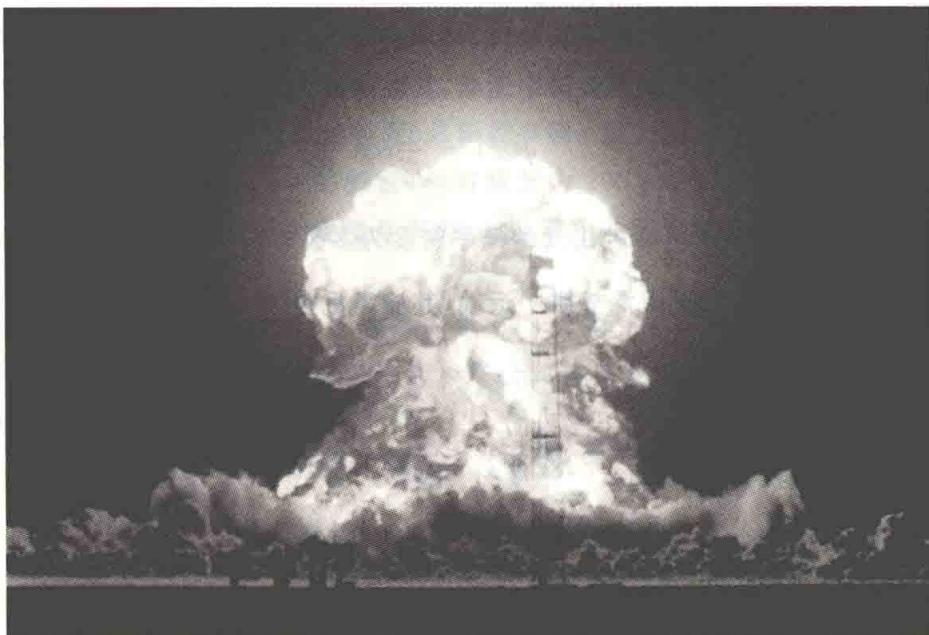
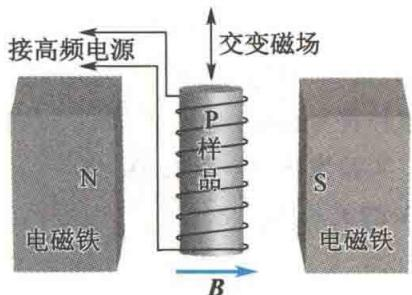
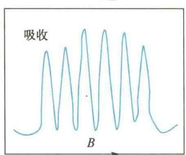
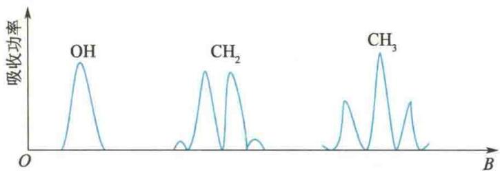
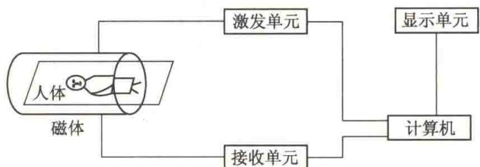
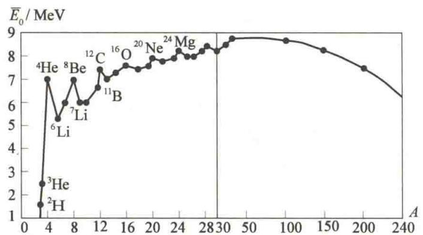

import Guide from '@/components/Guide.astro';
import Knowledge from '@/components/Knowledge.astro';
import Example from '@/components/Example.astro';
import Analysis from '@/components/Analysis.astro';
import Solution from '@/components/Solution.astro';
import Variant from '@/components/Variant.astro';
import Note from '@/components/Note.astro';
import Block from '@/components/Block.astro';
import Method from '@/components/Method.astro';
import Exercise from '@/components/Exercise.astro';

## 第16章 原子核物理和粒子物理简介

本章提要

人类在探索构成物质的基本单元的过程中经历了以下几个阶段.19世纪以前,人们认为构成物质的基本单元是原子;进入20世纪后,人们认识到原子是有内部结构的,是由原子核和核外电子构成的;到了20世纪30年代,人们知道原子核是由质子和中子构成的,当时认为质子、中子、电子和光子是构成物质的基本单元,称为基本粒子;20世纪60年代以后,理论和实验都证实质子、中子等称为强子的基本粒子都有内部结构,于是去掉“基本”二字,改称为粒子,这些粒子是由夸克构成的,但至今尚未找到自由夸克.夸克有没有内部结构?人们正在探索.

原子核物理学以原子核为研究对象,研究原子核的基本性质、核结构、核反应、核衰变,以及核技术在许多领域中的应用.本章仅对这些内容作简单介绍.粒子是比原子核更深的物质结构层次,粒子物理学研究粒子的性质、结构、粒子间的相互作用和转化的规律,是当前物理学研究的前沿之一,本章最后一节将对此作简单介绍.

## 16.1.1 原子核的质子-中子模型

原子核是由质子和中子组成的. 质子(p) 就是氢核, 带有正电荷 + e, 质量为 $m_{p} = 1.007276 \, u$ (u 为原子质量单位, $1 \, u = 1.6605655 \times 10^{-27} \, kg$ ). 中子(n) 不带电, 其质量为 $m_{n} = 1.008665 \, u$ . 质子和中子统称为核子.

不同的原子核由数目不同的质子和中子组成. 核中的质子数也称核电荷数, 它等于这种元素的原子序数 $Z$ . 质子数 $Z$ 和中子数 $N$ 之和称为核的质量数 $A$ , 即 $A = Z + N$ . 质量数 $A$ 和核电荷数 $Z$ 是表征原子核特征的两个重要物理量, 常用符号 $\frac{A}{2} X$ 表示原子核, 其中 $X$ 表示与 $Z$ 相应的元素符号. 例如, 质量数为 14 的氮原子核标记为 $\frac{14}{7} N$ , 质量数为 16 的氧原子核标记为 $\frac{16}{8} O$ . 通常把具有相同质子数 $Z$ 和相同中子数 $N$ 的一类原子核称为一种核素. 例如, $\frac{16}{8} O$ 、 $\frac{17}{8} O$ 、 $\frac{18}{8} O$ 是 $Z = 8, N = 8, 9, 10$ 的三种核素. 具有相同的质子数 $Z$ 而中子数 $N$ 不同的原子核称为同位素, 上述是氧的三种同位素. 再如, 氢有三种同位素 $\frac{1}{1} H$ 、 $\frac{2}{1} H$ 、 $\frac{3}{1} H$ , 分别称为氘核、氘核、氚核. 电子和中子虽然不是原子核, 但也常用这种符号标记, 分别用 $-\frac{0}{-1} e$ 和 $\frac{1}{0} n$ 标记. 质子可用 $\frac{1}{1} H$ 标记, 也可用 $\frac{1}{1} p$ 标记.

实验发现,原子核的体积总是正比于它的质量数 A. 如果把原子核看成球体,其半径 R 与质量数 A 的关系为

$$

R = R _ {0} A ^ {1 / 3}\tag{16.1}

$$

式中， $R_{0}$ 是常数，由实验测定为 $R_{0}=1.20\times10^{-15}$ m. 这表明原子核的体积与核的质量数成正比，由此得到的结论是：在一切原子核中，核物质的密度是一个常数，可以算出核物质的密度为 $\rho=2.29\times10^{17}\ kg/m^{3}$ .

## 16.1.2 核自旋和磁矩

实验和理论都说明原子核也有自旋. 原子核的自旋角动量的大小为

$$

P _ {1} = \sqrt {I (I + 1)} \frac {h}{2 \pi}\tag{16.2}

$$

式中， $I$ 称为核自旋角动量量子数，简称核自旋.不同原子核的自旋的取值可以是整数，也可以是半整数.质子和中子的自旋都是 $I = \frac{1}{2}$ .当原子核的质子数和中子数都是偶数（偶-偶核）时，其自旋为零，如 ${}_{2}^{4}\mathrm{He},{}_{8}^{16}\mathrm{O},I = 0.$ 当质子数和中子数都是奇数（奇-奇核）时，其自旋为非零整数，如 ${}_{1}^{2}\mathrm{H},{}_{3}^{6}\mathrm{Li}$ 、 ${}_{7}^{14}\mathrm{N},I = 1;{}_{5}^{10}\mathrm{B},I = 3.$ 当原子核的核子数为奇数（奇-偶核）时，其自旋为 $\frac{1}{2}$ 的奇数倍，如 ${}_{2}^{3}\mathrm{He},I =$ $\frac{1}{2};{}_{3}^{7}\mathrm{Li},{}_{4}^{9}\mathrm{Be},I = \frac{3}{2}.$ 这是原子核的质子-中子模型的证据之一.

原子核带有电荷且有自旋运动,故原子核也有磁矩.核磁矩用和电子磁矩类似的方法来表示.原子核磁矩通常以核磁子为单位,即核磁子

$$

\mu_ {\mathrm{N}} = \frac {e h}{4 \pi m _ {\mathrm{p}}}

$$

形式上与玻尔磁子相似，只是这里用质子的质量 $m_{\mathrm{p}}$ 代替了玻尔磁子中的电子质量 $m_{\mathrm{e}}$ .因为 $m_{\mathrm{p}} = 1836.5m_{\mathrm{e}}$ ，所以

$$

\mu_ {\mathrm{N}} = \frac {1}{1 8 3 6 . 5} \mu_ {\mathrm{B}} = 5. 0 5 0 \times 1 0 ^ {- 2 7} \mathrm{A} \cdot \mathrm{m} ^ {2}

$$

式中， $\mu_{\mathrm{B}}$ 是玻尔磁子.

实验测得质子的磁矩不等于核磁子 $\mu_{N}$ . 质子的磁矩为 $\mu_{p} = 2.792782\mu_{N}$ . 不带电的中子也有磁矩, 中子的磁矩为 $\mu_{n} = -1.913165\mu_{N}$ , 负号表示中子的自旋角动量与磁矩方向相反. 中子磁矩不为零, 说明中子内部也有一定的正、负电荷分布, 但总电量为零, 因此整个中子对外显示电中性.

原子核的磁矩的大小 $\mu_{\mathrm{I}}$ 与核自旋角动量的大小 $P_{\mathrm{I}}$ 的关系（仿电子自旋假设）可以写成

$$

\mu_ {\mathrm{I}} = g _ {\mathrm{I}} \frac {e}{2 m _ {\mathrm{p}}} P _ {\mathrm{I}} = g _ {\mathrm{I}} \frac {e}{2 m _ {\mathrm{p}}} \sqrt {I (I + 1)} \frac {h}{2 \pi} = g _ {\mathrm{I}} \sqrt {I (I + 1)} \mu_ {\mathrm{N}}\tag{16.3}

$$

式中， $g_{1}$ 称为原子核的 g 因子. $\mu_{1}$ 在某一特殊方向上的投影为

$$

\mu_ {1 _ {z}} = g _ {1} M _ {1} \mu_ {\mathrm{N}}\tag{16.4}

$$

式中， $M_{1}$ 称为核磁量子数，它的取值为

$$

M _ {1} = - I, - (I - 1), \dots , I - 1, I

$$

通常是测 $\mu_{1}$ 在特定方向上的最大投影

$$

\mu_ {\mathrm{I}} ^ {\prime} = g _ {\mathrm{I}} I \mu_ {\mathrm{N}}\tag{16.5}

$$

并用 $\mu_{1}^{\prime}$ 来衡量核磁矩的大小. 由式(16.5)，只要知道 I（由光谱的超精细结构可以测出），再测得 $g_{1}$ 就可以算出核磁矩.

测定核磁矩,常利用“核磁共振”现象,它的原理和原子的磁共振相似.如图16.1所示,将待测样品P放在电磁铁两极之间,于是由样品中核磁矩 $\mu_{1}$ 和磁感应强度B的相互作用,应有附加能量

$$

\Delta E = - \mu_ {1} B \cos \theta\tag{16.6}

$$

式中， $\theta$ 表示 $\mu_{I}$ 和 B 的夹角. 由于空间量子化, 根据式(16.4), 式(16.6) 改写为

$$

\Delta E = - \mu_ {1 _ {z}} B = - g _ {1} M _ {1} \mu_ {\mathrm{N}} B

$$

因为 $M_{1}$ 可取 -I, -(I-1), …, I-1, I 中的任意一数值，因而原子核在磁场中将有 $2I+1$ 个可能的能量（称为核磁图 16.1 核磁共振装置示意图

能级). 如果将缠在样品上的导线通以频率为 $\nu$ 的高频电流, 则在样品中产生交变电磁场, 其光子能量为 $h\nu$ . 调节电磁铁的励磁电流, 使 $h\nu = \Delta E$ , 则样品的原子核将从交变磁场中吸收能量, 发生能级跃迁. 因为核磁量子数的选择定则为

$$

\Delta M _ {1} = 0, \pm 1

$$

所以核的能量只改变

$$

\delta (\Delta E) = g _ {1} \mu_ {\mathrm{N}} B

$$

当

$$

h \nu = g _ {1} \mu_ {\mathrm{N}} B

$$

时,样品中的原子核将从交变磁场中吸收能量,这个现象称为核磁共振吸收,这时的频率 $\nu$ 称为共振频率.将式(16.7)写成

$$

h \nu = g _ {1} \mu_ {\mathrm{N}} B = \frac {g _ {1} I \mu_ {\mathrm{N}}}{I} B = \frac {\mu_ {1} ^ {\prime}}{I} B\tag{16.7}

$$

或

$$

\mu_ {1} ^ {\prime} = I \frac {h \nu}{B}

$$

只须测得 I、B 和 $\nu$ ，就可以算出核磁矩 $\mu_{1}^{\prime}$ 。表 16.1 列出了一些原子核的自旋角动量量子数和磁矩的测量结果。 $\mu_{1}^{\prime}>0$ ，是因为 $g_{1}>0,\mu_{1}$ 和 $P_{1}$ 方向相同； $\mu_{1}^{\prime}<0$ ，是因为 $g_{1}<0,\mu_{1}$ 与 $P_{1}$ 方向相反。

表 16.1 一些原子核的自旋角动量量子数和磁矩的测量结果

<table><tr><td>原子核</td><td> $I$ </td><td> $\mu_{1}^{\prime}/\mu_{N}$ </td><td>原子核</td><td> $I$ </td><td> $\mu_{1}^{\prime}/\mu_{N}$ </td></tr><tr><td> $^{1}_{1}H$ </td><td>1/2</td><td>2.792 782</td><td> $^{11}_{5}B$ </td><td>3/2</td><td>2.688 57</td></tr><tr><td> $^{2}_{1}H$ </td><td>1</td><td>0.857 406</td><td> $^{14}_{7}N$ </td><td>1</td><td>0.403 61</td></tr><tr><td> $^{6}_{3}Li$ </td><td>1</td><td>0.822 010</td><td> $^{15}_{7}N$ </td><td>1/2</td><td>-0.283 09</td></tr><tr><td> $^{7}_{3}Li$ </td><td>3/2</td><td>3.256 28</td><td> $^{20}_{10}Ne$ </td><td>0</td><td> $<2\times10^{-4}$ </td></tr><tr><td> $^{9}_{4}Be$ </td><td>3/2</td><td>-1.177 44</td><td> $^{23}_{11}Na$ </td><td>3/2</td><td>2.217 51</td></tr><tr><td> $^{10}_{5}B$ </td><td>3</td><td>1.800 6</td><td> $^{40}_{19}K$ </td><td>4</td><td>-1.298 1</td></tr></table>

式(16.7)表明,当发生共振吸收时,若已知电磁波的频率 $\nu$ 和磁感应强度大小B,则可算出 $g_{1}$ .这便是通过实验测原子核“g因子”的方法.

因为原子核在磁场中有 $2I + 1$ 个核磁能级，所以在核磁共振中会出现 $2I + 1$ 个共振峰.图16.2所示是水中 $\mathrm{Mn}^{2+}$ 离子的顺磁共振峰，每个峰值代表一个能级.图16.2中有6个峰，则 $2I + 1 = 6,I = \frac{5}{2}$ ，这就是 $\mathrm{Mn}^{2+}$ 原子核的自旋量子数.由此可知，利用顺磁共振可测原子核的自旋量子数.

实验时保持电磁场的 $\nu$ 不变, 改变磁感应强度大小 B, 满足 $h\nu = g_{1}M_{1}\mu_{N}B$ , 则每个峰值对应的 B 值与一个 $M_{1}$ 数值相对应.

图16.2 水中 $\mathrm{Mn}^{2+}$ 离子的顺磁共振峰

核磁共振技术已在物理、化学、医学、地质等许多领域中得到应用.例如，在物理学中研究原子核的结构；在化学中研

究分子的结构；在地球史的研究中，根据硅酸盐中 $^{29}$ Si成分的微量分析，发现了地球上曾发生大规模生物灭绝的原因是小星球与地球发生过强烈碰撞；等等.

由于氢核 $^{1}$ H核磁共振信号最强，含有不同氢核的分子样品核磁共振谱线不同。图16.3所示是乙醇 $\left(\mathrm{CH}_{3}-\mathrm{CH}_{2}-\mathrm{OH}\right)$ 的一条吸收谱线。图中出现了三组吸收峰域，正好对应乙醇分子中三组氢核 $^{1}$ H分布，这三组峰域出现在不同B值处，表明各组 $^{1}$ H的能态分裂稍有不同。此外，因为在同一组内存在多个 $^{1}$ H核，所以其自旋磁矩间的相互作用引起吸收峰的分裂。

  

图 16.3 乙醇的核磁共振谱

实验时通常用水作为样品,因为水分子中的电子磁矩相互抵消,且氧原子核的磁矩为零,所以水分子的磁矩仅由氢核的磁矩所提供.由于磁场可以穿入人体,而人体内大部分是水,这些水的分布可因种种疾病而发生变化,故可以利用氢核的核磁共振来进行医疗诊断.图16.4所示是核磁共振成像诊断仪的方框图.它的优点是:射频电磁波(频率为几十至几百兆赫兹)对人体无害,可获得内脏器官的功能状态、生理状态及病变状态等信息.

  

图 16.4 核磁共振成像诊断仪的方框图

## 16.1.3 核力

组成原子核的质子之间存在较强的相互排斥的静电力，力图使原子核解体，而万有引力仅为电磁力的 $1 / 10^{37}$ ，远不能抵消静电力的作用而把核子束缚在一起。由此推测，核子之间必定存在着另一种相互作用力，称为核力。根据多年的研究，核力具有以下特点。

(1) 核力是一种比电磁力强得多的强相互作用力, 主要表现为吸引力.

(2) 核力是短程力, 只有当核子间的距离小于 $10^{-15}$ m 时才显示出来, 在大于 $10^{-15}$ m 时, 核力远小于静电力.

（3）核力与核子的带电状况无关.大量实验表明，质子之间、中子之间、质子和中子之间所表现的核力作用大致相同.

（4）核力具有饱和性，即一个核子只能与附近的有限个数的核子发生核力作用，而不能与原子核内所有核子发生这种作用.

关于核力的作用机制,至今尚未圆满解答.1935年,日本物理学家汤川秀树提出了核力的介子理论,认为核子之间通过交换 $\pi$ 介子而发生核力作用,可以定性解释某些实验现象.1947年,在宇宙射线中发现了 $\pi$ 介子.但是,这一理论还有与实验不符之处,尚待进一步完善.

## 16.1.4 原子核的结合能

中国物理学家

实验发现,任何一个原子核的质量总是小于组成该原子核的所有核子的质量之和,它们之间的差额称为原子核的质量亏损.设原子核 $\frac{A}{2}X$ 的质量为 $M_{x}$ ,质子的质量为 $m_{p}$ ,中子的质量为 $m_{n}$ ,在这一原子核中共有Z个质子和(A-Z)个中子,质量亏损为

  

钱三强

$$

\Delta m = \left[ Z m _ {\mathrm{p}} + (A - Z) m _ {\mathrm{n}} \right] - M _ {\mathrm{x}}\tag{16.8}

$$

由于质子质量 $m_{\mathrm{p}}$ 等于氢原子质量 $m_{\mathrm{H}}$ 减去1个核外电子的质量 $m_{\mathrm{e}}$ ，即 $m_{\mathrm{p}} = m_{\mathrm{H}} - m_{\mathrm{e}}$ ；原子序数为 $Z$ 的原子核的质量 $M_{\mathrm{x}}$ 等于这种原子的质量 $M$ 减去 $Z$ 个核外电子的质量，即 $M_{\mathrm{x}} = M - Zm_{\mathrm{e}}$ ，代入式(16.8)，得

$$

\begin{array}{r l} \Delta m & = Z (m _ {\mathrm{H}} - m _ {\mathrm{e}}) + (A - Z) m _ {\mathrm{n}} - (M - Z m _ {\mathrm{e}}) \\ & = Z m _ {\mathrm{H}} + (A - Z) m _ {\mathrm{n}} - M \end{array}\tag{16.9}

$$

因为实验中用质谱仪测出的元素质量是原子的质量 M，而不是原子核的质量 $M_{x}$ ，所以要用式(16.9)计算质量亏损.

造成质量亏损的原因是核子在结合成原子核时，它们之间核力的强烈作用，使体系能量降低，从而释放出一定的能量，相应的质量也减少了。根据相对论质能关系 $\Delta E = \Delta mc^2$ ，如果质量亏损 $\Delta m = 1\mathrm{u}$ ，则对应的能量改变为

$$

\Delta E = 1 \mathrm{uc} ^ {2} = 1. 6 6 0 5 6 5 5 \times 1 0 ^ {- 2 7} \mathrm{kg} \times c ^ {2} = 1. 4 9 2 4 4 \times 1 0 ^ {- 1 0} \mathrm{J} = 9 3 1. 5 \mathrm{MeV}

$$

(1 eV = 1.602 $189 \times 10^{-19}$ J). 因此，由 Z 个质子和 $(A - Z)$ 个中子结合成 $_{Z}^{A}X$ 核时，释放出的能量为

$$

\Delta E = \Delta m c ^ {2} = [ Z m _ {\mathrm{H}} + (A - Z) m _ {\mathrm{n}} - M ] \times 9 3 1. 5 \mathrm{MeV}\tag{16.10}

$$

式中，质量以 u 为单位。这种由质子和中子结合成原子核时放出的能量叫作原子核的结合能。反之，要使原子核分裂成单个的自由质子和自由中子，外界必须克服核子之间的相互作用力做功，即供给与结合能同样大小的能量。

原子核的结合能与原子核内所包含的总核子数 A 的比值称为平均结合能（或比结合能），用 $\overline{E_{0}}$ 表示，即

$$

\overline {{{{E _ {0}}}}} = \frac {\Delta E}{A} = \frac {\Delta m c ^ {2}}{A}

$$

中国物理学家

(16.11)

不同原子核的平均结合能不同, 原子核的平均结合能大小反映了原子核的稳定程度. 原子核的平均结合能越大, 原子核就越稳定. 图16.5所示为原子核的平均结合能与核子数A的关系曲线, 称为原子核的平均结合能曲线. 由图16.5可知, 较轻的原子核和较重的原子核的平均结合能较小, 中等质量 $(A=40\sim100)$ 的原子核的平均结合能较大, 并大致相等. 平均结合能的最大值约为8.8 MeV, 其对应的质量数A=60, 因而原子核的组合或演化的后果是向A=60的核趋近时, 释放原子能. 在重核区, 如果将一个重核分裂成两个中等质量的核, 原子核的平均结合能将升高, 从而释放出核能, 这就是核裂变的理论基础; 在轻核区, 将两个平均结合能小的核聚合成平均结合能大的核, 也会释放出核能, 这是核聚变的理论基础.

邓稼先

  

图16.5 原子核的平均结合能与核子数 $A$ 的关系曲线

