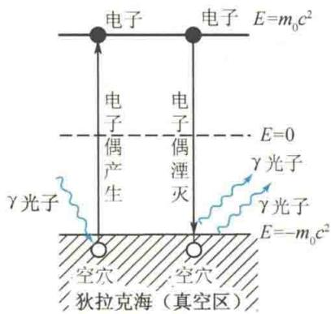

import Guide from '@/components/Guide.astro';
import Knowledge from '@/components/Knowledge.astro';
import Example from '@/components/Example.astro';
import Analysis from '@/components/Analysis.astro';
import Solution from '@/components/Solution.astro';
import Variant from '@/components/Variant.astro';
import Note from '@/components/Note.astro';
import Block from '@/components/Block.astro';
import Method from '@/components/Method.astro';
import Exercise from '@/components/Exercise.astro';

粒子物理研究的对象是比原子核更深入的一个物质结构层次,其空间尺度小于 $10^{-16}$ m. 粒子是一个庞大的家族,至今已发现并确认的粒子有 450 多种,已发现尚待确认的还有 300 多种,随着加速器能量的不断提高和实验技术的不断改进,新粒子还在不断地被发现.到目前为止,只有光子、电子、正电子、质子、反质子、中微子是稳定的,其他粒子都会衰变.粒子可在相互作用中产生,正、反粒子相遇时会湮灭.下面只简单介绍粒子特征、四种相互作用、粒子分类、强子的夸克结构和相互作用的统一理论.

## 16.3.1 粒子特征 四种相互作用和粒子分类

19世纪末，物理学深入物质结构的微观领域，电子的发现是一个重要标志。到20世纪30年代，中子的发现又是一个重要标志。至此，连同已发现的质子、光子，这四种粒子称为基本粒子。下面再介绍几个重要发现。

### 1) 正电子的发现

1932年，安德森在记录宇宙射线（宇宙中的高能粒子流）的云雾室中发现了正电子。它与电子有相同的质量，但却带正电荷。已知原子中的电子都带负电荷，因此正电子不是宏观物体的组元，这让当时的人们很惊讶。早在1930年，狄拉克曾在理论上预言存在正电子。狄拉克认为“真空”是充满负能粒子的一种状态。负电子充满整个负能区，因而没有观测效应。如果负能态的电子吸收了能量大于 $1.022\mathrm{MeV}$ 的光子而跃入正能态（电子静能 $m_0c^2 = 0.511\mathrm{MeV}$ ），电子原先占据的负能级就成为一个空穴，这个空穴就是正电子。正电子碰到负电子，即正能区的电子降落到负能区的空穴中，正、负电子湮灭，同时产生两个光子，如图16.6所示。正电子湮灭技术，当今已成为一个有特色的研究领域。现在已经清楚，所有粒子都有反粒子，正电子只是其中的一例而已。正、反粒子的质量、自旋、平均寿命完全相同，而电荷等值异号，磁矩方向相反。从理论上说，还应该存在由这些反粒子组成的反原子核、反原子、反物质、反星体等. 1998 年 6 月, 中国和美国等国家的科学家将 $\alpha$ 磁谱仪送上太空, 其任务之一就是在宇宙中寻找反物质.

### 2) 中微子的发现

原子核在 $\beta$ 衰变时观测到的是从原子核中放出的电子.1930年，泡利根据原子核衰变前后应遵循角动量守恒定律和能量守恒定律，提出原子核在发射 $\beta$ 粒子的同时应发射一个质量几乎为零的中性粒子，称为中微子.中微子自旋在粒子前进方向上的投影为 $-\frac{1}{2}\hbar$ ，反中微子为 $\frac{1}{2}\hbar$ 通过实验探测中微子很困难，直到1959年才得到公认的结果.原子核中并不存在中微子，因此中微子也不是宏观物体的组元，它是在衰变过程中产生出来的.现在人们认识到，粒子间能相互转换是微观世界的普遍特性.
<figure class="vp-figure">
  
  <figcaption>图16.6 正、负电子对的产生和湮灭</figcaption>
</figure>

### 3) 介子的发现

1936年，人们在对宇宙射线的观测中发现了一种粒子，其质量是电子的207倍，但又比质子小，物理上称它为“ $\mu$ 介子”（后改称 $\mu$ 子）。 $\mu$ 子是不稳定的，其平均寿命是 $2.2 \times 10^{-6} \mathrm{~s}$ 。后来人们发现它衰变成正电子、中微子和反中微子，或者电子、中微子和反中微子，说明 $\mu$ 子有正、反两种，带电量分别为 $+e$ 和 $-e$ ，分别用符号 $\mu^{+}$ 和 $\mu^{-}$ 表示。1947年，人们在宇宙射线中发现 $\pi$ 介子。它的质量是电子质量的273.1倍，带电量为 $+e$ 或 $-e$ ，分别用 $\pi^{+}, \pi^{-}$ 表示，其平均寿命是 $2.6 \times 10^{-8} \mathrm{~s}.\pi$ 介子衰变成 $\mu$ 子还放出中微子，反应式为
$$
\begin{array}{l}\pi^ {+} \rightarrow \mu^ {+} + \nu_ {\mu}\\\pi^ {-} \rightarrow \mu^ {-} + \tilde {\nu} _ {\mu}\end{array}
$$
$\nu_{\mu}$ 和 $\tilde{\nu}_{\mu}$ 互为反粒子，它们是和 $\mu$ 子相联系的中微子，称为 $\mu$ 中微子。它们和电子中微子 $\nu_{\mathrm{e}}$ 、 $\tilde{\nu}_{\mathrm{e}}$ 不同。 $\mu$ 子和 $\mu$ 中微子 $\nu_{\mu}$ 的自旋都是 $\frac{1}{2}$ ，所以 $\pi^{+}, \pi^{-}$ 的自旋应为整数，实验测得 $\pi$ 介子的自旋为零。一般说来，介子的自旋都为整数， $\mu$ 子并不属于介子类。
20 世纪 50 年代以后人们发现了质量超过核子质量的粒子, 称为超子.
粒子的特征可用以下几个物理量来描述.
（1）质量，常用能量来表示，因为可按相对论的质能关系给出质量 $m=\frac{E}{c^{2}}$ . 例如，质子的静止质量是 938.2796 MeV.
(2) 电量, 常以电子电量 e 为单位, 如 $\pi^{+}$ 介子的电量是 +e.
（3）自旋，自旋角动量以 $\hbar$ 为单位。自旋角动量量子数为整数或半奇数。例如，电子的自旋为 $\frac{1}{2}$ ，光子的自旋为 1。
(4) 平均寿命. 多数粒子是不稳定的, 它们的衰变特征用平均寿命表示.
在经典物理中,物体的相互作用在本质上只有两种,即引力和电磁力.微观粒子质量太小,引力实际上不起作用.实验证明,电磁力的规律在微观领域依然成立.除此之外,还应有别的作用力存在.
前面已经提到原子核中有一种核力,这是一种吸引力,这种作用比静电作用更强,称为强作用力.在 $\beta$ 衰变中,涉及不带电粒子,因此也不是电磁力的效果,定量分析表明,这种作用力很弱,简称弱作用力.
至今,人们认识到自然界的基本相互作用力只有四种.按强弱排序,它们是强作用力、电磁力、弱作用力、引力.强作用力和弱作用力只是在微观距离上起作用.因此宏观上只有电磁力和引力.这四种力通常称作四种相互作用.表16.2列出了四种相互作用的比较.
表 16.2 四种相互作用的比较
<table><tr><td>作用类别</td><td>引力作用</td><td>弱作用</td><td>电磁作用</td><td>强作用</td></tr><tr><td>作用力程/m</td><td> $\infty$ </td><td> $<10^{-16}$ </td><td> $\infty$ </td><td> $10^{-16} \sim 10^{-15}$ </td></tr><tr><td>举例</td><td>天体之间</td><td> $\beta$ 衰变</td><td>原子结合</td><td>核力</td></tr><tr><td>相对强度</td><td> $10^{-38}$ </td><td> $10^{-9}$ </td><td>1/137</td><td>1</td></tr><tr><td>作用传递者</td><td>引力子 $^{\text{1}}$ </td><td>中间玻色子 $(W^{\pm},Z^{0})$ </td><td>光子( $\gamma$ )</td><td>胶子(g)</td></tr><tr><td>被作用粒子</td><td>一切物体</td><td>强子、轻子</td><td>强子、e、 $\mu$ 、 $\gamma$ </td><td>强子</td></tr><tr><td>特征时间/s</td><td>—</td><td> $>10^{-10}$ </td><td> $10^{-20} \sim 10^{-16}$ </td><td> $<10^{-23}$ </td></tr></table>
四种相互作用都严格遵循能量守恒、动量守恒、角动量守恒、电荷数守恒这四条守恒定律. 此外, 还有一些与粒子内部结构相联系的守恒定律, 如宇称守恒、同位旋守恒、奇异数守恒、重子数守恒、轻子数守恒等, 这些守恒定律并不是在每一种相互作用中都成立, 它们只是一些近似的守恒定律. 例如, 杨振宁、李政道于 1956 年提出弱相互作用中宇称不守恒的假设, 后经吴健雄实验证实. 杨振宁、李政道因此获得 1957 年诺贝尔物理学奖.
粒子按其参与相互作用的性质可以分为三类. 第一类是规范粒子. 按照量子场论, 这四种作用力都是通过交换一定的粒子来实现的交换力. 规范粒子是传递作用力的粒子. 光子是电磁力的传递者, $W^{\pm}$ 和 $Z^{0}$ 是弱力的传递者. 强力的传递者(按至今的理论)是胶子, 符号为 g. 胶子是不能单独出现的粒子, 因此无法记录在仪器上. 引力是通过交换引力子来实现的, 但是它的存在还没有充足的理论根据. 第二类是轻子. 这些粒子完全不受强作用力的影响, 如电子、中微子、 $\mu$ 子等. 由于这些代表性粒子都较轻(有时并不轻), 因此称为轻子. 带电的轻子也参与电磁作用, 不带电的轻子(只有中微子)则只参与弱作用. 第三类是强子. 强子又分成介子和重子两类, 以介子、质子、中子为代表, 它们既有强作用也有弱作用. 由于两种作用都存在时, 强作用是主要的, 因此称为强子. 表 16.3 为粒子分类表, 将粒子这样分类, 不仅使人们对粒子的全局有清晰的了解, 而且对以后的深入研究也是重要的导向.
表 16.3 粒子分类表
<table><tr><td>类别</td><td>粒子名称</td><td>符号</td><td>质量/MeV</td><td>自旋</td><td>平均寿命/s</td><td>主要衰变方式</td></tr><tr><td rowspan="4">规范粒子</td><td>光子</td><td> $\gamma$ </td><td>0</td><td>1</td><td>稳定</td><td></td></tr><tr><td>W粒子</td><td> $W^{\pm}$ </td><td>80 800</td><td>1</td><td> $>0.95\times10^{-25}$ </td><td> $W^{-}\rightarrow e^{-}+\bar{\nu}_{e}$ </td></tr><tr><td> $Z^{0}$ 粒子</td><td> $Z^{0}$ </td><td>92 900</td><td>1</td><td> $>0.77\times10^{-25}$ </td><td> $Z^{0}\rightarrow e^{+}+e^{-}$ </td></tr><tr><td>胶子</td><td>g</td><td>0</td><td>1</td><td>稳定</td><td></td></tr><tr><td rowspan="6">轻子</td><td>电中微子</td><td> $\nu_{e}$ </td><td>0</td><td>1/2</td><td>稳定</td><td></td></tr><tr><td> $\mu$ 中微子</td><td> $\nu_{\mu}$ </td><td>0</td><td>1/2</td><td>稳定</td><td></td></tr><tr><td> $\tau$ 中微子</td><td> $\nu_{\tau}$ </td><td>0</td><td>1/2</td><td>稳定</td><td></td></tr><tr><td>电子</td><td> $e^{-}$ </td><td>0.511 003 4</td><td>1/2</td><td>稳定</td><td></td></tr><tr><td> $\mu$ 子</td><td> $\mu^{-}$ </td><td>105.659 32</td><td>1/2</td><td> $2.197\ 09\times10^{-6}$ </td><td> $\mu^{-}\rightarrow e^{-}+\bar{\nu}_{e}+\nu_{\mu}$ </td></tr><tr><td> $\tau$ 子</td><td> $\tau^{-}$ </td><td>1 776.9</td><td>1/2</td><td> $3.4\times10^{-13}$ </td><td> $\tau^{-}\rightarrow\mu^{-}+\bar{\nu}_{\mu}+\nu_{\tau}$ </td></tr></table>
<table><tr><td colspan="2">类别</td><td>粒子名称</td><td>符号</td><td>质量/MeV</td><td>自旋</td><td>平均寿命/s</td><td>主要衰变方式</td></tr><tr><td rowspan="13">强子</td><td rowspan="6">介子</td><td> $\pi$ 介子</td><td> $\pi^{0}$  $\pi^{\pm }$ </td><td>134.963 0139.567 3</td><td>00</td><td> $0.83\times 10^{-16}$  $2.603\,0\times 10^{-18}$ </td><td> $\pi^{0}\rightarrow\gamma+\gamma$  $\pi^{+}\rightarrow\mu^{+}+\nu_{\mu}$ </td></tr><tr><td> $\eta$ 介子</td><td> $\eta$ </td><td>548.8</td><td>0</td><td> $7.48\times 10^{-19}$ </td><td> $\eta\rightarrow\gamma+\gamma$ </td></tr><tr><td>K介子</td><td> $K^{0}$  $\overline{K}^{0}$  $K^{\pm }$ </td><td>497.67493.667</td><td>00</td><td> $\begin{cases}0.8923\times 10^{-10}\\5.183\times 10^{-8}\\1.2371\times 10^{-8}\end{cases}$ </td><td> $K_{s}^{0}\rightarrow\pi^{+}+\pi^{-}$  $K_{L}^{0}\rightarrow\pi^{-}+\mathrm{e}^{+}+\nu_{e}$  $K^{+}\rightarrow\mu^{+}+\nu_{\mu}$ </td></tr><tr><td>D介子</td><td> $D_{0}$  $\overline{D}^{0}$  $D^{\pm }$ </td><td>1864.71869.4</td><td>00</td><td> $4.4\times 10^{-13}$  $9.2\times 10^{-13}$ </td><td> $D^{0}\rightarrow K^{-}+\pi^{+}+\pi^{0}$  $D^{+}\rightarrow\overline{K}^{0}+\pi^{+}+\pi^{0}$ </td></tr><tr><td>F介子</td><td> $F^{\pm }$ </td><td>1971</td><td>0</td><td> $1.9\times 10^{-13}$ </td><td> $F^{+}\rightarrow\eta+\pi^{+}$ </td></tr><tr><td>B介子</td><td> $B^{0}$  $\overline{B}^{0}$  $B^{\pm }$ </td><td>5274.25270.8</td><td>00</td><td> $14\times 10^{-13}$ </td><td> $B^{0}\rightarrow\overline{D}^{0}+\pi^{+}+\pi^{-}$  $B^{+}\rightarrow\overline{D}^{0}+\pi^{+}$ </td></tr><tr><td rowspan="7">重子</td><td>质子</td><td>p</td><td>938.279 6</td><td>1/2</td><td>稳定</td><td>—</td></tr><tr><td>中子</td><td>n</td><td>939.573 1</td><td>1/2</td><td>898</td><td> $n\rightarrow p+e^{-}+\overline{\nu}_{e}$ </td></tr><tr><td> $\Lambda^{0}$ 超子</td><td> $\Lambda^{0}$ </td><td>1115.60</td><td>1/2</td><td> $2.632\times 10^{-10}$ </td><td> $\Lambda^{0}\rightarrow p+\pi^{-}$ </td></tr><tr><td> $\sum$ 超子</td><td> $\sum^{+}$  $\sum^{0}$  $\sum^{-}$ </td><td>1189.361192.461197.34</td><td>1/21/21/21/2</td><td> $0.800\times 10^{-10}$  $5.8\times 10^{-20}$  $1.482\times 10^{-10}$ </td><td> $\sum^{+}\rightarrow p+\pi^{0}$  $\sum^{0}\rightarrow\Lambda^{0}+\gamma$  $\sum^{-}\rightarrow n+\pi^{-}$ </td></tr><tr><td> $\Xi$ 超子</td><td> $\Xi^{0}$  $\Xi^{-}$ </td><td>1314.91321.32</td><td>1/21/2</td><td> $2.90\times 10^{-10}$  $1.641\times 10^{-10}$ </td><td> $\Xi^{0}\rightarrow\Lambda^{0}+\pi^{0}$  $\Xi^{-}\rightarrow\Lambda^{0}+\pi^{-}$ </td></tr><tr><td> $\Omega^{-}$ 超子</td><td> $\Omega^{-}$ </td><td>1672.45</td><td>3/2</td><td> $0.819\times 10^{-10}$ </td><td> $\Omega^{-}\rightarrow\Lambda^{0}+K^{-}$ </td></tr><tr><td> $\Lambda_{e}^{+}$ 重子</td><td> $\Lambda_{e}^{+}$ </td><td>2282.0</td><td>1/2</td><td> $2.3\times 10^{-13}$ </td><td> $\Lambda_{e}^{+}\rightarrow p+K^{-}+\pi^{+}$ </td></tr></table>

## 16.3.2 强子的夸克结构

到目前为止，已发现六种轻子。它们是电子、 $\mu$ 子、 $\tau$ 子和分别与之对应的三种中微子。按当今人类的认识水平，轻子类也只有这六种了，目前还未发现轻子有内部结构。强子情况却相反，越来越大的加速器使人们不断发现新的强子，至今已发现了八百多种强子。这是人们认为强子不是基本粒子的重要原因。
在强子种类已很多时,人们开始从现象上对不同强子进行分类.在分类规律的指引下,提出了强子不是基本粒子,而是由若干个夸克构成的复合体.夸克是强子的组元粒子.
夸克共有六种,粒子物理学家称夸克有六种不同的“味”.这六种夸克的符号及性质如表16.4所示.
表 16.4 六种夸克的符号及性质
<table><tr><td>夸克种类(味)</td><td>上</td><td>下</td><td>奇异</td><td>粲</td><td>底</td><td>顶</td></tr><tr><td>英文</td><td>up</td><td>down</td><td>strange</td><td>charm</td><td>bottom</td><td>top</td></tr><tr><td>符号</td><td>u</td><td>d</td><td>s</td><td>c</td><td>b</td><td>t</td></tr><tr><td>质量/MeV</td><td>5</td><td>10</td><td>500</td><td>1 500</td><td>4 800</td><td>—</td></tr><tr><td>电荷(e)</td><td>2/3</td><td>-1/3</td><td>-1/3</td><td>2/3</td><td>-1/3</td><td>2/3</td></tr><tr><td>自旋</td><td>1/2</td><td>1/2</td><td>1/2</td><td>1/2</td><td>1/2</td><td>1/2</td></tr></table>
每种夸克都有相应的反夸克.
最轻的两味是 u 夸克和 d 夸克. u 夸克带正电荷, 电量是电子电量的 $\frac{2}{3}$ . d 夸克带负电荷, 电量是电子电量的 $\frac{1}{3}$ . 所有重子都由三个夸克组成. 如质子由 u、u、d 三个夸克组成, $p \equiv (uud) \uparrow \uparrow \downarrow$ , 其电荷为 $\frac{2}{3} + \frac{2}{3} - \frac{1}{3} = 1$ , 小箭头代表夸克自旋之间的关系, 其自旋为 $+ \frac{1}{2} + \frac{1}{2} - \frac{1}{2} = \frac{1}{2}$ . 中子由 u、d、d 三个夸克组成, $n \equiv (udd) \uparrow \uparrow \downarrow$ , 其电荷为 $-\frac{1}{3} - \frac{1}{3} + \frac{2}{3} = 0$ , 自旋为 $+ \frac{1}{2} + \frac{1}{2} - \frac{1}{2} = \frac{1}{2}$ . 除电荷以外, 还有一些量子数, 如重子数、同位旋、超荷、粲数等, 这里不再介绍. 所有的介子都是由一个夸克和一个反夸克组成的. 例如, $\pi^{+} \equiv (ud) \uparrow \downarrow$ , 其电荷为 $\frac{2}{3} + \frac{1}{3} = 1$ , 自旋为零; $\pi^{-} \equiv (ud) \downarrow \uparrow$ , 其电荷为 $-\frac{2}{3} - \frac{1}{3} = -1$ , 自旋为零. 表 16.5 所示为一些强子的夸克谱.
表 16.5 一些强子的夸克谱
<table><tr><td>介子</td><td>重子</td></tr><tr><td> $\pi^{+} = (u \bar{d}) \uparrow \downarrow$ </td><td> $p = (uud) \uparrow \uparrow \downarrow$ </td></tr><tr><td> $\pi^{0} = \frac{1}{\sqrt{2}}(u \bar{u} - d \bar{d}) \uparrow \downarrow$ </td><td> $n = (udd) \uparrow \uparrow \downarrow$ </td></tr><tr><td> $\pi^{-} = (d \bar{u}) \uparrow \downarrow$ </td><td> $\sum^{+} = (uus) \uparrow \uparrow \downarrow$ </td></tr><tr><td> $K^{+} = (u \bar{s}) \uparrow \downarrow$ </td><td> $\sum^{0} = \frac{1}{\sqrt{2}}(uds + sdu) \uparrow \uparrow \downarrow$ </td></tr><tr><td> $K^{-} = (s \bar{u}) \uparrow \downarrow$ </td><td> $\sum^{-} = (dds) \uparrow \uparrow \downarrow$ </td></tr><tr><td> $K^{0} = (d \bar{s}) \uparrow \downarrow$ </td><td> $\Xi^{0} = (uss) \uparrow \uparrow \downarrow$ </td></tr><tr><td> $\overline{K}^{0} = (s \bar{d}) \uparrow \downarrow$ </td><td> $\Xi^{-} = (dss) \uparrow \uparrow \downarrow$ </td></tr><tr><td> $\eta = \frac{1}{\sqrt{6}}(u \bar{u} + d \bar{d} - 2s \bar{s}) \uparrow \downarrow$ </td><td> $\Lambda^{-0} = \frac{1}{\sqrt{2}}(sdu - sud) \uparrow \uparrow \downarrow$ </td></tr></table>
以电子电荷为单位, 夸克带分数电荷, 这是一个显著特征. 于是人们开始以分数电荷为标志来寻找夸克. 虽然多年的努力没有成果, 但是夸克的强相互作用理论却发展起来了. 按照这一理论, 夸克不仅有“味”的区别, 而且还有“色”的区别, 人们形象地称它们为红夸克、黄夸克、蓝夸克. 每种“味”的夸克可以具有三种不同的色, 不同色的夸克靠胶子结合在一起. 三个夸克组成的重子是白色的. 构成介子的正、反夸克互为补色, 所以介子也是白色的, 即质子、中子等一切能观测到的强子都是白色的. 相反, 非白色的单个夸克或夸克复合体是不能单独出现的, 这样, 单个夸克不被发现就是必然的了. 不同色的夸克表示不同的状态, 引入色就可解释自旋问题. 夸克的自旋都是 $\frac{1}{2}$ , 应遵循泡利不相容原理. 一个夸克和一个反夸克构成一个介子, 两者的自旋相反, 介子的自旋为零, 这很好理解. 但是三个夸克构成一个重子. 如 $\Omega^{-}$ 是 (sss) $\uparrow \uparrow \uparrow$ , 自旋是 $\frac{3}{2}$ , 三个 s 夸克的自旋平行, 则这三个夸克应分别具有不同的颜色, 处于不同的状态, 才不违背泡利不相容原理.
这个被称为量子色动力学的夸克强作用理论，已被大量实验证明是正确的。现在已很少有人因为没有找到夸克而怀疑它的真实性了，夸克理论的确立使人们对粒子世界的认识前进了一大步。原来作为基本粒子的质子、中子等强子都是复合物，而不是基本粒子了。迄今为止，还没有实验现象说明轻子和夸克有内部结构，所以可认为轻子和夸克是物质世界的最小单元。夸克有六味，每味各有三色，又各有正、反粒子，共36个。轻子有六味，即 $e, \nu_{e}, \mu, \nu_{\mu}, \tau, \nu_{\tau}$ ，它们都无色，各有正、反粒子，共12个。至于这些粒子是不是物质的终极本原，这是未来物理学家才能回答的问题。有人提出夸克-轻子的复合模型，称为亚夸克理论，以减少这48种粒子的数目，但是该理论因缺乏实验根据而不被承认。

## 16.3.3 相互作用的统一

粒子间有四种相互作用, 它们各自是独立的. 质子和中子靠强相互作用结合成原子核; 原子核和电子靠电磁作用结合成原子; 弱相互作用导致 $\beta$ 衰变, 万有引力作用存在于一切物体之间; 强相互作用和弱相互作用是短程的, 对宏观现象不起作用. 因此, 宏观力的本原只有电磁力和引力两种. 自然界为什么存在这么多的作用? 它们之间有没有联系? 能否在这些表面上看来很不相同的作用中找出简单的统一本原? 爱因斯坦在建立了广义相对论之后, 致力于研究电磁力和引力的统一. 可是他花费了很大的精力, 最后却没有成功. 海森伯研究过各种力的统一, 也没有结果. 因为物理学是一门实验科学, 一个理论是否正确的唯一标准是它是否符合事实. 因此物理学家追求统一的思想能否实现, 取决于他们的想法是否与客观实际情况一致. 而这一点很难事先作出判断.
在后来的物理学家看来，爱因斯坦的失败并不是他追求统一的想法不对，而是由于他错误地想在宏观物理的基础上寻求统一。宏观物理规律是唯象性的，而不是本原性的。因此在微观粒子的动力学理论确立以后，追求几种不同相互作用的统一的努力又复活了。1968年，格拉肖、温伯格、萨拉姆三人在现代高能物理实验的基础上，把弱相互作用和电磁相互作用统一起来，建立了弱电统一理论。
从现象上看来,弱力和电磁力是性质差别很大的两种力.弱力是短程力,电磁力是长程力,强度上的差别有10个数量级以上.这两种力怎么会在本质上是同一种力?由量子场理论来看,弱力的弱性和它的短程性来自同一个原因,那就是传递弱力的媒介粒子很重.弱电统一理论的要点指出,在能量很高(远大于几百GeV)的现象中,传递弱力的媒介粒子与光子一样,静止质量为零.又由于内部存在某种对称性,弱力和电磁力成为同一种力,弱力和电磁力的强度和所表现的效果都没有区别.现在人们简单地称这种统一的力为弱电力.在能量较低时,一种被称为希格斯机理的物理效应把该种内部对称性破坏了,使某些传递力的媒介粒子获得很大的质量.这些粒子传递力就变得很弱,它就是在低能现象上看到的弱力.有一种媒介粒子仍然保持静止质量为零,它传递的就是电磁力.传递力的媒介粒子叫作规范粒子.在低能范围内,电磁相互作用的规范粒子是光子,弱相互作用的规范粒子是 $W^{\pm}$ 粒子和 $Z^{0}$ 粒子.这一理论称为有对称性自发破缺的规范场理论.弱电统一理论已被大量实验证实.1979年,格拉肖、温伯格、萨拉姆因建立弱电统一理论而获得诺贝尔物理学奖.1984年,范德梅尔和鲁比亚因在发现W粒子和Z粒子过程中的重要贡献而获得诺贝尔物理学奖.这些都说明这一理论得到了人们的认可.
弱电统一理论的成功是人类认识微观世界的重大成果，它鼓舞物理学家建立更大的统一理论。把强相互作用和弱电作用统一起来的理论，叫作大统一理论。1974年，乔奇和格拉肖以弱电统一理论和量子色动力学为基础建立了一个大统一理论，可是这个理论至今没有得到实验验证。物理学家还想把引力也统一进来，也就是四种相互作用都统一起来的理论，叫作超大统一理论。如果
超大统一理论成功了,那就意味着自然界只有一种基本相互作用.这确实应当被认为是一件了不起的事情.可是,目前还没有出现实验可证实的结果.要实现超大统一,似应考虑夸克和轻子的组元是什么,可是目前还远没解决这个问题.
从古到今,人类一直在探索物质及其相互作用的本原,并在这一思想的支配下由浅入深、由表及里地一个层次一个层次地发展,这种探索可能是永无止境的.
