import QRCodeVideo from '@/components/QRCodeVideo.astro';

import Guide from '@/components/Guide.astro';
import Knowledge from '@/components/Knowledge.astro';
import Example from '@/components/Example.astro';
import Analysis from '@/components/Analysis.astro';
import Solution from '@/components/Solution.astro';
import Variant from '@/components/Variant.astro';
import Note from '@/components/Note.astro';
import Block from '@/components/Block.astro';
import Method from '@/components/Method.astro';
import Exercise from '@/components/Exercise.astro';

## 第17章 新技术的物理基础

本章提要
<QRCodeVideo title="量子通信" url="https://api.guangyiedu.com/v3/resource/resource/r/NewQrCode-Y5lXY0g5IWvmkcryUBnD" />  
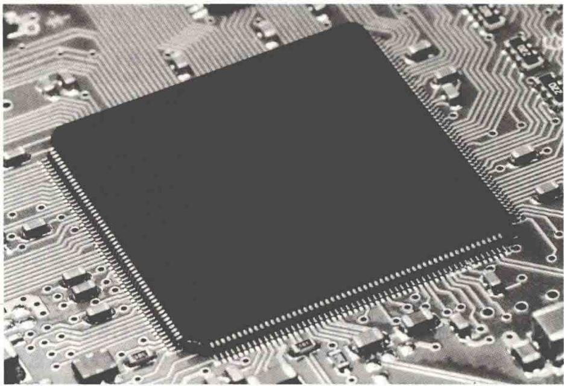
几乎所有重大的新技术领域(如半导体、激光、超导和信息技术等)的创立,事前都经过了长期的酝酿,在理论和实验方面积累了大量的知识之后,才突然迸发出来.1960年,第一台红宝石激光器的诞生依赖于受激辐射理论.1911年,具有广阔应用前景的超导现象被发现.20世纪,晶体管、集成电路诞生,开启了以计算机为代表的信息技术革命.量子力学及建立在量子力学基础上的能带理论孕育并成就了这些新技术.
本章将从量子物理的基本结论出发，对能带、激光、超导和纳米科学技术等内容进行介绍，最后简要介绍玻色-爱因斯坦凝聚态.

固体是指具有确定形状和体积的物体,可分为三大类:一是晶体,如食盐、云母、金刚石等;二是非晶体,如玻璃、松香、沥青等;三是准晶体.迄今为止,科学界只对晶体有较为成熟的理论,但目前对非晶体和准晶体的研究也很活跃.因为固体由大量原子紧密结合而成,所以它的结构和性质既取决于原子间的相互作用,又与原子中外层电子的运动有重要关系.实践证明,固体的许多性质无法用经典理论解释,必须用量子理论才能说明.本节所说的固体指的是晶体.

## 17.1.1 晶体结构和晶体分类

### 1. 晶体结构

从宏观上看,晶体具有规则的几何形状.从微观上看,晶体中的分子、原子或离子在空间的排列都呈规则的、具有周期性的阵列形式,这种微观粒子的三维阵列称为晶体点阵(简称晶格).晶体的基本特征是规则排列,表现出长程有序性.图17.1(a)、(b)、(c)、(d)分别是NaCl、CsCl、Cu和金刚石的基本晶格结构示意图.
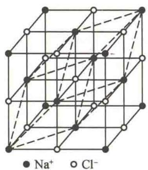  
(a) NaCl
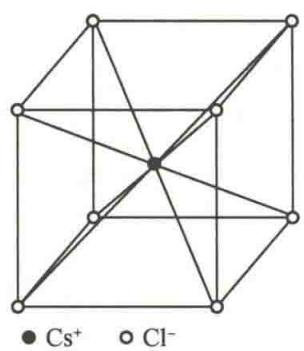  
(b) CsCl
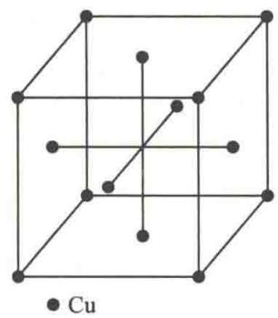  
(c) Cu
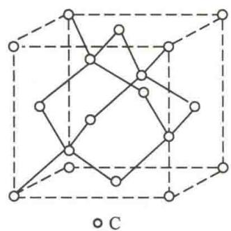  
(d) 金刚石  
图17.1 基本晶格结构示意图
由于晶格的周期性,我们可以在其中选取一定的单元,只要将它不断重复地平移,就可得到整个晶体.这样的重复单元称为晶胞,如图17.2所示.
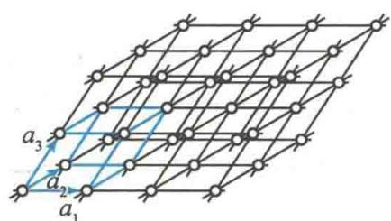

### 2. 晶体分类

晶体按结合力的性质可分成如下四种基本类型.
图17.2 晶胞

### 1) 离子晶体

这种晶体的正、负离子相间排列，它们的结合是靠离子之间的库仑吸引力，形成离子键。最典型的是周期表中ⅠA族的碱金属元素Li、Na、K、Rb、Cs和ⅦA族卤元素
F、Cl、Br、I间形成的化合物，如NaCl晶体.离子晶体一般硬度高、熔点高、性脆、电子导电性弱.离子键没有方向性和饱和性.

## 2）共价晶体

原子晶体内原子间的结合力主要通过共价键实现,故原子晶体又称为共价晶体.氢分子( $H_{2}$ )是典型的靠共价键结合的分子.当两个氢原子相互靠近形成分子时,两个自旋相反的价电子将在两个氢核之间运动,为两个氢核所共有,这时它们同时与两个氢核有较强的吸引力作用,形成共价键,从而将两个原子结合起来.具有代表性的共价晶体有金刚石,半导体材料锗、硅、碳化硅等.共价键具有方向性和饱和性.
共价晶体具有高硬度、高熔点、高沸点，难溶于所有寻常液体的特性。这类晶体在低温时电导率很低，但当温度升高，或掺入杂质时，电导率会随之增加。
中国物理学家

## 3）分子晶体

<QRCodeVideo title="黄昆" url="https://api.guangyiedu.com/v3/resource/resource/r/NewQrCode-ifmU4nOT4v4RQUkbJJvJ" />
组成分子晶体的微粒是电中性的无极性分子,其结合力主要来自各分子相互接近时诱发的瞬时电偶极矩.这种结合力称为范德瓦耳斯力,相应的结合键称为范德瓦耳斯键.这种键没有方向性和饱和性.
黄昆
大部分有机化合物的晶体和 $Cl_{2}$ 、 $CO_{2}$ 、 $CH_{4}$ 、 $SO_{2}$ 、HCl 等以及惰性气体（如 Ne、Ar、Kr、Xe 等）在低温下形成的晶体都是分子晶体。由于范德瓦耳斯力很弱，这种结合不牢固，因此分子晶体具有熔点低、硬度低和导电性差等特点。

## 4）金属晶体

金属晶体是一种重要的晶体类型,它与共价晶体较相似.在金属晶体中,原子失去了它的部分或全部价电子而成为离子实.这些离开了原子的价电子为全部离子实
所共有. 金属键就是靠共有化价电子和离子实之间的库仑力形成的. 金属键没有饱和性和明显的方向性.
金属所具有的特性,如导电性、导热性、金属光泽等都与共有化价电子可以在整个晶体内自由运动有关.
对于大多数晶体,微粒之间的结合键往往是上述各种结合键中的几种的混合,称为混合键.例如,石墨晶体的同一层中碳原子之间靠共价键结合,而不同层间靠范德瓦耳斯键结合,如图17.3所示.
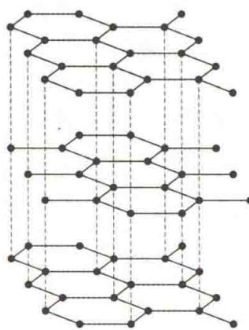  
图 17.3 石墨晶体

## 17.1.2 固体的能带

固体中原子的能级结构和孤立原子不同,形成所谓的“能带”.为了弄清能带形成的原因,先要了解什么是电子共有化.

### 1. 电子共有化

为简单起见,我们来讨论只有一个价电子的原子,这样的原子可以看成由一个电子和一个正离子(原子实)组成,电子在离子电场中运动.单个原子的势能曲线如图17.4(a)所示.当两个原子靠得很近时,每个价电子将同时受到两个离子电场的作用,这时势能曲线如图17.4(b)中的实线所示.当大量原子规则排列形成晶体时,晶体内形成了周期性势场,势能曲线如图17.4(c)所示.实际的晶体是三维点阵,势场也具有三维周期性.
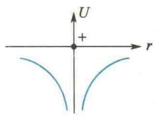  
(a) 单个原子
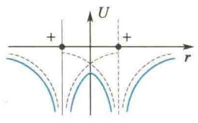  
(b) 两个原子
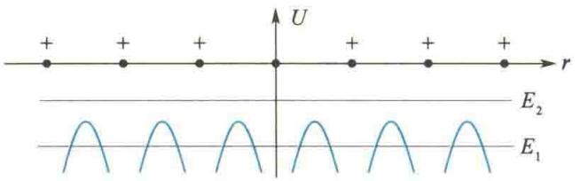  
(c) 晶体中的周期性势场  
图17.4 原子和晶体的势能曲线
确定电子在晶体内周期性势场中的运动状态需要求解薛定谔方程, 这里从略, 仅就此作一些定性说明. 对于能量为 $E_{1}$ 的电子来说, 势能曲线代表着势垒. 由于 $E_{1}$ 较小, 相对地势垒宽度就很宽了, 因此电子穿透势垒的概率十分微小, 基本上可以认为电子仍束缚在各自原子实的周围. 对于能量较大 (如 $E_{2}$ ) 的电子, 因为其能量超出了势垒的高度, 所以它可以在晶体内自由运动, 而不再受特定原子的束缚. 还有一些能量略大于 $E_{1}$ 的电子, 虽不能越过势垒高度, 但可以通过隧道效应而进入相邻原子. 这样, 在晶体内便出现了一批由整个晶体原子所共有的自由电子. 这种由于晶体中原子的周期性排列而使价电子不再为单个原子所有的现象, 称为电子的共有化.

### 2. 能带的形成

量子力学证明,晶体中电子共有化的结果,使原先每个原子中具有相同能量的电子能级,因各原子间的相互影响而分裂为一系列和原来能级很接近的新能级,这些新能级基本上连成一片而形成能带.下面定性解释能带的形成原因.
根据泡利不相容原理, 同一原子系统中, 不可能有两个或两个以上的电子具有完全相同的一组量子数 $(n, l, m_l, m_s)$ . 当大量分子、原子紧密结合成晶体时, 其中共有化电子是属于整个晶体系统的, 系统中也就不可能有量子数完全相同、处于同一能态的两个或两个以上的电子. 例如, 两个氢原子, 当它们相距很远且各自孤立时, 它们的核外电子处于基态 (1s 态), 量子数 $n, l, m_l$ 分别为 1、0、0, 自旋量子数可以都是 $+\frac{1}{2}$ , 也可以都是 $-\frac{1}{2}$ , 即可以处于具有相同能量的能级. 当两个氢原子相互靠近形成一个氢分子时, 由于电子的共有化, 这两个 1s 态电子的自旋量子数就只有一个是 $+\frac{1}{2}$ , 另一个是 $-\frac{1}{2}$ , 这样才能结合成能量最小的稳定态. 这两个 1s 态电子实际上处于有微小区别的不同能态, 形成氢分子中的两个能级. 氢分子的能量 $E$ 与原子间距 $r$ 的关系曲线 ( $E-r$ 曲线) 如图 17.5 所示. 两个原来相距很远、均处于 1s 态的氢原子, 当它们的间距缩小到 $r_0$ 时 (这时两原子已构成稳定的氢分子), 对应于 $r_0$ 有两个能量值 (图 17.5 中 $A$ 点和 $B$ 点), 即此时氢分子中的两个 1s 态电子有了两个能级. 这种情况通常叫作能级分裂. 以此类推, 当 $N$ 个原子相互靠近形成晶体时, 它们的外层电子被共有化, 使原来处于相同能级上的电子不再具有相同的能量, 而处于 $N$ 个相互靠得很近的新能级上. 或者说, 孤立原子的每一个能级分裂成了 $N$ 个很接近的新能级. 由于晶体中原子数目 $N$ 非常大, 所形成的 $N$ 个新能级中相邻两能级间的能量差很小, 其数量级为 $10^{-22} \mathrm{eV}$ , 几乎可以看成是连续的. 因此, $N$ 个新能级具有一定的能量范围, 通常称为能带, 如图 17.6 所示.
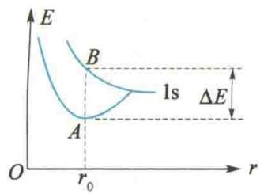  
图 17.5 氢分子能量与原子间距的关系曲线
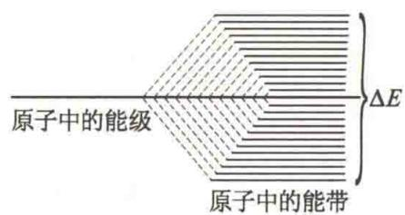  
图 17.6 晶体中能级的分裂
能带的宽度与多种因素有关:一是与原子间距有关,间距愈小,能带愈宽;二是与原子中的内层与外层电子的状态有关.对内层电子,由于它们距自身核很近,受邻近原子核的作用较弱,因此内层能带宽度较小;而外层价电子由于与自身核的距离和相邻原子核的距离处于同等数量级,受相邻原子的作用强烈,因此价电子的能级分裂的能带较宽.以此类推,比价电子能量更高的激发态能级分裂出的能带更宽.
因为原子中的每个能级在晶体中要分裂成一个能带,所以在两个相邻的能带间,可能有一个不被允许的能量间隔,这个能量间隔称为禁带.两个能带也可能相互重叠,这时禁带消失.能带的形成如图17.7所示.
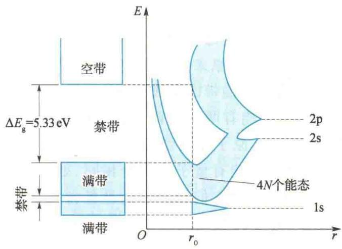  
(a) 金刚石的能带
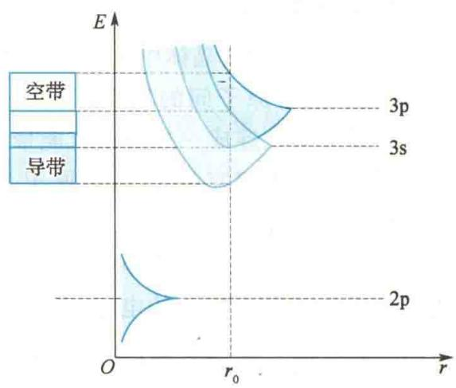  
(b) 钠晶体的能带  
图 17.7 能带的形成(r:原子间距, $r_{0}$ :平衡位置)
电子在这些能带中的分布情况如何呢？
根据泡利不相容原理,每个能带可以容纳的电子数等于与该能带相应的原子能级所能容纳的电子数的 N 倍,N 是组成晶体的原子个数.例如,由 N 个原子组成的晶体中,其 2s 能带总共可以容纳 2N 个电子,其 2p 能带总共可以容纳 6N 个电子,等等.
能带形成后, 电子是怎样填入能带内各能级中去的呢? 它们的填充方式与原子的情形相似, 仍然服从能量最小原理和泡利不相容原理. 正常情况下, 总是优先填充能量较低的能级. 如果一个能带中的各能级都被电子填满, 这样的能带称为满带. 不论有无外电场作用, 当满带中任意电子由它原来占有的能级向这一能带中其他任意能级转移时, 因受泡利不相容原理的限制, 必有电子沿相反方向的转移与之相抵消, 这时总体上不产生定向电流, 所以满带中的电子不参与导电过程, 如图 17.8(a) 所示. 由价电子能级分裂而形成的能带称为价带, 通常情况下价带为能量最高的能带, 价带可能被填满, 成为满带, 也可能未被填满. 与各原子的激发能级相应的能带, 在未被激发的正常情况下没有电子填入, 称为空带. 由于某种原因电子受到激发而进入空带,在外电场作用下,这些电子在空带中向较高的空能级转移时,没有反向的电子转移与之抵消,可形成电流,因此表现出导电性,所以空带又称为导带,如图17.8(b)所示.有的能带(一般为价带)只有部分能级被电子占据,在外电场作用下,这种能带中的电子向高能级转移时,也没有反向的电子转移与之抵消,也可形成电流,表现出导电性,因此未被电子填满的能带也称为导带,如图17.8(c)所示.
(c)  
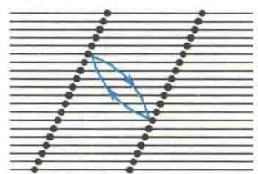  
(a)
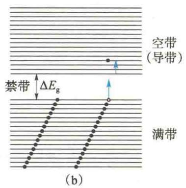  
图17.8 能带结构示意图
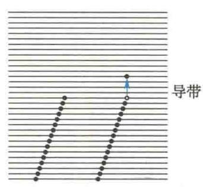

## 17.1.3 导体和绝缘体

根据前面的讨论, 当 N 个原子形成晶体时, 原子能级分裂成包含 N 个相近能级的能带. 能带所能容纳的电子数, 等于原来能级所能容纳的电子数乘以 N.
一般原子的内层能级都填满电子,所以形成晶体时,相应的能带也填满电子.原子最外层的能级可能原来填满了电子,也可能原来未被填满.如果原来填满了电子,那么相应的能带中亦填满电子.如果原来没有填满电子,那么相应的能带中也没有填满电子.
从能带结构来看,当温度接近热力学零度时,半导体和绝缘体都具有填满电子的满带和隔离满带与空带的禁带.半导体的禁带比较窄,禁带宽度 $\Delta E_{g}$ 为 0.1～1.5 eV,如图 17.9 所示.因此用不大的激发能量(热、光或电场)就可以把满带中的电子激发到空带中去,从而参与导电.
绝缘体的禁带一般很宽，禁带宽度 $\Delta E_{\mathrm{g}}$ 为 $3\sim 6\mathrm{eV}$ ，如图17.10所示.若用一般的热激发，光照或外加电场不强时，满带中的电子很少能被激发到空带中去，所以在外电场作用下，一般没有电子参与导电，表现为电阻率很大 $(\rho \approx 10^{16}\sim 10^{20}\Omega \cdot \mathrm{m})$ .大多数离子型晶体（如NaCl、KCl等）和分子型晶体（如 $\mathrm{Cl}_2,\mathrm{CO}_2$ 等）都是绝缘体.
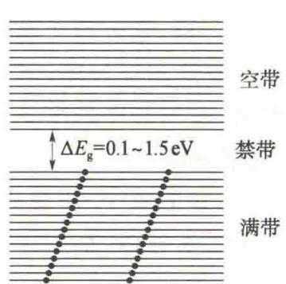  
图 17.9 半导体的能带结构示意图
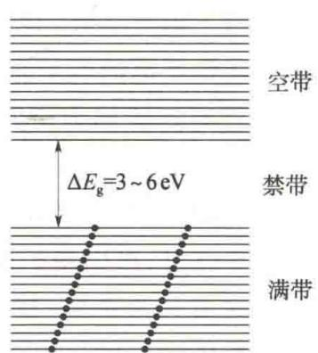  
图 17.10 绝缘体的能带结构示意图
导体的情况完全不同,其能带结构或者是能带中只填入部分电子而成导带,或者是满带与另一相邻空带紧密相连或部分重叠,或者是导带与另一空带重叠,如图17.11所示.在图17.11所示的情况下,如有外电场作用,它们的电子很容易从一个能级跃入另一个能级,从而形成电流,显示出很强的导电能力.单价金属(如Li等)的能带结构大致如图17.11(a)所示.一些二价金属(如Be、Ca、Mg、Zn、Sr、Cd、Ba等)的能带结构如图17.11(b)所示.另一些金属(如Na、K、Cu、Al、Ag等)的能带结构大致如图17.11(c)所示.
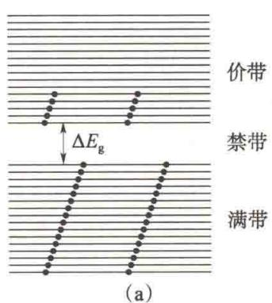
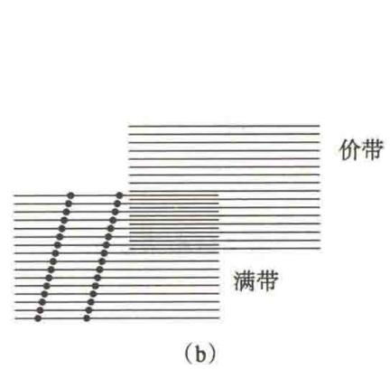
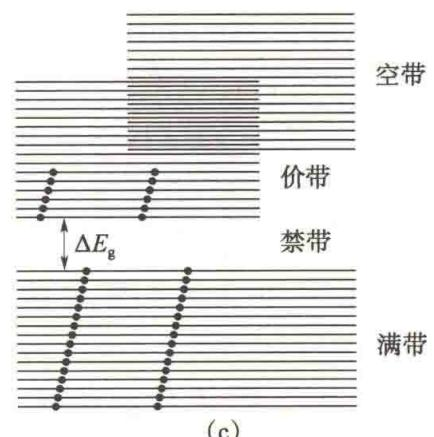  
图 17.11 金属导体的能带结构示意图
应该指出,能带和能级之间有时并不存在简单的对应关系,而且不能永远根据原来原子中各能级是否填满电子来判断晶体的导电性质.例如,二价金属 Ca 和 Mg,它们最外层的价电子能级中有两个电子,组成晶体时,与价电子能级相应的能带好像应该填满电子,但是由于价电子能带和它上面的空带重叠,如图 17.11(b) 所示,晶体中所有的价电子填不满叠合后的能带,因此这种晶体是导体.
总之,一个好的金属导体,它最上面的能带或是未被电子填满,或是虽被填满但此填满的能带与空带重叠.

## 17.1.4 半导体

从能带理论知道,半导体的满带和空带之间存在着禁带,但这个禁带宽度要比绝缘体的小得多.热运动的结果可使一部分电子从满带跃迁到空带,这不但使空带具有导电性能,而且使满带也具有导电性能,因为这时满带出现了空位,通常称为空穴.在外电场作用下,进入空带的电子可参与导电,称为电子导电.而满带中的其他电子在电场作用下填充空穴,并且它们又留下新的空穴,因而引起空穴的定向移动,效果就像是一些带正电的粒子在外电场作用下定向运动一样,这种由于满带中存在空穴所产生的导电性能称为空穴导电.对于没有杂质和缺陷的半导体,其导电机理是电子和空穴的混合导电,这种导电性能称为本征导电,参与导电的电子和空穴称为本征载流子.这种没有杂质和缺陷的半导体称为本征半导体.
在纯净半导体里,可以用扩散的方法掺入少量其他元素的原子.所掺进的原子,对半导体基体而言称为杂质.掺有杂质的半导体称为杂质半导体.杂质半导体的导电性能较本征半导体有很大的改变.
由能带理论可知,当原子相互接近形成固体时,外层电子的显著特点是电子共有化. 电子共有化是电子在不同原子的相同能级上转移而引起的, 电子不能在不同能级上转移, 因为不同能级具有不同的能量值. 杂质原子与原来组成晶体的原子不一样, 因而杂质原子的能级和晶体中其他原子的能级并不相同, 在这些能级上的电子由于能量的差异, 不能过渡到其他原子的能级上去, 即它不参与电子的共有化. 尽管如此, 杂质能级在半导体导电性能上却起着很重要的作用.
量子力学证明,杂质原子的能级处于禁带中.不同类型的杂质,其能级在禁带中的位置亦不同.有些杂质能级离导带较近,有些离满带较近.杂质能级的位置不同,杂质半导体的导电机理也不同,按照其导电机理,杂质半导体一般可以分为两类:一类以电子导电为主,称为N型(或电子型)半导体;另一类以空穴导电为主,称为P型(或空穴型)半导体.

### 1. N型半导体

在四价元素(如硅或锗)半导体中掺入少量五价元素(如磷或砷等)杂质,可形成N型半导体.
如图 17.12(a) 所示, 四价元素硅或锗的原子, 最外层有四个价电子, 形成共价晶体. 掺入五价元素的杂质磷后, 这些杂质原子将在晶体中分散地替代一些硅原子或锗原子. 由于磷原子有五个价电子, 其中四个可以和邻近的硅原子或锗原子形成共价键, 故杂质原子在其所在位置上成为具有净正电荷 + e 的离子, 多余的一个电子在此离子的电场范围内运动. 理论计算表明, 这种多余的价电子的能级处在禁带中, 而且靠近导带, 如图 17.12(b) 所示.
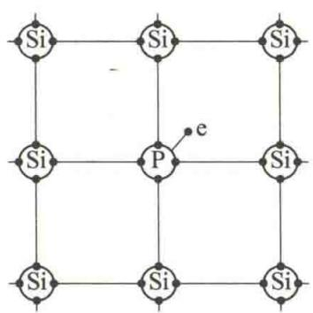  
(a)
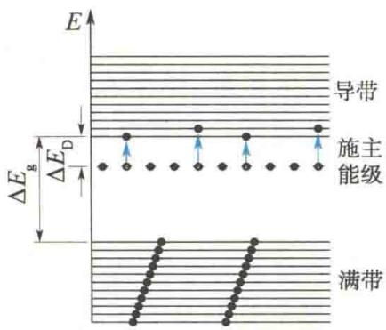  
(b)  
图17.12 N型半导体
这种杂质价电子很容易被激发到导带中去,所以这类杂质原子称为施主,相应的杂质能级称为施主能级.施主能级与导带底部之间的能量差值 $\Delta E_{D}$ 比禁带宽度 $\Delta E_{g}$ 小得多,约为 $10^{-2}$ eV.所以,在较低温度下,施主能级中的电子就可以被激发到导带中去.因此,这种半导体中杂质原子的数目虽然不多,但是在常温下,导带中的自由电子浓度却比同温度下纯净半导体的导带中的自由电子浓度大好多倍,这就大大提高了半导体的导电性能.这种主要靠施主能级激发到导带中去的电子来导电的半导体称为 N 型半导体或电子型半导体.

### 2. P型半导体

如果在硅或锗的纯净半导体中掺入少量三价元素(如硼、镓、铟等)杂质,那么这种杂质原子与相邻的四价硅或锗原子形成共价键结构时,将缺少一个电子,这相当于一个空穴,如图 17.13(a) 所示.相应于这种空穴的杂质能级也出现在禁带中,并且靠近满带,如图 17.13(b) 所示.满带顶部与杂质能级之间的能量差值 $\Delta E_{\mathrm{A}}$ 一般不到 $0.1 \mathrm{eV}$ . 在温度不很高的情况下,满带中的电子很容易被激发到杂质能级,同时在满带中形成空穴.这种杂质能级收容从满带跃迁来的电子,所以这类杂质原子又称为受主,相应的杂质能级称为受主能级.这时,半导体中的空穴浓度较之纯净半导体中的空穴浓度增加了好多倍,其导电性能显著增加.这种杂质半导体的导电性能主要取决于满带中的空穴,所以称为 P 型半导体,或者称为空穴型半导体.
(a)  
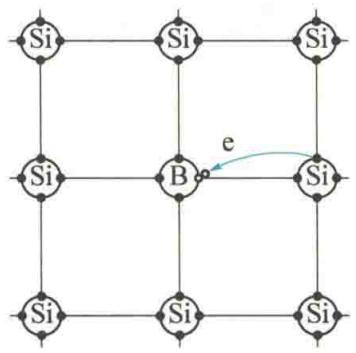
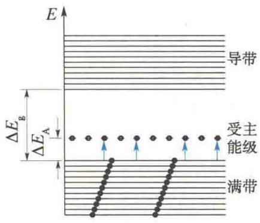  
(b)  
图 17.13 P 型半导体

### 3. PN结

在一片本征半导体的两侧各掺以施主型(高价)和受主型(低价)杂质,就构成一个PN结.这时由于P型半导体一侧空穴的浓度较大,而N型半导体一侧电子的浓度较大,因此N型区中的电子将向P型区扩散,P型区中
的空穴将向 N 型区扩散, 结果在交界面两侧出现正、负电荷的积累, P 型区一侧带负电荷, N 型区一侧带正电荷. 这些电荷在交界处形成一电偶层, 即 PN 结, 其厚度约为 $10^{-7}$ m, 如图 17.14(a) 所示. 在 PN 结内存在着由 N 型区指向 P 型区的电场, 起到阻碍电子和空穴继续扩散的作用, 最后达到动态平衡. 此时, 因为 PN 结中存在电场, 两半导体间存在着一定的电势差 $U_{0}$ , 所以电势自 N 型区向 P 型区递减, 这就是 PN 结处的接触电势差, 如图 17.14(b) 所示.
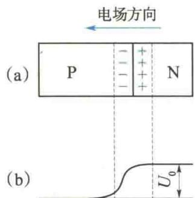  
图17.14 PN结
由于接触电势差 $U_{0}$ 的存在，在分析半导体的能带结构时，必须把由该电势差引起的附加电子静电势能 $-eU_{0}$ 考虑进去。因为PN结中，P型区一侧积累了较多的负电荷，所以P型区相对N型区电势较低，这样在P型导带中的电子要比在N型导带中的电子有较大的能量，该能量的差值为 $eU_{0}$ 。如果原来两半导体的能带如图17.15(a)所示（为简单起见，图中只画出满带的顶部和导带的底部），则在PN结处，能带发生弯曲，如图17.15(b)所示。
在 PN 结处, 势能曲线呈弯曲状, 构成势垒区, 它将阻止 N 型区的电子和 P 型区的空穴进一步向对方扩散, 所以 PN 结中的势垒区又称为阻挡层.
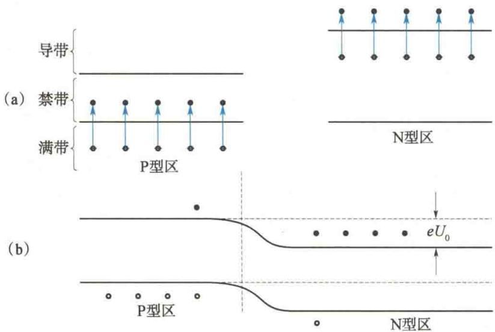  
图 17.15 PN 结形成前后能带示意图
由于阻挡层的存在,当把外加电压加到 PN 结两端时,阻挡层处的电势差将发生改变.如把正极接到 P 型区,把负极接到 N 型区(称为正向连接),外电场的方向与阻挡层的电场方向相反,使 PN 结中的电场减弱,势垒降低,或者说使阻挡层减薄.于是 N 型区中的电子和 P 型区中的空穴就容易通过阻挡层,不断向对方扩散,形成从 P 型区到 N 型区的正向电流,PN 结导通.外加电压增大,电流增大.
反之，当把电源负极接到P型区而正极接到N型区（称为反向连接）时，则外电场的方向与PN结中电场的方向相同，使PN结中电场加强，势垒增高，阻挡层加厚，N型区中的电子和P型区中的空穴就更难越过阻挡层.只有P型区的少数电子和N型区的少数空穴能通过阻挡层形成微弱的反向电流，而且随着反向电压的升高，反向电流很快达到饱和.PN结的伏安特性曲线如图17.16所示.
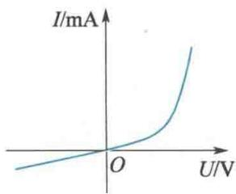  
图17.16 PN结的伏安特性曲线
由于反向电流很弱,因此通常说 PN 结具有单向导电性.利用其单向导电性,可以将 PN 结做成晶体二极管作整流用,也可以把各种类型的半导体适当组合,制成各种晶体管.随着超精细小型化技术的发展,各种规模的集成电路被制成,广泛应用于电子计算机、通信、雷达、宇航、电视等技术领域.

## \* 4. 半导体的其他特性和应用

半导体还有一些其他特性和应用,本节仅就热敏电阻、光敏电阻、温差电偶等的原理和应用作简单介绍.

（1）热敏电阻.半导体的电阻随温度的升高呈指数规律下降.这是因为随着温度的升高，由于热激发，半导体中的载流子（电子或空穴）显著增加.这种热激发载流子称为热生载流子.特别是在杂质半导体中，因为施主能级和受主能级处于禁带中，所需要的激发能量远比禁带宽度对应的能量小，所以热生载流子的增加尤为显著.其导电性能随温度的变化十分灵敏.通常把这种电阻随温度的升高而降低的半导体器件称为热敏电阻.热敏电阻由于具有体积小、热惯性小、寿命长等优点，已广泛应用于自动控制技术.
绿色能源——
太阳能
（2）光敏电阻.在可见光照射下，半导体硒的电阻将随光强的增加而急剧减小.这是由于光激发使半导体中载流子迅速增加.这种光激发的载流子称为光生载流子，由于光生载流子并没有逸
出体外,因此又称为内光电效应.
应该注意,光电导和热电导不同,热敏电阻是一种没有选择性的辐射能接收器,而光敏电阻是有选择性的,和光电效应类似,要求照射光的频率大于红限频率.在此条件下,光强越强,电导率越大.电导率随光强的变化十分灵敏.利用这种特性制成的半导体器件称为光敏电阻,光敏电阻是自动控制、遥感等技术中的一个重要元件.
（3）温差电偶.对两种不同的金属导体组成的闭合回路，如果两个接头处于不同的温度，那么在回路中将产生温差电动势.这个回路称为温差电偶，或称为热电偶.如果把两种不同的半导体组成回路，并使两个接头处于不同温度，也会产生温差电动势，而且比金属组成的热电偶的电动势大得多.这是因为半导体中的自由电子或空穴是由热激发产生的，随着温度的升高，自由电子或空穴的浓度也会迅速增大.
由于存在温度差,因此半导体中的电子或空穴会由浓度大、运动速度较大的热端运动到冷端,同时也有少量电子或空穴由冷端运动到热端.在 N 型半导
同时也有少量电子或空穴由冷端运动到热端. 在 N 型半导体中, 载流子是电子, 结果造成冷端带负电, 热端带正电. 而在 P 型半导体中, 则是冷端带正电, 热端带负电, 因而在冷热两端产生电势差.
随着电势差的增加,半导体内电场也开始增强,并且阻止载流子由热端向冷端的扩散而加速其由冷端到热端的运动,最后达到动态平衡.这种动态平衡决定了半导体中因温差而形成的温差电动势.半导体中的温差电动势比金属中的温差电动势要大数十倍,温度每差1℃,温差电动势的变化量能够达到甚至超过 $10^{-3}$ V.半导体温差电偶示意图如图17.17所示.
此外，还有半导体光电池、半导体场致发光材料和半导体激光器等，它们广泛应用于工农业生产及科研、通信、测量、宇航等多种技术领域。
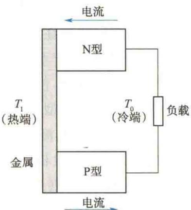  
图 17.17 半导体温差电偶示意图

