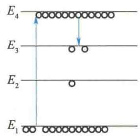
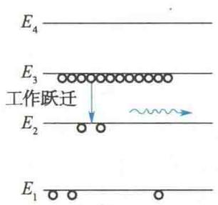
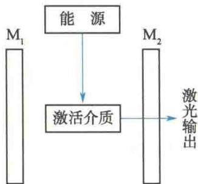
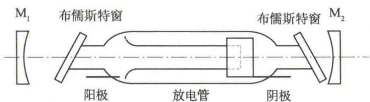
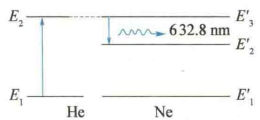

import QRCodeVideo from '@/components/QRCodeVideo.astro';

import Guide from '@/components/Guide.astro';
import Knowledge from '@/components/Knowledge.astro';
import Example from '@/components/Example.astro';
import Analysis from '@/components/Analysis.astro';
import Solution from '@/components/Solution.astro';
import Variant from '@/components/Variant.astro';
import Note from '@/components/Note.astro';
import Block from '@/components/Block.astro';
import Method from '@/components/Method.astro';
import Exercise from '@/components/Exercise.astro';

激光是“受激辐射光放大”(light amplification by stimulated emission of radiation)的简称,是20世纪60年代以后发展起来的一门新技术.激光的单色性、方向性和相干性都非常好,能量密度可以很高.激光在科学技术的各个领域内得到了日益广泛的应用.

## 17.2.1 激光的基本原理

### 1. 自发辐射与受激辐射

中国物理学家
<QRCodeVideo title="王淦昌" url="https://api.guangyiedu.com/v3/resource/resource/r/NewQrCode-tzH3722COglEEzL3Dwh0" />  
早在 1917 年, 爱因斯坦在他的辐射理论中就预见了受激辐射的存在. 光与原子体系相互作用时, 总是同时存在着吸收、自发辐射和受激辐射三种过程. 设原子中有能级 $E_{1}$ 和 $E_{2}(E_{2} > E_{1})$ , 则在常温下, 物质的绝大部分原子都处于低能级 $E_{1}$ (基态) 中. 处于高能级 $E_{2}$ 上的原子会自发地跃迁到低能级 $E_{1}$ , 辐射出光子 $h\nu$ , 这个过程称为自发辐射. 设发光物质单位体积中处于能级 $E_{1}$ 、 $E_{2}$ 的原子数分别为 $N_{1}$ 、 $N_{2}$ ，则单位时间内从 $E_{2}$ 向 $E_{1}$ 自发辐射的原子数为
$$
\left(\frac {\mathrm{d} N _ {2 1}}{\mathrm{d} t}\right) _ {\text {自}} = A _ {2 1} N _ {2}
$$
式中，比例系数 $A_{21}$ 称为自发辐射概率，它与外来辐射能量密度无关.
原子吸收辐射 $h\nu$ 从低能级 $E_{1}$ 跃迁到高能级 $E_{2}$ ，这个过程称为受激吸收跃迁。每秒吸收跃迁的原子总数与辐射场能量密度成正比，并与处于低能级 $E_{1}$ 的原子数 $N_{1}$ 成正比，即
$$
\left(\frac {\mathrm{d} N _ {1 2}}{\mathrm{d} t}\right) _ {\mathrm{吸}} = W _ {1 2} N _ {1}
$$
式中，比例系数 $W_{12} = B_{12} \rho(\nu, T)$ ，称为吸收概率。其中 $B_{12}$ 称为吸收系数， $\rho(\nu, T)$ 是辐射场能量密度。
处于高能级 $E_{2}$ 的原子除自发辐射外，还有一种辐射，称为受激辐射，处于高能级 $E_{2}$ 的原子在外来辐射或某一原子的自发辐射所放出的光子激发下，跃迁到低能级 $E_{1}$ 而发出光子 $h\nu$ . 受激辐射每秒跃迁的原子数与高能级原子数 $N_{2}$ 及辐射场能量密度成正比，即
$$
\left(\frac {\mathrm{d} N _ {2 1}}{\mathrm{d} t}\right) _ {\mathrm{受}} = W _ {2 1} N _ {2}
$$
式中，比例系数 $W_{21} = B_{21}\rho (\nu ,T)$ ，称为受激辐射概率.其中 $B_{21}$ 称为受激辐射系数，且 $B_{21} = B_{12};\rho (\nu ,T)$ 就是上述的辐射场能量密度.
光子的状态, 即光子的频率、相位、偏振方向和传播方向通常由量子数来描述. 这些量子数的每一种组合方式决定了光子的一种状态, 称为光的量子态 (光子态). 对给定的光源, 可能有的光子态的数目是很多的. 光子可处于其中一态, 也可多个光子占据同一态 (这一点与电子不同, 因为光子是玻色子而电子是费米子). 我们定义占据同一光子态的平均光子数目为光源的光子简并度, 记作 $\bar{\delta}$ .
自发辐射的光子的状态是不确定的,即使光子都满足 $h\nu = E_{2} - E_{1}$ ,由于是不同原子辐射的,其量子态也各不相同.换言之,自发辐射的光子简并度很低.这样的辐射光称为普通光,其单色性和相干性都很差.
而按照辐射的量子理论,受激辐射产生的光子的量子态与原光子完全相同.如果原子体系中有许多原子都处于某一相同的激发态能级,则其中某一原子的自发辐射产生的光子就可以促使处于同一激发态的其他原子发生受激辐射而放出同样的光子.这一过程将以连锁反应的方式在很短的时间内完成,从而产生出大量完全相同的光子,这一过程称为光放大.如果提供合适的条件,实现了这种光放大,就能得到大量高简并度的光子,产生单色性和相干性都很好的光束,即获得了激光.

### 2. 粒子数反转

光与原子体系相互作用时,如果自发辐射占优势,则发出的是普通光束;如果受激辐射占优势,就会发出激光.那么,在什么样的条件下才能使受激辐射占优势呢?
一般情况下,处于温度为 T 的平衡态下的体系,在各能级上的原子数由玻尔兹曼分布确定,即有
$$
\frac {N _ {2}}{N _ {1}} = \mathrm{e} ^ {- (E _ {2} - E _ {1}) / k T}\tag{17.1}
$$
这就是说,处于最低能级的原子最多,能级越高,处于该能级的原子就越少.实际上,激发态与基态之间的能量差一般大约是1 eV.因此,常温 $(T=300\ K)$ 的平衡态下, $\frac{N_{2}}{N_{1}}\approx e^{-38}$ ,即处于激发态的原子的数目微乎其微.前面已介绍过,受激吸收每秒跃迁的原子数与 $E_{1}$ 的原子数 $N_{1}$ 成正比,受激辐射每秒跃迁的原子数与 $E_{2}$ 的原子数 $N_{2}$ 成正比.当 $N_{2}\ll N_{1}$ 时,发生受激辐射每秒跃迁的原子数远少于发生受激吸收每秒跃迁的原子数,这时是不可能实现光放大的.要实现光放大,必须采取特殊措施,打破原子数在热平衡下的玻尔兹曼分布,使 $N_{2}>N_{1}$ .我们称体系的这种状态为粒子数反转(或“负温度”体系).所以,产生激光的首要条件是实现粒子数反转.
能够实现粒子数反转的介质称为激活介质. 要造成粒子数反转分布, 首先要求介质有适当的能级结构, 其次还要有必要的能量输入系统. 供给低能态的原子以能量, 促使它们跃迁到高能态的过程称为抽运过程.
下面以四能级系统为例来说明,为了实现粒子数反转,需要什么样的能级结构.图17.18(a)所示,在某原子的部分能级(4个能级, $E_{1}$ 为基态)上,当用频率为 $\nu=(E_{4}-E_{1})/h$ 的光照射时,一部分原子将迅速跃迁到 $E_{4}$ 能级,从而使该能级上的原子大为增多.但是,处于 $E_{4}$ 能级的原子将迅速以与其他原子碰撞等无辐射跃迁的方式到达平均寿命较长( $10^{-3}\sim1s$ )的亚稳态 $E_{3}$ 能级.由于 $E_{3}$ 能级的寿命较长,因此 $E_{3}$ 能级上将停留大量原子,而处于 $E_{2}$ 能级上的原子极少,如图17.18(b)所示.这样就建立起了一个粒子数反转体系.此时, $E_{3}\rightarrow E_{2}$ 的自发辐射就会引起连锁的受激辐射,其频率 $\nu_{32}=(E_{3}-E_{2})/h$ .He-Ne激光器和 $CO_{2}$ 激光器的工作物质都具有这种四能级系统,而红宝石激光器是一个三能级系统激光器.需要说明的是,这里所说的四能级系统或三能级系统,都是指在激光器抽运过程中直接有关的能级,并不是说这种物质只具有这几个能级.
<figure class="vp-figure">
  

    

      
      (a)
    

    

      
      (b)
    

  

  <figcaption>图 17.18 粒子数反转所需的能级结构</figcaption>
</figure>

### 3. 光学谐振腔

实现粒子数反转是产生激光的必要条件,但还不是充分条件.粒子数反转使得受激辐射与受激吸收相比,占了绝对优势,但是还不能保证受激辐射超过自发辐射.因为处于激发态能级的原子还可以通过自发辐射而跃迁到基态,而且在热平衡条件下,在激光器工作频率区域内(红外→紫外)自发辐射占绝对优势.如当T=1500K时,对于 $\lambda=694.3\ nm$ 的光,自发辐射的概率比受激辐射的概率大6个数量级.因此,在一般情况下,即使已实现了激活物质的粒子数反转,但如果不采取措施,要利用受激辐射来得到激光仍然是不可能的.
前面已经介绍过,自发辐射概率与辐射场能量密度无关,而受激辐射概率与辐射场能量密度成正比. 因此, 在激光器中, 利用光学谐振腔来形成所要求的强辐射场, 使辐射场能量密度远远大于热平衡时的数值, 从而使受激辐射概率远远大于自发辐射概率.
如图 17.19 所示, 光学谐振腔的主要部分是两个互相平行并与激活介质轴线垂直的反射镜 $M_{1}$ 和 $M_{2}$ . 其中 $M_{1}$ 是全反射镜, $M_{2}$ 是部分反射镜. 如上所述, 通过外界光、热、电、化学或核能等方式的激励, 谐振腔内的激活介质将会在能级 $E_{3}$ 和 $E_{2}$ 之间实现粒子数反转. 这时由自发辐射产生的频率为 $\nu = (E_{3} - E_{2}) / h$ 的光子就会激发 $E_{3}$ 能级上的原子产生受激辐射. 在产生的受激辐射光中, 沿轴向传播的光在两个反射镜之间来回反射, 往复通过已实现了粒子数反转的激活介
<figure class="vp-figure">
  
  <figcaption>图 17.19 光学谐振腔</figcaption>
</figure>
质,不断引起新的受激辐射,使轴向行进的该频率的光得到放大,这个过程称为光振荡.这是一种雪崩式的放大过程,会使谐振腔内沿轴向的光骤然增强,所以辐射场能量密度大大增强,受激辐射远远超过自发辐射.这种受激的辐射光从部分反射镜 $M_{2}$ 输出,它就是激光.沿其他方向传播的光很快从侧面逸出谐振腔,不能被继续放大.而自发辐射产生的频率不等于 $(E_{3}-E_{2})/h$ 的光,由于根本不可能引起受激辐射,也得不到放大,因此实际上输出的仅是频率为 $\nu=(E_{3}-E_{2})/h$ 的沿轴向传播的激光.由此可知,从谐振腔输出的激光具有很好的方向性和单色性.
在实际激光器中,存在着使光强减弱的各种损耗,如介质的吸收及散射等.只有当光在谐振腔中来回一次所得到的增益(增益G定义为光通过谐振腔单位长度时光强增加的比例)大于同一过程的损耗时,光放大才会实现.产生激光的最小增益称为阈值增益(或阈值条件),记为 $G_{m}$ .计算表明
$$
G _ {\mathrm{m}} = \frac {1}{2 L} \ln \frac {1}{R _ {1} R _ {2}}
$$
式中，L 是谐振腔长度， $R_{1}$ 与 $R_{2}$ 分别是两反射镜的反射系数。这就是产生激光所必须满足的阈值条件。为了达到阈值条件，要求选用增益系数大而内耗小的激活介质，并选用反射系数高的反射镜。

### 4. 横模与纵模

在激光技术中,经常提到激光的“模式”.按光的量子理论,给定一种模式对应于谐振腔内光子的一个量子态.激光模式有横模与纵模之分.按光的波动理论,简单地说,在与谐振腔轴线垂直的截面上形成的光的横向驻波模式称为横模.产生横模的原因很多,其中主要原因是不沿轴线方向传播的光束相互干涉加强.不同频率的光束在沿谐振腔轴线方向上形成的不同的纵向驻波模式称为纵模,也称轴模.显然,纵模是由频率不同引起的.
光学谐振腔除了有实现光振荡的作用, 还有一个作用就是选频, 即通过缩短谐振腔长度以扩大相邻两纵模的频率间隔, 达到减少纵模个数的目的. 在两反射镜间沿轴向传播的光束, 由于谐振腔长度 L 与光波波长之比是一个很大的值, 所以有许许多多波长不同的光波能符合反射加强的条件, 即
$$
2 n L = K _ {1} \lambda_ {1} = K _ {2} \lambda_ {2} = \dots\tag{17.2}
$$
式中， $n$ 是腔内激活介质的折射率， $K$ 是纵模模数。如果 $n = 1, L = 1\mathrm{m}, \lambda = 0.5\mu \mathrm{m}$ ，则 $K$ 可达 $4 \times 10^{6}$ 。但产生激光的某一波长的单色光总是有一定宽度的：根据原子处于激发态的平均寿命 $\Delta \tau \approx 10^{-8}\mathrm{s}$ ，按测不准关系，由 $\Delta E \Delta \tau \geqslant h$ 和 $\Delta E = h \Delta \nu$ 可推知 $\Delta \nu = \frac{\Delta E}{h} \geqslant \frac{1}{2\pi \Delta \tau}$ ，即谱线的自然宽度约为 $10^{7}\mathrm{Hz}$ ；再加上其他因素（碰撞增宽与多普勒增宽），一般谱线宽度为 $\Delta \nu = 10^{9}\mathrm{Hz}$ 。另外，由式(17.2)微分可知，两相邻纵模 $K$ 与 $K + 1$ 之间的波长间隔为
$$
\Delta \lambda = - \frac {\lambda}{K} = - \frac {\lambda^ {2}}{2 n L}
$$
而频率间隔为
$$
\Delta \nu^ {\prime} = - \frac {c \Delta \lambda}{\lambda^ {2}} = \frac {c}{2 n L}
$$
因此在腔长 $L$ 内能获得干涉加强的纵模的个数为
$$
N = \frac {\Delta \nu}{\Delta \nu^ {\prime}} = \frac {\Delta \nu}{c} 2 n L \approx \frac {2 n L \times 1 0 ^ {9}}{c}
$$
科研成果介绍
该数量相当有限，如 $\lambda = 632.8 \, nm$ 的 He-Ne 激光， $\Delta\nu \approx 10^{9} \, Hz$ ，而 $\Delta\nu' \approx 15 \times 10^{7} \, Hz$ ，则最大模数 N = 6。如果腔长 L 再变短，则纵模的个数 N 还会减少。
<QRCodeVideo title="大连相干光源" url="https://api.guangyiedu.com/v3/resource/resource/r/NewQrCode-qXfF6WdHUEiAmmFQ7FMT" />  
为了提高所输出的激光的单色性,往往需要单模输出,因此必须在有限的几个纵模里再选出一个单模来.最简单的方法是缩短激光管的长度L.还可以通过在谐振腔内放置法布里-珀罗标准具来实现,它使几个纵模中只有一个纵模有高的透射率,从而使原来的多模激光器变成单模激光器.

## 17.2.2 激光器

<QRCodeVideo title="神光Ⅱ高功率激光实验装置" url="https://api.guangyiedu.com/v3/resource/resource/r/NewQrCode-y62TKAji6nReFS1CKb9s" />  
科研成果介绍
激光器是产生激光的器件或装置,它由三部分组成:工作物质、激励(又叫泵浦)系统和光学谐振腔(有些激光器,如氮分子激光器也可以没有谐振腔).现在激光器的波长已从X射线区一直扩展到远红外区,最大连续功率输出达 $10^{4}W$ ,最大脉冲功率输出达 $10^{16}W$ .表17.1列出了常用激光器的主要性能.
表 17.1 常用激光器的主要性能
<table><tr><td>激光器名称</td><td>工作物质</td><td>典型波长 /nm</td><td>主要性能</td></tr><tr><td>红宝石</td><td>掺  $Cr^{3+}$  红宝石</td><td>694.3</td><td>脉冲、大功率</td></tr><tr><td>YAG</td><td>掺  $Nd^{3+}$  钇铝石榴石</td><td>1064</td><td>连续、中小功率</td></tr><tr><td>钕玻璃</td><td>掺  $Nd^{3+}$  玻璃</td><td>1059</td><td>大功率</td></tr><tr><td>氦氖</td><td>He-Ne 混合气体</td><td>632.8,1150,3390</td><td>连续、小功率</td></tr><tr><td>氩离子</td><td> $Ar^+$ </td><td>488.0,514.5</td><td>连续、大功率</td></tr><tr><td>二氧化碳</td><td> $CO_2$ </td><td>1060</td><td>脉冲、连续、大功率</td></tr><tr><td>氮分子</td><td> $N_2$ </td><td>337.1</td><td>脉冲</td></tr><tr><td>氦镉</td><td>He,Cd 蒸气</td><td>441.6,325.0</td><td>连续、中功率</td></tr><tr><td>氦锌</td><td>He,Zn 蒸气</td><td>747.9,589.4</td><td>连续</td></tr><tr><td>氦硒</td><td>He,Se 蒸气</td><td>522.8,497.6</td><td>连续,长使用寿命</td></tr><tr><td>染料</td><td>染料液体</td><td>590～640</td><td>连续可调谐、小功率</td></tr><tr><td>半导体</td><td>GaAs/GaAlAs</td><td>800～900</td><td>可调谐、小功率</td></tr></table>
科研成果介绍
第一个连续工作的气体激光器是1961年2月制成的氦氖(He-Ne)激光器,这种激光器目前应用得非常广泛.它是一个气体放电管,工作物质是氦气和氖气的混合气体.由于它的谐振腔两端的反射镜放置在放电管外,故称为外腔式激光器.反射镜有用两个凹球面的,也有用一凹一平或两个平面的.放电管的窗口与真空放电管的轴线成布儒斯特角,这种窗称为布儒斯特窗.这样可以使输出的激光成为完全偏振光.图17.20是外腔式He-Ne激光器示意图.在放电管的端部封入电极,电极间加上千伏以上的高压,气体放电.放电时,在电场中加速运动的电子与He原子碰撞,并使He原子激发到一些较高能态上.图17.21是He-Ne原子能级示意图.其中He有一个能级 $E_{2}$ 的平均寿命较长(亚稳态),Ne也有一个亚稳态能级 $E_{3}^{\prime}$ 与He的 $E_{2}$ 能级接近.激发到 $E_{2}$ 的He原子在与Ne原子碰撞时,就会把能量传给基态Ne原子,使大量Ne原子激发到 $E_{3}^{\prime}$ 能态.Ne原子还有一个比 $E_{3}^{\prime}$ 稍低的能级 $E_{2}^{\prime}$ ,但因He原子没有与之相近的能级,不可能通过与He原子的碰撞使Ne原子激发到 $E_{2}^{\prime}$ 能级.因此,Ne原子的 $E_{3}^{\prime}$ 和 $E_{2}^{\prime}$ 能级形成粒子数反转.只要有一个Ne原子发生 $E_{3}^{\prime}\rightarrow E_{2}^{\prime}$ 的自发辐射,就会产生受激辐射和光放大.再经过谐振腔的选模、放大和控制作用,就可以得到具有一定输出功率的单色性、相干性、方向性都很好的激光.
<QRCodeVideo title="上海软X射线自由电子激光装置" url="https://api.guangyiedu.com/v3/resource/resource/r/NewQrCode-UuSYt1xvngJBdq4bAqC2" />  
<figure class="vp-figure">
  
  <figcaption>图 17.20 外腔式 He-Ne 激光器示意图</figcaption>
</figure>
<figure class="vp-figure">
  
  <figcaption>图 17.21 He-Ne 原子能级示意图</figcaption>
</figure>

## 17.2.3 激光的特性

### 1. 单色性好

光的谱线宽度(频宽) $\Delta\nu$ 描述了光的单色性. 单色性较好的普通光的频宽 $\Delta\nu\approx10^{7}\sim10^{9}Hz$ ，而经过稳频的He-Ne激光器可得到频宽 $\Delta\nu\approx10^{-1}Hz$ 、波长为632.8nm的红光. 单色性提高了 $10^{8}\sim10^{9}$ 倍. 激光极好的单色性使其可作为长度标准进行精密测量.

### 2. 方向性好

光的方向性用光束的发散角来度量. 激光的发散角可以达到 $10^{-5} \sim 10^{-3}$ rad, 因此激光束几乎是平行光束. 若将激光射向几千米之外, 光束直径也只增加几厘米. 根据这一特性, 可把激光用于定位、导向、测距等领域.

### 3. 相干性好

光束的空间相干性是与方向性(发散角)紧密相关的. 激光具有极好的方向性, 意味着它同时具有极好的空间相干性, 将它作为相干光源时, 干涉图样有良好的可见度. 光束的时间相干性与单色性紧密相关. 激光具有极好的单色性, 意味着它同时具有极好的时间相干性, 将它作为相干光源可以观察到较高级次的干涉条纹, 可以进行长距离范围的精密测量.

### 4. 能量集中

由于激光束方向性好,能使能量在空间高度集中,利用激光脉冲或锁模调Q等措施,还可以使能量压缩到极短时间内发射,所以激光光源有极大的亮度.

## \*17.2.4 激光的应用

激光在各个技术领域中的广泛应用基本上是利用了激光是定向的强光和具有很好的单色相干性方面的特性.因为激光这两方面的特性往往不能截然分开,所以有的应用(如非线性光学)与激光的两方面特性都有关.
科研成果介绍
<QRCodeVideo title="合肥同步辐射装置" url="https://api.guangyiedu.com/v3/resource/resource/r/NewQrCode-aWvT18g1HrWGzKcdUL1s" />  

### 1. 激光测距

激光测距有三种方法. 第一种方法是干涉测长, 利用激光优越的相干性, 以激光波长为基准, 测量干涉条纹数目的变化即可转换为长度的变化, 如 13.6 节所介绍的迈克耳孙干涉仪即是一例. 用干涉测长法测量数十米的长度, 误差在 $1 \mu \mathrm{m}$ 之内. 第二种方法是激光调制测距, 对激光加以强度调制后发射出去, 接收到被照射物的反射光, 求出发射光与反射信号调制波的相位差, 即可转换成被测距离. 用这种方法测量数千米距离, 误差为几厘米. 第三种方法是激光雷达测距, 测量激光脉冲往返时间即可精确测定距离. 用这种方法测量地球与月球的距离 (约 $3.8 \times 10^{8} \mathrm{~m}$ ), 误差仅为几十厘米.

### 2. 激光加工与激光医疗

激光的空间相干性很好,能把光束聚焦成光强为 $10^{6} \sim 10^{10}$ W/cm $^{2}$ 的小光斑,它能以很精细(约 $1 \mu m$ ) 的空间尺度加热材料,实现打孔、焊接、机械加工以及控制加热以产生材料的结构变化等.同时,特定的材料对合适波长的激光吸收深度很小,可以在材料表面浅层加热,并且不会污染材料.激光束甚至可以穿过任何透射材料去加工密闭的内部零件.
激光的这种高强度的聚焦光束也广泛用于医学领域。激光可用作手术刀，高度精确地选择病变部位进行手术；利用激光的光致离解作用，还能清除病变组织而保护健康的组织；利用激光诱发的冲击波，可以清除继发性白内障；激光配合光导纤维，能粉碎人体内各种器官的结石。

### 3. 光信息处理和激光通信

激光在信息处理方面的一种应用是光盘的高速高密度记录. 声盘或视盘利用调制方法把激光束变成数字激光信号, 用此信号在母盘上产生坑穴存储并形成轨迹. 再现时用激光照射, 读取坑穴以还原声像. 光盘的存储密度比磁盘高出几百倍. 这种应用已进入寻常百姓的日常生活之中.
<QRCodeVideo title="激光制冷" url="https://api.guangyiedu.com/v3/resource/resource/r/NewQrCode-Vxef8OChlQNLLj9MXzNO" />  
激光信息处理的另一种应用是激光打印机。它类似于电子照相式复印机，受打印信息控制的激光束对感应体进行扫描式曝光辐照。感应体上受辐照部分和未受辐照部分的静电电荷分布不同，利用静电吸引作用可以成像并印到普通打印纸上。激光打印的文件图像十分清晰，其品质大大高于针式打印机。
  
光纤通信
激光通信是以激光为载波,用信息振幅去调制此载波以实现信息传输的.其优点是光波频带宽,可容纳大量的信息.现在已广泛使用的光纤通信就是激光通信的主要形式.

### 4. 激光在受控核聚变中的应用

利用极高功率的激光脉冲来加热氘和氚的混合物，使其温度达到0.1～2亿摄氏度，便可开始发生核聚变而放出巨大的能量。由于氘氚混合物的质量及激光的能量都可被控制，因而称此过程为受控核聚变，人们有可能利用聚变中的能量作为电力的能源。这方面的研究仍在进行中。

### 5. 激光的非线性效应

激光强大的电场和物质作用时,产生非线性效应,为光学开辟了一个应用方向.
